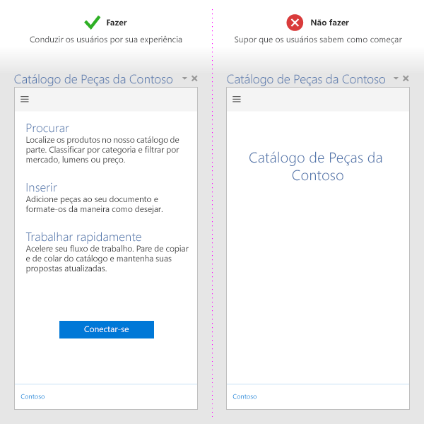
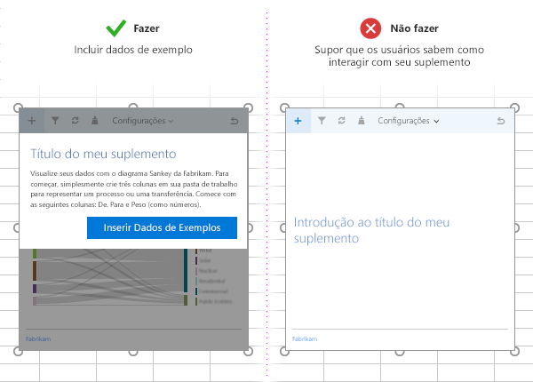

# Práticas recomendadas para o desenvolvimento de suplementos do OfficeBest practices for developing Office Add-ins

Os suplementos eficazes oferecem uma funcionalidade exclusiva e fascinante que estende os aplicativos do Office de uma maneira visualmente atraente. Para criar um excelente suplemento, ofereça uma primeira experiência envolvente para seus usuários, desenvolva uma experiência de interface de usuário de alto nível e otimize o desempenho do seu suplemento. Aplique as práticas recomendadas descritas neste artigo para criar suplementos que ajudem os usuários a concluir suas tarefas de forma rápida e eficiente.Effective add-ins offer unique and compelling functionality that extends Office applications in a visually appealing way. To create a great add-in, provide an engaging first-time experience for your users, design a first-class UI experience, and optimize your add-in's performance. Apply the best practices described in this article to create add-ins that help your users complete their tasks quickly and efficiently.

[!INCLUDE [publish policies note](../includes/note-publish-policies.md)]

## Fornecer um valor claroProvide clear value

- Crie suplementos que ajudem os usuários a concluir tarefas de forma rápida e eficiente. Concentre-se nos cenários que fazem sentido para aplicativos do Office. Por exemplo:Create add-ins that help users complete tasks quickly and efficiently. Focus on scenarios that make sense for Office applications. For example:
 - Torne as principais tarefas de criação mais rápidas e fáceis, com menos interrupções.Make core authoring tasks faster and easier, with fewer interruptions.
 - Habilite novos cenários no Office.Enable new scenarios within Office.
 - Inserir serviços complementares nos aplicativos do Office.Embed complementary services within Office applications.
 - Melhore a experiência do Office para aumentar a produtividade.Improve the Office experience to enhance productivity.
- Certifique-se de que o valor do seu suplemento seja claro para os usuários desde o princípio, [criando uma experiência envolvente na primeira execução](#create-an-engaging-first-run-experience).Make sure that the value of your add-in is clear to users right away by [creating an engaging first run experience](#create-an-engaging-first-run-experience).
- Crie uma [listagem eficaz do AppSource](/office/dev/store/create-effective-office-store-listings). Deixe claro quais são os benefícios do seu suplemento no título e na descrição. Não dependa da sua marca para dizer o que seu suplemento faz.Create an [effective AppSource listing](/office/dev/store/create-effective-office-store-listings). Make the benefits of your add-in clear in your title and description. Don't rely on your brand to communicate what your add-in does.

## Criar uma experiência envolvente na primeira execuçãoCreate an engaging first-run experience

- Envolva os novos usuários com uma primeira experiência altamente útil e intuitiva. Observe que, mesmo depois de baixar o suplemento da loja, os usuários ainda estão decidindo se vão utilizá-lo.Engage new users with a highly usable and intuitive first experience. Note that users are still deciding whether to use or abandon an add-in after they download it from the store.

- Deixe claro quais são as etapas que usuário terá que seguir para se envolver com seu suplemento. Use vídeos, diagramas, painéis de paginação ou outros recursos para atrair usuários.Make the steps that the user needs to take to engage with your add-in clear. Use videos, placemats, paging panels, or other resources to entice users.

- Reforce a proposta de valor do seu suplemento no início, em vez de apenas pedir que seus usuários entrem.Reinforce the value proposition of your add-in on launch, rather than just asking users to sign in.

- Forneça uma interface do usuário informativa e torne sua interface do usuário pessoal.Provide teaching UI to guide users and make your UI personal.

   

- Se seu suplemento de conteúdo estiver vinculado a dados no documento do usuário, inclua exemplos de dados ou um modelo para mostrar aos usuários o formato de dados a ser usado.If your content add-in binds to data in the user's document, include sample data or a template to show users the data format to use.

   

- Ofereça [avaliações gratuitas](/office/dev/store/decide-on-a-pricing-model). Caso o suplemento exija uma assinatura, disponibilize algumas funcionalidades sem a necessidade da assinatura.Offer [free trials](/office/dev/store/decide-on-a-pricing-model). If your add-in requires a subscription, make some functionality available without a subscription.

- Simplifique o processo de inscrição. Preencha automaticamente as informações (email, nome de exibição) e ignore as verificações de email.Make signup simple. Prefill information (email, display name) and skip email verifications.

- Evite os pop-ups. Se você tiver de usá-los, oriente o usuário sobre como habilitar o seu pop-up.Avoid pop ups. If you have to use them, guide the user to enable your pop up.

Para padrões que podem ser aplicados ao desenvolver sua experiência de primeira execução, consulte [Padrões de design da experiência do usuário para suplementos do Office](../design/first-run-experience-patterns.md).For patterns that you can apply as you develop your first-run experience, see [UX design patterns for Office Add-ins](../design/first-run-experience-patterns.md).

## Usar comandos de suplementoUse add-in commands

- Fornece ao suplemento pontos de entrada relevantes da interface do usuário usando os comandos do suplemento. Confira mais detalhes, inclusive as práticas recomendadas de design, nos [comandos de suplemento](../design/add-in-commands.md).Provide relevant UI entry points for your add-in by using add-in commands. For details, including design best practices, see [add-in commands](../design/add-in-commands.md).

## Aplicar os princípios de design de UXApply UX design principles

- Assegure-se de que a aparência e a funcionalidade de seus suplementos complementam a experiência do Office. Use o [Office UI Fabric](https://developer.microsoft.com/fabric).Ensure that the look and feel and functionality of your add-in complements the Office experience. Use [Office UI Fabric](https://developer.microsoft.com/fabric).

- Favoreça o conteúdo através do Chrome. Evite elementos de interface do usuário supérfluos que não agregam valor à experiência do usuário.Favor content over chrome. Avoid superfluous UI elements that don't add value to the user experience.

- Mantenha os usuários no controle. Verifique se os usuários compreenderam as decisões importantes e podem reverter facilmente as ações realizadas pelo suplemento.Keep users in control. Ensure that users understand important decisions, and can easily reverse actions the add-in performs.

- Use uma identidade visual para inspirar confiança e orientar os usuários. Não use o recurso de identidade visual para sobrecarregar ou enviar anúncios aos usuários.Use branding to inspire trust and orient users. Do not use branding to overwhelm or advertise to users.

- Evite a necessidade de rolagem. Otimize para a resolução 1366 x 768.Avoid scrolling. Optimize for 1366 x 768 resolution.

- Não inclua imagens não licenciadas.Do not include unlicensed images.

- Use uma [linguagem clara e simples](../design/voice-guidelines.md) no seu suplemento.Use [clear and simple language](../design/voice-guidelines.md) in your add-in.

- Preocupe-se com a acessibilidade: facilite a interação dos usuários com o seu suplemento e inclua tecnologias adaptativas, como leitores de tela.Account for accessibility - make your add-in easy for all users to interact with, and accommodate assistive technologies such as screen readers.

- Desenvolva para todas as plataformas e métodos de entrada, incluindo teclado/mouse e [toque](#optimize-for-touch). Certifique-se de que sua interface do usuário responda a diferentes fatores forma.Design for all platforms and input methods, including mouse/keyboard and [touch](#optimize-for-touch). Ensure that your UI is responsive to different form factors.

### Otimizar para toqueOptimize for touch

- Use a propriedade [Context. touchEnabled](/javascript/api/office/office.context#touchenabled) para detectar se o aplicativo do Office no qual o suplemento é executado está habilitado para toque.Use the [Context.touchEnabled](/javascript/api/office/office.context#touchenabled) property to detect whether the Office application that your add-in runs on is touch enabled.

  > [!NOTE]
  > Essa propriedade não tem suporte no Outlook.This property is not supported in Outlook.

- Verifique se todos os controles são dimensionados adequadamente para interação por toque. Por exemplo, se os botões têm destinos de toque adequados e se as caixas de entrada têm a dimensão correta para que os usuários insiram entradas.Ensure that all controls are appropriately sized for touch interaction. For example, buttons have adequate touch targets, and input boxes are large enough for users to enter input.

- Não confie nos métodos de entrada sem toque, como passar o cursor ou clicar com o botão direito do mouse.Do not rely on non-touch input methods like hover or right-click.

- Verifique se o suplemento funciona nos modos retrato e paisagem. Observe que em dispositivos de toque, parte do suplemento pode ficar oculta pelo teclado virtual.Ensure that your add-in works in both portrait and landscape modes. Be aware that on touch devices, part of your add-in might be hidden by the soft keyboard.

- Teste seu suplemento em um dispositivo real usando o [sideload](../testing/sideload-an-office-add-in-on-ipad-and-mac.md).Test your add-in on a real device by using [sideloading](../testing/sideload-an-office-add-in-on-ipad-and-mac.md).

> [!NOTE]
> Se você está usando o [Office UI Fabric](https://github.com/OfficeDev/Office-UI-Fabric) nos seus elementos de design, muitos desses elementos já foram tratados.If you're using [Office UI Fabric](https://github.com/OfficeDev/Office-UI-Fabric) for your design elements, many of these elements are taken care of.

## Otimizar e monitorar o desempenho do suplementoOptimize and monitor add-in performance

- Crie a percepção de respostas rápidas da interface do usuário. Seu suplemento deverá ser carregado em 500 ms ou menos.Create the perception of fast UI responses. Your add-in should load in 500 ms or less.

- Certifique-se de que todas as interações do usuário respondam em menos de um segundo.Ensure that all user interactions respond in under one second.

-  Forneça indicadores de carregamento para operações com longa execução.Provide loading indicators for long-running operations.

- Use uma CDN para hospedar imagens, recursos e bibliotecas comuns. Carregue o máximo possível de um só lugar.Use a CDN to host images, resources, and common libraries. Load as much as you can from one place.

- Siga as práticas da Web padrão para otimizar a página. Use apenas versões reduzidas das bibliotecas na produção. Carregue somente os recursos que você precisar e otimize como os recursos são carregados.Follow standard web practices to optimize your web page. In production, use only minified versions of libraries. Only load resources that you need, and optimize how resources are loaded.

- Se o tempo de execução das operações demorar, forneça feedback aos usuários. Observe os limites relacionados na tabela a seguir. Saiba mais em [Limites de recurso e otimização de desempenho para Suplementos do Office](../concepts/resource-limits-and-performance-optimization.md).If operations take time to execute, provide feedback to users. Note the thresholds listed in the following table. For additional information, see [Resource limits and performance optimization for Office Add-ins](../concepts/resource-limits-and-performance-optimization.md).

  |**Classe de interação****Interaction class**|**Destino****Target**|**Limite superior****Upper bound**|**Percepção humana****Human perception**|
  |:-----|:-----|:-----|:-----|
  |InstantâneoInstant|<=50 ms<=50 ms|100 ms100 ms|Nenhum atraso considerável.No noticeable delay.|
  |RápidaFast|50 – 100 ms.50-100 ms|200 ms200 ms|Atraso mínimo considerável. Não são necessários comentários.Minimally noticeable delay. No feedback necessary.|
  |TípicoTypical|100 – 300 ms100-300 ms|500 ms500 ms|Rápido, mas não o suficiente para ser descrito como rápido. Não são necessários comentários.Quick, but too slow to be described as fast. No feedback necessary.|
  |DinâmicoResponsive|300 – 500 ms.300-500 ms|1 segundo1 second|Não muito rápido, embora pareça ser dinâmico. Não são necessários comentários.Not fast, but still feels responsive. No feedback necessary.|
  |ContínuoContinuous|>500 ms>500 ms|5 segundos5 seconds|Tempo de espera médio, já não parece ser dinâmico. Podem ser necessários comentários.Medium wait, no longer feels responsive. Might need feedback.|
  |CativoCaptive|>500 ms>500 ms|10 segundos10 seconds|Longo, mas não o suficiente para fazer executar outra ação. Podem ser necessários comentários.Long, but not long enough to do something else. Might need feedback.|
  |EstendidaExtended|>500 ms>500 ms|>10 segundos>10 seconds|Longo o suficiente para realizar outra ação durante o tempo de espera. Podem ser necessários comentários.Long enough to do something else while waiting. Might need feedback.|
  |Longa execuçãoLong running|> 5 segundos>5 seconds|> 1 minuto>1 minute|Os usuários certamente farão algo mais.Users will certainly do something else.|

- Monitore a integridade do serviço e use a telemetria para monitorar o sucesso do usuário.Monitor your service health, and use telemetry to monitor user success.

- Minimize as trocas de dados entre o suplemento e o documento do Office.Minimize data exchanges between the add-in and the Office document. Para obter mais informações, consulte [Evite usar o método Context. Sync em loops](correlated-objects-pattern.md).For more information, see [Avoid using the context.sync method in loops](correlated-objects-pattern.md).

## Comercializar seu suplementoMarket your add-in

- Publique seu suplemento no [AppSource](/office/dev/store/submit-to-appsource-via-partner-center) e [promova-o](/office/dev/store/promote-your-office-store-solution) pelo seu site. Crie uma [listagem eficaz do AppSource](/office/dev/store/create-effective-office-store-listings).Publish your add-in to [AppSource](/office/dev/store/submit-to-appsource-via-partner-center) and [promote it](/office/dev/store/promote-your-office-store-solution) from your website. Create an [effective AppSource listing](/office/dev/store/create-effective-office-store-listings).

- Use títulos sucintos e descritivos para o suplemento. Inclua no máximo 128 caracteres.Use succinct and descriptive add-in titles. Include no more than 128 characters.

- Escreva descrições curtas e atraentes para o seu suplemento. Responda a pergunta "Qual problema este suplemento resolve?".Write short, compelling descriptions of your add-in. Answer the question "What problem does this add-in solve?".

- Transmita a proposta de valor do seu suplemento em seu título e descrição. Não confie apenas em sua marca.Convey the value proposition of your add-in in your title and description. Don't rely on your brand.

- Crie um site para ajudar os usuários a encontrar e utilizar seu suplemento.Create a website to help users find and use your add-in.

## Usar JavaScript que suporte o Internet ExplorerUse JavaScript that supports Internet Explorer

[!INCLUDE [How to support IE](../includes/es5-support.md)]

## Confira tambémSee also

- [Visão geral da plataforma Suplementos do OfficeOffice Add-ins platform overview](../overview/office-add-ins.md)
- [Saiba mais sobre o programa de desenvolvedor 365 da MicrosoftLearn about the Microsoft 365 Developer Program](https://developer.microsoft.com/microsoft-365/dev-program)
