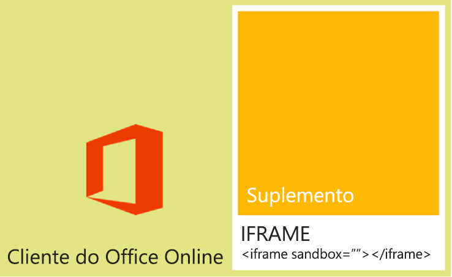

# <a name="privacy-and-security-for-office-add-ins"></a><span data-ttu-id="e6729-102">Privacidade e seguran?a para suplementos do Office</span><span class="sxs-lookup"><span data-stu-id="e6729-102">Privacy and security for Office Add-ins</span></span>

## <a name="understanding-the-add-in-runtime"></a><span data-ttu-id="e6729-103">No??es b?sicas sobre o tempo de execu??o do suplemento</span><span class="sxs-lookup"><span data-stu-id="e6729-103">Understanding the add-in runtime</span></span>

<span data-ttu-id="e6729-p101">Os suplementos do Office s?o protegidos por um ambiente de tempo de execu??o de suplemento, um modelo de permiss?es com v?rias camadas e administradores de desempenho. Essa estrutura protege a experi?ncia do usu?rio das seguintes maneiras:</span><span class="sxs-lookup"><span data-stu-id="e6729-p101">Office Add-ins are secured by an add-in runtime environment, a multiple-tier permissions model, and performance governors. This framework protects the user's experience in the following ways:</span></span> 

- <span data-ttu-id="e6729-106">O acesso ao quadro da interface do usu?rio do aplicativo host ? gerenciado.</span><span class="sxs-lookup"><span data-stu-id="e6729-106">Access to the host application's UI frame is managed.</span></span>

- <span data-ttu-id="e6729-107">? permitido somente o acesso indireto ao thread da interface do usu?rio do aplicativo host.</span><span class="sxs-lookup"><span data-stu-id="e6729-107">Only indirect access to the host application's UI thread is allowed.</span></span>

- <span data-ttu-id="e6729-108">As intera??es modais n?o s?o permitidas. Por exemplo, chamadas ?s fun??es **alert**, **confirm** e **prompt** do JavaScript n?o s?o permitidas porque s?o modais.</span><span class="sxs-lookup"><span data-stu-id="e6729-108">Modal interactions aren't allowed - for example, calls to JavaScript  **alert**, **confirm**, and **prompt** functions aren't allowed because they're modal.</span></span>

<span data-ttu-id="e6729-109">Al?m disso, a estrutura de tempo de execu??o fornece os seguintes benef?cios para garantir que um suplemento do Office n?o possa danificar o ambiente do usu?rio:</span><span class="sxs-lookup"><span data-stu-id="e6729-109">Further, the runtime framework provides the following benefits to ensure that an Office Add-in can't damage the user's environment:</span></span>

- <span data-ttu-id="e6729-110">Isola o processo no qual o suplemento ? executado.</span><span class="sxs-lookup"><span data-stu-id="e6729-110">Isolates the process the add-in runs in.</span></span>

- <span data-ttu-id="e6729-111">N?o exige substitui??o de .dll ou de .exe ou de componentes ActiveX.</span><span class="sxs-lookup"><span data-stu-id="e6729-111">Doesn't require .dll or .exe replacement or ActiveX components.</span></span>

- <span data-ttu-id="e6729-112">Facilita a instala??o e a desinstala??o do suplemento.</span><span class="sxs-lookup"><span data-stu-id="e6729-112">Makes add-ins easy to install and uninstall.</span></span>

<span data-ttu-id="e6729-113">E o uso de mem?ria, CPU e recursos de rede por suplementos do Office ? govern?vel para garantir que o bom desempenho e a confiabilidade sejam mantidos.</span><span class="sxs-lookup"><span data-stu-id="e6729-113">Also, the use of memory, CPU, and network resources by Office Add-ins is governable to ensure that good performance and reliability are maintained.</span></span> 

<span data-ttu-id="e6729-114">As se??es a seguir descrevem brevemente como a arquitetura de tempo de execu??o d? suporte a suplementos em execu??o em clientes do Office em dispositivos Windows, em dispositivos Mac OS X e em clientes do Office Online na Web.</span><span class="sxs-lookup"><span data-stu-id="e6729-114">The following sections briefly describe how the runtime architecture supports running add-ins in Office clients on Windows-based devices, on OS X Mac devices, and in Office Online clients on the web.</span></span>

> <span data-ttu-id="e6729-115">**OBSERVA??O:** para saber mais sobre como usar WIP e Intune com os Suplementos do Office, confira [Usar o WIP e o Intune para proteger dados empresariais em documentos executando suplementos do Office](https://docs.microsoft.com/en-us/microsoft-365-enterprise/office-add-ins-wip).</span><span class="sxs-lookup"><span data-stu-id="e6729-115">**NOTE**  To learn about using WIP and Intune with Office Add-ins, see [Use WIP and Intune to protect enterprise data in documents running Office Add-ins](https://docs.microsoft.com/en-us/microsoft-365-enterprise/office-add-ins-wip).</span></span>

### <a name="clients-for-windows-and-os-x-devices"></a><span data-ttu-id="e6729-116">Clientes para dispositivos Windows e OS X</span><span class="sxs-lookup"><span data-stu-id="e6729-116">Clients for Windows and OS X devices</span></span>

<span data-ttu-id="e6729-p102">Em clientes com suporte para dispositivos de ?rea de trabalho e de tablet, como Excel, Outlook e Outlook para Mac, h? suporte a suplementos do Office por meio da integra??o de um componente no processo, o tempo de execu??o de Suplementos do Office, que gerencia o ciclo de vida do suplemento e habilita a interoperabilidade entre o suplemento e o aplicativo cliente. A p?gina da Web do suplemento em si ? hospedada fora do processo. Como mostrado na Figura 1, em um dispositivo Windows para ?rea de trabalho ou tablet, a p?gina da Web do suplemento ? hospedada em um controle do Internet Explorer que, por sua vez, ? hospedado em um processo de tempo de execu??o de suplemento que fornece seguran?a e isolamento de desempenho.</span><span class="sxs-lookup"><span data-stu-id="e6729-p102">In supported clients for desktop and tablet devices, such as Excel, Outlook, and Outlook for Mac, Office Add-ins are supported by integrating an in-process component, the Office Add-ins runtime, which manages the add-in lifecycle and enables interoperability between the add-in and the client application. The add-in webpage itself is hosted out-of-process. As shown in figure 1, on a Windows desktop or tablet device, the add-in webpage is hosted inside an Internet Explorer control which, in turn, is hosted inside an add-in runtime process that provides security and performance isolation.</span></span>

<span data-ttu-id="e6729-p103">No Windows Desktop, o Modo Protegido no Internet Explorer deve ser ativado para a Zona de Site Restrito. Ele geralmente est? habilitado por padr?o. Se estiver desabilitado, um [erro ocorrer?](https://support.microsoft.com/en-us/help/2761180/apps-for-office-don-t-start-if-you-disable-protected-mode-for-the-restricted-sites-zone-in-internet-explorer) quando voc? tentar iniciar um suplemento.</span><span class="sxs-lookup"><span data-stu-id="e6729-p103">On Windows desktops, Protect Mode in Internet Explorer must be enabled for the Restricted Site Zone. This is typically enabled by default. If it is disabled, an [error will occur](https://support.microsoft.com/en-us/help/2761180/apps-for-office-don-t-start-if-you-disable-protected-mode-for-the-restricted-sites-zone-in-internet-explorer) when you try to launch an add-in.</span></span>

<span data-ttu-id="e6729-123">*Figura 1. Ambiente de execu??o dos Suplementos do Office nos clientes Windows para ?rea de trabalho e tablet*</span><span class="sxs-lookup"><span data-stu-id="e6729-123">*Figure 1. Office Add-ins runtime environment in Windows-based desktop and tablet clients*</span></span>


<span data-ttu-id="e6729-125">Como mostrado na figura a seguir, em um computador de mesa Mac OS X, a p?gina da Web do suplemento ? hospedada em um processo de host de tempo de execu??o WebKit em ?rea restrita que ajuda a fornecer um n?vel semelhante de seguran?a e prote??o de desempenho.</span><span class="sxs-lookup"><span data-stu-id="e6729-125">As shown in the following figure, on an OS X Mac desktop, the add-in web page is hosted inside a sandboxed WebKit runtime host process which helps provide similar level of security and performance protection.</span></span> 

<span data-ttu-id="e6729-126">*Figura 2. Ambiente de execu??o dos Suplementos do Office nos clientes Mac OS X*</span><span class="sxs-lookup"><span data-stu-id="e6729-126">*Figure 2. Office Add-ins runtime environment in OS X Mac clients*</span></span>


<span data-ttu-id="e6729-128">O tempo de execu??o de Suplementos do Office gerencia a comunica??o entre processos, a convers?o de eventos e chamadas ? API JavaScript em itens nativos, bem como o suporte de comunica??o remota da interface do usu?rio para habilitar o suplemento a ser processado dentro do documento, em um painel de tarefas ou de forma adjacente a uma mensagem de e-mail, solicita??o de reuni?o ou compromisso.</span><span class="sxs-lookup"><span data-stu-id="e6729-128">The Office Add-ins runtime manages interprocess communication, the translation of JavaScript API calls and events into native ones, as well as UI remoting support to enable the add-in to be rendered inside the document, in a task pane, or adjacent to an email message, meeting request, or appointment.</span></span>

### <a name="web-clients"></a><span data-ttu-id="e6729-129">Clientes Web</span><span class="sxs-lookup"><span data-stu-id="e6729-129">Web clients</span></span>

<span data-ttu-id="e6729-p104">Em clientes Web com suporte, como o Excel Online e o Outlook Web App, os Suplementos do Office s?o hospedados em um **iframe** que ? executado usando o atributo **sandbox** do HTML5. N?o s?o permitidos componentes ActiveX nem a navega??o na p?gina principal do cliente Web. O suporte a Suplementos do Office ? habilitado em clientes Web por meio da integra??o da API JavaScript para Office. De maneira semelhante aos aplicativos cliente de ?rea de trabalho, a API JavaScript gerencia o ciclo de vida do suplemento e a interoperabilidade entre o suplemento e o cliente Web. Essa interoperabilidade ? implementada por meio de uma infraestrutura especial de comunica??o de mensagens de publica??o entre quadros. A mesma biblioteca JavaScript (Office.js) que ? usada em clientes de ?rea de trabalho, est? dispon?vel para interagir com o cliente Web. A figura a seguir ilustra a infraestrutura que d? suporte aos Suplementos do Office no Office Online (em execu??o no navegador) e os componentes relevantes (o cliente Web, o **iframe**, o tempo de execu??o de Suplementos do Office e a API JavaScript para o Office) que s?o necess?rios para dar suporte a eles.</span><span class="sxs-lookup"><span data-stu-id="e6729-p104">In supported Web clients, such as Excel Online and Outlook Web App, Office Add-ins are hosted in an  **iframe** that runs using the HTML5 **sandbox** attribute. ActiveX components or navigating the main page of the web client are not allowed. Office Add-ins support is enabled in the web clients by the integration of the JavaScript API for Office. In a similar way to the desktop client applications, the JavaScript API manages the add-in lifecycle and interoperability between the add-in and the web client. This interoperability is implemented by using a special cross-frame post message communication infrastructure. The same JavaScript library (Office.js) that is used on desktop clients is available to interact with the web client. The following figure shows the infrastructure that supports Office Add-ins in Office Online (running in the browser), and the relevant components (the web client, **iframe**, Office Add-ins runtime, and JavaScript API for Office) that are required to support them.</span></span>

<span data-ttu-id="e6729-137">*Figura 3. Infraestrutura que d? suporte aos Suplementos do Office nos clientes Web do Office*</span><span class="sxs-lookup"><span data-stu-id="e6729-137">*Figure 3. Infrastructure that supports Office Add-ins in Office web clients*</span></span>



## <a name="add-in-integrity-in-appsource"></a><span data-ttu-id="e6729-139">Integridade do suplemento no AppSource</span><span class="sxs-lookup"><span data-stu-id="e6729-139">Add-in integrity in AppSource</span></span>

<span data-ttu-id="e6729-p105">Voc? pode disponibilizar os Suplementos do Office para o p?blico publicando-os no AppSource, que imp?e as seguintes medidas para manter a integridade dos suplementos:</span><span class="sxs-lookup"><span data-stu-id="e6729-p105">You can make your Office Add-ins available to the public by publishing them to AppSource. AppSource enforces the following measures to maintain the integrity of add-ins:</span></span>


- <span data-ttu-id="e6729-142">Requer que o servidor host de um Suplemento do Office sempre use o protocolo SSL para se comunicar.</span><span class="sxs-lookup"><span data-stu-id="e6729-142">Requires the host server of an Office Add-in to always use Secure Sockets Layer (SSL) to communicate.</span></span>

- <span data-ttu-id="e6729-143">Requer que um desenvolvedor forne?a uma prova de identidade, um acordo contratual e uma pol?tica de privacidade compat?vel para enviar suplementos.</span><span class="sxs-lookup"><span data-stu-id="e6729-143">Requires a developer to provide proof of identity, a contractual agreement, and a compliant privacy policy to submit add-ins.</span></span>

- <span data-ttu-id="e6729-144">Garante que a origem dos suplementos seja acess?vel no modo somente leitura.</span><span class="sxs-lookup"><span data-stu-id="e6729-144">Ensures that the source of add-ins is accessible in read-only mode.</span></span>

- <span data-ttu-id="e6729-145">D? suporte a um sistema de revis?o pelo usu?rio para os suplementos dispon?veis para promover uma comunidade autovigilante.</span><span class="sxs-lookup"><span data-stu-id="e6729-145">Supports a user-review system for available add-ins to promote a self-policing community.</span></span>

## <a name="addressing-end-users-privacy-concerns"></a><span data-ttu-id="e6729-146">Lidar com as preocupa??es de privacidade dos usu?rios finais</span><span class="sxs-lookup"><span data-stu-id="e6729-146">Addressing end users' privacy concerns</span></span>

<span data-ttu-id="e6729-147">Esta se??o descreve a prote??o oferecida pela plataforma de Suplementos do Office da perspectiva do cliente (usu?rio final) e fornece as diretrizes sobre como dar suporte ?s expectativas dos usu?rios e como manipular com seguran?a as PII (informa??es de identifica??o pessoal) dos usu?rios.</span><span class="sxs-lookup"><span data-stu-id="e6729-147">This section describes the protection offered by the Office Add-ins platform from the customer's (end user's) perspective, and provides guidelines for how to support users' expectations and how to securely handle users' personally identifiable information (PII).</span></span>

### <a name="end-users-perspective"></a><span data-ttu-id="e6729-148">Perspectiva dos usu?rios finais</span><span class="sxs-lookup"><span data-stu-id="e6729-148">End users' perspective</span></span>

<span data-ttu-id="e6729-p106">Os Suplementos do Office s?o criados usando tecnologias da Web que s?o executadas em um controle de navegador ou em um **iframe**. Por isso, o uso de suplementos ? semelhante ? navega??o em sites na Internet ou na intranet. Os suplementos podem ser externos ? organiza??o (se voc? adquire o suplemento do AppSource) ou internos (se voc? adquire o suplemento de um cat?logo de suplementos do Exchange Server, de um cat?logo de suplementos do SharePoint ou de um compartilhamento de arquivos na rede da organiza??o). Os suplementos t?m acesso limitado ? rede, e a maioria dos suplementos pode ler ou gravar no documento ou item de email ativo. A plataforma de suplementos aplica certas restri??es antes que um usu?rio ou administrador instale ou inicie um suplemento. Por?m, como ocorre com qualquer modelo de extensibilidade, os usu?rios devem ser cuidadosos antes de iniciar um suplemento desconhecido.</span><span class="sxs-lookup"><span data-stu-id="e6729-p106">Office Add-ins are built using web technologies that run in a browser control or **iframe**. Because of this, using add-ins is similar to browsing to web sites on the Internet or intranet. Add-ins can be external to an organization (if you acquire the add-in from AppSource) or internal (if you acquire the add-in from an Exchange Server add-in catalog, SharePoint add-in catalog, or file share on an organization's network). Add-ins have limited access to the network and most add-ins can read or write to the active document or mail item. The add-in platform applies certain constraints before a user or administrator installs or starts an add-in. But as with any extensibility model, users should be cautious before starting an unknown add-in.</span></span>

<span data-ttu-id="e6729-155">A plataforma de suplementos lida com as preocupa??es com privacidade dos usu?rios finais das seguintes maneiras:</span><span class="sxs-lookup"><span data-stu-id="e6729-155">The add-in platform addresses end users' privacy concerns in the following ways:</span></span>

- <span data-ttu-id="e6729-156">Os dados comunicados com o servidor Web que hospeda um suplemento de conte?do, do Outlook ou de painel de tarefas, bem como a comunica??o entre o suplemento e quaisquer servi?os Web que ele usa, devem ser criptografados usando o protocolo SSL.</span><span class="sxs-lookup"><span data-stu-id="e6729-156">Data communicated with the web server that hosts a content, Outlook or task pane add-in as well as communication between the add-in and any web services it uses must be encrypted using the Secure Socket Layer (SSL) protocol.</span></span>

- <span data-ttu-id="e6729-p107">Antes de instalar um suplemento do AppSource, o usu?rio pode exibir a pol?tica de privacidade e os requisitos desse suplemento. Al?m disso, os suplementos do Outlook que interagem com caixas de correio dos usu?rios exp?em as permiss?es espec?ficas das quais precisam. O usu?rio pode examinar os termos de uso, as permiss?es solicitadas e a pol?tica de privacidade antes de instalar um suplemento do Outlook.</span><span class="sxs-lookup"><span data-stu-id="e6729-p107">Before a user installs an add-in from AppSource, the user can view the privacy policy and requirements of that add-in. In addition, Outlook add-ins that interact with users' mailboxes surface the specific permissions that they require; the user can review the terms of use, requested permissions and privacy policy before installing an Outlook add-in.</span></span>

- <span data-ttu-id="e6729-p108">Ao compartilhar um documento, os usu?rios tamb?m compartilham suplementos que foram inseridos no documento ou associados a ele. Se um usu?rio abrir um documento que contenha um suplemento que o usu?rio n?o usou antes, o aplicativo host solicitar? que o usu?rio conceda permiss?o para que o suplemento seja executado no documento. Em um ambiente empresarial, o aplicativo host do Office tamb?m consultar? o usu?rio se o documento for proveniente de uma fonte externa.</span><span class="sxs-lookup"><span data-stu-id="e6729-p108">When sharing a document, users also share add-ins that have been inserted in or associated with that document. If a user opens a document that contains an add-in that the user hasn't used before, the host application prompts the user to grant permission for the add-in to run in the document. In an organizational environment, the Office host application also prompts the user if the document comes from an external source.</span></span>

- <span data-ttu-id="e6729-p109">Os usu?rios podem habilitar ou desabilitar o acesso ao AppSource. Para os suplementos do conte?do e do painel de tarefas, os usu?rios gerenciam o acesso aos suplementos e cat?logos confi?veis na **Central de Confiabilidade** no cliente host do Office (aberto com **Arquivo** > **Op??es** > **Central de Confiabilidade** > **Configura??es da Central de Confiabilidade** > **Cat?logos de Suplementos Confi?veis**). Para os suplementos do Outlook, os usu?rios podem gerenciar os suplementos escolhendo o bot?o **Gerenciar Suplementos**: no Outlook para Windows, escolha **Arquivo** > **Gerenciar Suplementos**. No Outlook para Mac, escolha o bot?o **Gerenciar Suplementos** na barra de suplementos. No Outlook Web App, escolha o menu **Configura??es** (?cone de engrenagem) > **Gerenciar suplementos**. Os administradores tamb?m podem gerenciar esse acesso [usando a pol?tica de grupo](http://technet.microsoft.com/en-us/library/jj219429.aspx#BKMK_Managing).</span><span class="sxs-lookup"><span data-stu-id="e6729-p109">Users can enable or disable the access to AppSource. For content and task pane add-ins, users manage access to trusted add-ins and catalogs from the  **Trust Center** on the host Office client (opened from **File** > **Options** > **Trust Center** > **Trust Center Settings** > **Trusted Add-in Catalogs**). For Outlook add-ins, uses can manage add-ins by choosing the  **Manage Add-ins** button: in Outlook for Windows, choose **File** > **Manage Add-ins**. In Outlook for Mac, choose the  **Manage Add-ins** button on the add-in bar. In Outlook Web App choose the **Settings** menu (gear icon) > **Manage add-ins**. Administrators can also manage this access [by using group policy](http://technet.microsoft.com/en-us/library/jj219429.aspx#BKMK_Managing).</span></span>

- <span data-ttu-id="e6729-166">O design da plataforma do suplemento fornece seguran?a e desempenho aos usu?rios finais das seguintes maneiras:</span><span class="sxs-lookup"><span data-stu-id="e6729-166">The design of the add-in platform provides security and performance for end users in the following ways:</span></span>

  - <span data-ttu-id="e6729-p110">Um Suplemento do Office ? executado em um controle de navegador da Web hospedado em um ambiente de tempo de execu??o de suplementos separado do aplicativo host do Office. Esse design fornece seguran?a e isolamento de desempenho do aplicativo host.</span><span class="sxs-lookup"><span data-stu-id="e6729-p110">An Office Add-in runs in a web browser control that is hosted in an add-in runtime environment separate from the Office host application. This design provides both security and performance isolation from the host application.</span></span>

  - <span data-ttu-id="e6729-169">A execu??o em um controle de navegador da Web permite que o suplemento fa?a quase tudo que uma p?gina da Web regular em execu??o em um navegador pode fazer, mas, ao mesmo tempo, restringe o suplemento a observar a pol?tica de mesma origem para o isolamento de dom?nio e as zonas seguran?a.</span><span class="sxs-lookup"><span data-stu-id="e6729-169">Running in a web browser control allows the add-in to do almost anything a regular web page running in a browser can do but, at the same time, restricts the add-in to observe the same-origin policy for domain isolation and security zones.</span></span>

<span data-ttu-id="e6729-p111">Os suplementos do Outlook fornecem recursos adicionais de seguran?a e desempenho por meio do monitoramento de uso de recursos espec?ficos do suplemento do Outlook. Para saber mais, consulte [Privacidade, permiss?es e seguran?a de suplementos do Outlook](https://docs.microsoft.com/en-us/outlook/add-ins/privacy-and-security).</span><span class="sxs-lookup"><span data-stu-id="e6729-p111">Outlook add-ins provide additional security and performance features through Outlook add-in specific resource usage monitoring. For more information, see [Privacy, permissions, and security for Outlook add-ins](https://docs.microsoft.com/en-us/outlook/add-ins/privacy-and-security).</span></span>

### <a name="developer-guidelines-to-handle-pii"></a><span data-ttu-id="e6729-172">Diretrizes de desenvolvedor para lidar com PII</span><span class="sxs-lookup"><span data-stu-id="e6729-172">Developer guidelines to handle PII</span></span>

<span data-ttu-id="e6729-p112">Voc? pode ler as diretrizes gerais de prote??o de PII para administradores de TI e desenvolvedores em [Proteger a privacidade no desenvolvimento e teste de aplicativos de recursos humanos](http://technet.microsoft.com/en-us/library/gg447064.aspx). A seguir s?o listadas algumas diretrizes de prote??o espec?ficas de PII para voc?, como desenvolvedor de Suplementos do Office:</span><span class="sxs-lookup"><span data-stu-id="e6729-p112">You can read general PII protection guidelines for IT administrators and developers in [Protecting Privacy in the Development and Testing of Human Resources Applications](http://technet.microsoft.com/en-us/library/gg447064.aspx). The following lists some specific PII protection guidelines for you as a developer of Office Add-ins:</span></span>

- <span data-ttu-id="e6729-p113">O objeto [Settings](https://dev.office.com/reference/add-ins/shared/settings) destina-se a persistir configura??es e dados de estado de suplementos entre sess?es para um suplemento de conte?do ou de painel de tarefas, mas n?o armazena senhas e outros itens de PII confidenciais no objeto **Settings**. Os dados no objeto **Settings** n?o ficam vis?veis para os usu?rios finais, mas s?o armazenados como parte do formato de arquivo do documento, que est? prontamente acess?vel. Voc? deve limitar o uso de PII pelo suplemento e armazenar quaisquer itens de PII necess?rios ao suplemento no servidor que hospeda o suplemento como um recurso protegido pelo usu?rio.</span><span class="sxs-lookup"><span data-stu-id="e6729-p113">The [Settings](https://dev.office.com/reference/add-ins/shared/settings) object is intended for persisting add-in settings and state data across sessions for a content or task pane add-in, but don't store passwords and other sensitive PII in the **Settings** object. The data in the **Settings** object isn't visible to end users, but it is stored as part of the document's file format which is readily accessible. You should limit your add-in's use of PII and store any PII required by your add-in on the server hosting your add-in as a user-secured resource.</span></span>

- <span data-ttu-id="e6729-p114">O uso de alguns aplicativos pode revelar itens de PII. Armazene com seguran?a os dados de identidade, local, horas de acesso e outras credenciais dos usu?rios para que os dados n?o sejam disponibilizados para outros usu?rios do suplemento.</span><span class="sxs-lookup"><span data-stu-id="e6729-p114">Using some applications can reveal PII. Make sure that you securely store data for your users' identity, location, access times, and any other credentials so that data won't become available to other users of the add-in.</span></span>

- <span data-ttu-id="e6729-p115">Se o suplemento estiver dispon?vel no AppSource, o requisito do AppSource por HTTPS proteger? os itens de PII transmitidos entre o servidor Web e o dispositivo ou computador cliente. No entanto, se voc? retransmitir esses dados para outros servidores, observe o mesmo n?vel de prote??o.</span><span class="sxs-lookup"><span data-stu-id="e6729-p115">If your add-in is available in AppSource, the AppSource requirement for HTTPS protects PII transmitted between your web server and the client computer or device. However, if you re-transmit that data to other servers, make sure you observe the same level of protection.</span></span>

- <span data-ttu-id="e6729-p116">Se voc? armazenar itens de PII dos usu?rios, revele esse fato e forne?a uma maneira para que os usu?rios os inspecionem e excluam. Se voc? enviar o suplemento ao AppSource, poder? indicar na pol?tica de privacidade os dados que coleta e como eles s?o usados.</span><span class="sxs-lookup"><span data-stu-id="e6729-p116">If you store users' PII, make sure you reveal that fact, and provide a way for users to inspect and delete it. If you submit your add-in to AppSource, you can outline the data you collect and how it's used in the privacy statement.</span></span>

## <a name="developers-permission-choices-and-security-practices"></a><span data-ttu-id="e6729-184">Op??es de permiss?o e pr?ticas de seguran?a de desenvolvedores</span><span class="sxs-lookup"><span data-stu-id="e6729-184">Developers' permission choices and security practices</span></span>

<span data-ttu-id="e6729-185">Siga estas diretrizes gerais para dar suporte ao modelo de seguran?a de Suplementos do Office e analisar detalhadamente cada tipo de suplemento.</span><span class="sxs-lookup"><span data-stu-id="e6729-185">Follow these general guidelines to support the security model of Office Add-ins, and drill down on more details for each add-in type.</span></span>

### <a name="permissions-choices"></a><span data-ttu-id="e6729-186">Op??es de permiss?es</span><span class="sxs-lookup"><span data-stu-id="e6729-186">Permissions choices</span></span>

<span data-ttu-id="e6729-187">A plataforma de suplemento fornece um modelo de permiss?es que o seu suplemento usa para declarar o n?vel de acesso aos dados de um usu?rio que ele exige para seus recursos.</span><span class="sxs-lookup"><span data-stu-id="e6729-187">The add-in platform provides a permissions model that your add-in uses to declare the level of access to a user's data that it requires for its features.</span></span> <span data-ttu-id="e6729-188">Cada n?vel de permiss?o corresponde ao subconjunto da API JavaScript para Office que seu suplemento pode usar em seus recursos.</span><span class="sxs-lookup"><span data-stu-id="e6729-188">Each permission level corresponds to the subset of the JavaScript API for Office your add-in is allowed to use for its features.</span></span> <span data-ttu-id="e6729-189">Por exemplo, a permiss?o **WriteDocument** para os suplementos do conte?do e do painel de tarefas permite acesso ao m?todo [Document.setSelectedDataAsync](https://dev.office.com/reference/add-ins/shared/document.setselecteddataasync), que permite que um suplemento grave no documento do usu?rio, mas n?o permite acesso a qualquer um dos m?todos para ler dados do documento.</span><span class="sxs-lookup"><span data-stu-id="e6729-189">For example, the  **WriteDocument** permission for content and task pane add-ins allows access to the [Document.setSelectedDataAsync](https://dev.office.com/reference/add-ins/shared/document.setselecteddataasync) method that lets an add-in write to the user's document, but doesn't allow access to any of the methods for reading data from the document.</span></span> <span data-ttu-id="e6729-190">Esse n?vel de permiss?o faz sentido para suplementos que precisam apenas gravar em um documento, como um suplemento no qual o usu?rio pode consultar dados para inserir em seus documentos.</span><span class="sxs-lookup"><span data-stu-id="e6729-190">This permission level makes sense for add-ins that only need to write to a document, such as an add-in where the user can query for data to insert into their document.</span></span>

<span data-ttu-id="e6729-p118">Como pr?tica recomendada, voc? deve solicitar permiss?es com base no princ?pio de _menor privil?gio_. Ou seja, voc? deve solicitar permiss?o para acessar apenas o subconjunto m?nimo da API que o suplemento requer para funcionar corretamente. Por exemplo, se o suplemento precisa apenas ler dados no documento de um usu?rio para seus recursos, voc? n?o deve solicitar mais do que a permiss?o **ReadDocument**. (Por?m, lembre-se de que a solicita??o de permiss?es insuficientes far? com que a plataforma de suplementos bloqueie o uso de algumas APIs pelo suplemento e gerar? erros em tempo de execu??o.)</span><span class="sxs-lookup"><span data-stu-id="e6729-p118">As a best practice, you should request permissions based on the principle of  _least privilege_. That is, you should request permission to access only the minimum subset of the API that your add-in requires to function correctly. For example, if your add-in needs only to read data in a user's document for its features, you should request no more than the **ReadDocument** permission. (But, keep in mind that requesting insufficient permissions will result in the add-in platform blocking your add-in's use of some APIs and will generate errors at run time.)</span></span>

<span data-ttu-id="e6729-p119">Voc? especifica permiss?es no manifesto do suplemento, conforme mostrado no exemplo abaixo nesta se??o, e os usu?rios finais podem ver o n?vel de permiss?o solicitado de um suplemento antes de decidirem instalar ou ativar o suplemento pela primeira vez. Al?m disso, os suplementos do Outlook que solicitam a permiss?o **ReadWriteMailbox** exigem o privil?gio de administrador expl?cito para serem instalados.</span><span class="sxs-lookup"><span data-stu-id="e6729-p119">You specify permissions in the manifest of your add-in, as shown in the example in this section below, and end users can see the requested permission level of an add-in before they decide to install or activate the add-in for the first time. Additionally, Outlook add-ins that request the  **ReadWriteMailbox** permission require explicit administrator privilege to install.</span></span>

<span data-ttu-id="e6729-p120">O exemplo a seguir mostra como um suplemento de painel de tarefas especifica a permiss?o **ReadDocument** em seu manifesto. Para manter as permiss?es em destaque, outros elementos no manifesto n?o s?o exibidos.</span><span class="sxs-lookup"><span data-stu-id="e6729-p120">The following example shows how a task pane add-in specifies the  **ReadDocument** permission in its manifest. To keep permissions as the focus, other elements in the manifest aren't displayed.</span></span>

```xml
<?xml version="1.0" encoding="utf-8"?>
<OfficeApp xmlns="http://schemas.microsoft.com/office/appforoffice/1.0"
           xmlns:xsi="http://www.w3.org/2001/XMLSchema-instance" 
           xmlns:ver="http://schemas.microsoft.com/office/appforoffice/1.0"
           xsi:type="TaskPaneApp">

... <!-- To keep permissions as the focus, not displaying other elements. -->
  <Permissions>ReadDocument</Permissions>
...
</OfficeApp>
```

<span data-ttu-id="e6729-199">Para saber mais sobre permiss?es para suplementos de painel de tarefas e de conte?do, consulte [Solicitar permiss?es para uso da API em suplementos de conte?do e de painel de tarefas](https://docs.microsoft.com/en-us/office/dev/add-ins/develop/requesting-permissions-for-api-use-in-content-and-task-pane-add-ins).</span><span class="sxs-lookup"><span data-stu-id="e6729-199">For more information about permissions for task pane and content add-ins, see [Requesting permissions for API use in content and task pane add-ins](https://docs.microsoft.com/en-us/office/dev/add-ins/develop/requesting-permissions-for-api-use-in-content-and-task-pane-add-ins).</span></span>

<span data-ttu-id="e6729-200">Para saber mais sobre permiss?es para suplementos do Outlook, confira os t?picos a seguir:</span><span class="sxs-lookup"><span data-stu-id="e6729-200">For more information about permissions for Outlook add-ins, see the following topics:</span></span>

- [<span data-ttu-id="e6729-201">Privacidade, permiss?es e seguran?a de suplementos do Outlook</span><span class="sxs-lookup"><span data-stu-id="e6729-201">Privacy, permissions, and security for Outlook add-ins</span></span>](https://docs.microsoft.com/outlook/add-ins/privacy-and-security)

- [<span data-ttu-id="e6729-202">No??es b?sicas sobre permiss?es de suplemento do Outlook</span><span class="sxs-lookup"><span data-stu-id="e6729-202">Understanding Outlook add-in permissions</span></span>](https://docs.microsoft.com/outlook/add-ins/understanding-outlook-add-in-permissions)

### <a name="same-origin-policy"></a><span data-ttu-id="e6729-203">Pol?tica de mesma origem</span><span class="sxs-lookup"><span data-stu-id="e6729-203">Same origin policy</span></span>

<span data-ttu-id="e6729-204">Como os suplementos do Office s?o p?ginas da Web executadas em um controle de navegador da Web, eles devem seguir a pol?tica de mesma origem imposta pelo navegador: por padr?o, uma p?gina da Web em um dom?nio n?o pode fazer chamadas ao servi?o Web [XmlHttpRequest](http://www.w3.org/TR/XMLHttpRequest/) para outro dom?nio que n?o aquele em que est? hospedada.</span><span class="sxs-lookup"><span data-stu-id="e6729-204">Because Office Add-ins are webpages that run in a web browser control, they must follow the same-origin policy enforced by the browser: by default, a webpage in one domain can't make [XmlHttpRequest](http://www.w3.org/TR/XMLHttpRequest/) web service calls to another domain other than the one where it is hosted.</span></span>

<span data-ttu-id="e6729-p121">Uma maneira de superar essa limita??o ? usar JSON/P: forne?a um proxy para o servi?o Web incluindo uma marca **script** com um atributo **src** que aponte para algum script hospedado em outro dom?nio. Voc? pode criar as marcas**script** via programa??o gerando de forma din?mica a URL para a qual apontar o atributo **src** e passando par?metros ? URL por meio de par?metros da consulta de URI. Os provedores de servi?os Web criam e hospedam o c?digo JavaScript em URLs espec?ficas e retornam scripts diferentes, dependendo dos par?metros de consulta de URI. Em seguida, esses scripts s?o executados onde est?o inseridos e funcionam como esperado.</span><span class="sxs-lookup"><span data-stu-id="e6729-p121">One way to overcome this limitation is to use JSON/P -- provide a proxy for the web service by including a  **script** tag with a **src** attribute that points to some script hosted on another domain. You can programmatically create the **script** tags, dynamically creating the URL to which to point the **src** attribute, and passing parameters to the URL via URI query parameters. Web service providers create and host JavaScript code at specific URLs, and return different scripts depending on the URI query parameters. These scripts then execute where they are inserted and work as expected.</span></span>

<span data-ttu-id="e6729-209">A seguir h? um exemplo de JSON/P no exemplo de suplemento do Outlook.</span><span class="sxs-lookup"><span data-stu-id="e6729-209">The following is an example of JSON/P in the Outlook add-in example.</span></span> 

```js
// Dynamically create an HTML SCRIPT element that obtains the details for the specified video.
function loadVideoDetails(videoIndex) {
    // Dynamically create a new HTML SCRIPT element in the webpage.
    var script = document.createElement("script");
    // Specify the URL to retrieve the indicated video from a feed of a current list of videos,
    // as the value of the src attribute of the SCRIPT element. 
    script.setAttribute("src", "https://gdata.youtube.com/feeds/api/videos/" + 
        videos[videoIndex].Id + "?alt=json-in-script&amp;callback=videoDetailsLoaded");
    // Insert the SCRIPT element at the end of the HEAD section.
    document.getElementsByTagName('head')[0].appendChild(script);
}
```

<span data-ttu-id="e6729-p122">O Exchange e o SharePoint fornecem proxies do lado do cliente para habilitar o acesso de dom?nio cruzado. Em geral, a pol?tica de mesma origem em uma intranet n?o ? t?o estrita como na Internet. Para saber mais, confira [Pol?tica de mesma origem, parte 1: sem exibi??o](http://blogs.msdn.com/b/ieinternals/archive/2009/08/28/explaining-same-origin-policy-part-1-deny-read.aspx) e [Como lidar com limita??es de pol?tica de mesma origem nos Suplementos do Office](../develop/addressing-same-origin-policy-limitations.md).</span><span class="sxs-lookup"><span data-stu-id="e6729-p122">Exchange and SharePoint provide client-side proxies to enable cross-domain access. In general, same origin policy on an intranet isn't as strict as on the Internet. For more information, see [Same Origin Policy Part 1: No Peeking](http://blogs.msdn.com/b/ieinternals/archive/2009/08/28/explaining-same-origin-policy-part-1-deny-read.aspx) and [Addressing same-origin policy limitations in Office Add-ins](../develop/addressing-same-origin-policy-limitations.md).</span></span>

### <a name="tips-to-prevent-malicious-cross-site-scripting"></a><span data-ttu-id="e6729-213">Dicas para evitar scripts mal-intencionados entre sites</span><span class="sxs-lookup"><span data-stu-id="e6729-213">Tips to prevent malicious cross-site scripting</span></span>

<span data-ttu-id="e6729-214">Um usu?rio mal-intencionado pode atacar a origem de um suplemento inserindo um script mal-intencionado no documento ou nos campos do suplemento.</span><span class="sxs-lookup"><span data-stu-id="e6729-214">An ill-intentioned user could attack the origin of an add-in by entering malicious script through the document or fields in the add-in.</span></span> <span data-ttu-id="e6729-215">Um desenvolvedor deve processar a entrada do usu?rio para evitar a execu??o do JavaScript de um usu?rio mal-intencionado em seu dom?nio.</span><span class="sxs-lookup"><span data-stu-id="e6729-215">A developer should process user input to avoid executing a malicious user's JavaScript within their domain.</span></span> <span data-ttu-id="e6729-216">A seguir est?o algumas boas pr?ticas a serem seguidas para manipular a entrada do usu?rio a partir de um documento ou mensagem de e-mail, ou por meio de campos em um suplemento:</span><span class="sxs-lookup"><span data-stu-id="e6729-216">The following are some good practices to follow to handle user input from a document or mail message, or via fields in an add-in:</span></span>


- <span data-ttu-id="e6729-p124">Em vez da propriedade DOM [innerHTML](http://msdn.microsoft.com/en-us/library/ie/ms533897.aspx), use as propriedades [innerText](https://msdn.microsoft.com/library/ms533899.aspx) e [textContent](https://developer.mozilla.org/en-US/docs/DOM/Node.textContent) quando apropriado. Fa?a o seguinte para o suporte entre navegadores do Internet Explorer e do Firefox:</span><span class="sxs-lookup"><span data-stu-id="e6729-p124">Instead of the DOM property [innerHTML](http://msdn.microsoft.com/en-us/library/ie/ms533897.aspx), use the [innerText](https://msdn.microsoft.com/library/ms533899.aspx) and [textContent](https://developer.mozilla.org/en-US/docs/DOM/Node.textContent) properties where appropriate. Do the following for Internet Explorer and Firefox cross-browser support:</span></span>

    ```js
     var text = x.innerText || x.textContent
    ```

    <span data-ttu-id="e6729-p125">Para saber mais sobre as diferen?as entre **innerText** e **textContent**, confira [Node.textContent](https://developer.mozilla.org/en-US/docs/DOM/Node.textContent). Para saber mais sobre a compatibilidade de DOM entre navegadores comuns, consulte [Compatibilidade de DOM W3C ? HTML](http://www.quirksmode.org/dom/w3c_html.html#t07).</span><span class="sxs-lookup"><span data-stu-id="e6729-p125">For information about the differences between  **innerText** and **textContent**, see [Node.textContent](https://developer.mozilla.org/en-US/docs/DOM/Node.textContent). For more information about DOM compatibility across common browsers, see [W3C DOM Compatibility - HTML](http://www.quirksmode.org/dom/w3c_html.html#t07).</span></span>

- <span data-ttu-id="e6729-p126">Se precisar usar **innerHTML**, verifique se a entrada do usu?rio n?o tem conte?do mal-intencionado antes de pass?-la para **innerHTML**. Para saber mais e obter um exemplo de como usar **innerHTML** com seguran?a, confira a propriedade [innerHTML](http://msdn.microsoft.com/en-us/library/ie/ms533897.aspx).</span><span class="sxs-lookup"><span data-stu-id="e6729-p126">If you must use  **innerHTML**, make sure the user's input doesn't contain malicious content before passing it to  **innerHTML**. For more information and an example of how to use  **innerHTML** safely, see [innerHTML](http://msdn.microsoft.com/en-us/library/ie/ms533897.aspx) property.</span></span>

- <span data-ttu-id="e6729-223">Se estiver usando jQuery, use o m?todo [.text()](http://api.jquery.com/text/) em vez do m?todo [.html()](http://api.jquery.com/html/).</span><span class="sxs-lookup"><span data-stu-id="e6729-223">If you are using jQuery, use the [.text()](http://api.jquery.com/text/) method instead of the [.html()](http://api.jquery.com/html/) method.</span></span>

- <span data-ttu-id="e6729-224">Use o m?todo [toStaticHTML](http://msdn.microsoft.com/en-us/library/ie/cc848922.aspx) para remover atributos e elementos HTML din?micos da entrada dos usu?rios antes de pass?-la para **innerHTML**.</span><span class="sxs-lookup"><span data-stu-id="e6729-224">Use the [toStaticHTML](http://msdn.microsoft.com/en-us/library/ie/cc848922.aspx) method to remove any dynamic HTML elements and attributes in users' input before passing it to **innerHTML**.</span></span>

- <span data-ttu-id="e6729-225">Use a fun??o [encodeURIComponent](http://msdn.microsoft.com/en-us/library/8202bce6-1342-40dc-a5ef-ac6d210a7d15.aspx) ou [encodeURI](http://msdn.microsoft.com/en-us/library/17bab5a2-bcd4-46c2-8b52-b2b5a0ed98a3.aspx) para codificar texto que se destina a ser uma URL que vem da entrada do usu?rio ou a cont?m.</span><span class="sxs-lookup"><span data-stu-id="e6729-225">Use the [encodeURIComponent](http://msdn.microsoft.com/en-us/library/8202bce6-1342-40dc-a5ef-ac6d210a7d15.aspx) or [encodeURI](http://msdn.microsoft.com/en-us/library/17bab5a2-bcd4-46c2-8b52-b2b5a0ed98a3.aspx) function to encode text that is intended to be a URL that comes from or contains user input.</span></span>

- <span data-ttu-id="e6729-226">Consulte [Desenvolver suplementos seguros](http://msdn.microsoft.com/en-us/library/windows/apps/hh849625.aspx) para obter mais pr?ticas recomendadas para criar solu??es Web mais seguras.</span><span class="sxs-lookup"><span data-stu-id="e6729-226">See [Developing secure add-ins](http://msdn.microsoft.com/en-us/library/windows/apps/hh849625.aspx) for more best practices to create more secure web solutions.</span></span>

### <a name="tips-to-prevent-clickjacking"></a><span data-ttu-id="e6729-227">Dicas para impedir "clickjacking"</span><span class="sxs-lookup"><span data-stu-id="e6729-227">Tips to prevent "Clickjacking"</span></span>

<span data-ttu-id="e6729-228">Como os suplementos do Office s?o processados em um iframe durante a execu??o em um navegador com aplicativos de host do Office Online, use as dicas a seguir para reduzir o risco de [clickjacking](http://en.wikipedia.org/wiki/Clickjacking), uma t?cnica explorada por hackers para induzir os usu?rios a revelarem informa??es confidenciais.</span><span class="sxs-lookup"><span data-stu-id="e6729-228">Because Office Add-ins are rendered in an iframe when running in a browser with Office Online host applications, use the following tips to minimize the risk of [clickjacking](http://en.wikipedia.org/wiki/Clickjacking) -- a technique used by hackers to fool users into revealing confidential information.</span></span>

<span data-ttu-id="e6729-p127">Em primeiro lugar, identifique a??es confidenciais que o suplemento pode executar. Elas incluem a??es que um usu?rio n?o autorizado pode usar de forma mal-intencionada, como iniciar uma transa??o financeira ou publicar dados confidenciais. Por exemplo, o suplemento pode permitir que o usu?rio envie um pagamento a um destinat?rio definido pelo usu?rio.</span><span class="sxs-lookup"><span data-stu-id="e6729-p127">First, identify sensitive actions that your add-in can perform. These include any actions that an unauthorized user could use with malicious intent, such as initiating a financial transaction or publishing sensitive data. For example, your add-in might let the user send a payment to a user-defined recipient.</span></span>

<span data-ttu-id="e6729-p128">Segundo, para a??es confidenciais, o suplemento deve confirmar com o usu?rio antes de executar a a??o. A confirma??o deve detalhar o efeito que a a??o ter?. Tamb?m deve detalhar como o usu?rio pode impedir a a??o, se necess?rio, escolhendo um bot?o espec?fico marcado como "N?o Permitir" ou ignorando a confirma??o.</span><span class="sxs-lookup"><span data-stu-id="e6729-p128">Second, for sensitive actions, your add-in should confirm with the user before it executes the action. This confirmation should detail what effect the action will have. It should also detail how the user can prevent the action, if necessary, whether by choosing a specific button marked "Don't Allow" or by ignoring the confirmation.</span></span>

<span data-ttu-id="e6729-235">Terceiro, para garantir que nenhum poss?vel hacker possa ocultar ou mascarar a confirma??o, voc? deve exibi-la fora do contexto do suplemento (ou seja, n?o em uma caixa de di?logo HTML).</span><span class="sxs-lookup"><span data-stu-id="e6729-235">Third, to ensure that no potential attacker can hide or mask the confirmation, you should display it outside the context of the add-in (that is, not in an HTML dialog box).</span></span>

<span data-ttu-id="e6729-236">Aqui est?o alguns exemplos de como obter uma confirma??o:</span><span class="sxs-lookup"><span data-stu-id="e6729-236">Here are some examples of how you could get confirmation:</span></span>

- <span data-ttu-id="e6729-237">Envie um e-mail ao usu?rio com um link de confirma??o.</span><span class="sxs-lookup"><span data-stu-id="e6729-237">Send an email to the user that contains a confirmation link.</span></span>

- <span data-ttu-id="e6729-238">Envie uma mensagem de texto ao usu?rio com um c?digo de confirma??o para ele inserir no suplemento.</span><span class="sxs-lookup"><span data-stu-id="e6729-238">Send a text message to the user that includes a confirmation code that the user can enter in the add-in.</span></span>

- <span data-ttu-id="e6729-p129">Abra um di?logo de confirma??o em uma nova janela do navegador para uma p?gina que n?o possa ser exibida em iframe. Geralmente, esse ? o padr?o usado por p?ginas de login. Use a [API de di?logo](../develop/dialog-api-in-office-add-ins.md) para criar um novo di?logo.</span><span class="sxs-lookup"><span data-stu-id="e6729-p129">Open a confirmation dialog in a new browser window to a page that cannot be iframed. This is typically the pattern that is used by login pages. Use the [dialog api](../develop/dialog-api-in-office-add-ins.md) to create a new dialog.</span></span>

<span data-ttu-id="e6729-p130">Verifique tamb?m se o endere?o usado para entrar em contato com o usu?rio n?o pode ter sido fornecido por um poss?vel hacker. Por exemplo, para confirma??es de pagamento, use o endere?o arquivado na conta autorizada do usu?rio.</span><span class="sxs-lookup"><span data-stu-id="e6729-p130">Also, ensure that the address you use for contacting the user couldn't have been provided by a potential attacker. For example, for payment confirmations use the address on file for the authorized user's account.</span></span>

### <a name="other-security-practices"></a><span data-ttu-id="e6729-244">Outras pr?ticas de seguran?a</span><span class="sxs-lookup"><span data-stu-id="e6729-244">Other security practices</span></span>

<span data-ttu-id="e6729-245">Os desenvolvedores tamb?m devem observar as seguintes pr?ticas de seguran?a:</span><span class="sxs-lookup"><span data-stu-id="e6729-245">Developers should also take note of the following security practices:</span></span>


- <span data-ttu-id="e6729-246">Os desenvolvedores n?o devem usar controles ActiveX em Suplementos do Office, pois os controles ActiveX n?o d?o suporte ? natureza de plataforma cruzada da plataforma de suplementos.</span><span class="sxs-lookup"><span data-stu-id="e6729-246">Developers shouldn't use ActiveX controls in Office Add-ins as ActiveX controls don't support the cross-platform nature of the add-in platform.</span></span>

- <span data-ttu-id="e6729-p131">Os suplementos de conte?do e de painel de tarefas presumem o uso das mesmas configura??es de SSL que o Internet Explorer usa por padr?o e permitem que a maioria do conte?do seja fornecida apenas por SSL. Os suplementos do Outlook exigem que todo o conte?do seja fornecido por SSL. Os desenvolvedores devem especificar no elemento **SourceLocation** do manifesto do suplemento uma URL que use HTTPS, para identificar o local do arquivo HTML do suplemento.</span><span class="sxs-lookup"><span data-stu-id="e6729-p131">Content and task pane add-ins assume the same SSL settings that Internet Explorer uses by default, and allows most content to be delivered only by SSL. Outlook add-ins require all content to be delivered by SSL. Developers must specify in the **SourceLocation** element of the add-in manifest a URL that uses HTTPS, to identify the location of the HTML file for the add-in.</span></span>

    <span data-ttu-id="e6729-250">Para garantir que os suplementos n?o estejam fornecendo conte?do usando HTTP, ao test?-los os desenvolvedores devem se certificar que as seguintes configura??es est?o selecionadas no Internet Explorer e que n?o h? avisos de seguran?a aparecendo em seus cen?rios de teste:</span><span class="sxs-lookup"><span data-stu-id="e6729-250">To make sure add-ins aren't delivering content by using HTTP, when testing add-ins, developers should make sure the following settings are selected in Internet Explorer and no security warnings appear in their test scenarios:</span></span>

    - <span data-ttu-id="e6729-p132">Verifique se a configura??o de seguran?a **Exibir conte?do misto** da zona **Internet** est? definida para **Perguntar**. Voc? pode fazer isso selecionando o seguinte no Internet Explorer: na guia **Seguran?a** da caixa de di?logo **Op??es da Internet**, selecione a zona **Internet**, escolha **N?vel personalizado**, role at? **Exibir conte?do misto** e marque **Perguntar** se essa op??o n?o estiver marcada.</span><span class="sxs-lookup"><span data-stu-id="e6729-p132">Make sure the security setting,  **Display mixed content**, for the  **Internet** zone is set to **Prompt**. You can do that by selecting the following in Internet Explorer: on the  **Security** tab of the **Internet Options** dialog box, select the **Internet** zone, select **Custom level**, scroll to look for  **Display mixed content**, and select  **Prompt** if it isn't already selected.</span></span>

    - <span data-ttu-id="e6729-253">Verifique se a op??o **Avisar ao alterar o modo de seguran?a** est? marcada na guia **Avan?ado** da caixa de di?logo **Op??es da Internet**.</span><span class="sxs-lookup"><span data-stu-id="e6729-253">Make sure **Warn if Changing between Secure and not secure mode** is selected in the **Advanced** tab of the **Internet Options** dialog box.</span></span>

- <span data-ttu-id="e6729-p133">Para garantir que os suplementos n?o usem excessivamente os recursos de mem?ria ou do n?cleo da CPU e causem a nega??o de servi?o em um computador cliente, a plataforma de suplementos estabelece limites de uso de recursos. Como parte dos testes, os desenvolvedores devem verificar se o desempenho de um suplemento est? dentro dos limites de uso de recursos.</span><span class="sxs-lookup"><span data-stu-id="e6729-p133">To make sure that add-ins don't use excessive CPU core or memory resources and cause any denial of service on a client computer, the add-in platform establishes resource usage limits. As part of testing, developers should verify whether an add-in performs within the resource usage limits.</span></span>

- <span data-ttu-id="e6729-256">Antes de publicar um suplemento, os desenvolvedores devem verificar se as informa??es de identifica??o pessoal expostas nos arquivos do suplemento est?o seguras.</span><span class="sxs-lookup"><span data-stu-id="e6729-256">Before publishing an add-in, developers should make sure that any personal identifiable information that they expose in their add-in files is secure.</span></span>

- <span data-ttu-id="e6729-p134">Os desenvolvedores n?o devem inserir chaves usadas para acessar APIs ou servi?os de terceiros (como o Bing, Google ou Facebook) diretamente nas p?ginas HTML do suplemento. Em vez disso, devem criar um servi?o Web personalizado ou armazenar as chaves em alguma outra forma de armazenamento seguro na Web, que podem ent?o chamar para passar o valor de chave ao suplemento.</span><span class="sxs-lookup"><span data-stu-id="e6729-p134">Developers shouldn't embed keys that they use to access third-party APIs or services (such as Bing, Google, or Facebook) directly in the HTML pages of their add-in. Instead, they should create a custom web service or store the keys in some other form of secure web storage that they can then call to pass the key value to their add-in.</span></span>

- <span data-ttu-id="e6729-259">Os desenvolvedores devem fazer o seguinte ao enviar um suplemento ? AppSource:</span><span class="sxs-lookup"><span data-stu-id="e6729-259">Developers should do the following when submitting an add-in to AppSource:</span></span>

  - <span data-ttu-id="e6729-260">Hospedar o suplemento que est?o enviando em um servidor Web que d? suporte a SSL.</span><span class="sxs-lookup"><span data-stu-id="e6729-260">Host the add-in they are submitting on a web server that supports SSL.</span></span>
  - <span data-ttu-id="e6729-261">Produzir uma declara??o com uma pol?tica de privacidade compat?vel.</span><span class="sxs-lookup"><span data-stu-id="e6729-261">Produce a statement outlining a compliant privacy policy.</span></span>
  - <span data-ttu-id="e6729-262">Estar preparados para assinar um acordo contratual ao enviar o suplemento.</span><span class="sxs-lookup"><span data-stu-id="e6729-262">Be ready to sign a contractual agreement upon submitting the add-in.</span></span>

<span data-ttu-id="e6729-p135">Al?m das regras de uso de recursos, os desenvolvedores de suplementos do Outlook tamb?m devem verificar se os suplementos est?o de acordo com os limites para a especifica??o de regras de ativa??o e se usam a API JavaScript. Para saber mais, confira [Limites de ativa??o e API JavaScript para suplementos do Outlook](http://msdn.microsoft.com/library/e0c9e3d0-517e-4333-b8bd-e169c51a07f6.aspx).</span><span class="sxs-lookup"><span data-stu-id="e6729-p135">Other than resource usage rules, developers for Outlook add-ins should also make sure their add-ins observe limits for specifying activation rules and using the JavaScript API. For more information, see [Limits for activation and JavaScript API for Outlook add-ins](http://msdn.microsoft.com/library/e0c9e3d0-517e-4333-b8bd-e169c51a07f6.aspx).</span></span>

## <a name="it-administrators-control"></a><span data-ttu-id="e6729-265">Controle de administradores de TI</span><span class="sxs-lookup"><span data-stu-id="e6729-265">IT administrators' control</span></span>

<span data-ttu-id="e6729-266">Em uma configura??o corporativa, os administradores de TI t?m autoridade final para habilitar ou desabilitar o acesso ao AppSource e a cat?logos particulares.</span><span class="sxs-lookup"><span data-stu-id="e6729-266">In a corporate setting, IT administrators have ultimate authority over enabling or disabling access to AppSource and any private catalogs.</span></span>

## <a name="see-also"></a><span data-ttu-id="e6729-267">Confira tamb?m</span><span class="sxs-lookup"><span data-stu-id="e6729-267">See also</span></span>

- [<span data-ttu-id="e6729-268">Solicitar permiss?es para uso da API em suplementos de painel de tarefas e de conte?do</span><span class="sxs-lookup"><span data-stu-id="e6729-268">Requesting permissions for API use in content and task pane add-ins</span></span>](http://msdn.microsoft.com/library/da2efadc-4ebf-45fe-be39-397ac1eb1dbd.aspx)
- [<span data-ttu-id="e6729-269">Privacidade, permiss?es e seguran?a de suplementos do Outlook</span><span class="sxs-lookup"><span data-stu-id="e6729-269">Privacy, permissions, and security for Outlook add-ins</span></span>](http://msdn.microsoft.com/library/44208fc4-05d4-42d8-ab20-faa89624de1c.aspx)
- [<span data-ttu-id="e6729-270">No??es b?sicas sobre permiss?es de suplemento do Outlook</span><span class="sxs-lookup"><span data-stu-id="e6729-270">Understanding Outlook add-in permissions</span></span>](https://docs.microsoft.com/en-us/outlook/add-ins/understanding-outlook-add-in-permissions)
- [<span data-ttu-id="e6729-271">Limites de ativa??o e da API do JavaScript API para suplementos do Outlook</span><span class="sxs-lookup"><span data-stu-id="e6729-271">Limits for activation and JavaScript API for Outlook add-ins</span></span>](http://msdn.microsoft.com/library/e0c9e3d0-517e-4333-b8bd-e169c51a07f6.aspx)
- [<span data-ttu-id="e6729-272">Como lidar com limita??es de pol?tica de mesma origem nos suplementos do Office</span><span class="sxs-lookup"><span data-stu-id="e6729-272">Addressing same-origin policy limitations in Office Add-ins</span></span>](http://msdn.microsoft.com/library/36c800ae-1dda-4ea8-a558-37c89ffb161b.aspx)
- [<span data-ttu-id="e6729-273">Pol?tica de Mesma Origem</span><span class="sxs-lookup"><span data-stu-id="e6729-273">Same Origin Policy</span></span>](http://www.w3.org/Security/wiki/Same_Origin_Policy)
- [<span data-ttu-id="e6729-274">Pol?tica de Mesma Origem Parte 1: Sem Inspecionar</span><span class="sxs-lookup"><span data-stu-id="e6729-274">Same Origin Policy Part 1: No Peeking</span></span>](http://blogs.msdn.com/b/ieinternals/archive/2009/08/28/explaining-same-origin-policy-part-1-deny-read.aspx)
- [<span data-ttu-id="e6729-275">Pol?tica de mesma origem para JavaScript</span><span class="sxs-lookup"><span data-stu-id="e6729-275">Same origin policy for JavaScript</span></span>](https://developer.mozilla.org/En/Same_origin_policy_for_JavaScript)
- [<span data-ttu-id="e6729-276">Modo Protegido do IE</span><span class="sxs-lookup"><span data-stu-id="e6729-276">IE Protect Mode</span></span>](https://support.microsoft.com/en-us/help/2761180/apps-for-office-don-t-start-if-you-disable-protected-mode-for-the-restricted-sites-zone-in-internet-explorer)
