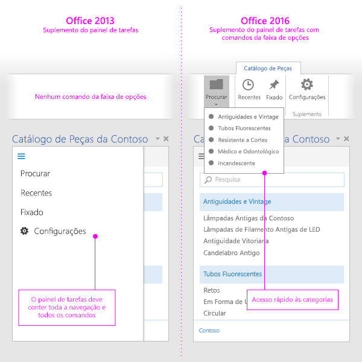

# Comandos de suplemento para Excel, Word e PowerPointAdd-in commands for Excel, Word, and PowerPoint

Comandos de suplemento são elementos de interface do usuário que estendem a interface do usuário do Office e iniciam ações no suplemento. Você pode usar comandos de suplemento para adicionar um botão à faixa de opções ou um item a um menu de contexto. Ao selecionar um comando de suplemento, os usuários iniciam ações como executar código JavaScript ou exibir uma página do suplemento em um painel de tarefas. Os comandos de suplemento ajudam os usuários a localizar e usar o suplemento, o que pode ajudá-lo a aumentar a adoção e a reutilização do suplemento, além de melhorar a retenção de clientes.Add-in commands are UI elements that extend the Office UI and start actions in your add-in. You can use add-in commands to add a button on the ribbon or an item to a context menu. When users select an add-in command, they initiate actions such as running JavaScript code, or showing a page of the add-in in a task pane. Add-in commands help users find and use your add-in, which can help increase your add-in's adoption and reuse, and improve customer retention.

Para uma visão geral do recurso, confira o vídeo [Comandos de Suplemento na Faixa de Opções do Office](https://channel9.msdn.com/events/Build/2016/P551).For an overview of the feature, see the video [Add-in Commands in the Office Ribbon](https://channel9.msdn.com/events/Build/2016/P551).

> [!NOTE]
> Os catálogos do SharePoint não são compatíveis com os comandos de suplemento. É possível implantar comandos de suplemento pela [Implantação centralizada](../publish/centralized-deployment.md) ou pelo [AppSource](/office/dev/store/submit-to-the-office-store) ou usar [sideload](../testing/create-a-network-shared-folder-catalog-for-task-pane-and-content-add-ins.md) para implantar seu comando de suplemento para testes.SharePoint catalogs do not support add-in commands. You can deploy add-in commands via [Centralized Deployment](../publish/centralized-deployment.md) or [AppSource](/office/dev/store/submit-to-the-office-store), or use [sideloading](../testing/create-a-network-shared-folder-catalog-for-task-pane-and-content-add-ins.md) to deploy your add-in command for testing. 

*Figura 1. Suplemento com comandos em execução na Área de Trabalho do Excel**Figure 1. Add-in with commands running in Excel Desktop*

*Figura 2. Suplemento com comandos em execução no Excel Online**Figure 2. Add-in with commands running in Excel Online*

## Recursos de comandosCommand capabilities

Os seguintes recursos de comando são compatíveis no momento.The following command capabilities are currently supported.

> [!NOTE]
> Atualmente os suplementos de conteúdo não dão suporte a comandos de suplemento.Content add-ins do not currently support add-in commands.

**Pontos de extensão****Extension points**

- Guias da faixa de opções: estender as guias internas ou criar uma nova guia personalizada.Ribbon tabs - Extend built-in tabs or create a new custom tab.
- Menus de contexto: estender os menus de contexto selecionados.Context menus - Extend selected context menus.

**Tipos de controle****Control types**

- Botões simples: disparar ações específicas.Simple buttons - trigger specific actions.
- Menus – menu suspenso simples com botões que disparam ações.Menus - simple menu dropdown with buttons that trigger actions.

**Ações****Actions**

- ShowTaskpane: exibe um ou vários painéis que carregam páginas HTML personalizadas dentro deles.ShowTaskpane - Displays one or multiple panes that load custom HTML pages inside them.
- ExecuteFunction: carrega uma página HTML invisível e executa uma função JavaScript dentro dela. Para mostrar a interface do usuário dentro de sua função (como erros, progresso ou entrada adicional), você pode usar a API [displayDialog](/javascript/api/office/office.ui).ExecuteFunction - Loads an invisible HTML page and then execute a JavaScript function within it. To show UI within your function (such as errors, progress, or additional input) you can use the [displayDialog](/javascript/api/office/office.ui) API.  

## Plataformas com suporteSupported platforms

Os comandos de suplemento atualmente têm suporte nas seguintes plataformas:Add-in commands are currently supported on the following platforms:

- Outlook 2016 no Windows (build 16.0.4678.1000+)Outlook 2016 on Windows (build 16.0.4678.1000+)
- Office no Windows conectado ao Office 365 (build 16.0.6769+)Office on Windows connected to Office 365 (build 16.0.6769+)
- Office 2019 no WindowsOffice 2019 for Windows
- Office para Mac conectado ao Office 365 (build 15.33+)Office for Mac connected to Office 365 (build 15.33+)
- Office 2019 para MacOffice 2019 for Mac
- Office OnlineOffice Online

Mais plataformas serão incluídas em breve.More platforms are coming soon.

## DepuraçãoDebugging

Para depurar um comando de Suplemento, você deve executá-lo no Office Online.To debug an Add-in Command, you must run it in Office Online. Para obter detalhes, consulte [Depurar suplementos no Office Online](../testing/debug-add-ins-in-office-online.md).For details, see [Debug add-ins in Office Online](../testing/debug-add-ins-in-office-online.md).

## Práticas recomendadasBest practices

Aplique as seguintes práticas recomendadas ao desenvolver comandos de suplementos:Apply the following best practices when you develop add-in commands:

- Use os comandos para representar uma ação específica com um resultado claro e específico para os usuários. Não combine várias ações em um único botão.Use commands to represent a specific action with a clear and specific outcome for users. Do not combine multiple actions in a single button.
- Forneça ações granulares que tornam a realização de tarefas comuns no seu suplemento mais eficiente. Minimize o número de etapas necessárias para concluir uma tarefa.Provide granular actions that make common tasks within your add-in more efficient to perform. Minimize the number of steps an action takes to complete.
- Para o posicionamento dos comandos na faixa de opções do Office:For the placement of your commands in the Office ribbon:
    - Insira os comandos em uma guia existente (Inserir, Revisar e assim por diante) se a funcionalidade fornecida se encaixar ali. Por exemplo, se seu suplemento permitir que os usuários insiram mídia, adicione um grupo à guia Inserir. Observe que nem todas as guias estão disponíveis em todas as versões do Office. Para saber mais, confira o [Manifesto XML dos Suplementos do Office](../develop/add-in-manifests.md).Place commands on an existing tab (Insert, Review, and so on) if the functionality provided fits there. For example, if your add-in enables users to insert media, add a group to the Insert tab. Note that not all tabs are available across all Office versions. For more information, see [Office Add-ins XML manifest](../develop/add-in-manifests.md).
    - Insira comandos na guia Página Inicial se a funcionalidade não se encaixar em outra guia e você menos de seis comandos de nível superior. Você também pode adicionar comandos à guia Página Inicial se seu suplemento precisar funcionar em diferentes versões do Office (como o Office para área de trabalho e o Office Online) e uma guia não estiver disponível em todas as versões (por exemplo, a guia Design não existe no Office Online).Place commands on the Home tab if the functionality doesn't fit on another tab, and you have fewer than six top-level commands. You can also add commands to the Home tab if your add-in needs to work across Office versions (such as Office Desktop and Office Online) and a tab is not available in all versions (for example, the Design tab doesn't exist in Office Online).  
    - Coloque os comandos em uma guia personalizada se você tiver mais de seis comandos de nível superior.Place commands on a custom tab if you have more than six top-level commands.
    - Nomeie seu grupo de acordo com o nome do seu suplemento. Se você tiver vários grupos, nomeie cada grupo com base na funcionalidade que os comandos nesse grupo fornecem.Name your group to match the name of your add-in. If you have multiple groups, name each group based on the functionality that the commands in that group provide.
    - Não adicione botões supérfluos para aumentar o estado real do seu suplemento.Do not add superfluous buttons to increase the real estate of your add-in.

     > [!NOTE]
     > Os suplementos que ocupam muito espaço podem não passar na [Validação do AppSource](/office/dev/store/validation-policies).Add-ins that take up too much space might not pass [AppSource validation](/office/dev/store/validation-policies).

- Para todos os ícones, siga as [diretrizes de design de ícones](add-in-icons.md).For all icons, follow the [icon design guidelines](add-in-icons.md).
- Forneça uma versão do seu suplemento que também funcione em hosts que não tenham suporte para comandos.Provide a version of your add-in that also works on hosts that do not support commands. Um manifesto de suplemento único pode funcionar tanto em hosts cientes do comando (com os comandos) quanto em hosts não cientes do comando (como um painel de tarefas).A single add-in manifest can work in both command-aware (with commands) and non-command-aware (as a task pane) hosts.

   *Figura 3. Suplemento de painel de tarefas no Office 2013 e o mesmo suplemento usando comandos de suplementos no Office 2016**Figure 3. Task pane add-in in Office 2013 and the same add-in using add-in commands in Office 2016*

   

## Próximas etapasNext steps

A melhor maneira de começar a usar os comandos de suplemento é conferir os [exemplos de comandos de Suplemento do Office](https://github.com/OfficeDev/Office-Add-in-Commands-Samples/) no GitHub.The best way to get started using add-in commands is to take a look at the [Office Add-in commands samples](https://github.com/OfficeDev/Office-Add-in-Commands-Samples/) on GitHub.

Saiba mais sobre como especificar comandos de suplemento no manifesto em [Criar comandos de suplemento no manifesto](../develop/create-addin-commands.md) e no conteúdo de referência [VersionOverrides](/office/dev/add-ins/reference/manifest/versionoverrides).For more information about specifying add-in commands in your manifest, see [Create add-in commands in your manifest](../develop/create-addin-commands.md) and the [VersionOverrides](/office/dev/add-ins/reference/manifest/versionoverrides) reference content.
