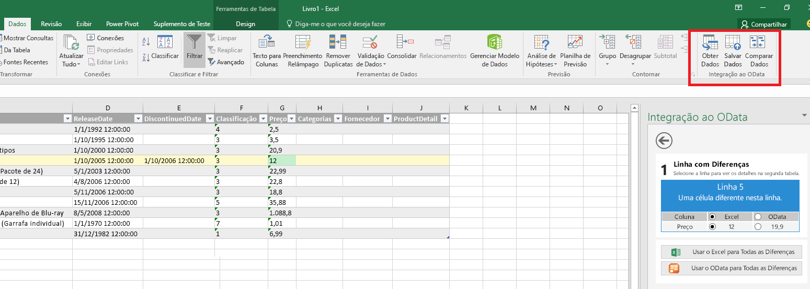

# Comandos de suplemento para Excel, Word e PowerPoint

Comandos de suplemento são elementos de interface do usuário que estendem a interface do usuário do Office e iniciam ações no suplemento. Você pode usar comandos de suplemento para adicionar um botão à faixa de opções ou um item a um menu de contexto. Ao selecionar um comando de suplemento, os usuários iniciam ações como executar código JavaScript ou exibir uma página do suplemento em um painel de tarefas. Os comandos de suplemento ajudam os usuários a localizar e usar o suplemento, o que pode ajudá-lo a aumentar a adoção e a reutilização do suplemento, além de melhorar a retenção de clientes.

Para uma visão geral do recurso, confira o vídeo [Comandos de Suplemento na Faixa de Opções do Office](https://channel9.msdn.com/events/Build/2016/P551).

> [!NOTE]
> Os catálogos do SharePoint não são compatíveis com os comandos de suplemento. É possível implantar comandos de suplemento pela [Implantação centralizada](../publish/centralized-deployment.md) ou pelo [AppSource](/office/dev/store/submit-to-appsource-via-partner-center) ou usar [sideload](../testing/create-a-network-shared-folder-catalog-for-task-pane-and-content-add-ins.md) para implantar seu comando de suplemento para testes.

> [!IMPORTANT]
> Os comandos de suplemento também são compatíveis com o Outlook. Para saber mais, confira [Comandos de suplemento para o Outlook](../outlook/add-in-commands-for-outlook.md).

*Figura 1. Suplemento com comandos em execução na Área de Trabalho do Excel*

*Figura 2. Suplemento com comandos em execução no Excel na Web*

## Recursos de comandos

Os seguintes recursos de comando são compatíveis no momento.

> [!NOTE]
> Atualmente os suplementos de conteúdo não dão suporte a comandos de suplemento.

### Pontos de extensão

- Guias da faixa de opções: estender as guias internas ou criar uma nova guia personalizada.
- Menus de contexto: estender menus de contexto selecionados.

### Tipos de controle

- Botões simples: disparar ações específicas.
- Menus – menu suspenso simples com botões que disparam ações.

### Ações

- ShowTaskpane: exibe um ou vários painéis que carregam páginas HTML personalizadas dentro deles.
- ExecuteFunction: carrega uma página HTML invisível e executa uma função JavaScript dentro dela. Para mostrar a interface do usuário dentro de sua função (como erros, progresso ou entrada adicional), você pode usar a API [displayDialog](/javascript/api/office/office.ui).  

### Status padrão Habilitado ou Desabilitado (visualização)

Você pode especificar se o comando está ativado ou desativado quando o suplemento é iniciado e alterar programaticamente a configuração.

> [!NOTE]
> Esse recurso está em visualização e não tem suporte em todos os hosts ou cenários. Para obter mais informações, consulte [Ativar e Desativar Comandos de Suplemento](disable-add-in-commands.md).

## Plataformas compatíveis

Os comandos de suplemento atualmente têm suporte nas seguintes plataformas.

- Outlook no Windows (build 16.0.6769+, conectado à assinatura do Office 365)
- Office 2019 no Windows
- Office no Mac (build 15.33+, conectado à assinatura do Office 365)
- Office 2019 no Mac
- Office na Web

> [!NOTE]
> Para saber mais sobre o suporte do Outlook, confira [comandos de suplemento do Outlook](../outlook/add-in-commands-for-outlook.md).

## Depuração

Para depurar um comando de Suplemento, você deve executá-lo no Office na Web. Para obter detalhes, confira [Depurar suplementos no Office na Web](../testing/debug-add-ins-in-office-online.md).

## Práticas recomendadas

Aplique as seguintes práticas recomendadas ao desenvolver comandos de suplementos:

- Use os comandos para representar uma ação específica com um resultado claro e específico para os usuários. Não combine várias ações em um único botão.
- Forneça ações granulares que tornam a realização de tarefas comuns no seu suplemento mais eficiente. Minimize o número de etapas necessárias para concluir uma tarefa.
- Para o posicionamento dos comandos na faixa de opções do Office:
    - Insira os comandos em uma guia existente (Inserir, Revisar e assim por diante) se a funcionalidade fornecida se encaixar ali. Por exemplo, se seu suplemento permitir que os usuários insiram mídia, adicione um grupo à guia Inserir. Observe que nem todas as guias estão disponíveis em todas as versões do Office. Para saber mais, confira o [Manifesto XML dos Suplementos do Office](../develop/add-in-manifests.md).
    - Insira comandos na guia Página Inicial se a funcionalidade não se encaixar em outra guia e você menos de seis comandos de nível superior. Você também pode adicionar comandos à guia Página Inicial se seu suplemento precisar funcionar em diferentes versões do Office (como o Office para área de trabalho e o Office na Web) e uma guia não está disponível em todas as versões (por exemplo, a guia Design não existe no Office na Web).  
    - Coloque os comandos em uma guia personalizada se você tiver mais de seis comandos de nível superior.
    - Nomeie seu grupo de acordo com o nome do seu suplemento. Se você tiver vários grupos, nomeie cada grupo com base na funcionalidade que os comandos nesse grupo fornecem.
    - Não adicione botões supérfluos para aumentar o estado real do seu suplemento.

     > [!NOTE]
     > Os suplementos que ocupam muito espaço podem não passar na [Validação do AppSource](/legal/marketplace/certification-policies).

- Para todos os ícones, siga as [diretrizes de design de ícones](add-in-icons.md).
- Forneça uma versão do seu suplemento que também funcione em hosts que não tenham suporte para comandos. Um manifesto de suplemento único pode funcionar tanto em hosts cientes do comando (com os comandos) quanto em hosts não cientes do comando (como um painel de tarefas).

   *Figura 3. Suplemento de painel de tarefas no Office 2013 e o mesmo suplemento usando comandos de suplementos no Office 2016*

   

## Próximas etapas

A melhor maneira de começar a usar os comandos de suplemento é conferir os [exemplos de comandos de Suplemento do Office](https://github.com/OfficeDev/Office-Add-in-Commands-Samples/) no GitHub.

Saiba mais sobre como especificar comandos de suplemento no manifesto em [Criar comandos de suplemento no manifesto](../develop/create-addin-commands.md) e no conteúdo de referência [VersionOverrides](../reference/manifest/versionoverrides.md).
