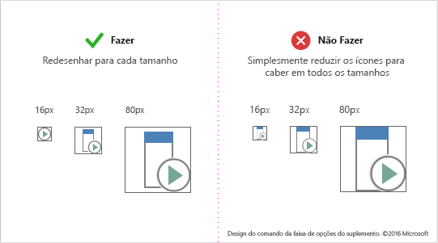
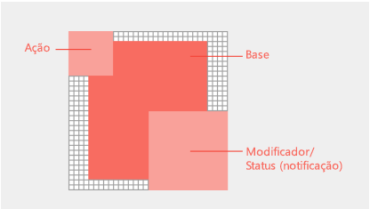

# Diretrizes de ícone de estilo atualizado para suplementos do Office

As versões do Office 2013 + (sem assinatura) do Office usam o novo estilo da Microsoft iconografia. Se você preferir que seus ícones correspondam ao estilo monoline do Microsoft 365, confira [diretrizes de ícone de estilo monoline para suplementos do Office](add-in-icons-monoline.md).

## Estilo visual novo do Office

Os ícones atualizados incluem apenas os elementos Essential communicative. Elementos não essenciais, como perspectiva, gradientes e uma fonte de luz, foram removidos. Os ícones simplificados suportam a análise mais rápida de comandos e controles. Siga este estilo para se ajustar melhor aos clientes que não estão inscritos no Office.

## Práticas recomendadas

Siga estas diretrizes ao criar seus ícones:

|Fazer|Não fazer|
|:---|:---|
|Mantenha os visuais simples e claros, concentrando-se nos principais elementos da comunicação.| Não usar artefatos que façam com que o ícone pareça confuso.|
|Usar a linguagem de ícones do Office para representar comportamentos ou conceitos.|Não redefina glifos do Office UI Fabric para comandos de suplemento na faixa de opções do aplicativo do Office ou nos menus contextuais. Os ícones do Fabric são estilisticamente diferentes e não serão compatíveis.|
|Reutilizar metáforas visuais comuns do Office, como o pincel para formatar ou a lupa para localizar.|Não reutilizar metáforas visuais para comandos diferentes. Usar o mesmo ícone para conceitos e comportamentos diferentes pode causar confusão. |
|Redesenhar os ícones para deixá-los pequenos ou maiores. Dedicar um tempo para redesenhar recortes, cantos e bordas arredondadas para maximizar a clareza da linha. |Não redimensionar os ícones reduzindo-os ou aumentando-os. Isso pode levar a uma baixa qualidade visual e a ações confusas. Os ícones complexos criados em um tamanho maior podem perder clareza ao ser redimensionados para ficar menores sem um redesenho. |
|Use a white fill for accessibility. Most objects in your icons will require a white background to be legible across Office UI themes and in high-contrast modes.  |Evite confiar no seu logotipo ou marca para comunicar o que um comando de suplemento faz. Nem sempre é possível reconhecer as marcas em ícones menores e quando os modificadores são aplicados. As marcas de marca geralmente entram em conflito com os estilos de ícone da faixa de opções do aplicativo do Office e podem competir pela atenção do usuário em um ambiente saturado. |
|Usar o formato PNG com uma tela de fundo transparente. ||
|Evitar usar conteúdo localizável nos ícones, como caracteres tipográficos, indicações de parágrafos e pontos de interrogação. ||

## Recomendações e requisitos de tamanho de ícone

Os ícones da área de trabalho do Office são imagens bitmap. Os tamanhos diferentes serão renderizados, dependendo do modo de toque e da configuração de DPI do usuário. Inclua todos os oito tamanhos com suporte para criar a melhor experiência para todas as resoluções e contextos com suporte. Estes são os tamanhos compatíveis (três são obrigatórios):

- 16 px (obrigatório)
- 20 px
- 24 px
- 32 px (obrigatório)
- 40 px
- 48 px
- 64 px (recomendado, melhor para Mac)
- 80 px (obrigatório)

Não se esqueça de redesenhar seus ícones para cada tamanho em vez de reduzi-los para que caibam.

<!--
The following table shows the icon sizes that render for different modes at different DPI settings.

|DPI |**Small**||**Medium**||**Large**||**Extra large**|
|:---|:---|:---|:---|:---|:---|:---|:---|
|    |**Mouse**|**Touch**|**Mouse**|**Touch**|**Mouse**|**Touch**|-|
|100%|16px|20px|24px||32px|40px|48px|
|125%|20px|24px|||40px|48px|60px|
|150%|24px|24px|36px||48px|48px|72px|
|200%|32px|40px|48px||64px|80px|96px|
|250%|40px||||80px||120px|
|300%|48px||||96px||144px

> [!NOTE]
> At DPI settings of 150% or greater, the icon does not get swapped out for a larger size when Touch mode is engaged. At DPI settings greater than 250%, Touch mode is turned off by default.

The following table lists the locations for certain icon sizes.

|Location|100% DPI|200% DPI|250% DPI|
|:-------|:-------|:-------|:-------|
|Small ribbon button|16px|32px|40px|
|Contextual menu|16px|32px|40px|
|Quick access toolbar (QAT)|16px|32px|40px|
|Large ribbon icon|32px|64px|80px|

-->

## Anatomia e layout do ícone

Office icons are typically comprised of a base element with action and conceptual modifiers overlayed. Action modifiers represent concepts such as add, open, new, or close. Conceptual modifiers represent status, alteration, or a description of the icon.

To create commands that align with the Office UI, follow layout guidelines for the base element and modifiers. This ensures that your commands look professional and that your customers will trust your add-in. If you make exceptions to these guidelines, do so intentionally.

A imagem a seguir mostra o layout de elementos básicos e modificadores em um ícone do Office.

- Elementos básicos centrais no quadro do pixel com preenchimento todo vazio.
- Coloque modificadores de ação na parte superior esquerda.
- Coloque modificadores conceituais no canto inferior direito.
- Limit the number of elements in your icons. At 32px, limit the number of modifiers to a maximum of two. At 16px, limit the number of modifiers to one.

### Preenchimento do elemento básico

Coloque elementos básicos com tamanhos consistentes. Se os elementos básicos não puderem ser centralizados no quadro, alinhe-os no canto superior esquerdo, deixando os pixels extras na parte inferior direita. Para obter melhores resultados, aplique as diretrizes de preenchimento listadas na tabela da seção a seguir.

### Modificadores

All modifiers should have a 1px transparent cutout between each element, including the background. Elements should not directly overlap. Create whitespace between rules and edges. Modifiers can vary slightly in size, but use these dimensions as a starting point.

|**Tamanho do ícone**|**Preenchimento em torno do elemento básico**|**Tamanho do modificador**|
|:---|:---|:---|
|16px|,0|9px|
|20px|1px|10px|
|24px|1px|12px|
|32px|2px|14px|
|40px|2px|20px|
|48px|3px|22px|
|64px|5px|29px|
|80px|5px|38px|

## Cores do ícone

> [!NOTE]
> Estas diretrizes de cor são destinadas a ícones da faixa de opções usados em [Comandos do suplemento](add-in-commands.md). Esses ícones não são processados com o Microsoft UI Fabric e a paleta de cores é diferente da paleta descrita em [Microsoft UI Fabric| Cores | Compartilhado](https://fluentfabric.azurewebsites.net/#/color/shared).

Office icons have a limited color palette. Use the colors listed in the following table to guarantee seamless integration with the Office UI. Apply the following guidelines to the use of color:

- Use color to communicate meaning rather than for embellishment. It should highlight or emphasize an action, status, or an element that explicitly differentiates the mark. 
- If possible, use only one additional color beyond gray. Limit additional colors to two at the most.
- Colors should have a consistent appearance in all icon sizes. Office icons have slightly different color palettes for different icon sizes. 16px and smaller icons are slightly darker and more vibrant than 32px and larger icons. Without these subtle adjustments, colors appear to vary across sizes.

|**Nome da cor**|**RGB**|**Hex**|**Cor**|**Categoria**|
|:---|:---|:---|:---|:---|
|Texto Cinza (80)|80, 80, 80|#505050|  |Texto|
|Texto Cinza (95)|95, 95, 95|#5F5F5F|  |Texto|
|Texto Cinza (105)|105, 105, 105|#696969|  |Texto|
|Cinza Escuro 32|128, 128, 128|#808080|  |32 e acima|
|Cinza Médio 32|158, 158, 158|#9E9E9E|  |32 e acima|
|Cinza Claro TODO|179, 179, 179|#B3B3B3|  |Todos os tamanhos|
|Cinza Escuro 16|114, 114, 114|#727272|  |16 e abaixo|
|Cinza Médio 16|144, 144, 144|#909090|  |16 e abaixo|
|Azul 32|77, 130, 184|#4d82B8|  |32 e acima|
|Azul 16|74, 125, 177|#4A7DB1|  |16 e abaixo|
|Amarelo TODO|234, 194, 130|#EAC282|  |Todos os tamanhos|
|Laranja 32|231, 142, 70|#E78E46|  |32 e acima|
|Laranja 16|227, 142, 70|#E3751C|  |16 e abaixo|
|Rosa TODO|230, 132, 151|#E68497|  |Todos os tamanhos|
|Verde 32|118, 167, 151|#76A797|  |32 e acima|
|Verde 16|104, 164, 144|#68A490|  |16 e abaixo|
|Vermelho 32|216, 99, 68|#D86344|  |32 e acima|
|Vermelho 16|214, 85, 50|#D65532|  |16 e abaixo|
|Roxo 32|152, 104, 185|#9868B9|  |32 e acima|
|Roxo 16|137, 89, 171|#8959AB|  |16 e abaixo|

## Ícones em modos de alto contraste

Office icons are designed to render well in high contrast modes. Foreground elements are well differentiated from backgrounds to maximize legibility and enable recoloring. In high contrast modes, Office will recolor any pixel of your icon with a red, green, or blue value less than 190 to full black. All other pixels will be white. In other words, each RGB channel is assessed where 0-189 values are black and 190-255 values are white. Other high-contrast themes recolor using the same 190 value threshold but with different rules. For example, the high-contrast white theme will recolor all pixels greater than 190 opaque but all other pixels as transparent. Apply the following guidelines to maximize legibility in high-contrast settings:

- Vise diferenciar elementos de primeiro plano e de plano de fundo ao longo do limite de valor de 190.
- Siga os estilos visuais dos ícones do Office.
- Use cores da nossa paleta de ícones.
- Evite o uso de gradientes.
- Evite blocos grandes de cores com valores similares.
