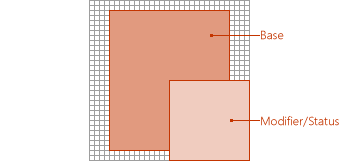
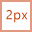
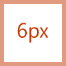
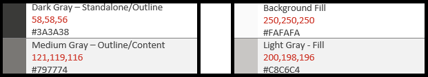
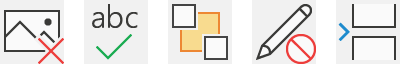

# Diretrizes de ícone de estilo monoline para suplementos do OfficeMonoline style icon guidelines for Office Add-ins

O estilo monoline iconografia são usados no Office 365.Monoline style iconography are used in Office 365. Se você preferir que seus ícones correspondam ao novo estilo de não assinatura do Office 2013 +, confira [diretrizes de ícone de estilo atualizado para suplementos do Office](add-in-icons-fresh.md).If you would prefer that your icons match the Fresh style of non-subscription Office 2013+, see [Fresh style icon guidelines for Office Add-ins](add-in-icons-fresh.md).

## Estilo visual monoline do OfficeOffice Monoline visual style

O objetivo do estilo de monolinha ter um iconografia consistente, claro e acessível para comunicar ações e recursos com visuais simples, garantir que os ícones estejam acessíveis a todos os usuários e ter um estilo consistente com aqueles usados em qualquer lugar no Windows.The goal of the Monoline style to have consistent, clear, and accessible iconography to communicate action and features with simple visuals, ensure the icons are accessible to all users, and have a style that is consistent with those used elsewhere in Windows.

As diretrizes a seguir são para desenvolvedores de terceiros que desejam criar ícones para recursos que serão consistentes com os ícones já presentes nos produtos do Office.The following guidelines are for 3rd party developers who want to create icons for features that will be consistent with the icons already present Office products.

### Princípios de designDesign principles

-   Simples, limpo, claro.Simple, clean, clear.
-   Conter apenas elementos necessários.Contain only necessary elements.
-   Estilo de ícone do Windows inspirado.Inspired by Windows icon style.
-   Acessível a todos os usuários.Accessible to all users.

#### Transmitir significadoConveying meaning

-   Use elementos descritivos, como uma página para representar um documento ou envelope para representar emails.Use descriptive elements such as a page to represent a document or an envelope to represent mail.
-   Use o mesmo elemento para representar o mesmo conceito, ou seja, mail é sempre representado por um envelope, não um carimbo.Use the same element to represent the same concept, i.e., mail is always represented by an envelope, not a stamp.
-   Use uma metáfora principal durante o desenvolvimento do conceito.Use a core metaphor during concept development.

#### Redução dos elementosReduction of Elements

-   Reduza o ícone ao seu significado principal, usando apenas os elementos essenciais para a metáfora.Reduce the icon to its core meaning, using only elements that are essential to the metaphor.
-   Limitar o número de elementos em um ícone a dois, independentemente do tamanho do ícone.Limit the number of elements in an icon to two, regardless of icon size.

#### ConsistênciaConsistency

Os tamanhos, a organização e a cor dos ícones devem ser consistentes.Sizes, arrangement, and color of icons should be consistent.

#### EstiloStyling

##### PerspectivaPerspective

Os ícones monoline estão voltados para o avanço por padrão.Monoline icons are forward-facing by default. Determinados elementos que exigem perspectiva e/ou rotação, como um cubo, são permitidos, mas as exceções devem ser mantidas no mínimo.Certain elements that require perspective and/or rotation, such as a cube, are allowed, but exceptions should be kept to a minimum.

##### OrnamentoEmbellishment

Monolinha é um estilo mínimo limpo.Monoline is a clean minimal style. Tudo usa cor plana, o que significa que não há gradientes, texturas ou fontes de luz.Everything uses flat color, which means there are no gradients, textures, or light sources.

## PlanejamentoDesigning

### CoincidiSizes

Recomendamos que você produza cada ícone em todos esses tamanhos para suportar dispositivos DPI alto.We recommend that you produce each icon in all these sizes to support high DPI devices. Os tamanhos absolutamente *exigidos* são 16px, 20px e medianiz 32px, já que são os tamanhos 100%.The absolutely *required* sizes are 16px, 20px, and 32px, as those are the 100% sizes.

**16px, 20px, medianiz 24px, medianiz 32px, 40px, 48px, 64px, 80px, 96px****16px, 20px, 24px, 32px, 40px, 48px, 64px, 80px, 96px**

### LayoutLayout

Veja a seguir um exemplo de layout de ícone com um modificador.The following is an example of icon layout with a modifier.

  

#### ElementosElements

- **Base**: o conceito principal que o ícone representa.**Base**: The main concept that the icon represents. Isso geralmente é o único Visual necessário para o ícone, mas às vezes o conceito principal pode ser aprimorado com um elemento secundário, um modificador.This is usually the only visual needed for the icon, but sometimes the main concept can be enhanced with a secondary element, a modifier.

- **Modificador** Qualquer elemento que sobrepõe a base; ou seja, um modificador que normalmente representa uma ação ou um status.**Modifier** Any element that overlays the base; that is, a modifier that typically represents an action or a status. Ele modifica o elemento base agindo como uma adição, alteração ou descritor.It modifies the base element by acting as an addition, alteration, or a descriptor.

### ConstruçãoConstruction

#### Posicionamento do elementoElement placement

Os elementos base são colocados no centro do ícone dentro do preenchimento.Base elements are placed in the center of the icon within the padding. Se ele não puder ser colocado perfeitamente centralizado, a base deverá ter um erro no canto superior direito.If it can't be placed perfectly centered, then the base should err to the top right. No exemplo a seguir, o ícone está perfeitamente centralizado:In the following example, the icon is perfectly centered:

No exemplo a seguir, o ícone é erring à esquerda.In the following example, the icon is erring to the left.

Modificadores quase sempre são colocados no canto inferior direito da tela de ícones.Modifiers are almost always placed in the bottom right corner of the icon canvas. Em alguns casos raros, os modificadores são colocados em um canto diferente.In some rare cases, modifiers are placed in a different corner. Por exemplo, se o elemento base não puder ser reconhecível com o modificador no canto inferior direito, considere colocá-lo no canto superior esquerdo.For example, if the base element would be unrecognizable with the modifier in the bottom right corner, then consider placing it in the upper left corner.

#### PaddingPadding

Cada ícone de tamanho tem uma quantidade especificada de preenchimento em torno do ícone.Each size icon has a specified amount of padding around the icon. O elemento base permanece dentro do preenchimento, mas o modificador deve arredondar para a borda da tela, estendendo-o para fora do preenchimento---para a borda da borda do ícone.The base element stays within the padding, but the modifier should butt up to the edge of the canvas, extending outside of the padding---to the edge of the icon border. As imagens a seguir mostram o preenchimento recomendado a ser usado para cada um dos tamanhos de ícone.The following images show the recommended padding to use for each of the icon sizes.

|**16px****16px**|**20px****20px**|**24px****24px**|**32px****32px**|**40px****40px**|**48px****48px**|**64px****64px**|**80px****80px**|**96px****96px**|
|:---|:---|:---|:---|:---|:---|:---|:---|:---|
||||||||||

#### Espessuras de linhaLine weights

Monolinha é um estilo dominado por formas de linha e contorno.Monoline is a style dominated by line and outlined shapes. Dependendo de qual tamanho você está produzindo, o ícone deve usar os pesos de linha a seguir.Depending on what size you are producing the icon should use the following line weights.

|**Tamanho do ícone:****Icon Size:**|**16px****16px**|**20px****20px**|**24px****24px**|**32px****32px**|**40px****40px**|**48px****48px**|**64px****64px**|**80px****80px**|**96px****96px**|
|:---|:---|:---|:---|:---|:---|:---|:---|:---|:---|
|**Espessura da linha:****Line Weight:**|1px1px|1px1px|1px1px|1px1px|2px2px|2px2px|2px2px|2px2px|3px3px|
|||||||||||

#### RecortesCutouts

Quando um elemento Icon é colocado na parte superior de outro elemento, um recorte (do elemento inferior) é usado para fornecer espaço entre os dois elementos, principalmente para fins de legibilidade.When an icon element is placed on top of another element, a cutout (of the bottom element) is used to provide space between the two elements, mainly for readability purposes. Isso geralmente ocorre quando um modificador é colocado na parte superior de um elemento base, mas também há casos em que nenhum dos elementos é um modificador.This usually happens when a modifier is placed on top of a base element, but there are also cases where neither of the elements is a modifier. Esses recortes entre os dois elementos são, às vezes, chamados de "Gap".These cutouts between the two elements is sometimes referred to as a "gap".

O tamanho da lacuna deve ter a mesma largura que a espessura da linha usada nesse tamanho.The size of the gap should be the same width as the line weight used on that size. Se estiver fazendo um ícone de 16px, a largura do espaço seria 1 px e, se for um ícone 48px, a lacuna deverá ser 2 px.If making a 16px icon, the gap width would be 1px and if it is a 48px icon then the gap should be 2px. O exemplo a seguir mostra um ícone medianiz 32px com uma lacuna de 1 px entre o modificador e a base subjacente.The following example shows a 32px icon with a gap of 1px between the modifier and the underlying base.

Em alguns casos, a lacuna pode ser aumentada em 1/2 px se o modificador tiver uma borda diagonal ou curva e a lacuna padrão não fornecer separação suficiente.In some cases, the gap can be increase by a 1/2px if the modifier has a diagonal or curved edge and the standard gap doesn't provide enough separation. Isso provavelmente afetará somente os ícones com espessura de linha 1 px; 16px, 20px, medianiz 24px e medianiz 32px.This will likely only affect the icons with 1px line weight; 16px, 20px, 24px, and 32px.

#### Preenchimentos de plano de fundoBackground fills

A maioria dos ícones no conjunto de ícones monoline exige preenchimentos de plano de fundo.Most icons in the Monoline icon set require background fills. No entanto, há casos em que o objeto não teria um preenchimento naturalmente, portanto, nenhum preenchimento deve ser aplicado.However, there are cases where the object would not naturally have a fill, so no fill should be applied. Os ícones a seguir têm um preenchimento branco:The following icons have a white fill:

Os ícones a seguir não têm preenchimento.The following icons have no fill. (O ícone de engrenagem é incluído para mostrar que o orifício central não está preenchido.) (The gear icon is included to show that the center hole is not filled.) 

##### Práticas recomendadas para preenchimentosBest practices for fills

###### AtaqueDos:

- Preencha qualquer elemento que tenha um limite definido e, naturalmente, teria um preenchimento.Fill any element that has a defined boundary, and would naturally have a fill.
- Use uma forma separada para criar o preenchimento do plano de fundo.Use a separate shape to create the background fill.
- Usar **preenchimento de plano de fundo** da [paleta de cores](#color).Use **Background Fill** from the [color palette](#color).
- Manter a separação de pixels entre elementos sobrepostos.Maintain the pixel separation between overlapping elements.
- Preencher entre vários objetos.Fill between multiple objects.

###### PermitidoDon'ts:

- Não preencha objetos que não seriam naturalmente preenchidos; por exemplo, um clipe de clipe.Don't fill objects that would not naturally be filled; for example, a paperclip.
- Não preencha os colchetes.Don't fill brackets.
- Não preencha números ou caracteres alfabéticos.Don't fill behind numbers or alpha characters.

### CorColor

A paleta de cores foi projetada para simplificar e acessibilidade.The color palette has been designed for simplicity and accessibility. Ele contém 4 cores neutras e duas variações de azul, verde, amarelo, vermelho e roxo.It contains 4 neutral colors and two variations for blue, green, yellow, red, and purple. A cor laranja não é incluída intencionalmente na paleta de cores do ícone monoline.Orange is intentionally not included in the Monoline icon color palette. Cada cor deve ser usada de formas específicas, conforme descrito nesta seção.Each color is intended to be used in specific ways as outlined in this section.

#### PaletaPalette

#### Como usar coresHow to use color

Na paleta de cores monoline, todas as cores têm variações autônomas, de estrutura de tópicos e de preenchimento.In the Monoline color palette, all colors have Standalone, Outline, and Fill variations. Geralmente, os elementos são construídos com um preenchimento e uma borda.Generally, elements are constructed with a fill and a border. As cores são aplicadas em um dos seguintes padrões:The colors are applied in one of the following patterns:

- A cor autônoma sozinho para objetos que não têm preenchimento.The Standalone color alone for objects that have no fill.
- A borda usa a cor de contorno e o preenchimento usa a cor de preenchimento.The border uses the Outline color and the fill uses the Fill color.
- A borda usa a cor autônoma e o preenchimento usa a cor de preenchimento de plano de fundo.The border uses the Standalone color and the fill uses the Background Fill color.

A seguir estão exemplos de como usar cores.The following are examples of using color.

A situação mais comum será ter um elemento usando cinza escuro autônomo com preenchimento de plano de fundo.The most common situation will be to have an element use Dark Gray Standalone with Background Fill.

Ao usar um preenchimento colorido, ele sempre deve estar com sua cor de contorno correspondente.When using a colored Fill, it should always be with its corresponding Outline color. Por exemplo, o preenchimento azul deve ser usado apenas com o contorno azul.For example, Blue Fill should only be used with Blue Outline. Mas há duas exceções a essa regra geral:But there are two exceptions to this general rule:

- O preenchimento de plano de fundo pode ser usado com qualquer cor independente.Background Fill can be used with any color Standalone.
- O preenchimento cinza claro pode ser usado com duas cores de contorno diferentes: cinza escuro ou cinza médio.Light Gray Fill can be used with two different Outline colors: Dark Gray or Medium Gray.

#### Quando usar coresWhen to use color

A cor deve ser usada para transmitir o significado do ícone, em vez de um ornamento.Color should be used to convey the meaning of the icon rather than for embellishment. Ela deve **realçar a ação** para o usuário.It should **highlight the action** to the user. Quando um modificador é adicionado a um elemento base que tem cor, o elemento base é normalmente transformado em cinza escuro e preenchimento de plano de fundo para que o modificador possa ser o elemento de cor, como o caso abaixo com o modificador "X" sendo adicionado à base da imagem no ícone da extrema esquerda do conjunto a seguir.When a modifier is added to a base element that has color, the base element is typically turned into Dark Gray and Background Fill so that the modifier can be the element of color, such as the case below with the "X" modifier being added to the picture base in the leftmost icon of the following set.

Você deve limitar seus ícones a **uma** cor adicional, diferente da estrutura de tópicos e do preenchimento mencionados acima.You should limit your icons to **one** additional color, other than the Outline and Fill mentioned above. No entanto, é possível usar mais cores se for vital para a metáfora, com um limite de duas cores adicionais além de cinza.However, more colors can be used if it is vital for its metaphor, with a limit of two additional colors other than gray. Em casos raros, há exceções quando são necessárias mais cores.In rare cases, there are exceptions when more colors are needed. Estes são bons exemplos de ícones que usam apenas uma cor.The following are good examples of icons that use just one color.

  

Mas os ícones a seguir usam muitas cores.But the following icons use too many colors.

  

Use **cinza médio** para "conteúdo" interno, como linhas de grade em um ícone de uma planilha.Use **Medium Gray** for interior "content", such as grid lines in an icon of a spreadsheet. Cores interiores adicionais são usadas quando o conteúdo precisa mostrar o comportamento do controle.Additional interior colors are used when the content needs to show the behavior of the control.

#### Linhas de textoText lines

Quando as linhas de texto estão em um "contêiner" (por exemplo, texto em um documento), use cinza médio.When text lines are in a "container" (for example, text on a document), use medium gray. As linhas de texto que não estão em um contêiner devem ser **cinza escuro**.Text lines not in a container should be **Dark Gray**.

### TextoText

Evite usar caracteres de texto em ícones.Avoid using text characters in icons. Como os produtos do Office são usados em todo o mundo, desejamos manter os ícones da forma mais neutra possível.Since Office products are used around the world, we want to keep icons as language neutral as possible.

## ProduçãoProduction

### Formato de arquivo de íconeIcon file format

Os ícones finais devem ser salvos como arquivos de imagem. png.The final icons should be saved as .png image files. Use o formato PNG com um plano de fundo transparente e tenha profundidade de 32 bits.Use PNG format with a transparent background and have 32-bit depth.
