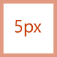

# Diretrizes de ícone de estilo monolinha para suplementos do Office

A iconografia de estilo monolinha é usada em aplicativos do Office. Se você preferir que seus ícones correspondam ao estilo Fresh do Office 2013 ou superior perpétuo, consulte as diretrizes do ícone estilo Fresh para [Suplementos do Office](add-in-icons-fresh.md).

## Estilo visual monolinha do Office

O objetivo do estilo Monoline é ter uma iconografia consistente, clara e acessível para comunicar ações e recursos com visuais simples, garantir que os ícones sejam acessíveis para todos os usuários e ter um estilo consistente com aqueles usados em outro lugar no Windows.

As diretrizes a seguir são para desenvolvedores de terceiros que desejam criar ícones para recursos que serão consistentes com os ícones já presentes nos produtos do Office.

### Princípios de design

- Simples, limpo, claro.
- Contêm apenas os elementos necessários.
- Inspirado no estilo de ícone do Windows.
- Acessível a todos os usuários.

#### Transmitir significado

- Use elementos descritivos, como uma página, para representar um documento ou um envelope para representar emails.
- Use o mesmo elemento para representar o mesmo conceito, ou seja, o email é sempre representado por um envelope, não por um carimbo.
- Use uma metáfora principal durante o desenvolvimento de conceitos.

#### Redução de elementos

- Reduza o ícone ao seu principal significado, usando apenas elementos essenciais para a metáfora.
- Limite o número de elementos em um ícone a dois, independentemente do tamanho do ícone.

#### Consistência

Tamanhos, organização e cor dos ícones devem ser consistentes.

#### Estilo

##### Perspectiva

Os ícones monolinha são voltados para a frente por padrão. Determinados elementos que exigem perspectiva e/ou rotação, como um cubo, são permitidos, mas as exceções devem ser mantidas no mínimo.

##### Enfeite

Monoline é um estilo mínimo limpo. Tudo usa cor plana, o que significa que não há gradientes, texturas ou fontes de luz.

## Projetar

### Tamanhos

Recomendamos que você produza cada ícone em todos esses tamanhos para dar suporte a dispositivos de alto DPI. Os *tamanhos absolutamente necessários* são 16 px, 20 px e 32 px, pois esses são os tamanhos de 100%.

**16 px, 20 px, 24 px, 32 px, 40 px, 48 px, 64 px, 80 px, 96 px**

> [!IMPORTANT]
> Para obter uma imagem que seja o ícone representativo do suplemento, consulte Criar [listagem efetiva no AppSource](/office/dev/store/create-effective-office-store-listings#create-an-icon-for-your-add-in) e no Office para obter tamanho e outros requisitos.

### Layout

A seguir está um exemplo de layout de ícone com um modificador.

  

#### Elementos

- **Base**: o conceito principal que o ícone representa. Geralmente, esse é o único visual necessário para o ícone, mas às vezes o conceito principal pode ser aprimorado com um elemento secundário, um modificador.

- **Modificador** Qualquer elemento que sobreponha a base; ou seja, um modificador que normalmente representa uma ação ou um status. Ele modifica o elemento base agindo como uma adição, alteração ou um descritor.

### Construção

#### Posicionamento de elemento

Os elementos base são colocados no centro do ícone dentro do preenchimento. Se não puder ser colocado perfeitamente centralizado, a base deverá errar no canto superior direito. No exemplo a seguir, o ícone é perfeitamente centralizado.

No exemplo a seguir, o ícone está errando para a esquerda.

Os modificadores quase sempre são colocados no canto inferior direito da tela do ícone. Em alguns casos raros, os modificadores são colocados em um canto diferente. Por exemplo, se o elemento base seria irreconhecível com o modificador no canto inferior direito, considere colocá-lo no canto superior esquerdo.

#### Padding

Cada ícone de tamanho tem uma quantidade especificada de preenchimento ao redor do ícone. O elemento base permanece dentro do preenchimento, mas o modificador deve ser até a borda da tela, estendendo-se fora do preenchimento até a borda da borda do ícone. As imagens a seguir mostram o preenchimento recomendado a ser usado para cada um dos tamanhos de ícone.

|**16px**|**20px**|**24px**|**32px**|**40px**|**48px**|**64px**|**80px**|**96 px**|
|:---|:---|:---|:---|:---|:---|:---|:---|:---|
||||||||||

#### Pesos de linha

Monoline é um estilo dominado por formas de linha e estruturadas. Dependendo do tamanho que você está produzindo, o ícone deve usar os pesos de linha a seguir.

|Tamanho do ícone:|16px|20px|24px|32px|40px|48px|64px|80px|96 px|
|:---|:---|:---|:---|:---|:---|:---|:---|:---|:---|
|**Peso da linha:**|1px|1px|1px|1px|2px|2px|2px|2px|3px|
|**Ícone de exemplo:**||||||||||

#### Recortes

Quando um elemento de ícone é colocado sobre outro elemento, um recorte (do elemento inferior) é usado para fornecer espaço entre os dois elementos, principalmente para fins de legibilidade. Isso geralmente acontece quando um modificador é colocado sobre um elemento base, mas também há casos em que nenhum dos elementos é um modificador. Esses recortes entre os dois elementos às vezes são chamados de "lacuna".

O tamanho da lacuna deve ter a mesma largura que o peso da linha usado nesse tamanho. Se você estiver criando um ícone de 16 px, a largura da lacuna será 1px e, se for um ícone de 48 px, a lacuna deverá ser de 2px. O exemplo a seguir mostra um ícone de 32 px com uma lacuna de 1px entre o modificador e a base subjacente.

Em alguns casos, a lacuna poderá ser maior em um px de 1/2 se o modificador tiver uma borda diagonal ou curva e a lacuna padrão não fornecer separação suficiente. Isso provavelmente afetará apenas os ícones com espessura de linha de 1px: 16 px, 20 px, 24 px e 32 px.

#### Preenchimentos em segundo plano

A maioria dos ícones no conjunto de ícones Monoline exige preenchimentos de plano de fundo. No entanto, há casos em que o objeto não teria naturalmente um preenchimento, portanto, nenhum preenchimento deve ser aplicado. Os ícones a seguir têm um preenchimento branco.

Os ícones a seguir não têm preenchimento. (O ícone de engrenagem está incluído para mostrar que o buraco central não está preenchido.)

##### Práticas recomendadas para preenchimentos

###### O que fazer

- Preencha qualquer elemento que tenha um limite definido e que naturalmente tenha um preenchimento.
- Use uma forma separada para criar o preenchimento da tela de fundo.
- Use **o Preenchimento de Plano** de Fundo [da paleta de cores](#color).
- Mantenha a separação de pixels entre elementos sobrepostos.
- Preencher entre vários objetos.

###### O que não fazer

- Não preencha objetos que não seriam preenchidos naturalmente; por exemplo, um clipe de papel.
- Não preencha colchetes.
- Não preencha atrás de números ou caracteres alfa.

### Cor

A paleta de cores foi projetada para simplificar e acessibilidade. Ele contém 4 cores neutras e duas variações para azul, verde, amarelo, vermelho e roxo. Laranja não está incluído intencionalmente na paleta de cores do ícone Monoline. Cada cor deve ser usada de maneiras específicas, conforme descrito nesta seção.

#### Paleta

#### Como usar cor

Na paleta de cores Monoline, todas as cores têm variações Autônomas, Estrutura de Tópicos e Preenchimento. Em geral, os elementos são construídos com um preenchimento e uma borda. As cores são aplicadas em um dos padrões a seguir.

- A cor autônoma sozinha para objetos que não têm preenchimento.
- A borda usa a cor estrutura de tópicos e o preenchimento usa a cor Preenchimento.
- A borda usa a cor Autônoma e o preenchimento usa a cor Preenchimento da Tela de Fundo.

A seguir estão exemplos de uso de cor.

A situação mais comum será fazer com que um elemento use Cinza Escuro Autônomo com Preenchimento em Segundo Plano.

Ao usar um Preenchimento colorido, ele sempre deve estar com sua cor de estrutura de tópicos correspondente. Por exemplo, Preenchimento Azul só deve ser usado com Estrutura de Tópicos Azul. Mas há duas exceções a essa regra geral.

- O Preenchimento de Plano de Fundo pode ser usado com qualquer cor Autônoma.
- O Preenchimento Cinza Claro pode ser usado com duas cores de estrutura de tópicos diferentes: Cinza Escuro ou Cinza Médio.

#### Quando usar a cor

A cor deve ser usada para transmitir o significado do ícone em vez de para embelezamento. Ele deve **realçar a ação** para o usuário. Quando um modificador é adicionado a um elemento base que tem cor, o elemento base normalmente é transformado em Cinza Escuro e Preenchimento de Plano de Fundo para que o modificador possa ser o elemento de cor, como o caso abaixo com o modificador "X" sendo adicionado à base de imagem no ícone mais à esquerda do conjunto a seguir.

Você deve limitar seus ícones **a uma** cor adicional, diferente das estruturas de tópicos e preenchimento mencionadas acima. No entanto, mais cores podem ser usadas se for vital para sua metáfora, com um limite de duas cores adicionais diferentes de cinza. Em casos raros, há exceções quando mais cores são necessárias. A seguir estão bons exemplos de ícones que usam apenas uma cor.

  

Mas os ícones a seguir usam muitas cores.

  

Use **Cinza Médio** para "conteúdo" interno, como linhas de grade em um ícone de uma planilha. Cores interiores adicionais são usadas quando o conteúdo precisa mostrar o comportamento do controle.

#### Linhas de texto

Quando as linhas de texto estão em um "contêiner" (por exemplo, texto em um documento), use cinza médio. As linhas de texto que não estão em um contêiner devem ser **Cinza Escuro**.

### Texto

Evite usar caracteres de texto em ícones. Como os produtos do Office são usados em todo o mundo, queremos manter os ícones o mais neutro possível.

## Produção

### Formato de arquivo de ícone

Os ícones finais devem ser salvos como arquivos .png imagem. Use o formato PNG com uma tela de fundo transparente e tenha profundidade de 32 bits.

## Confira também

- [Elemento de manifesto do ícone](/javascript/api/manifest/icon)
- [Elemento de manifesto IconUrl](/javascript/api/manifest/iconurl)
- [Elemento de manifesto HighResolutionIconUrl](/javascript/api/manifest/highresolutioniconurl)
- [Criar um ícone para o seu suplemento](/office/dev/store/create-effective-office-store-listings#create-an-icon-for-your-add-in)
