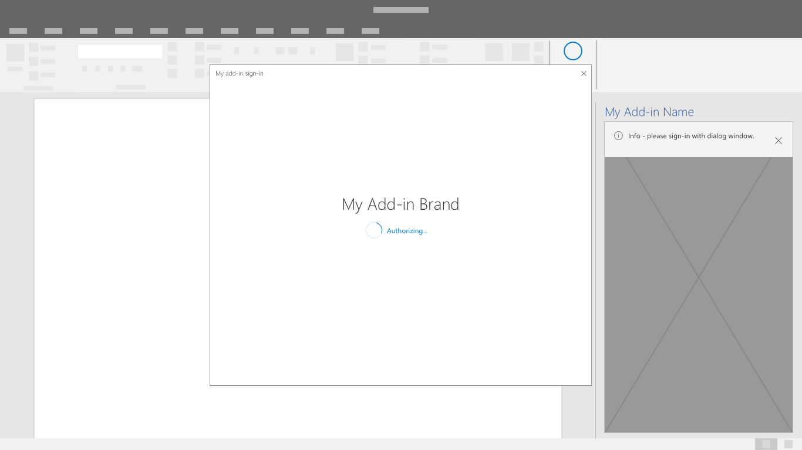
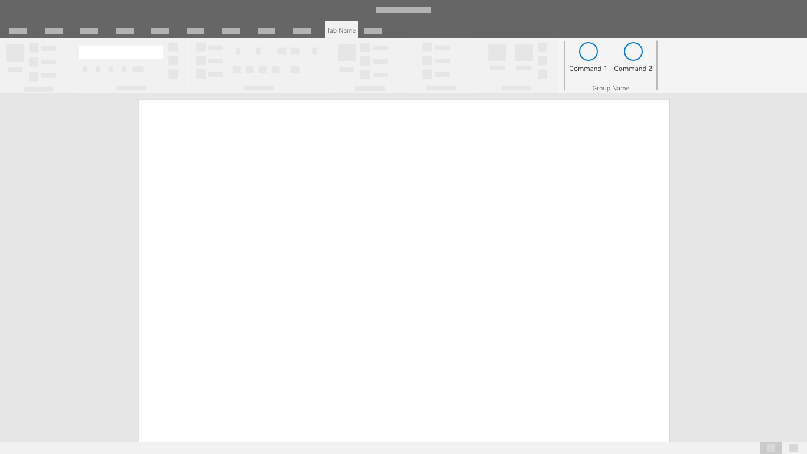

# Padrões de autenticação

Os suplementos podem exigir que os usuários entrem ou se inscrevam para acessar os recursos e funcionalidades. As caixas de entrada de nome de usuário e senha ou botões que iniciam fluxos de credenciais de terceiros são controles comuns da interface em experiências de autenticação. Uma experiência de autenticação simples e eficiente é uma primeira etapa importante para iniciar os usuários no uso de seu suplemento.

## Práticas recomendadas

|Fazer|Não fazer|
|:----|:----|
|Antes de entrar, descreva o valor do suplemento ou demonstre a funcionalidade sem exigir uma conta. |Espere que os usuários entrem sem compreender o valor e os benefícios do suplemento.|
|Oriente os usuários pelos fluxos de autenticação com um botão principal bem visível em cada tela. |Chame atenção para as tarefas secundárias e terciárias com outros botões e chamadas para ação.|
|Use rótulos de botão claros que descrevam tarefas específicas, como “Entrar” ou “Criar conta”. |Use rótulos de botão vagos como “Enviar” ou “Começar” para orientar os usuários por meio de fluxos de autenticação.|
|Use uma caixa de diálogo para concentrar a atenção do usuário em formulários de autenticação. |Encha seu painel de tarefas com uma primeira experiência de execução e formulários de autenticação.|
|Inclua pequenos recursos eficientes no fluxo como foco automático em caixas de entrada. |Adicione etapas desnecessárias à interação como exigir que os usuários cliquem nos campos de formulário.|
|Forneça uma maneira de os usuários sairem e reauthenticarem. |Force os usuários a fazer a desinstalação para alternar identidades.|

## Fluxo de autenticação

1. Marcador de primeira execução: coloque o botão de entrada como uma chamada para ação clara na primeira experiência de execução do seu suplemento.

    

1. Caixa de diálogo de opções do provedor de identidade: exiba uma lista clara de provedores de identidade, incluindo um formulário de nome de usuário e senha, se aplicável. A interface de usuário do seu suplemento poderá ser bloqueada enquanto a caixa de diálogo de autenticação estiver aberta.

    

1. Entrada de um provedor de identidade: os provedores de identidade têm as próprias interfaces de usuário. Microsoft Azure Active Directory permite a personalização de páginas de painel de entrada e acesso para uma aparência consistente com seu serviço. [Saiba mais](/azure/active-directory/fundamentals/customize-branding).

    

1. Progresso: indique o progresso enquanto as configurações e a interface do usuário são carregadas.

    

> [!NOTE]
> Ao usar o serviço de identidade da Microsoft, você terá a oportunidade de usar um botão de entrada com marca que poderá ser personalizado com temas claros e escuros. Saiba mais.

## Fluxo de autenticação Sign-On único

> [!NOTE]
> No momento, a API de login único tem suporte para Word, Excel, Outlook e PowerPoint. Para obter mais informações sobre o suporte a um único sign-on, consulte [IdentityAPI requirement sets](../reference/requirement-sets/identity-api-requirement-sets.md). Se você estiver trabalhando com um suplemento do Outlook, certifique-se de habilitar a Autenticação Moderna para a locação do Microsoft 365. Confira mais informações sobre como fazer isso em [Exchange Online: como habilitar seu locatário para autenticação moderna](https://social.technet.microsoft.com/wiki/contents/articles/32711.exchange-online-how-to-enable-your-tenant-for-modern-authentication.aspx).

Use o login único para uma experiência de usuário final mais suave. A identidade do usuário dentro Office (uma conta da Microsoft ou uma Microsoft 365 de usuário) é usada para entrar no seu complemento. Como resultado, os usuários só entrarão uma vez. Isso remove conflitos na experiência e faz com que os clientes comecem a usar o suplemento sem dificuldades.

1. Como um complemento está sendo instalado, um usuário verá uma janela de consentimento semelhante à seguinte:

    

    > [!NOTE]
    > O publicador do suplemento terá controle sobre o logotipo, sobre as cadeias de caracteres e escopos de permissão incluídos na janela de consentimento. A interface do usuário é pré-configurada pela Microsoft.

1. O suplemento será carregado após o consentimento do usuário. Ele pode extrair e exibir todas as informações personalizadas necessárias do usuário.

    

## Confira também

- Saiba mais sobre [o desenvolvimento de complementos do SSO](../develop/sso-in-office-add-ins.md)
