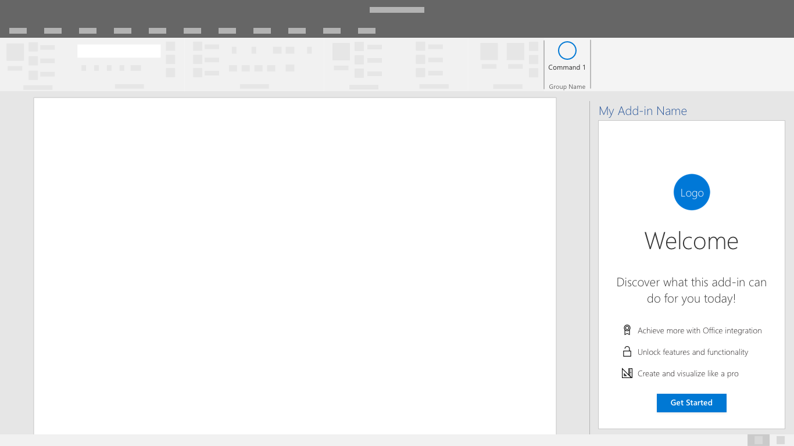

# Padrões de autenticaçãoAuthentication patterns

Os suplementos podem exigir que os usuários entrem ou se inscrevam para acessar os recursos e funcionalidades.Add-ins may require users to sign-in or sign-up in order to access features and functionality. As caixas de entrada de nome de usuário e senha ou botões que iniciam fluxos de credenciais de terceiros são controles comuns da interface em experiências de autenticação.Input boxes for username and password or buttons that start third party credential flows are common interface controls in authentication experiences. Uma experiência de autenticação simples e eficiente é uma primeira etapa importante para iniciar os usuários no uso de seu suplemento.A simple and efficient authentication experience is an important first step to getting users started with your add-in.

## Práticas recomendadasBest practices

|FazerDo|Não fazerDon't|
|:----|:----|
|Antes de entrar, descreva o valor do suplemento ou demonstre a funcionalidade sem exigir uma conta.Prior to sign-in, describe the value of your add-in or demonstrate functionality without requiring an account. |Espere que os usuários entrem sem compreender o valor e os benefícios do suplemento.Expect users to sign-in without understanding the value and benefits of your add-in.|
|Oriente os usuários pelos fluxos de autenticação com um botão principal bem visível em cada tela.Guide users through authentication flows with a primary, highly visible button on each screen. |Chame atenção para as tarefas secundárias e terciárias com outros botões e chamadas para ação.Draw attention to secondary and tertiary tasks with competing buttons and calls to action.|
|Use rótulos de botão claros que descrevam tarefas específicas, como “Entrar” ou “Criar conta”.Use clear button labels that describe specific tasks like "Sign in" or "Create account".   |Use rótulos de botão vagos como “Enviar” ou “Começar” para orientar os usuários por meio de fluxos de autenticação.Use vague button labels like "Submit" or "Get started" to guide users through authentication flows.|
|Use uma caixa de diálogo para concentrar a atenção do usuário em formulários de autenticação.Use a dialog to focus users' attention on authentication forms.    |Encha seu painel de tarefas com uma primeira experiência de execução e formulários de autenticação.Overcrowd your task pane with a first run experience and authentication forms.|
|Inclua pequenos recursos eficientes no fluxo como foco automático em caixas de entrada.Find small efficiencies in the flow like auto-focusing on input boxes. |Adicione etapas desnecessárias à interação como exigir que os usuários cliquem nos campos de formulário.Add unnecessary steps to the interaction like requiring users to click into form fields.|
|Ofereça uma maneira para os usuários saírem e autenticarem-se novamente.Provide a way for users to sign-out and reauthenticate.    |Force os usuários a fazer a desinstalação para alternar identidades.Force users to uninstall to switch identities.|

## Fluxo de autenticaçãoAuthentication flow overview
Até o logon único estar fora da versão prévia, os suplementos de produção devem conceder aos usuários uma opção para entrar diretamente com o serviço ou um provedor de identidade como a Microsoft.Until single sign-on is out of preview, production add-ins should give users a choice to sign-in directly with your service or an identity provider like Microsoft.

1. Marcador de primeira execução: coloque o botão de entrada como uma chamada para ação clara na primeira experiência de execução do seu suplemento.First Run Placemat - Place your sign-in button as a clear call-to action inside your add-in's first run experience.

2. Caixa de diálogo de opções do provedor de identidade: exibe uma lista clara de provedores de identidade incluindo um formulário de nome de usuário e senha, se aplicável.Identity Provider Choices Dialog - Display a clear list of identity providers including a username and password form if applicable. A interface de usuário de um suplemento poderá ser bloqueada quando a caixa de diálogo de autenticação estiver aberta.Your add-in UI may be blocked while the authentication dialog is open.

3. Entrada de um provedor de identidade: os provedores de identidade têm suas próprias interfaces de usuário.Identity Provider Sign-in - The identity provider will have their own UI. O Microsoft Azure Active Directory permite a personalização das páginas de entrada e de painel de acesso para uma aparência consistente com o serviço.  [Saiba mais](https://docs.microsoft.com/azure/active-directory/fundamentals/customize-branding).Microsoft Azure Active Directory allows customization of sign-in and access panel pages for consistent look and feel with your service. [Learn More](https://docs.microsoft.com/azure/active-directory/fundamentals/customize-branding).

4. Progresso: indica o progresso enquanto as configurações e a interface do usuário são carregadas.Progress - Indicate progress while settings and UI load.

> [!NOTE] 
> Ao usar o serviço de identidade da Microsoft, você terá a oportunidade de usar um botão de entrada com marca que poderá ser personalizado com temas claros e escuros.When using Microsoft's Identity service you'll have the opportunity to use a branded sign-in button that is customizable to light and dark themes.Saiba mais.Learn More

## Fluxo de autenticação de logon único (versão prévia)Single Sign-On authentication flow (preview)

> [!NOTE]
> Atualmente a API de logon único tem suporte na visualização para Word, Excel, Outlook e PowerPoint.The Single Sign-on API is currently supported in preview for Word, Excel, Outlook, and PowerPoint. Para saber mais informações sobre o suporte a logon único, confira  [Conjuntos de requisitos da IdentityAPI](https://docs.microsoft.com/office/dev/add-ins/reference/requirement-sets/identity-api-requirement-sets?view=office-js).For more information about single sign-on support, see [IdentityAPI requirement sets](https://docs.microsoft.com/office/dev/add-ins/reference/requirement-sets/identity-api-requirement-sets?view=office-js). Se você estiver trabalhando com um suplemento do Outlook, certifique-se de habilitar a Autenticação Moderna para a locação do Office 365.If you are working with an Outlook add-in, be sure to enable Modern Authentication for the Office 365 tenancy. Para saber mais informações sobre como fazer isso, confira  [Exchange Online: como habilitar seu locatário para autenticação moderna](https://social.technet.microsoft.com/wiki/contents/articles/32711.exchange-online-how-to-enable-your-tenant-for-modern-authentication.aspx).For information about how to do this, see  [Exchange Online: How to enable your tenant for modern authentication](https://social.technet.microsoft.com/wiki/contents/articles/32711.exchange-online-how-to-enable-your-tenant-for-modern-authentication.aspx).

Depois que o recurso de logon único for disponibilizado para suplementos de produção, use-o em uma experiência de usuário final mais estável.Once single sign-on is generally available for production add-ins, use it for the smoother end-user experience. A identidade do usuário no Office (identidade da conta Microsoft ou do Office 365) é usada para entrar no suplemento.The user's identity within Office (either a Microsoft Account or an Office 365 identity) is used to sign-in to your add-in. Como resultado, os usuários somente entram uma vez.As a result users only sign-in once. Isso remove conflitos na experiência e faz com que os clientes comecem a usar o suplemento sem dificuldades.This removes friction in the experience making it easier for your customers to get started.

1. Conforme um suplemento está sendo instalado, um usuário verá uma janela de consentimento semelhante ao exemplo abaixo: As an add-in is being installed, a user will see a consent window similar to the one below: 
> [!NOTE]
> O fornecedor do suplemento terá controle sobre o logotipo, sobre as cadeias de caracteres e escopos de permissão incluídos na janela de consentimento.The add-in publisher will have control over the logo, strings and permission scopes included in the consent window. A interface do usuário é pré-configurada pela Microsoft.The UI is pre-configured by Microsoft.

2. O suplemento será carregado após o consentimento do usuário.The add-in will load after the user consents. Ele pode extrair e exibir quaisquer informações de usuário personalizadas necessárias.It can extract and display any necessary user customized information.

## Confira tambémSee also
- Saiba mais sobre como [desenvolver suplementos de SSO (versão prévia)](https://docs.microsoft.com/office/dev/add-ins/develop/sso-in-office-add-ins)Learn more about [developing SSO Add-ins (preview)](https://docs.microsoft.com/office/dev/add-ins/develop/sso-in-office-add-ins)