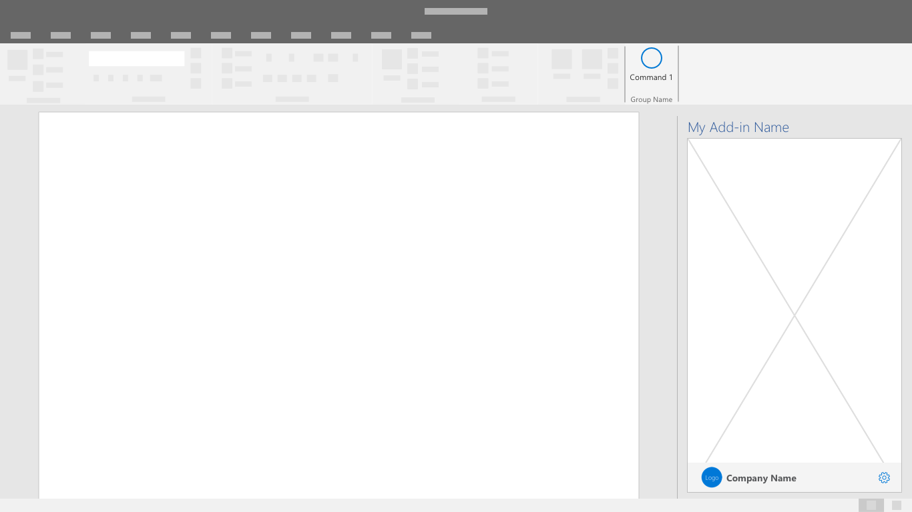

# Padrões de identidade visualBranding patterns

Esses padrões proporcionam visibilidade à marca e contexto aos seus usuários.These patterns provide brand visibilty and context to your add-in users. 

## Práticas recomendadasBest practices

|FazerDo |Não fazerDon't|
|:---- |:----|
| Use os componentes familiares de interface do usuário com a aplicação de destaques de identidade visual, tais como tipografia e cor.Use familiar UI components with applied branding accents like typography and color. | Não crie novos componentes para a interface do usuário que contradigam a interface de usuário estabelecida do Office.Don't invent new UI components that contradict established Office UI. | 
| Aplique a identidade visual de suplemento no rodapé da barra da marca na parte inferior da sua interface do usuário.Place your add-in branding in a brand bar footer at the bottom of your UI. | Não repita o nome do painel de tarefas na barra de marca imediatamente adjacente à parte superior da sua interface do usuário.Don't repeat your task pane name in an immediately adjacent brand bar at the top of your UI. |
| Use os elementos de marca com moderação.Use brand elements sparingly. Ajuste sua solução para o Office de forma complementar.Fit your solution into Office such that is complementary. | Não insira elementos da marca de forma excessiva na interface do usuário do Office porque podem distrair e confundir os clientes.Don't insert excessively branded elements into Office UI that distract and confuse customers. |
| Verifique se a sua solução é reconhecível e conecta as telas com elementos visuais consistentes.Make your solution recognizable and connect your screens together with consistent visual elements. | Não oculte sua solução com elementos visuais aplicados de modo inconsistente e irreconhecíveis.Don't hide your solution with unrecognizable and inconsistently applied visual elements. |
| Crie a conexão com um serviço ou negócio relacionado para garantir que os clientes reconheçam e confiem na sua solução.Build connection with a parent service or business to ensure that customers know and trust your solution. | Não force os clientes a aprender um novo conceito de marca se já houver um relacionamento útil e compreensível que possa ser aproveitado para criar confiança e valor.Don't make customers learn a new brand concept if there is a useful and understandable relationship that can be leveraged to build trust and value. |

Aplique os padrões e componentes a seguir, quando possível, para permitir que os usuários adotem a utilização total do seu suplemento.Apply the following patterns and components as applicable to allow users to embrace the full utility of your add-in.

## Barra da marcaBrand Bar

A barra da marca é um espaço no rodapé para incluir o nome e o logotipo da marca.The brand bar is a space in the footer to include your brand name and logo. Também funciona como um link para o site da marca e um local de acesso opcional.It also serves as a link to your brand's website and an optional access location.

## Tela inicialSplash Screen

Use esta tela para exibir a sua identidade visual enquanto o suplemento estiver carregando ou na transição entre estados de interface do usuário.Use this screen to display your branding while the add-in is loading or transitioning between UI states.

