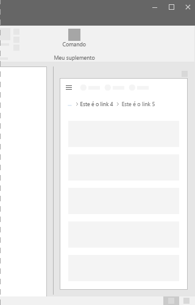

# Componente de Navegação estrutural no Office UI Fabric

Em Suplementos do Office, use a navegação estrutural, que mostra a localização da página atual em uma hierarquia e ajuda os usuários a entender onde estão em relação ao restante da hierarquia. Além disso, a navegação estrutural fornece navegação com um clique para níveis mais altos na hierarquia.
  
#### Exemplo: navegação estrutural em um painel de tarefas

## Práticas recomendadas

|**Faça**|**Não faça**|
|:------------|:--------------|
|Coloque a navegação estrutural na parte superior de um layout em um suplemento, acima de uma lista de itens ou acima do conteúdo principal de um layout.   |Não use a navegação estrutural como a principal maneira de navegar para outras páginas.  |

## Implementação

Confira os detalhes em [Navegação estrutural](https://dev.office.com/fabric#/components/breadcrumb) e [Introdução com exemplo de código do Fabric React](https://github.com/OfficeDev/Word-Add-in-GettingStartedFabricReact).

## Veja também

- [Padrões de design da experiência do usuário](https://github.com/OfficeDev/Office-Add-in-UX-Design-Patterns-Code)
- [Office UI Fabric em Suplementos do Office](office-ui-fabric.md)
