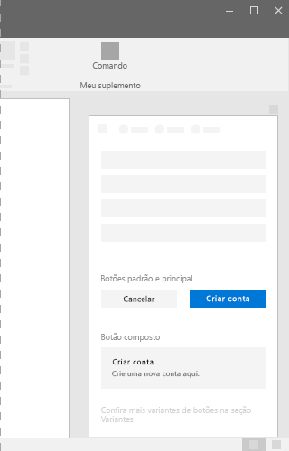

# Componente de botão no Office UI Fabric

Use botões no suplemento do Office para permitir que os usuários confirmem alterações ou concluam etapas de uma tarefa. O texto do botão precisa comunicar a finalidade da interação. Coloque botões na parte inferior do contêiner de interface do usuário de um painel de tarefas, caixa de diálogo ou painel de conteúdo. Por exemplo, use os botões para permitir que os usuários enviem um formulário, fechem uma caixa de diálogo ou acessem a próxima página.
  
#### Exemplo: Botões em um painel de tarefas

 

 

## Práticas recomendadas

|**Faça**|**Não faça**|
|:-----|:--------|
|Os botões padrão sempre devem realizar operações seguras em suplementos. |Não coloque o foco padrão em um botão que destrói dados. Em vez disso, coloque o foco no botão que executa a operação segura ou cancela a ação.|
|Use uma única linha de texto no rótulo do botão. Deixe o texto o mais curto possível.|Não coloque nada além de texto em um botão.|
|Verifique se que o rótulo transmite uma finalidade clara do botão para o usuário. Use rótulos concisos, específicos, autoexplicativos. Considere o uso de uma única palavra.|Não use botões para navegação, exceto para as etapas **Voltar** e **Avançar**. Para navegação, é melhor usar um link.|
|Exponha apenas um ou dois botões (ações) para o usuário, por exemplo, **Aceitar** e **Cancelar**. Se você precisar exibir mais ações, poderá usar caixas de seleção ou botões de opção para que os usuários escolham as ações e fornecer um único botão para iniciar as ações escolhidas.||
|Defina **Enviar**, **OK** e **Aplicar** como botões primários. Quando os botões **Redefinir** ou **Cancelar** aparecerem junto a um desses, defina-os como botões padrão.| |

## Variantes

|**Variação**|**Descrição**|**Exemplo**|
|:------------|:--------------|:----------|
|**Botão primário**|Botões primários herdam a cor de tema no estado de repouso. Use botões primários para realçar o plano de ação principal.||
|**Botão padrão**|Botões padrão sempre devem realizar operações seguras e nunca causar exclusões.||
|**Botão composto**|Use botões compostos para causar ações que realizem uma tarefa ou para promover uma tarefa de transição.||

## Implementação

Para saber mais, confira [Button](https://dev.office.com/fabric#/components/button) e [Primeiros passos com exemplo de código do Fabric React](https://github.com/OfficeDev/Word-Add-in-GettingStartedFabricReact).

## Recursos adicionais

- [Padrões de design da experiência do usuário](https://github.com/OfficeDev/Office-Add-in-UX-Design-Patterns-Code)

- [Office UI Fabric em Suplementos do Office](office-ui-fabric.md)
