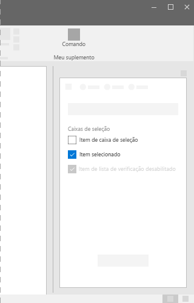
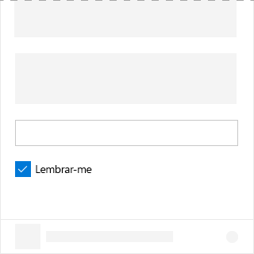

# Componente de caixa de seleção no Office UI Fabric

Uma caixa de seleção é um elemento da interface do usuário que permite aos usuários marcar ou desmarcar opções em suplementos. Use caixas de seleção para permitir que os usuários escolham entre opções. Além disso, uma caixa de seleção pode ser combinada com um controle relacionado. Marcar ou desmarcar a caixa de seleção muda o comportamento do controle relacionado. Por exemplo, o controle relacionado pode alternar entre os estados visível ou oculto.
  
#### Exemplo: caixa de seleção em um painel de tarefas

## Práticas recomendadas

|**Faça**|**Não faça**|
|:------------|:--------------|
|Use caixas de seleção para indicar o status.   |Não use caixas de seleção para mostrar/indicar uma ação.   |
|Use várias caixas de seleção quando os usuários puderem selecionar várias opções e as opções não forem mutuamente exclusivas.|Não use uma caixa de seleção quando os usuários puderem escolher apenas uma opção. Quando for necessário selecionar apenas uma opção, use os botões de opção.|
|Permita que os usuários escolham qualquer combinação de opções quando várias caixas de seleção estiverem agrupadas.|Não coloque dois grupos de caixas de seleção próximos um do outro. Separe os dois grupos com rótulos.|
|Use uma única caixa de seleção para uma configuração secundária. Por exemplo, a caixa de seleção **Lembrar-me?** é uma configuração secundária usada em um cenário de login.|Não use caixas de seleção para ativar e desativar configurações. Para alternar entre um estado de ativação ou desativação, use uma alternância.|

## Variantes

|**Variação**|**Descrição**|**Exemplo**|
|:------------|:--------------|:----------|
|**Caixa de seleção não controlada**|Use como o estado padrão da caixa de seleção. ||
|**Caixa de seleção não controlada marcada por padrão**|Use quando a instância da caixa de seleção mantiver seu próprio estado. ||
|**Caixa de seleção desativada e não controlada marcada por padrão**|Estado desativado da caixa de seleção. ||
|**Caixa de seleção controlada**|O estado marcado desta caixa de seleção é decidido em outro local da interface do usuário. Neste cenário, o valor correto é passado para a caixa de seleção por um evento **onChange** e com uma nova renderização da interface do usuário. ||

## Implementação

Para saber mais, confira [Caixa de seleção](https://dev.office.com/fabric#/components/checkbox) e [Primeiros passos com exemplo de código do Fabric React](https://github.com/OfficeDev/Word-Add-in-GettingStartedFabricReact).

## Veja também

- [Padrões de design da experiência do usuário](https://github.com/OfficeDev/Office-Add-in-UX-Design-Patterns-Code)
- [Office UI Fabric em Suplementos do Office](office-ui-fabric.md)
