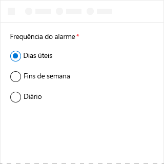
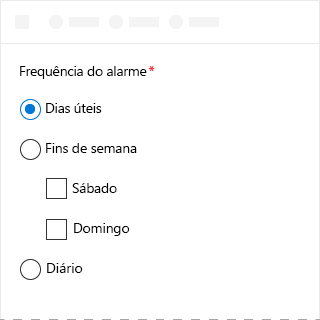
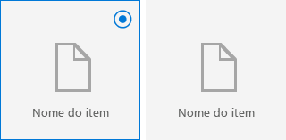

# Componente ChoiceGroup no Office UI Fabric

O componente ChoiceGroup, também conhecido como um botão de opção, apresenta aos usuários duas ou mais opções mutuamente exclusivas. Os usuários podem selecionar apenas um botão do ChoiceGroup em um grupo. Cada opção é representada por um botão do ChoiceGroup. 
  
#### Exemplo: ChoiceGroup em um painel de tarefas

 

## Práticas recomendadas

|**Faça**|**Não faça**|
|:------------|:--------------|
|Mantenha as opções de ChoiceGroup no mesmo nível.   |Não utilize ChoiceGroups ou caixas de seleção aninhados.   |
|Use ChoiceGroups com duas a sete opções, verificando se há espaço suficiente na tela para mostrar todas as opções. Caso contrário, use uma caixa de seleção ou lista suspensa.|Não use quando as opções forem números com uma gradação fixa, por exemplo, 10, 20, 30 e assim por diante. Em vez disso, use um componente de controle deslizante.|
|Se os usuários não puderem escolher nenhuma das opções, considere incluir uma opção como **Nenhum** ou **Não se aplica**.|Não use dois botões de ChoiceGroup para uma única opção binária.|
|Se possível, alinhe os botões de ChoiceGroup verticalmente em vez de horizontalmente. O alinhamento horizontal é mais difícil de ler e localizar.||
|Liste as opções em ordem lógica, por exemplo, da opção mais provável a ser selecionada até a menos, da operação mais simples até a mais complexa ou do menor risco para o maior risco. |Não use ordenação alfabética porque é dependente do idioma.|

## Variantes

|**Variação**|**Descrição**|**Exemplo**|
|:------------|:--------------|:----------|
|**ChoiceGroups**|Use quando não forem necessárias imagens para fazer uma escolha.| |
|**ChoiceGroups usando imagens**|Use quando forem necessárias imagens para fazer uma escolha.| |

## Implementação

Para saber mais, confira [ChoiceGroup](https://dev.office.com/fabric#/components/choicegroup) e [Primeiros passos com exemplo de código do Fabric React](https://github.com/OfficeDev/Word-Add-in-GettingStartedFabricReact).

## Veja também

- [Padrões de design da experiência do usuário](https://github.com/OfficeDev/Office-Add-in-UX-Design-Patterns-Code)
- [Office UI Fabric em Suplementos do Office](office-ui-fabric.md)
