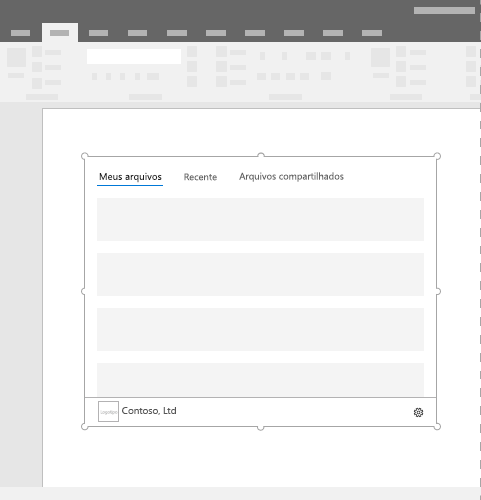

# Suplementos de conteúdo do Office

Suplementos de conteúdo são superfícies que podem ser incorporadas diretamente em documentos do Excel ou PowerPoint. Os suplementos de conteúdo concedem aos usuários acesso a controles de interface que executam códigos para modificar documentos ou exibir dados de uma fonte de dados. Use suplementos de conteúdo quando quiser inserir a funcionalidade diretamente no documento.  

*Figura 1. Layout típico dos suplementos de conteúdo*

## Práticas recomendadas

- Inclua alguns elementos de navegação ou comando, como CommandBar ou Pivot, na parte superior do suplemento.
- Inclua um elemento da marca, como BrandBar, na parte inferior do suplemento (aplica-se apenas a suplementos do Excel e do PowerPoint).

## Variantes

Os tamanhos de Excel e PowerPoint de conteúdo Office área de trabalho e Microsoft 365 são especificados pelo usuário.

## Menu de personalidade

Menus de personalidade podem obstruir elementos de navegação e comando localizados perto da parte superior direita do suplemento. Veja a seguir as dimensões atuais do menu personalidade no Windows e Mac.

No Windows, o menu de personalidade mede 12 x 32 pixels, conforme mostrado.

*Figura 2. Menu de personalidade no Windows*

No Mac, o menu de personalidade mede 26 x 26 pixels, mas flutua 8 pixels a partir da direita e 6 pixels a partir do topo, o que aumenta o espaço ocupado para 34 x 32 pixels, como mostrado.

*Figura 3. Menu de personalidade no Mac*

## Implementação

Para ver um exemplo que implementa um suplemento de conteúdo, confira [Suplemento de conteúdo do Excel Humongous Insurance](https://github.com/OfficeDev/Excel-Content-Add-in-Humongous-Insurance) no GitHub.

## Considerações sobre o suporte

- Verifique se o seu Office de usuário funcionará em um [aplicativo ou plataforma Office específico](../overview/office-add-in-availability.md).
- Alguns suplementos de conteúdo podem obrigar o usuário a "confiar" nele para ler e gravar no Excel ou PowerPoint. Você pode declarar no manifesto do suplemento quais [níveis de permissão](../develop/requesting-permissions-for-api-use-in-content-and-task-pane-add-ins.md) deseja que o usuário tenha.  
- Os suplementos de conteúdo são compatíveis com o Excel e PowerPoint nas versões do Office 2013 e posteriores. Se você abrir um suplemento em uma versão do Office não compatível com os suplementos web do Office, eles aparecerão como imagem.

## Confira também

- [Disponibilidade de aplicativos e plataformas de cliente Office para Suplementos do Office](../overview/office-add-in-availability.md)
- [Núcleo da Malha em Suplementos do Office](fabric-core.md)
- [Padrões de design da experiência do usuário para suplementos do Office](../design/ux-design-pattern-templates.md)
- [Solicitar permissões para uso da API em suplementos ](../develop/requesting-permissions-for-api-use-in-content-and-task-pane-add-ins.md)
