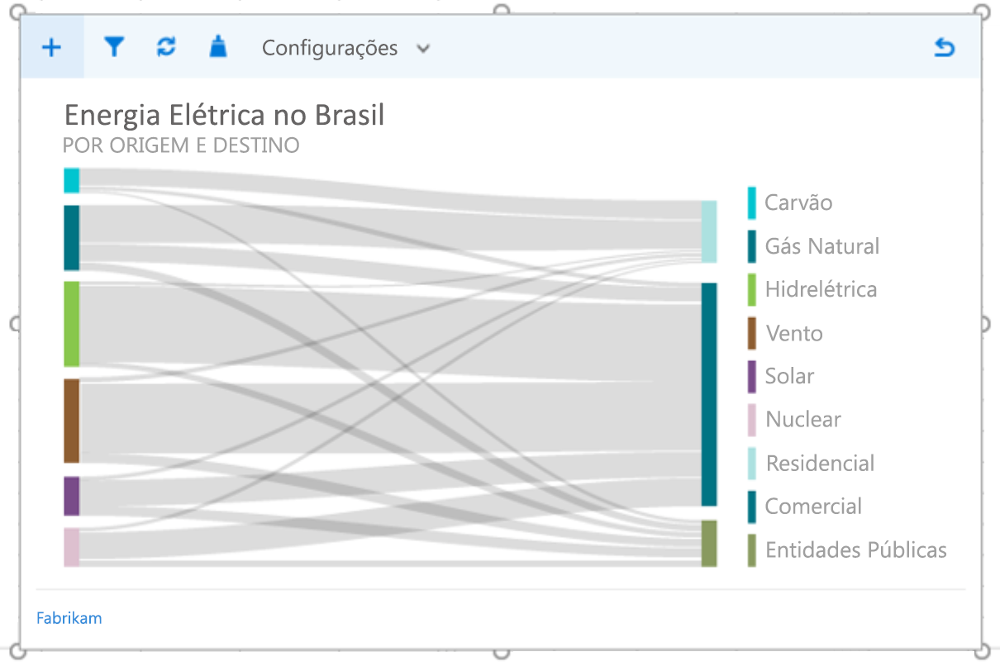
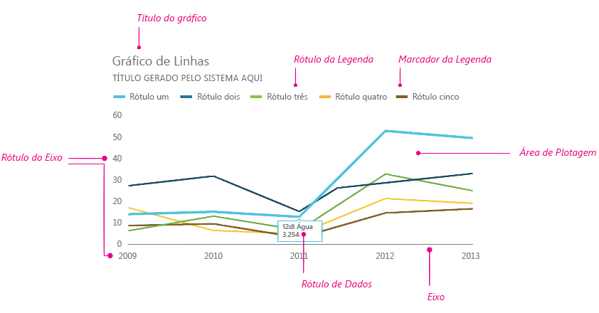
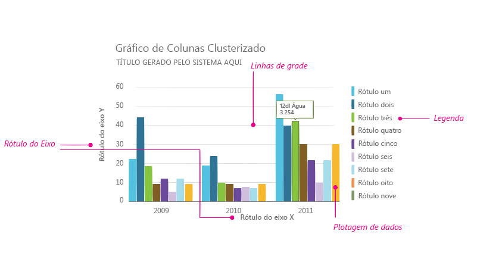
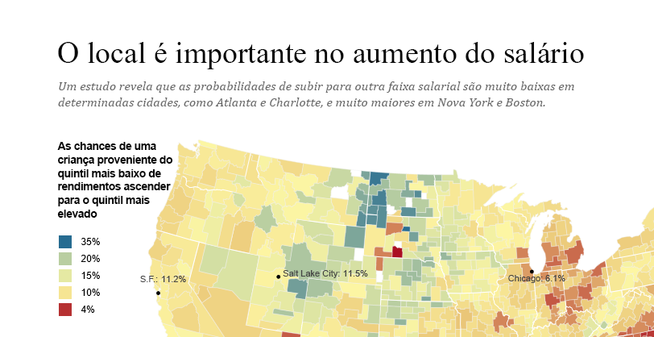
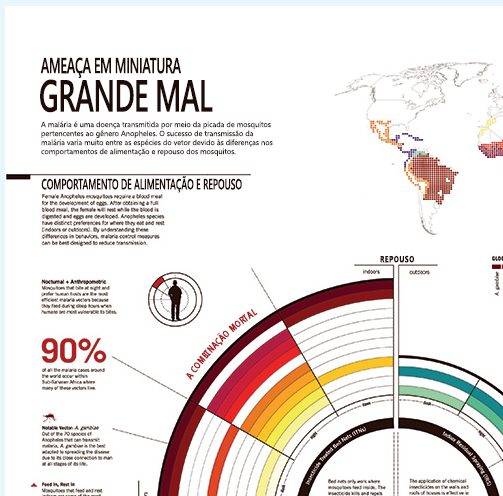
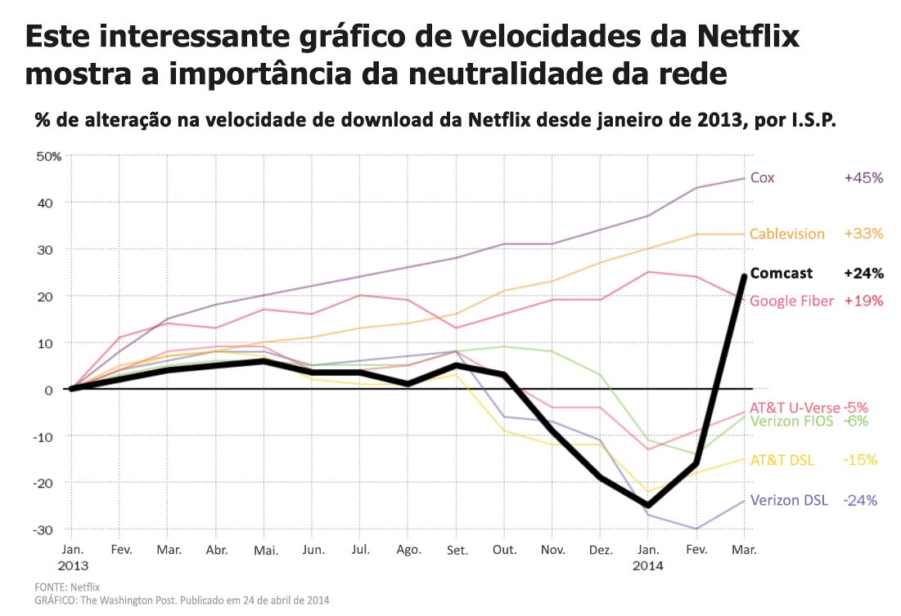

# Diretrizes de estilo de visualização de dados para Suplementos do OfficeData visualization style guidelines for Office Add-ins

Boas visualizações de dados ajudam os usuários a encontrarem informações em seus dados. Eles podem usar essas informações para contar histórias que informam e convencem. Este artigo fornece diretrizes para ajudá-lo a criar visualizações de dados eficazes em seus suplementos para o Excel e outros aplicativos do Office.Good data visualizations help users find insights in their data. They can use those insights to tell stories that inform and persuade. This article provides guidelines to help you design effective data visualizations in your add-ins for Excel and other Office apps.

Recomendamos que você use o [Office UI Fabric](https://developer.microsoft.com/fabric) para criar o cromado para suas visualizações de dados. O Office UI Fabric inclui estilos e componentes que se integram perfeitamente com a aparência do Office.We recommend that you use [Office UI Fabric](https://developer.microsoft.com/fabric) to create the chrome for your data visualizations. Office UI Fabric includes styles and components that integrate seamlessly with the Office look and feel. 

<!--The following figure shows a data visualization in an add-in that uses Fabric.

 

-->

## Elementos de visualização de dadosData visualization elements

As visualizações de dados compartilham uma estrutura geral e elementos comuns visuais e interativos, incluindo títulos, rótulos e plotagens de dados, conforme mostrado nas figuras a seguir.Data visualizations share a general framework and common visual and interactive elements, including titles, labels, and data plots, as shown in the following figures.

### Títulos de gráficoChart titles

Siga estas diretrizes para títulos de gráfico:Follow these guidelines for chart titles:

- Deixe seus títulos de gráfico bem legíveis. Posicione-os para criar uma hierarquia visual em relação ao restante do gráfico.Make your chart titles easily readable. Position them to create a clear visual hierarchy in relation to the rest of the chart.
- Em geral, use maiúsculas nas frases (a primeira letra da primeira palavra em letra maiúscula). Para criar o contraste ou reforçar hierarquias, você poderá usar todas em maiúsculas, mas use isso com moderação.In general, use sentence capitalization (capitalize the first word). To create contrast or to reinforce hierarchies, you can use all caps, but all caps should be used sparingly.
- Incorpore a [typeramp do Office UI Fabric](https://developer.microsoft.com/fabric#/styles/typography) para deixar seus gráficos consistentes com a interface de usuário do Office, que usa o Segoe. Você também pode usar outra fonte para diferenciar o conteúdo do gráfico da interface do usuário.Incorporate the [Office UI Fabric type ramp](https://developer.microsoft.com/fabric#/styles/typography) to make your charts consistent with the Office UI, which uses Segoe. You can also use a different typeface to differentiate chart content from the UI.
- Use tipos sem serifa com contadores grandes.Use sans-serif typefaces with large counters.

Os exemplos a seguir mostram tipos com serifa e sem serifa usados em títulos de gráfico. Observe como o contraste de escala e o uso eficaz do espaço em branco criam uma hierarquia visual forte.The following examples show serif and sans-serif typefaces used in chart titles. Notice how the scale contrast and effective use of white space create a strong visual hierarchy.

### Rótulos dos eixosAxis labels

Deixe os rótulos dos eixos escuros para serem lidos claramente, com um bom contraste entre as cores do plano de fundo e do texto. Verifique se não estão tão escuros que competem com a tinta dos dados.Make your axis labels dark enough to read clearly, with adequate contrast ratios between the text and background colors. Make sure that they are not so dark that they compete with data ink.

Cinza claro é mais eficaz para rótulos dos eixos. Se você estiver usando o Fabric, consulte a [Paleta de cores neutras](https://developer.microsoft.com/fabric#/styles/colors).Light grays are most effective for axis labels. If you’re using Fabric, see the [Neutral Colors palette](https://developer.microsoft.com/fabric#/styles/colors).

### Tinta dos dadosData ink

Os pixels que representam os dados reais em um gráfico são chamados de tinta dos dados. Esse deve ser o foco central da visualização. Evite o uso de sombras, contornos pesados ou elementos de design desnecessários que distorcem ou competem com os dados. Use gradientes apenas quando os valores dos dados estiverem vinculados aos valores das cores. Evite gráficos tridimensionais, a menos que um valor mensurável e objetivo seja associado a uma terceira dimensão.The pixels that represent the actual data in a chart are referred to as data ink. This should be the central focus of the visualization. Avoid the use of drop shadows, heavy outlines, or unnecessary design elements that distort or compete with the data. Use gradients only when data values are tied to color values. Avoid three-dimensional charts unless a measurable, objective value is bound to a third dimension.

### CorColor

Escolha cores que acompanham os temas do sistema operacional ou aplicativo em vez de cores codificadas. Ao mesmo tempo, não deixe que as cores que você aplica distorçam os dados. O uso incorreto de cores nas visualizações de dados pode resultar em distorção de dados e leitura incorreta de informações.Choose colors that follow operating system or application themes rather than hardcoded colors. At the same time, make sure that the colors you apply do not distort the data. Misuse of color in data visualizations can result in data distortion and incorrect reading of information.

Para ver as práticas recomendadas para o uso de cores nas visualizações de dados, consulte o seguinte:For best practices for use of color in data visualizations, see the following:

- [Por que as cores do arco-íris não são a melhor opção para as visualizações de dadosWhy rainbow colors aren't the best option for data visualizations](http://www.poynter.org/2013/why-rainbow-colors-arent-always-the-best-options-for-data-visualizations/224413/)
- [Color Brewer 2.0: Aviso de Cor para CartografiaColor Brewer 2.0: Color Advice for Cartography](http://colorbrewer2.org/)
- [Eu Quero MatizI Want Hue](http://tools.medialab.sciences-po.fr/iwanthue/)

### Linhas de gradeGridlines

As linhas de grade geralmente são necessárias para a leitura precisa de um gráfico, mas elas devem ser apresentadas como um elemento visual secundário, aprimorando a tinta dos dados e não competindo com ela. Use linhas de grade estáticas finas e leves, a menos que elas tenham sido projetadas especificamente para alto contraste. Você também pode usar interação para criar linhas de grade dinâmicas, que aparecem no contexto quando um usuário interage com um gráfico.Gridlines are often necessary for accurately reading a chart, but should be presented as a secondary visual element, enhancing the data ink, not competing with it. Make static gridlines thin and light, unless they are designed specifically for high contrast. You can also use interaction to create dynamic, just-in-time gridlines that appear in context when a user interacts with a chart.

Cinza claro é mais eficaz para linhas de grade. Se você estiver usando o Fabric, consulte a [Paleta de cores neutras](https://developer.microsoft.com/fabric#/styles/colors).Light grays are most effective for gridlines. If you’re using Fabric, see the [Neutral Colors palette](https://developer.microsoft.com/fabric#/styles/colors).

A imagem a seguir mostra uma visualização de dados com linhas de grade.The following image shows a data visualization with gridlines.

### LegendasLegends

Adicione legendas, se for necessário:Add legends if necessary to:

- Diferenciar as sériesDistinguish between series
- Apresentar mudanças de escala ou valorPresent scale or value changes

Confira se suas legendas aprimoram a tinta dos dados e não competem com ela. Coloque as legendas:Make sure that your legends enhance the data ink and do not compete with it. Place legends:

- Recue à esquerda acima da área de plotagem por padrão, se todos os itens de legenda se ajustarem acima do gráfico.Flush left above the plot area by default, if all legend items fit above the chart.
- No lado superior direito da área de plotagem, se todos os itens de legenda não couberem acima do gráfico e use uma barra de rolagem, se necessário.On the upper right side of the plot area, if all legend items do not fit above the chart, and make it scrollable, if necessary.

Para otimizar a legibilidade e a acessibilidade, mapeie os marcadores de legenda para a forma de gráfico relevante. Por exemplo, use marcadores de legenda em círculo para gráfico de bolhas e de plotagem de dispersão. Use marcadores de legenda de segmento de linha para gráficos de linhas.To optimize for readability and accessibility, map legend markers to the relevant chart shape. For example, use circle legend markers for scatter plot and bubble chart legends. Use line segment legend markers for line charts.

### Dicas de ferramenta e rótulos de dadosData labels and tooltips

Verifique se as dicas de ferramentas os e rótulos de dados têm espaço suficiente em branco e variação de tipos. Use algoritmos para minimizar oclusão e conflito. Por exemplo, uma dica de ferramenta pode ser exibida à direita de um ponto de dados por padrão, mas ser exibida à esquerda se forem detectadas bordas à direita.Ensure that data labels and tooltips have adequate white space and type variation. Use algorithms to minimize occlusion and collision. For example, a tooltip might surface to the right of a data point by default, but surface to the left if right edges are detected.

## Princípios de designDesign principles

A equipe de Design do Office criou o conjunto de princípios de design a seguir, que usamos ao criar novas visualizações de dados para o pacote de produtos do Office.The Office Design team created the following set of design principles, which we use when designing new data visualizations for the Office product suite.

### Princípios de design visualVisual design principles

- As visualizações devem honrar e aprimorar os dados, facilitando a compreensão. Realce os dados, adicionando elementos de suporte somente conforme o necessário para fornecer o contexto. Evite embelezamentos desnecessários (sombras, estruturas de tópicos etc), gráficos desnecessários ou distorção de dados.Visualizations should honor and enhance the data, making it easy to understand. Highlight the data, adding supporting elements only as needed to provide context. Avoid unnecessary embellishments (drop shadows, outlines, etc), chart junk, or data distortion.
- As visualizações devem incentivar a exploração fornecendo comentários visuais interessantes. Use padrões de interação bem estabelecidos, controles de interface e feedback claro do sistema.Visualizations should encourage exploration by providing rich visual feedback. Use well-established interaction patterns, interface controls, and clear system feedback.
- Incorpore princípios de design consagrados. Use princípios tipográficos e de design de comunicação visual estabelecidos para aprimorar a forma, a legibilidade e o significado.Embody time-honored design principles. Use established typographic and visual communication design principles to enhance form, readability, and meaning.

### Princípios de design de interaçãoInteraction design principles

- Design para permitir a exploração.Design to allow for exploration.
- Permitir interações diretas com objetos que revelam novas informações (classificação ao arrastar, por exemplo).Allow for direct interactions with objects that reveal new insights (sorting via drag, for example).
- Use modelos de interação simples, diretos e familiares.Use simple, direct, familiar interaction models.

Para obter mais informações sobre como criar visualizações de dados interativas e amigáveis, confira [Princípios e armadilhas de interface do usuário](http://uitraps.com/).For more information about how to design user-friendly interactive data visualizations, see [UI Tenets and Traps](http://uitraps.com/).

### Princípios de design de animaçãoMotion design principles

A animação segue o estímulo. Os elementos visuais devem se mover na mesma direção e com a mesma velocidade. Isso se aplica a:Motion follows stimulus. Visual elements should move in the same direction at the same rate. This applies to:

- Criação do gráficoChart creation
- Transição de um tipo de gráfico para outroTransition from one chart type to another chart type
- FiltragemFiltering
- ClassificaçãoSorting
- Adição ou subtração de dadosAdding or subtracting data
- Revisão ou segmentação de dadosBrushing or slicing data
- Redimensionamento de um gráficoResizing a chart

Crie uma percepção de causalidade. Quando preparar animações:Create a perception of causality. When staging animations:

- Prepare uma coisa de cada vez.Stage one thing at a time. 
- Prepare as mudanças nos eixos antes da mudança na tinta dos dados.Stage changes to axes before changes to data ink.
- Prepare e anime objetos como um grupo se eles estiverem se movendo na mesma velocidade e na mesma direção.Stage and animate objects as a group if they are moving at the same speed in the same direction.
- Prepare elementos de dados em grupos de não mais do que 4 a 5 objetos. Os espectadores têm dificuldade de acompanhar mais de 4 e 5 objetos independentemente.Stage data elements in groups of no more than 4-5 objects. Viewers have difficulty tracking more than 4-5 objects independently.

A animação adiciona significado.Motion adds meaning.

- Animações aumentam a compreensão do usuário das alterações nos dados, fornecem contexto e atuam como uma camada de anotação não verbal.Animations increase user comprehension of changes to the data, provide context, and act as a non-verbal annotation layer.
- A animação deve ocorrer em um espaço de coordenadas significativo da visualização.Motion should occur in a meaningful coordinate space of the visualization.
- Personalize a animação para o visual.Tailor the animation to the visual. 
- Evite animações gratuitas.Avoid gratuitous animations.

A animação segue os dados.Motion follows data.

- Preserve o mapeamentos de dados. Se uma área estiver vinculada a uma medida, mantenha essa área na transição.Preserve data mappings. If an area is tied to a measure, maintain that area in transition.
- Manter uma linguagem de design de animação consistente. Sempre que possível, mapeie a animação da visualização de dados para a linguagem de design de animação do Office. Use animações semelhantes para tipos de gráfico semelhantes.Maintain a consistent animation design language. Where possible, map data visualization animation to existing Office motion design language. Use similar animations for similar chart types.

## Acessibilidade nas visualizações de dadosAccessibility in data visualizations

- Não use cor como a única maneira de comunicar informações. As pessoas que são daltônicas não serão capazes de interpretar os resultados. Use forma, tamanho e textura, além de cor quando possível para comunicar informações.Do not use color as the only way to communicate information. People who are color blind will not be able to interpret the results. Use shape, size and texture in addition to color when possible to communicate information.
- Torne todos os elementos interativos, como botões de ação ou listas de escolha, acessíveis a partir de um teclado.Make all interactive elements, such as push buttons or pick lists, accessible from a keyboard.
- Envie eventos de acessibilidade para leitores de tela para anunciar alterações de foco, dicas de ferramentas e assim por diante.Send accessibility events to screen readers to announce focus changes, tooltips, and so on.

## Veja tambémSee also 

- [Dados + Design: uma introdução simples para preparar e  visualizar as informaçõesData + Design: A Simple Introduction to Preparing and Visualizing Information](https://infoactive.co/data-design)
- [As cinco melhores bibliotecas para criar visualizações de dadosThe Five Best Libraries for Building Data Visualizations](http://www.fastcompany.com/3029760/the-five-best-libraries-for-building-data-vizualizations)
- [Exibição Visual de informações quantitativasThe Visual Display of Quantitative Information](https://www.edwardtufte.com/tufte/books_vdqi)
