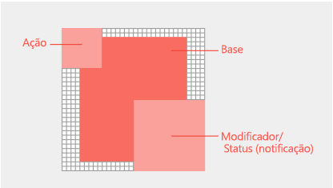

# Desenvolver ?cones para comandos de suplementoDesign icons for add-in commands

Os [Comandos de suplementos](add-in-commands.md) adicionam bot?es, texto e ?cones ? interface do usu?rio do Office. Os bot?es de comando de suplemento devem fornecer ?cones significativos e r?tulos que identifiquem claramente a a??o que o usu?rio est? realizando ao usar um comando. Este artigo fornece diretrizes de estilo e produ??o que ajudam voc? a desenvolver ?cones que se integrem perfeitamente ao Office.[Add-in commands](add-in-commands.md) add buttons, text, and icons to the Office UI. Your add-in command buttons should provide meaningful icons and labels that clearly identify the action the user is taking when they use a command. This article provides stylistic and production guidelines that help you design icons that integrate seamlessly with Office. 

## Princ?pios de design de ?cones do OfficeOffice icon design principles

A vers?o Office 2013 de clientes de ?rea de trabalho do Office conta com uma iconografia atualizada. A mudan?a estil?stica de substitui??o ? a redu??o. Os novos ?cones cont?m apenas elementos de comunica??o essenciais. Elementos n?o essenciais, como perspectiva, gradientes e uma fonte de luz, foram removidos. Os ?cones simplificados suportam a an?lise mais r?pida de comandos e controles. Siga esse estilo para ter uma melhor integra??o com o Office.The Office 2013 release of the Office desktop clients includes refreshed iconography. The overriding stylistic change is reduction. The new icons include only essential communicative elements. Non-essential elements including perspective, gradients, and light source are removed. The simplified icons support faster parsing of commands and controls. Follow this style to best fit with Office.

Os ?cones do Office s?o baseados nas seguintes princ?pios de design:Office icons are based on the following design principles: 

- Interpreta??o moderna do conjunto de ?cones do OfficeModern interpretation of Office icon collection 
- Novo, por?m reconhec?velFresh yet familiar  
- Simples, claro e diretoSimple, clear, and direct 

A imagem a seguir mostra ?cones que aplicam os princ?pios modernos de design.The following image shows icons that apply the modern design principles.

## Diretrizes de ?conesIcon guidelines
Siga estas diretrizes ao criar seus ?cones:Follow these guidelines when you create your icons: 

- Mantenha uma grade de 1 px e use uma ferramenta de edi??o bitmap para obter melhores resultados.Stick to the 1px grid and use a bitmap editing tool for best results.  
- Redesenhe, n?o redimensione. ? medida que voc? redimensiona seus ?cones para tamanhos maiores ou menores, reserve um tempo para redesenhar os recortes, os cantos e as bordas arredondadas para maximizar a defini??o da linha.Redraw, don't resize. As you resize your icons for larger or smaller sizes, take the time to redraw cutouts, corners, and rounded edges to maximize line clarity. 
- Remova artefatos que fa?am com que o ?cone pare?a confuso.Remove artifacts that make your icon look messy.
- N?o reutilize ?cones do Office UI Fabric na faixa de op??es do Office ou no menu contextual. Os ?cones do Fabric s?o estilisticamente diferentes e n?o ser?o compat?veis.Don't reuse Office UI Fabric icons in the Office ribbon or contextual menu. Fabric icons are stylistically different and will not match. 
- Evite confiar no seu logotipo ou marca para comunicar o que um comando de suplemento faz. Nem sempre ? poss?vel reconhecer as marcas em ?cones menores e quando os modificadores s?o aplicados. As marcas geralmente entram em conflito com estilos de ?cone da faixa de op??es e podem competir pela aten??o do usu?rio em um ambiente saturado.Avoid relying on your logo or brand to communicate what an add-in command does. Brand marks aren't always recognizable at smaller icon sizes and when modifiers are applied. Brand marks often conflict with Office ribbon icon styles, and can compete for user attention in a saturated environment.
- Use um preenchimento branco para acessibilidade. A maioria dos objetos em seus ?cones exigir? um fundo branco para ser leg?vel nos temas da interface do usu?rio do Office e nos modos de alto contraste.Use a white fill for accessibility. Most objects in your icons will require a white background to be legible across Office UI themes and in high-contrast modes.  
- Use o formato PNG com uma tela de fundo transparente.Use the PNG format with a transparent background. 
- Evite usar conte?do localiz?vel em seus ?cones, como caracteres tipogr?ficos, indica??es de par?grafos e pontos de interroga??o.Avoid localizable content in your icons, including typographic characters, indications of paragraph rags, and question marks. 
- N?o reutilize met?foras visuais para comandos diferentes. Usar o mesmo ?cone para a??es diferentes pode causar confus?o.Don't reuse visual metaphors for different commands. Using the same icon for different actions can cause confusion. 
- Fa?a com que os r?tulos dos seus bot?es sejam claros e concisos. Use uma combina??o de informa??es visuais e textuais para transmitir o significado.Make your button labels clear and succinct. Use a combination of visual and textual information to convey meaning. 

## Recomenda??es e requisitos de tamanho de ?coneIcon size recommendations and requirements

Os ?cones de ?rea de trabalho do Office 2016 s?o imagens bitmap. Tamanhos diferentes ser?o renderizados, dependendo do modo de toque e da configura??o de DPI do usu?rio. Inclua todos os oito tamanhos com suporte para criar a melhor experi?ncia para todas as resolu??es e contextos com suporte. Estes s?o os tamanhos compat?veis (tr?s s?o obrigat?rios):Office 2016 desktop icons are bitmap images. Different sizes will render depending on the user's DPI setting and touch mode. Include all eight supported sizes to create the best experience in all supported resolutions and contexts. The following are the supported sizes - three are required:

- 16 px (obrigat?rio)16 px (Required)
- 20 px20 px
- 24 px24 px
- 32 px (obrigat?rio)32 px (Required)
- 40 px40 px
- 48 px48 px
- 64 px (recomendado, melhor para Mac)64 px (Recommended, best for Mac)
- 80 px (obrigat?rio)80 px (Required)  

N?o se esque?a de redesenhar seus ?cones para cada tamanho em vez de reduzi-los para que caibam.Make sure to redraw your icons for each size rather than shrink them to fit.

<!--
The following table shows the icon sizes that render for different modes at different DPI settings.

|DPI |**Small**||**Medium**||**Large**||**Extra large**|
|:---|:---|:---|:---|:---|:---|:---|:---|
|    |**Mouse**|**Touch**|**Mouse**|**Touch**|**Mouse**|**Touch**|-|
|100%|16px|20px|24px||32px|40px|48px|
|125%|20px|24px|||40px|48px|60px|
|150%|24px|24px|36px||48px|48px|72px|
|200%|32px|40px|48px||64px|80px|96px|
|250%|40px||||80px||120px|
|300%|48px||||96px||144px

> [!NOTE]
> At DPI settings of 150% or greater, the icon does not get swapped out for a larger size when Touch mode is engaged. At DPI settings greater than 250%, Touch mode is turned off by default.

The following table lists the locations for certain icon sizes.

|Location|100% DPI|200% DPI|250% DPI|
|:-------|:-------|:-------|:-------|
|Small ribbon button|16px|32px|40px|
|Contextual menu|16px|32px|40px|
|Quick access toolbar (QAT)|16px|32px|40px|
|Large ribbon icon|32px|64px|80px|

-->

## Anatomia e layout do ?coneIcon anatomy and layout

Os ?cones do Office s?o geralmente compostos por um elemento b?sico com modificadores conceituais e de a??o sobrepostos.?Os modificadores de a??o representam conceitos como adicionar, abrir, novo ou fechar. Os modificadores conceituais representam status, altera??o ou uma descri??o do ?cone.Office icons are typically comprised of a base element with action and conceptual modifiers overlayed.?Action modifiers represent concepts such as add, open, new, or close. Conceptual modifiers represent status, alteration, or a description of the icon. 

Para criar comandos que se alinhem ? interface do usu?rio do Office, siga as diretrizes de layout para o elemento b?sico e os modificadores. Isso garante que seus comandos tenham uma apar?ncia profissional e seus clientes confiem no seu suplemento. Se voc? fizer exce??es a essas diretrizes, fa?a intencionalmente.To create commands that align with the Office UI, follow layout guidelines for the base element and modifiers. This ensures that your commands look professional and that your customers will trust your add-in. If you make exceptions to these guidelines, do so intentionally.

A imagem a seguir mostra o layout de elementos b?sicos e modificadores em um ?cone do Office.The following image shows the layout of base elements and modifiers in an Office icon.

- Elementos b?sicos centrais no quadro do pixel com preenchimento todo vazio.Center base elements in the pixel frame with empty padding all around.
- Coloque modificadores de a??o na parte superior esquerda.Place action modifiers on the top left. 
- Coloque modificadores conceituais no canto inferior direito.Place conceptual modifiers on the bottom right.
- Limite o n?mero de elementos em seus ?cones. Com 32 px, limite o n?mero de modificadores a no m?ximo dois. Com 16 px, limite o n?mero de modificadores a um.Limit the number of elements in your icons. At 32px, limit the number of modifiers to a maximum of two. At 16px, limit the number of modifiers to one.

Coloque elementos b?sicos com tamanhos consistentes. Se os elementos b?sicos n?o puderem ser centralizados no quadro, alinhe-os no canto superior esquerdo, deixando os pixels extras na parte inferior direita. Para melhores resultados, aplique as diretrizes de preenchimento listadas na tabela a seguir.Place base elements consistently across sizes. If base elements can't be centered in the frame, align them to the top left, leaving the extra pixels on the bottom right. For best results, apply the padding guidelines listed in the following table.

|**Tamanho do ?cone****Icon size**|**Preenchimento em torno do elemento b?sico****Padding around base element**|
|:---|:---|
|16 px16px|0.0|
|20 px20px|1 px1px|
|24 px24px|1 px1px|
|32 px32px|2 px2px|
|40 px40px|2 px2px|
|48 px48px|3 px3px|
|64 px64px|5 px5px|
|80 px80px|5 px5px|

Todos os modificadores devem ter um recorte transparente de 1 px entre cada elemento, incluindo a tela de fundo. Os elementos n?o devem se sobrepor diretamente. Crie um espa?o em branco entre as regras e as bordas. Os modificadores podem variar um pouco de tamanho, mas use essas dimens?es como ponto de partida.All modifiers should have a 1px transparent cutout between each element, including the background. Elements should not directly overlap. Create whitespace between rules and edges. Modifiers can vary slightly in size, but use these dimensions as a starting point.

|**Tamanho do ?cone****Icon size**|**Tamanho do modificador****Modifier size**|
|:---|:---|
|16 px16px|9 px9px|
|20 px20px|10 px10px|
|24 px24px|12 px12px|
|32 px32px|14 px14px|
|40 px40px|20 px20px|
|48 px48px|22 px22px|
|64 px64px|29 px29px|
|80 px80px|38 px38px|

## Cores do ?coneIcon colors

Os ?cones do Office t?m uma paleta de cores limitada. Use as cores listadas na tabela a seguir para garantir uma integra??o perfeita com a interface de usu?rio do Office. Aplique as seguintes diretrizes para o uso de cor:Office icons have a limited color palette. Use the colors listed in the following table to guarantee seamless integration with the Office UI. Apply the following guidelines to the use of color: 

- Use cor para transmitir significado, n?o como enfeite. Ela deve destacar ou enfatizar uma a??o, status ou um elemento que diferencie explicitamente a marca.Use color to communicate meaning rather than for embellishment. It should highlight or emphasize an action, status, or an element that explicitly differentiates the mark.  
- Se poss?vel, use somente uma cor al?m do cinza. Limite as cores adicionais a no m?ximo duas.If possible, use only one additional color beyond gray. Limit additional colors to two at the most.
- As cores devem ter uma apar?ncia consistente em todos os tamanhos de ?cone. Os ?cones do Office t?m paletas de cores um pouco diferentes para tamanhos de ?cones diferentes. ?cones com 16 px e menores s?o um pouco mais escuros e mais vibrantes do que os ?cones de 32 px e maiores. Sem esses ajustes sutis, as cores parecem variar entre os tamanhos.Colors should have a consistent appearance in all icon sizes. Office icons have slightly different color palettes for different icon sizes. 16px and smaller icons are slightly darker and more vibrant than 32px and larger icons. Without these subtle adjustments, colors appear to vary across sizes.   

|**Nome da cor****Color name**|**RGB****RGB**|**Hexa****Hex**|**Cor****Color**|**Categoria****Category**|
|:---|:---|:---|:---|:---|
|Texto Cinza (80)Text Gray (80)|80, 80, 8080, 80, 80|#505050#505050|  |TextoText|
|Texto Cinza (95)Text Gray (95)|95, 95, 9595, 95, 95|#5F5F5F#5F5F5F|  |TextoText|
|Texto Cinza (105)Text Gray (105)|105, 105, 105105, 105, 105|#696969#696969|  |TextoText|
|Cinza Escuro 32Dark Gray 32|128, 128, 128128, 128, 128|#808080#808080|  |32 e acima32 and above|
|Cinza M?dio 32Medium Gray 32|158, 158, 158158, 158, 158|#9E9E9E#9E9E9E|  |32 e acima32 and above|
|Cinza Claro TODOLight Gray ALL|179, 179, 179179, 179, 179|#B3B3B3#B3B3B3|  |Todos os tamanhosAll sizes|
|Cinza Escuro 16Dark Gray 16|114, 114, 114114, 114, 114|#727272#727272|  |16 e abaixo16 and below|
|Cinza M?dio 16Medium Gray 16|144, 144, 144144, 144, 144|#909090#909090|  |16 e abaixo16 and below|
|Azul 32Blue 32|77, 130, 18477, 130, 184|#4d82B8#4d82B8|  |32 e acima32 and above|
|Azul 16Blue 16|74, 125, 17774, 125, 177|#4A7DB1#4A7DB1|  |16 e abaixo16 and below|
|Amarelo TODOYellow ALL|234, 194, 130234, 194, 130|#EAC282#EAC282|  |Todos os tamanhosAll sizes|
|Laranja 32Orange 32|231, 142, 70231, 142, 70|#E78E46#E78E46|  |32 e acima32 and above|
|Laranja 16Orange 16|227, 142, 70227, 142, 70|#E3751C#E3751C|  |16 e abaixo16 and below|
|Rosa TODOPink ALL|230, 132, 151230, 132, 151|#E68497#E68497|  |Todos os tamanhosAll sizes|
|Verde 32Green 32|118, 167, 151118, 167, 151|#76A797#76A797|  |32 e acima32 and above|
|Verde 16Green 16|104, 164, 144104, 164, 144|#68A490#68A490|  |16 e abaixo16 and below|
|Vermelho 32Red 32|216, 99, 68216, 99, 68|#D86344#D86344|  |32 e acima32 and above|
|Vermelho 16Red 16|214, 85, 50214, 85, 50|#D65532#D65532|  |16 e abaixo16 and below|
|Roxo 32Purple 32|152, 104, 185152, 104, 185|#9868B9#9868B9|  |32 e acima32 and above|
|Roxo 16Purple 16|137, 89, 171137, 89, 171|#8959AB#8959AB|  |16 e abaixo16 and below|

## ?cones em modos de alto contrasteIcons in high contrast modes

Os ?cones do Office foram projetados para renderizar bem em modos de alto contraste. Elementos de primeiro plano s?o bem diferenciados dos planos de fundo para maximizar a legibilidade e habilitar a recolora??o. Nos modos de alto contraste, o Office recolore qualquer pixel do seu ?cone com um valor vermelho, verde ou azul menor que 190 para totalmente preto. Todos os outros pixels ficam na cor branca. Em outras palavras, cada canal RGB ? avaliado onde, os valores de 0 a 189 ficam pretos e os valores de 190 a 255 ficam brancos. Outros temas de alto contraste fazem a recolora??o usando o mesmo limite de valor de 190, mas com regras diferentes. Por exemplo, o tema de branco de alto contraste recolore todos pixels maiores que 190 para opaco, mas todos os outros pixels para transparente. Aplique as seguintes diretrizes para maximizar a legibilidade em configura??es de alto contraste:Office icons are designed to render well in high contrast modes. Foreground elements are well differentiated from backgrounds to maximize legibility and enable recoloring. In high contrast modes, Office will recolor any pixel of your icon with a red, green, or blue value less than 190 to full black. All other pixels will be white. In other words, each RGB channel is assessed where 0-189 values are black and 190-255 values are white. Other high-contrast themes recolor using the same 190 value threshold but with different rules. For example, the high-contrast white theme will recolor all pixels greater than 190 opaque but all other pixels as transparent. Apply the following guidelines to maximize legibility in high-contrast settings:

- Vise diferenciar elementos de primeiro plano e de plano de fundo ao longo do limite de valor de 190.Aim to differentiate foreground and background elements along the 190 value threshold.
- Siga os estilos visuais dos ?cones do Office.Follow Office icon visual styles.
- Use cores da nossa paleta de ?cones.Use colors from our icon palette.
- Evite o uso de gradientes.Avoid the use of gradients.
- Evite blocos grandes de cores com valores similares.Avoid large blocks of color with similar values.

## Veja tamb?mSee also

- [Pr?ticas recomendadas de desenvolvimento de suplementosAdd-in development best practices](../concepts/add-in-development-best-practices.md)
- [Comandos de suplemento para Excel, Word e PowerPointAdd-in commands for Excel, Word, and PowerPoint](../design/add-in-commands.md)
