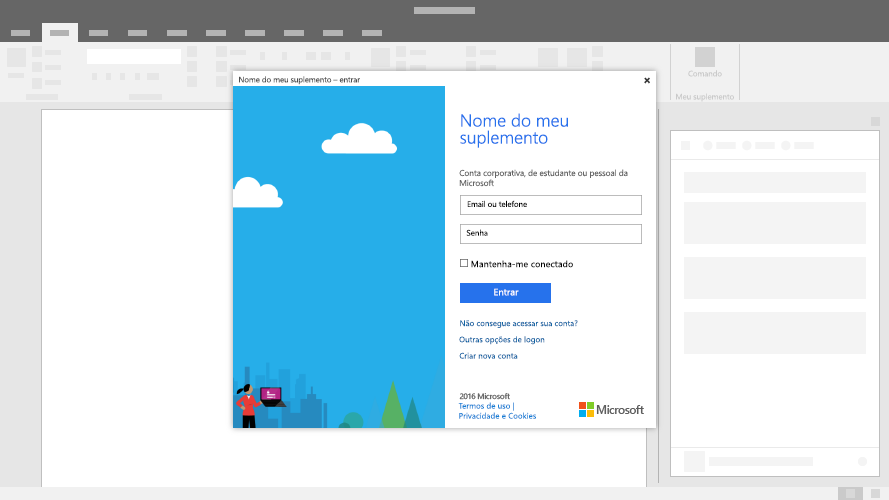

# Caixas de diálogo em Suplementos do OfficeDialog boxes in Office Add-ins
 
Caixas de diálogo são superfícies que flutuam acima da janela do aplicativo do Office ativo. Você pode usar caixas de diálogo para fornecer espaço adicional na tela para tarefas como páginas de entrada que não podem ser abertas diretamente em um painel de tarefas ou solicitações para confirmar uma ação executada por um usuário ou mostrar vídeos que podem ser muito pequenos se confinados a um painel de tarefas.Dialog boxes are surfaces that float above the active Office application window. You can use dialog boxes to provide additional screen space for tasks such as sign-in pages that can't be opened directly in a task pane or requests to confirm an action taken by a user, or to show videos that might be too small if confined to a task pane.

*Figura 1. Layout típico de uma caixa de diálogo**Figure 1. Typical layout for a dialog box*

## Práticas recomendadasBest practices

|**Faça****Do**|**Não faça****Don't**|
|:-----|:--------|
|<ul><li>Inclua um título descritivo com o nome de suplemento, juntamente com a tarefa atual.Include a descriptive title that includes your add-in name along with the current task.</li></ul>|<ul><li>Não adicione o nome da sua empresa ao título.Don't append your company name to the title.</li></ul>|
||<ul><li>Não abra uma caixa de diálogo, a menos que o cenário exija isso.Don't open a dialog box unless the scenario requires it.</li></ul>|

## ImplementaçãoImplementation

Confira um exemplo que implementa uma caixa de diálogo em [Exemplo de API de caixa de diálogo de suplemento do Office](https://github.com/OfficeDev/Office-Add-in-Dialog-API-Simple-Example) no GitHub.For a sample that implements a dialog box, see [Office Add-in Dialog API Example](https://github.com/OfficeDev/Office-Add-in-Dialog-API-Simple-Example) in GitHub.

## Confira tambémSee also

- [Objeto DialogDialog object](https://docs.microsoft.com/javascript/api/office/office.dialog)
- [Padrões de design da experiência do usuário para suplementos do OfficeUX design patterns for Office Add-ins](../design/ux-design-pattern-templates.md)

