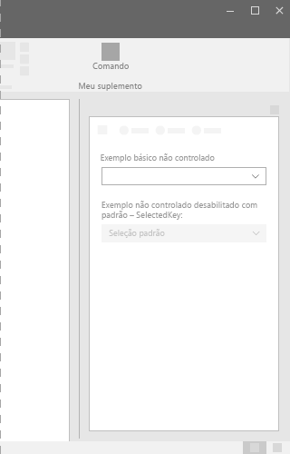
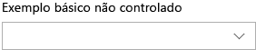

# Componente DropDown no Office UI Fabric

Uma lista suspensa é uma lista de opções mostrada quando clicamos em um botão suspenso. Use menus ou listas suspensas para simplificar o design da interface do usuário e quando os usuários tiverem que fazer uma escolha dentro da interface. Quando a lista é recolhida, o item selecionado fica visível. Para alterar o item escolhido, os usuários abrem a lista e selecionam um novo valor.
  
#### Exemplo: lista suspensa em um painel de tarefas

## Práticas recomendadas

|**Faça**|**Não faça**|
|:------------|:--------------|
|Use uma lista suspensa quando houver maior probabilidade de que a opção padrão seja escolhida, em vez das outras opções. Por outro lado, ChoiceGroup ou botões de opção colocam a mesma ênfase em todas as opções exibidas.|Não use um menu suspenso quando todas as opções forem igualmente susceptíveis de serem selecionadas.|
|Use uma lista suspensa quando houver várias opções que podem ser recolhidas em um único campo. Além disso, use listas suspensas em caso de listas longas de itens ou quando o espaço na tela for restrito.|Não use listas suspensas se houver menos de duas opções. Em vez disso, use uma caixa de seleção.|
|Use instruções ou palavras encurtadas em um menu suspenso.| |

## Variantes

|**Variação**|**Descrição**|**Exemplo**|
|:------------|:--------------|:----------|
|**Menu suspenso básico e não controlado **|Use quando houver muitas opções disponíveis para escolha.| |
|**Menu suspenso não controlado e desabilitado com o defaultSelectedKey**|Estado desabilitado do menu suspenso.| |
|**Menu suspenso controlado**|Use quando o item selecionado padrão for influenciado por outra localização em sua interface de usuário, e o item selecionado no menu suspenso precisar ser mantido.| |

## Implementação

Para saber mais, confira [Lista suspensa](https://dev.office.com/fabric#/components/dropdown) e [Primeiros passos com exemplo de código do Fabric React](https://github.com/OfficeDev/Word-Add-in-GettingStartedFabricReact).

## Veja também

- [Padrões de design da experiência do usuário](https://github.com/OfficeDev/Office-Add-in-UX-Design-Patterns-Code)
- [Office UI Fabric em Suplementos do Office](office-ui-fabric.md)
