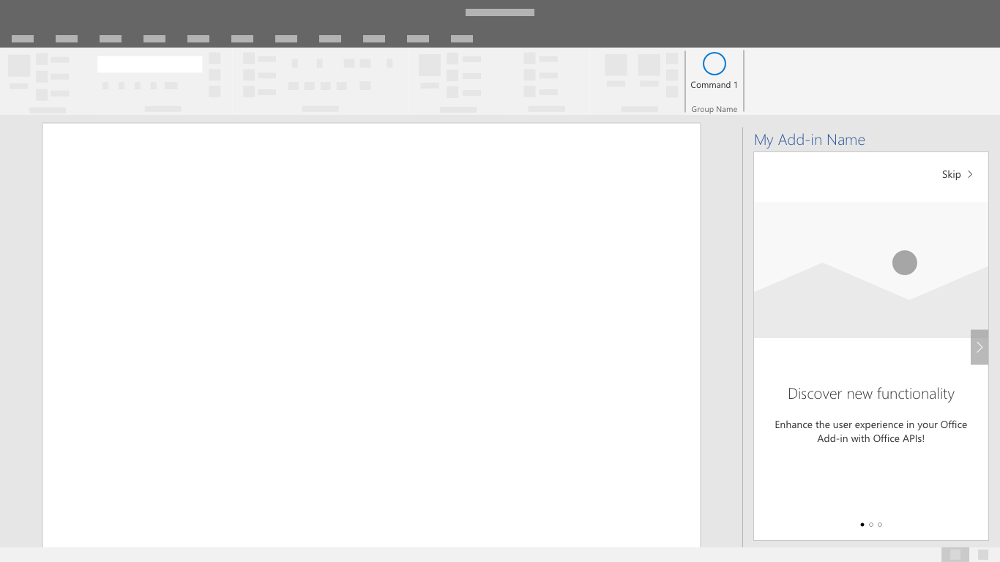

# Padrões de tela de apresentação

Uma tela de apresentação (FRE) é a introdução de um usuário para o suplemento. Um FRE é exibida quando um usuário abre um suplemento pela primeira vez e fornece informações sobre as funções, recursos e/ou os benefícios do suplemento. Essa experiência ajuda a moldar a impressão do usuário de um suplemento e pode influenciar fortemente sua probabilidade de voltar e continuar usando o suplemento.

## Práticas recomendadas

Siga estas práticas recomendadas ao criar sua tela de apresentação:

|Fazer|Não fazer|
|:------|:------|
|Forneça uma simples e breve introdução para as principais ações do suplemento. | Não inclua informações e legendas que não sejam relevantes ao guia de introdução.
|Forneça aos usuários a oportunidade de concluir uma ação que impactará positivamente o uso do add-in. | Não espere que os usuários aprendam tudo ao mesmo tempo. Concentre-se na ação que fornece o maior valor.
|Crie uma experiência envolvente que os usuários desejem concluir. | Não force os usuários a clicar na experiência da tela de apresentação. Forneça aos usuários uma opção para ignorar a tela de apresentação. |

Considere se mostrar aos usuários a tela de apresentação uma vez ou periodicamente é importante para seu cenário. Por exemplo, se o suplemento for usado apenas periodicamente, os usuários poderão ficar menos familiarizados com seu suplemento e poderão se beneficiar de outra interação com a tela de apresentação.

Aplique os seguintes padrões, conforme aplicável, para criar ou aprimorar a tela de apresentação do seu suplemento.

## Carrossel

O carrossel apresenta aos usuários uma série de recursos ou página de informações antes que eles comecem a usar o suplemento.

*Figura 1: Permita que os usuários avancem ou pulem as páginas iniciais do fluxo do carrossel.*

*Figura 2: Minimize o número de telas do carrossel que você apresenta ao usuário somente para as que são necessárias para comunicar efetivamente sua mensagem*

*Figura 3: Forneça um apelo à ação claro para sair da tela de apresentação.*

## Roteiro de valor

O posicionamento do valor informa a proposta de valor do seu suplemento com posicionamento do logotipo, uma proposta de valor claramente definida, destaques ou resumo do recurso e uma chamada para ação.

* Um roteiro de valor com logotipo, proposição de valor clara, resumo de recurso e chamada para ação.*

### Roteiro de vídeo

O roteiro de vídeo mostra aos usuários um vídeo antes que eles comecem a usar o suplemento.

*Figura 1: Apresentação do roteiro - A tela contém uma imagem estática do vídeo com um botão de reprodução e um botão de apelo para ação. *

*Figura 2: Player de vídeo - os usuários são apresentados a um vídeo em uma janela de diálogo.*

