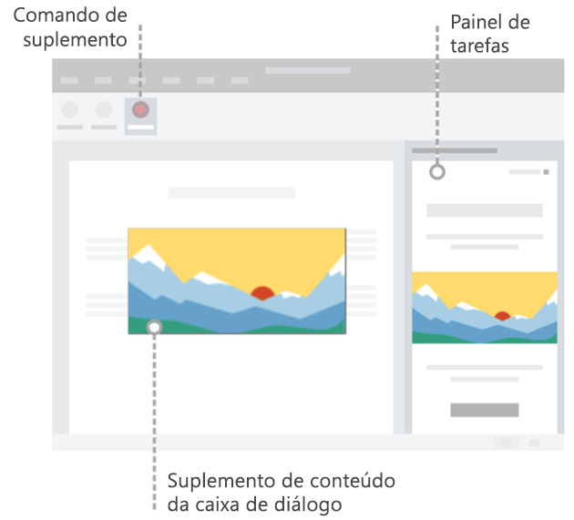

# Elementos da interface do usuário do Office para suplementos do Office

You can use several types of UI elements to extend the Office UI, including add-in commands and HTML containers. These UI elements look like a natural extension of Office and work across platforms. You can insert your custom web-based code into any of these elements.

A imagem a seguir mostra os tipos de elementos de interface do usuário do Office que você pode criar.

## Comandos de suplemento

Use [comandos de suplemento](add-in-commands.md) para adicionar pontos de entrada ao suplemento na faixa de opções do aplicativo do Office. Comandos iniciam ações no suplemento executando código JavaScript ou iniciando um contêiner HTML. Você pode criar dois tipos de comandos de suplemento.

|**Tipo de comando**|**Descrição**|
|:---------------|:--------------|
|Botões, menus e guias da faixa de opções|Use to add custom buttons, menus (dropdowns), or tabs to the default ribbon in Office. Use Buttons and menus to trigger an action in Office. Use tabs to group and organize buttons and menus.|
|Menus de contexto| Use to extend the default context menu. Context menus are displayed when users right-click text in an Office document or a table in Excel.| 

## Contêineres HTML

Use HTML containers to embed HTML-based UI code within Office clients. These web pages can then reference the Office JavaScript API to interact with content in the document. You can create three types of HTML containers.

|**Contêiner HTML**|**Descrição**|
|:-----------------|:--------------|
|[Painéis de tarefas](task-pane-add-ins.md)|Display custom UI in the right pane of the Office document. Use task panes to allow users to interact with your add-in side-by-side with the Office document.|
|[Suplementos de conteúdo](content-add-ins.md)|Display custom UI embedded within Office documents. Use content add-ins to allow users to interact with your add-in directly within the Office document. For example, you might want to show external content such as videos or data visualizations from other sources. |
|[Caixas de diálogo](dialog-boxes.md)|Display custom UI in a dialog box that overlays the Office document. Use a dialog box for interactions that require focus and more real estate, and do not require a side-by-side interaction with the document.|

## Confira também

- [Comandos de suplemento para Excel, Word e PowerPoint](add-in-commands.md)
- [Painéis de tarefas](task-pane-add-ins.md)
- [Suplementos de conteúdo](content-add-ins.md)
- [Caixas de diálogo](dialog-boxes.md)
