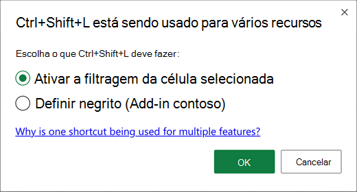
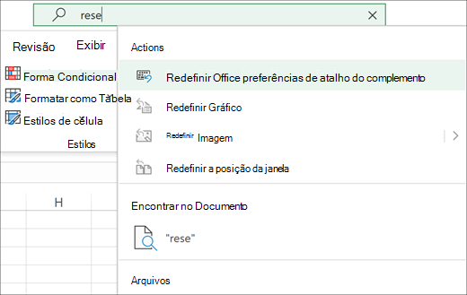

# <a name="add-custom-keyboard-shortcuts-to-your-office-add-ins"></a>Adicionar atalhos de teclado personalizados aos seus Office de usuário

Atalhos de teclado, também conhecidos como combinações de teclas, permitem que os usuários do seu complemento funcionem com mais eficiência. Atalhos de teclado também melhoram a acessibilidade do complemento para usuários com deficiências, fornecendo uma alternativa ao mouse.

[!include[Keyboard shortcut prerequisites](../includes/keyboard-shortcuts-prerequisites.md)]

> [!NOTE]
> Para começar com uma versão de trabalho de um add-in com atalhos de teclado já habilitados, clone e execute o exemplo Excel [Atalhos de Teclado.](https://github.com/OfficeDev/Office-Add-in-samples/tree/main/Samples/excel-keyboard-shortcuts) Quando você estiver pronto para adicionar atalhos de teclado ao seu próprio complemento, continue com este artigo.

Há três etapas para adicionar atalhos de teclado a um complemento.

1. [Configure o manifesto do complemento](#configure-the-manifest).
1. [Crie ou edite o arquivo JSON de atalhos](#create-or-edit-the-shortcuts-json-file) para definir ações e atalhos de teclado.
1. [Adicione uma ou mais chamadas de tempo de](#create-a-mapping-of-actions-to-their-functions) execução da API [Office.actions.associate](/javascript/api/office/office.actions#associate) para mapear uma função para cada ação.

## <a name="configure-the-manifest"></a>Configurar o manifesto

Há duas pequenas alterações no manifesto a fazer. Um deles é habilitar o add-in para usar um tempo de execução compartilhado e o outro é apontar para um arquivo formatado JSON onde você definiu os atalhos do teclado.

### <a name="configure-the-add-in-to-use-a-shared-runtime"></a>Configurar o add-in para usar um tempo de execução compartilhado

A adição de atalhos personalizados de teclado exige que o seu complemento use o tempo de execução compartilhado. Para obter mais informações, [Configure an add-in to use a shared runtime](../develop/configure-your-add-in-to-use-a-shared-runtime.md).

### <a name="link-the-mapping-file-to-the-manifest"></a>Vincular o arquivo de mapeamento ao manifesto

Imediatamente *abaixo* (não dentro) `<VersionOverrides>` do elemento no manifesto, adicione um elemento [ExtendedOverrides.](../reference/manifest/extendedoverrides.md) De definir o atributo como a URL completa de um arquivo JSON em `Url` seu projeto que você criará em uma etapa posterior.

```xml
    ...
    </VersionOverrides>  
    <ExtendedOverrides Url="https://contoso.com/addin/shortcuts.json"></ExtendedOverrides>
</OfficeApp>
```

## <a name="create-or-edit-the-shortcuts-json-file"></a>Criar ou editar o arquivo JSON de atalhos

Crie um arquivo JSON em seu projeto. Certifique-se de que o caminho do arquivo corresponde ao local especificado para o `Url` atributo do [elemento ExtendedOverrides.](../reference/manifest/extendedoverrides.md) Este arquivo descreverá seus atalhos de teclado e as ações que eles invocarão.

1. Dentro do arquivo JSON, há duas matrizes. A matriz de ações conterá objetos que definem as ações a serem invocadas e a matriz de atalhos conterá objetos que mapeiam combinações de teclas em ações. Veja um exemplo.
    ```json
    {
        "actions": [
            {
                "id": "SHOWTASKPANE",
                "type": "ExecuteFunction",
                "name": "Show task pane for add-in"
            },
            {
                "id": "HIDETASKPANE",
                "type": "ExecuteFunction",
                "name": "Hide task pane for add-in"
            }
        ],
        "shortcuts": [
            {
                "action": "SHOWTASKPANE",
                "key": {
                    "default": "Ctrl+Alt+Up"
                }
            },
            {
                "action": "HIDETASKPANE",
                "key": {
                    "default": "Ctrl+Alt+Down"
                }
            }
        ]
    }
    ```

    Para obter mais informações sobre os objetos JSON, consulte [Construct the action objects](#construct-the-action-objects) and Construct the shortcut [objects](#construct-the-shortcut-objects). O esquema completo dos atalhos JSON está em [extended-manifest.schema.json](https://developer.microsoft.com/json-schemas/office-js/extended-manifest.schema.json).

    > [!NOTE]
    > Você pode usar "CONTROL" no lugar de "Ctrl" ao longo deste artigo.

    Em uma etapa posterior, as ações serão mapeadas para as funções que você escrever. Neste exemplo, mais tarde você mapeará SHOWTASKPANE para uma função que chama o método e `Office.addin.showAsTaskpane` HIDETASKPANE para uma função que chama o `Office.addin.hide` método.

## <a name="create-a-mapping-of-actions-to-their-functions"></a>Criar um mapeamento de ações para suas funções

1. Em seu projeto, abra o arquivo JavaScript carregado pela sua página HTML no `<FunctionFile>` elemento.
1. No arquivo JavaScript, use a API [Office.actions.associate](/javascript/api/office/office.actions#associate) para mapear cada ação especificada no arquivo JSON para uma função JavaScript. Adicione o JavaScript a seguir ao arquivo. Observe o seguinte sobre o código.

    - O primeiro parâmetro é uma das ações do arquivo JSON.
    - O segundo parâmetro é a função que é executado quando um usuário pressiona a combinação de teclas mapeada para a ação no arquivo JSON.

    ```javascript
    Office.actions.associate('-- action ID goes here--', function () {

    });
    ```

1. Para continuar o exemplo, use `'SHOWTASKPANE'` como o primeiro parâmetro.
1. Para o corpo da função, use o método [Office.addin.showAsTaskpane](/javascript/api/office/office.addin#showAsTaskpane__) para abrir o painel de tarefas do complemento. Quando terminar, o código deverá ter a seguinte aparência:

    ```javascript
    Office.actions.associate('SHOWTASKPANE', function () {
        return Office.addin.showAsTaskpane()
            .then(function () {
                return;
            })
            .catch(function (error) {
                return error.code;
            });
    });
    ```

1. Adicione uma segunda chamada de função para mapear a ação para uma função que `Office.actions.associate` `HIDETASKPANE` chama [Office.addin.hide](/javascript/api/office/office.addin#hide__). Apresentamos um exemplo a seguir.

    ```javascript
    Office.actions.associate('HIDETASKPANE', function () {
        return Office.addin.hide()
            .then(function () {
                return;
            })
            .catch(function (error) {
                return error.code;
            });
    });
    ```

Seguindo as etapas anteriores, o seu add-in alterna a visibilidade do painel de tarefas pressionando **Ctrl+Alt+Up** e **Ctrl+Alt+Down.** O mesmo comportamento é mostrado no exemplo Excel [atalhos](https://github.com/OfficeDev/Office-Add-in-samples/tree/main/Samples/excel-keyboard-shortcuts) de teclado no Office PnP de GitHub.

## <a name="details-and-restrictions"></a>Detalhes e restrições

### <a name="construct-the-action-objects"></a>Construir os objetos de ação

Use as diretrizes a seguir ao especificar os objetos na `actions` matriz do shortcuts.json.

- Os nomes das `id` propriedades e `name` são obrigatórios.
- A `id` propriedade é usada para identificar exclusivamente a ação a ser invocada usando um atalho de teclado.
- A `name` propriedade deve ser uma cadeia de caracteres amigável que descreve a ação. Deve ser uma combinação dos caracteres A - Z, a - z, 0 - 9 e as marcas de pontuação "-", "_" e "+".
- A propriedade do `type` é opcional. Atualmente, apenas `ExecuteFunction` o tipo é suportado.

Apresentamos um exemplo a seguir.

```json
    "actions": [
        {
            "id": "SHOWTASKPANE",
            "type": "ExecuteFunction",
            "name": "Show task pane for add-in"
        },
        {
            "id": "HIDETASKPANE",
            "type": "ExecuteFunction",
            "name": "Hide task pane for add-in"
        }
    ]
```

O esquema completo dos atalhos JSON está em [extended-manifest.schema.json](https://developer.microsoft.com/json-schemas/office-js/extended-manifest.schema.json).

### <a name="construct-the-shortcut-objects"></a>Construir os objetos de atalho

Use as diretrizes a seguir ao especificar os objetos na `shortcuts` matriz do shortcuts.json.

- Os nomes de `action` propriedade , e são `key` `default` obrigatórios.
- O valor da propriedade é uma cadeia de caracteres e deve corresponder a uma das `action` `id` propriedades no objeto action.
- A propriedade pode ser qualquer combinação dos caracteres A - Z, a -z, 0 - 9 e as marcas de pontuação `default` "-", "_" e "+". (Por convenção, letras de maiúsculas e baixos não são usadas nessas propriedades.)
- A propriedade deve conter o nome de pelo menos uma chave `default` modificadora (Alt, Ctrl, Shift) e apenas uma outra chave.
- Shift não pode ser usado como a única chave modificadora. Combine Shift com Alt ou Ctrl.
- Para Macs, também há suporte para a chave do modificador de comando.
- Para Macs, Alt é mapeado para a tecla Option. Para Windows, Command é mapeado para a tecla Ctrl.
- Quando dois caracteres são vinculados à mesma chave física em um teclado padrão, eles são sinônimos na propriedade; por exemplo, Alt+a e Alt+A são o mesmo atalho, assim como `default` Ctrl+- e Ctrl+ porque "-" e "_" são a mesma chave \_ física.
- O caractere "+" indica que as teclas de cada lado são pressionadas simultaneamente.

Apresentamos um exemplo a seguir.

```json
    "shortcuts": [
        {
            "action": "SHOWTASKPANE",
            "key": {
                "default": "Ctrl+Alt+Up"
            }
        },
        {
            "action": "HIDETASKPANE",
            "key": {
                "default": "Ctrl+Alt+Down"
            }
        }
    ]
```

O esquema completo dos atalhos JSON está em [extended-manifest.schema.json](https://developer.microsoft.com/json-schemas/office-js/extended-manifest.schema.json).

> [!NOTE]
> As Dicas de Chave, também conhecidas como atalhos de chave sequencial, como o atalho Excel para escolher uma cor de preenchimento **Alt+H, H**, não são suportadas em Office Add-ins.

## <a name="avoid-key-combinations-in-use-by-other-add-ins"></a>Evitar combinações de teclas em uso por outros complementos

Há muitos atalhos de teclado que já estão em uso por Office. Evite registrar atalhos de teclado para o seu add-in que já estão em uso, no entanto, pode haver algumas instâncias em que é necessário substituir atalhos de teclado existentes ou lidar com conflitos entre vários complementos que registraram o mesmo atalho de teclado.

No caso de um conflito, o usuário verá uma caixa de diálogo na primeira vez que tentar usar um atalho de teclado conflitante. Observe que o texto da opção de complemento exibida nesta caixa de diálogo vem da propriedade no objeto `name` action no `shortcuts.json` arquivo.



O usuário pode selecionar qual ação o atalho do teclado tomará. Depois de fazer a seleção, a preferência é salva para usos futuros do mesmo atalho. As preferências de atalho são salvas por usuário, por plataforma. Se o usuário desejar alterar suas preferências, poderá invocar o comando Redefinir Office preferências de atalho de **Complementos** da caixa de pesquisa Diga-me.  Invocar o comando limpa todas as preferências de atalho do complemento do usuário e o usuário será novamente solicitado com a caixa de diálogo conflito na próxima vez que tentar usar um atalho conflitante.



Para a melhor experiência do usuário, recomendamos que você minimize os conflitos com Excel com essas boas práticas.

- Use apenas atalhos de teclado com o seguinte padrão: **Ctrl+Shift+Alt+* x***, onde *x* é alguma outra chave.
- Se você precisar de mais atalhos de teclado, verifique a lista de [atalhos](https://support.microsoft.com/office/1798d9d5-842a-42b8-9c99-9b7213f0040f)Excel teclado e evite usar qualquer um deles no seu complemento.
- Quando o foco do teclado estiver dentro da interface do usuário do complemento, **Ctrl+Spacebar** e **Ctrl+Shift+F10** não funcionarão, pois são atalhos de acessibilidade essenciais.
- Em um computador Windows ou Mac, se o comando "Redefinir preferências de atalho de complementos do Office" não estiver disponível no menu de pesquisa, o usuário poderá adicionar manualmente o comando à faixa de opções personalização da faixa de opções por meio do menu de contexto.

## <a name="customize-the-keyboard-shortcuts-per-platform"></a>Personalizar os atalhos de teclado por plataforma

É possível personalizar atalhos para serem específicos da plataforma. Veja a seguir um exemplo do objeto que personaliza os atalhos para cada uma das seguintes `shortcuts` plataformas: `windows` , `mac` , `web` . Observe que você ainda deve ter uma tecla `default` de atalho para cada atalho.

No exemplo a seguir, a chave é a chave `default` de fallback para qualquer plataforma que não seja especificada. A única plataforma não especificada é Windows, portanto, a `default` chave só se aplicará a Windows.

```json
    "shortcuts": [
        {
            "action": "SHOWTASKPANE",
            "key": {
                "default": "Ctrl+Alt+Up",
                "mac": "Command+Shift+Up",
                "web": "Ctrl+Alt+1",
            }
        },
        {
            "action": "HIDETASKPANE",
            "key": {
                "default": "Ctrl+Alt+Down",
                "mac": "Command+Shift+Down",
                "web": "Ctrl+Alt+2"
            }
        }
    ]
```

## <a name="localize-the-keyboard-shortcuts-json"></a>Localize os atalhos de teclado JSON

Se o seu add-in dá suporte a várias localidades, você precisará localizar a `name` propriedade dos objetos de ação. Além disso, se qualquer uma das localidades com suporte para o complemento tiver alfabetos ou sistemas de escrita diferentes e, portanto, teclados diferentes, talvez seja necessário localizar os atalhos também. Para obter informações sobre como localizar os atalhos de teclado JSON, consulte [Localize extended overrides](../develop/localization.md#localize-extended-overrides).

## <a name="browser-shortcuts-that-cannot-be-overridden"></a>Atalhos do navegador que não podem ser substituídos

Ao usar atalhos de teclado personalizados na Web, alguns atalhos de teclado usados pelo navegador não podem ser substituídos por complementos. Esta lista é um trabalho em andamento. Se você descobrir outras combinações que não podem ser substituidas, nos avise usando a ferramenta de comentários na parte inferior desta página.

- Ctrl+N
- Ctrl+Shift+N
- Ctrl+T
- Ctrl+Shift+T
- Ctrl+W
- Ctrl+PgUp/PgDn

## <a name="enable-custom-keyboard-shortcuts-for-specific-users-preview"></a>Habilitar atalhos de teclado personalizados para usuários específicos (visualização)

O seu complemento pode permitir que os usuários reatribuam as ações do add-in para combinações de teclado alternativos.

> [!IMPORTANT]
> Os recursos descritos nesta seção estão atualmente em visualização e sujeitos a alterações. No momento, eles não têm suporte para utilização em ambientes de produção. Para experimentar os recursos de visualização, você precisará ingressar [no programa Office Insider.](https://insider.office.com/join)
> Uma boa maneira de experimentar os recursos de pré-visualização é usando uma assinatura do Microsoft 365. Se você ainda não tem uma assinatura do Microsoft 365, pode obter uma ingressando no[ programa de desenvolvedor do Microsoft 365](https://developer.microsoft.com/office/dev-program).

> [!NOTE]
> As APIs descritas nesta seção exigem o conjunto de [requisitos KeyboardShortcuts 1.1.](../reference/requirement-sets/keyboard-shortcuts-requirement-sets.md)

Use o [método Office.actions.replaceShortcuts](/javascript/api/office/office.actions#replaceShortcuts) para atribuir combinações de teclado personalizadas de um usuário às ações de seus complementos. O método assume um parâmetro de tipo , onde os s são um subconjunto das IDs de ação que devem ser definidas no manifesto estendido JSON do `{[actionId:string]: string|null}` `actionId` complemento. Os valores são as combinações de teclas preferidas do usuário. O valor também pode ser , que removerá qualquer personalização para isso e reverterá para a combinação de teclado padrão definida no manifesto estendido JSON do `null` `actionId` complemento.

Se o usuário estiver conectado Office, as combinações personalizadas serão salvas nas configurações de roaming do usuário por plataforma. No momento, a personalização de atalhos não é suportada para usuários anônimos.

```javascript
const userCustomShortcuts = {
    SHOWTASKPANE:"CTRL+SHIFT+1", 
    HIDETASKPANE:"CTRL+SHIFT+2"
};
Office.actions.replaceShortcuts(userCustomShortcuts)
    .then(function () {
        console.log("Successfully registered.");
    })
    .catch(function (ex) {
        if (ex.code == "InvalidOperation") {
            console.log("ActionId does not exist or shortcut combination is invalid.");
        }
    });
```

Para descobrir quais atalhos já estão em uso para o usuário, chame o método [Office.actions.getShortcuts.](/javascript/api/office/office.actions#getShortcuts) Este método retorna um objeto do tipo , onde os valores representam a combinação de teclado atual que o usuário deve usar para invocar `[actionId:string]:string|null}` a ação especificada. Os valores podem vir de três fontes diferentes:

- Se houve um conflito com o atalho e o usuário optou por usar uma ação diferente (nativa ou outro complemento) para essa combinação de teclado, o valor retornado será já que o atalho foi substituído e não há nenhuma combinação de teclado que o usuário possa usar no momento para invocar essa ação de `null` add-in.
- Se o atalho tiver sido personalizado usando o método [Office.actions.replaceShortcuts,](/javascript/api/office/office.actions#replaceShortcuts) o valor retornado será a combinação de teclado personalizada.
- Se o atalho não tiver sido substituído ou personalizado, ele retornará o valor do manifesto estendido JSON do complemento.

Apresentamos um exemplo a seguir.

```javascript
Office.actions.getShortcuts()
    .then(function (userShortcuts) {
       for (const action in userShortcuts) {
           let shortcut = userShortcuts[action];
           console.log(action + ": " + shortcut);
       }
    });

```

Conforme descrito em [Evitar combinações de teclas](#avoid-key-combinations-in-use-by-other-add-ins)em uso por outros complementos, é uma boa prática evitar conflitos em atalhos. Para descobrir se uma ou mais combinações de teclas já estão em uso passá-las como uma matriz de cadeias de caracteres para o método [Office.actions.areShortcutsInUse.](/javascript/api/office/office.actions#areShortcutsInUse) O método retorna um relatório contendo combinações de chaves que já estão em uso na forma de uma matriz de objetos do tipo `{shortcut: string, inUse: boolean}` . A `shortcut` propriedade é uma combinação de teclas, como "CTRL+SHIFT+1". Se a combinação já estiver registrada em outra ação, `inUse` a propriedade será definida como `true` . Por exemplo, `[{shortcut: "CTRL+SHIFT+1", inUse: true}, {shortcut: "CTRL+SHIFT+2", inUse: false}]`. O seguinte trecho de código é um exemplo:

```javascript
const shortcuts = ["CTRL+SHIFT+1", "CTRL+SHIFT+2"];
Office.actions.areShortcutsInUse(shortcuts)
    .then(function (inUseArray) {
        const availableShortcuts = inUseArray.filter(function (shortcut) { return !shortcut.inUse; });
        console.log(availableShortcuts);
        const usedShortcuts = inUseArray.filter(function (shortcut) { return shortcut.inUse; });
        console.log(usedShortcuts);
    });

```

## <a name="next-steps"></a>Próximas etapas

- Consulte o [Excel de exemplo de atalhos](https://github.com/OfficeDev/Office-Add-in-samples/tree/main/Samples/excel-keyboard-shortcuts) de teclado.
- Obter uma visão geral de como trabalhar com substituições estendidas em [Trabalho com substituições estendidas do manifesto](../develop/extended-overrides.md).
