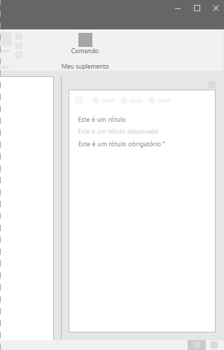

# Componente Label no Office UI Fabric

Use rótulos para nomear ou dar título a um componente ou grupo de componentes. Quando combinados a outro componente ou grupo de componentes, os rótulos devem estar perto dos componentes ou grupos relacionados. Alguns componentes têm rótulos predefinidos, como uma lista suspensa ou um botão de alternância.
  
#### Exemplo: Rótulo em um painel de tarefas

 

 

## Práticas recomendadas

|**Faça**|**Não faça**|
|:------------|:--------------|
|Use a primeira letra da sentença em maiúscula, por exemplo, **Nome**.|Não use a capitalização de título, por exemplo, **Nome**.|
|Seja curto e conciso.|Não use frases inteiras ou pontuação complexa, como vírgulas ou ponto e vírgula.|
|Ao adicionar um rótulo a componentes, use um substantivo ou uma frase curta, como o texto do rótulo.| |

## Variantes

|**Variação**|**Descrição**|**Exemplo**|
|:------------|:--------------|:----------|
|**Rótulo padrão**|Use para rótulos padrão.| |
|**Rótulo desabilitado**|Use quando o componente relacionado for desabilitado.| |
|**Rótulo obrigatório**|Use quando o componente relacionado for necessário.| |

## Implementação

Para obter detalhes, confira [Rótulo](https://dev.office.com/fabric#/components/label) e [Introdução com exemplo de código do Fabric React](https://github.com/OfficeDev/Word-Add-in-GettingStartedFabricReact).

## Recursos adicionais

- [Padrões de design da experiência do usuário](https://github.com/OfficeDev/Office-Add-in-UX-Design-Patterns-Code)

- [Office UI Fabric em Suplementos do Office](office-ui-fabric.md)
