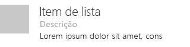
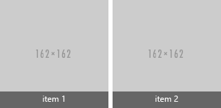

# Componente List no Office UI Fabric

As listas fornecem um layout consistente ao interagir com grandes coleções de conteúdo, mesmo quando o conteúdo tem muito texto. As listas permitem que os usuários verifiquem facilmente o conteúdo. 
  
#### Exemplo: Lista em um painel de tarefas

## Práticas recomendadas

- Termine cada entrada em uma lista com um ponto se:
  - Todas as entradas são frases completas.
  - Uma ou mais das entradas contiver um fragmento e uma frase completa que ofereça informações adicionais.
  - Todas as entradas completarem a frase ou fragmento introdutório.
- Listas consecutivas separadas em uma página com títulos.

## Variantes

|**Variação**|**Descrição**|**Exemplo**|
|:------------|:--------------|:----------|
|**Lista de grade**|Use quando forem necessárias informações detalhadas com cada item de lista.| |
|**Lista de itens de altura variável**|Use quando forem necessários imagens e texto grandes.| |

## Implementação

Confira mais detalhes em [List](https://dev.office.com/fabric#/components/list) e [Introdução com exemplo de código do Fabric React](https://github.com/OfficeDev/Word-Add-in-GettingStartedFabricReact).

## Veja também

- [Padrões de design da experiência do usuário](https://github.com/OfficeDev/Office-Add-in-UX-Design-Patterns-Code)
- [Office UI Fabric em Suplementos do Office](office-ui-fabric.md)
