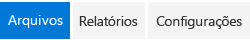

# Componente dinâmico no Office UI Fabric

Os dinâmicos oferecem uma navegação rápida para conteúdo acessado com frequência. Os dinâmicos permitem a navegação entre duas ou mais exibições de conteúdo. Os cabeçalhos de texto especificam qual conteúdo está em cada seção da tabela. O conteúdo de cada seção da tabela pode pertencer a diferentes categorias de conteúdo. Nos suplementos do Office, use guias nos controles de dinâmicos. As guias podem usar uma combinação de ícones e texto para comunicar o tipo de conteúdo que elas possuem. 

#### Exemplo: Dinâmico em um painel de tarefas

 

 

## Práticas recomendadas

|**Faça**|**Não faça**|
|:------------|:--------------|
|Os rótulos de navegação devem ser concisos, de preferência com apenas uma ou duas palavras em vez de uma frase.|Não use frases inteiras ou pontuação complexa, como vírgulas ou ponto e vírgula.|
|Persista cabeçalhos de tabela dinâmica na tela, mesmo se outra guia estiver selecionada.| |
|Use de três a cinco guias nos controles de tabela dinâmica.| |
|Use dinâmicos como elementos de navegação perto da parte superior da página. Não misture dinâmicos ao conteúdo de página.| |
|Use dinâmicos em páginas com grande quantidade de conteúdo que exijam muita rolagem.| |

## Variantes

|**Variação**|**Descrição**|**Exemplo**|
|:------------|:--------------|:----------|
|**Exemplo básico**|Use como a opção padrão de tabela dinâmica.| |
|**Links no estilo de guia**|Use quando botões de tabela dinâmica em estilo de guia forem preferenciais.| |

## Implementação

Para saber mais, confira [Pivot](https://dev.office.com/fabric#/components/pivot) e [Primeiros passos com exemplo de código do Fabric React](https://github.com/OfficeDev/Word-Add-in-GettingStartedFabricReact).

## Recursos adicionais

- [Padrões de design da experiência do usuário](https://github.com/OfficeDev/Office-Add-in-UX-Design-Patterns-Code)

- [Office UI Fabric em Suplementos do Office](office-ui-fabric.md)
