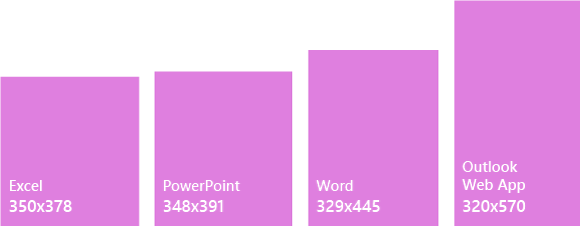

# Painéis de tarefas nos Suplementos do Office
 
Painéis de tarefas são superfícies de interface que normalmente são exibidas no lado direito da janela no Word, PowerPoint, Excel e Outlook. As painéis de tarefa concedem aos usuários acesso a controles de interface que executam códigos para modificar documentos ou emails ou exibir dados de uma fonte de dados. Use painéis de tarefa quando não precisar inserir a funcionalidade diretamente no documento.

*Figura 1. Layout típico do painel de tarefa*

## Práticas recomendadas

|**Faça**|**Não faça**|
|:-----|:--------|
|<ul><li>Inclua o nome do seu suplemento no título.</li></ul>|<ul><li>Não adicione o nome da sua empresa ao título.</li></ul>|
|<ul><li>Use nomes descritivos curtos no título.</li></ul>|<ul><li>Não acrescente cadeias de caracteres como "suplemento", "para Word" ou "para Office" no título do suplemento.</li></ul>|
|<ul><li>Inclua alguns elementos de navegação ou comando, como CommandBar ou Pivot, na parte superior do suplemento.</li></ul>||
|<ul><li>Inclua um elemento da marca, como BrandBar, na parte inferior do suplemento, a menos que seu suplemento seja voltado para uso no Outlook.</li></ul>||

## Variantes

As imagens a seguir mostram vários tamanhos de painel de tarefas com a faixa de opções do Office em uma resolução de 1366 x 768. No Excel, é necessário um espaço vertical adicional para acomodar a barra de fórmulas.  

*Figura 2. Tamanhos de painel de tarefas da área de trabalho do Office 2016*

- Excel – 320 x 455
- PowerPoint – 320 x 531
- Word – 320 x 531
- Outlook – 348 x 535

 

*Figura 3. Tamanhos de painel de tarefas do Office 365*

- Excel – 350 x 378
- PowerPoint – 348 x 391
- Word – 329 x 445
- Outlook Web App – 320 x 570

## Menu de personalidade

Menus de personalidade podem obstruir elementos de navegação e comando localizados perto da parte superior direita do suplemento. Veja a seguir as dimensões atuais do menu personalidade no Windows e Mac.

No Windows, o menu de personalidade mede 12 x 32 pixels, conforme mostrado.

*Figura 4. Menu de personalidade no Windows*

No Mac, no menu de personalidade mede 26 x 26 pixels, mas flutua 8 pixels a partir da direita e 6 pixels a partir do topo, o que aumenta o espaço para 34 x 32 pixels, como mostrado.

*Figura 5. Menu de personalidade no Mac*

## Implementação

Para ver uma amostra que implementa um painel de tarefas, confira [Suplemento do Excel JS Tendências de Despesas do WoodGrove](https://github.com/OfficeDev/Excel-Add-in-WoodGrove-Expense-Trends) no GitHub. 

## Confira também

- [Office UI Fabric em Suplementos do Office](office-ui-fabric.md) 
- [Padrões de design da experiência do usuário para suplementos do Office](../design/ux-design-pattern-templates.md)

