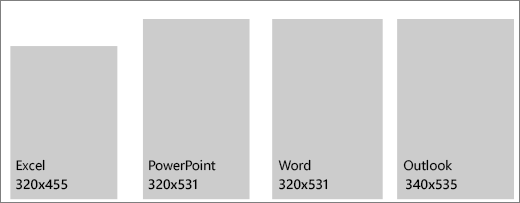

# Painéis de tarefas nos Suplementos do OfficeTask panes in Office Add-ins

Painéis de tarefas são superfícies de interface que normalmente são exibidas no lado direito da janela no Word, PowerPoint, Excel e Outlook. As painéis de tarefa concedem aos usuários acesso a controles de interface que executam códigos para modificar documentos ou emails ou exibir dados de uma fonte de dados. Use painéis de tarefa quando não precisar inserir a funcionalidade diretamente no documento.Task panes are interface surfaces that typically appear on the right side of the window within Word, PowerPoint, Excel, and Outlook. Task panes give users access to interface controls that run code to modify documents or emails, or display data from a data source. Use task panes when you don't need to embed functionality directly into the document.

*Figura 1. Layout típico do painel de tarefa**Figure 1. Typical task pane layout*

## Práticas recomendadasBest practices

|FazerDo|Não fazerDon't|
|:-----|:--------|
|<ul><li>Inclua o nome do seu suplemento no título.Include the name of your add-in in the title.</li></ul>|<ul><li>Não adicione o nome da sua empresa ao título.Don't append your company name to the title.</li></ul>|
|<ul><li>Use nomes descritivos curtos no título.Use short descriptive names in the title.</li></ul>|<ul><li>Não adicione cadeias de caracteres como "add-in", "for Word" ou "for Office" ao título do seu complemento.Don't append strings such as "add-in," "for Word," or "for Office" to the title of your add-in.</li></ul>|
|<ul><li>Inclua alguns elementos de navegação ou comando, como CommandBar ou Pivot, na parte superior do suplemento.Include some navigational or commanding element such as the CommandBar or Pivot at the top of your add-in.</li></ul>||
|<ul><li>Inclua um elemento da marca, como BrandBar, na parte inferior do suplemento, a menos que seu suplemento seja voltado para uso no Outlook.Include a branding element such as the BrandBar at the bottom of your add-in unless your add-in is to be used within Outlook.</li></ul>||

## VariantesVariants

As imagens a seguir mostram os vários tamanhos do painel de tarefas com Aplicativo do Office faixa de opções em uma resolução de 1366x768.The following images show the various task pane sizes with the Office app ribbon at a 1366x768 resolution. No Excel, é necessário um espaço vertical adicional para acomodar a barra de fórmulas.For Excel, additional vertical space is required to accommodate the formula bar.  

*Figura 2. Tamanhos de painel de tarefas da área de trabalho do Office 2016**Figure 2. Office 2016 desktop task pane sizes*

- Excel - 320 x 455 pixelsExcel - 320x455 pixels
- PowerPoint - 320 x 531 pixelsPowerPoint - 320x531 pixels
- Word - 320x531 pixelsWord - 320x531 pixels
- Outlook - 348 x 535 pixelsOutlook - 348x535 pixels

 

*Figura 3. Office tamanhos do painel de tarefas**Figure 3. Office task pane sizes*

- Excel - 350 x 378 pixelsExcel - 350x378 pixels
- PowerPoint - 348 x 391 pixelsPowerPoint - 348x391 pixels
- Word - 329x445 pixelsWord - 329x445 pixels
- Outlook (na Web) - 320x570 pixelsOutlook (on the web) - 320x570 pixels

## Menu de personalidadePersonality menu

Menus de personalidade podem obstruir elementos de navegação e comando localizados perto da parte superior direita do suplemento. Veja a seguir as dimensões atuais do menu personalidade no Windows e Mac.Personality menus can obstruct navigational and commanding elements located near the top right of the add-in. The following are the current dimensions of the personality menu on Windows and Mac.

No Windows, o menu de personalidade mede 12 x 32 pixels, conforme mostrado.For Windows, the personality menu measures 12x32 pixels, as shown.

*Figura 4. Menu de personalidade no Windows**Figure 4. Personality menu on Windows*

No Mac, no menu de personalidade mede 26 x 26 pixels, mas flutua 8 pixels a partir da direita e 6 pixels a partir do topo, o que aumenta o espaço para 34 x 32 pixels, como mostrado.For Mac, the personality menu measures 26x26 pixels, but floats 8 pixels in from the right and 6 pixels from the top, which increases the space to 34x32 pixels, as shown.

*Figura 5. Menu de personalidade no Mac**Figure 5. Personality menu on Mac*

## ImplementaçãoImplementation

Para ver uma amostra que implementa um painel de tarefas, confira [Suplemento do Excel JS Tendências de Despesas do WoodGrove](https://github.com/OfficeDev/Excel-Add-in-WoodGrove-Expense-Trends) no GitHub.For a sample that implements a task pane, see [Excel Add-in JS WoodGrove Expense Trends](https://github.com/OfficeDev/Excel-Add-in-WoodGrove-Expense-Trends) on GitHub.

## Confira tambémSee also

- [Fabric Core em Office de complementosFabric Core in Office Add-ins](fabric-core.md)
- [Padrões de design da experiência do usuário para suplementos do OfficeUX design patterns for Office Add-ins](../design/ux-design-pattern-templates.md)
