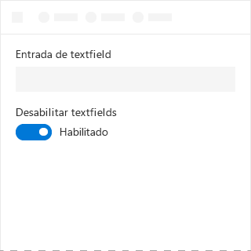
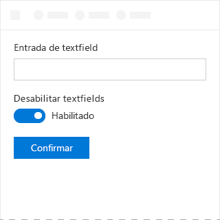

# Componente de alternância no Office UI Fabric

As alternâncias representam uma opção física para ativar ou desativar recursos. Use alternâncias para apresentar duas opções mutuamente exclusivas (por exemplo, ativar ou desativar), em que a escolha de uma opção resulta em uma ação imediata.
  
#### Exemplo: alternância em um painel de tarefas

## Práticas recomendadas

|**Faça**|**Não faça**|
|:------------|:--------------|
|Use alternâncias para configurações binárias quando as alterações são imediatamente aplicadas.   |Não use alternâncias se os usuários tiverem que executar uma etapa adicional antes que as alterações entrem em vigor.   |
|Somente substitua os rótulos **Ativar** e **Desativar** se houver rótulos mais específicos a serem usados para uma configuração. Use rótulos curtos (três a quatro caracteres) que representem opostos binários.| |

## Variantes

|**Variação**|**Descrição**|**Exemplo**|
|:------------|:--------------|:----------|
|**Ativado e marcado**|Use quando o estado de alternância estiver ativo.| |
|**Habilitado e desmarcado**|Use quando o estado de alternância estiver inativo.| |
|**Desabilitado e marcado**|Use quando o estado ativo não puder ser alterado.| |
|**Desabilitado e desmarcado**|Use quando o estado inativo não puder ser alterado.| |

## Implementação

Para saber mais, confira [Alternância](https://dev.office.com/fabric#/components/toggle) e [Primeiros passos com exemplo de código do Fabric React](https://github.com/OfficeDev/Word-Add-in-GettingStartedFabricReact).

## Veja também

- [Padrões de design da experiência do usuário](https://github.com/OfficeDev/Office-Add-in-UX-Design-Patterns-Code)
- [Office UI Fabric em Suplementos do Office](office-ui-fabric.md)
