# Parceiros de interação para Suplementos do Office

Os Suplementos do Office podem aprimorar as experiências de criação e a produtividade, bem como conectar conteúdo em aplicativos de host do Office para maiores fluxos de trabalho baseados na Web. Uma série de cenários comuns se aplicam ao conteúdo, painel de tarefas e suplementos do Outlook que você possa desenvolver. Este artigo descreve alguns dos cenários mais comuns e fornece padrões de interação recomendados para a experiência do usuário do suplemento. Você pode detalhar, combinar ou misturar e relacionar esses padrões de interação de acordo com seus cenários exclusivos.

 **Cenários comuns de suplemento**

| Tipo de suplemento | Cenários comuns |
| ------ | ------ |
|  Conteúdo  |  Visualização de dados   Widgets e ferramentas  |
|  Painel de tarefas  |  Transformar e processar dados   Criação de forma eficiente e eficaz   Localizar conteúdo e inserir dados   Publicar ou carregar conteúdo para um serviço Web  |
|  Outlook  |  Ponte entre o conteúdo de email e um aplicativo externo   Fornecer mais informações sobre o conteúdo em um compromisso ou uma mensagem de email   Fornecer informações que o ajudem a ser mais produtivo  |

## Visualizar dados com um suplemento de conteúdo

Este exemplo mostra um suplemento de conteúdo para Excel que gera um gráfico a partir dos dados em uma planilha.

Nesse padrão de interação, o suplemento não se torna ativo até que você selecione e vincule dados para gerar o gráfico. É importante comunicar a finalidade do suplemento e as etapas para ativá-lo no modo de exibição inicial do suplemento. 

**Suplemento de conteúdo para Excel que gera um gráfico a partir dos dados em uma planilha**
 

 
<ul><li>
Para reforçar que você deve executar uma ação antes de escolher o botão, exiba instruções juntamente com um botão desabilitado (A).
</li><li>
Depois que você selecionar um intervalo de células, o botão Criar Gráfico ficará ativo (B - C).
</li><li>
A visualização preenche o contêiner e substitui o modo de exibição anterior (D).
</li><li>
Exiba qualquer interface do usuário adicional na borda inferior do suplemento junto com um botão de configurações (engrenagem) para levá-lo a um modo de exibição em que você pode redefinir ou gerenciar o suplemento.
</li></ul>Mais adequado para:
<ul><li>
Suplementos que exigem que você selecione dados antes da ativação.
</li></ul>

## Transformar o conteúdo com um suplemento do painel de tarefas

Este exemplo mostra um suplemento do painel de tarefas que traduz o texto no seu documento para outro idioma.

Nesse padrão de interação, você deve primeiro selecionar o texto que deseja traduzir no documento.

**Suplemento do painel de tarefas que traduz o texto no seu documento para outro idioma**
 
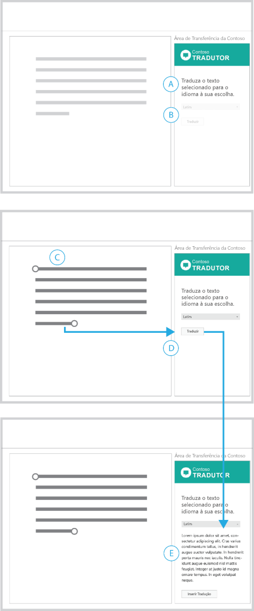
 
<ul><li>
Comunique a finalidade do suplemento em um título e mencione o fato de que primeiro você deve fazer uma seleção (A).
</li><li>
O menu de idioma e o botão Traduzir estão desabilitados, reforçando que você deve executar uma ação antes para poder continuar. Depois que você selecionar o conteúdo do documento, esses dois elementos ficarão ativos (D).
</li><li>
Depois de escolher Traduzir, a IU será aberta, mostrando o conteúdo traduzido, juntamente com um botão para inseri-lo novamente no documento (R).
</li><li>
Você pode fornecer um botão Limpar ou Redefinir que retorna à exibição inicial.
</li></ul>Mais adequado para:
<ul><li>
Suplementos que exigem que você selecione dados antes da ativação.
</li><li>
Interface do usuário que é aberta ou revelada à medida que você avança em um cenário.
</li></ul>

## Processar dados com um suplemento do painel de tarefas

Este exemplo mostra um suplemento do painel de tarefas que verifica os dados no Excel.

Nesse padrão de interação, você deve selecionar um intervalo de células na planilha para começar.

**Suplemento do painel de tarefas que verifica dados no Excel**
 

 
<ul><li>
A finalidade do suplemento é descrita no cabeçalho. Instruções ajudam você a começar.
</li><li>
O botão Enviar dados selecionados está desabilitado, reforçando que você deve executar uma ação para avançar (A).
</li><li>
Depois de selecionar um intervalo de células na planilha (B), o botão Enviar dados selecionados é ativado.
</li><li>
Depois de escolher esse botão, a IU é substituída pelo intervalo de células selecionado, uma barra de progresso e um botão Cancelar.
</li><li>
A barra de progresso comunica o status do processo e o botão Cancelar permite interrompê-lo (D).
</li><li>
Quando o processo é concluído, os resultados são exibidos automaticamente (R). Selecionar um elemento na lista ativará a célula correspondente na planilha.
</li></ul>Mais adequado para:
<ul><li>
Processos que levam um tempo indeterminado.
</li></ul>

## Analisar o conteúdo com um suplemento do painel de tarefas

Este exemplo mostra um suplemento do painel de tarefas que exibe definições de palavras conforme você digita.

Nesse padrão de interação, você deve primeiro selecionar o texto no documento para ver os resultados.

**Suplemento do painel de tarefas que exibe definições de palavras conforme você digita**
 

 
<ul><li>
Um título explica a finalidade do suplemento e como começar (A).
</li><li>
A pesquisa automática é habilitada por padrão, com a opção para desabilitá-la (B).
</li><li>
Depois que você faz uma seleção, o suplemento exibe o conteúdo correspondente (D).
</li><li>
Fornecer um link para exibir mais informações (E).
</li></ul>Mais adequado para:
<ul><li>
Suplementos que retornam automaticamente o conteúdo à medida que você cria.
</li><li>
Suplementos que exigem que você selecione conteúdo antes da ativação.
</li></ul>

## Localizar o conteúdo com um suplemento do painel de tarefas

Este exemplo mostra um suplemento do painel de tarefas para a pesquisa de conteúdo.

Nesse padrão de interação, você insere uma cadeia de caracteres na caixa de pesquisa ou seleciona de uma lista de conteúdos em destaque para começar.

**Suplemento do painel de tarefas para pesquisar conteúdo**
 
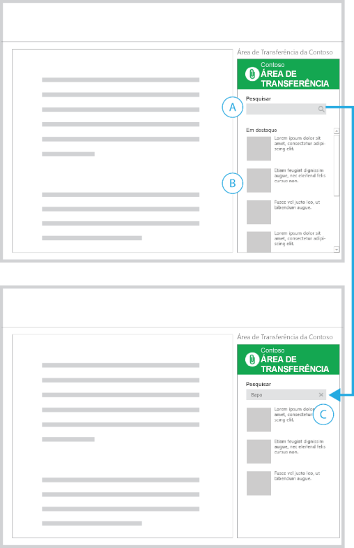
 
<ul><li>
A exibição inicial contém a caixa Pesquisar (A) e uma lista de conteúdo em destaque (B).
</li><li>
Quando você insere uma cadeia de caracteres na caixa de pesquisa, o ícone de pesquisa é substituído por um ícone fechar (C).
</li><li>
A escolha do ícone fechar o leva de volta ao modo de exibição inicial.
</li></ul>Mais adequado para:
<ul><li>
Suplementos que retornam automaticamente o conteúdo à medida que você cria.
</li><li>
Suplementos que exigem que você selecione conteúdo antes da ativação.
</li></ul>

## Inserir mídia com um suplemento do painel de tarefas

Nesse padrão de interação, é possível selecionar uma imagem dos resultados da pesquisa para inserir em seu documento.

**Suplemento do painel de tarefas para inserir uma imagem**
 
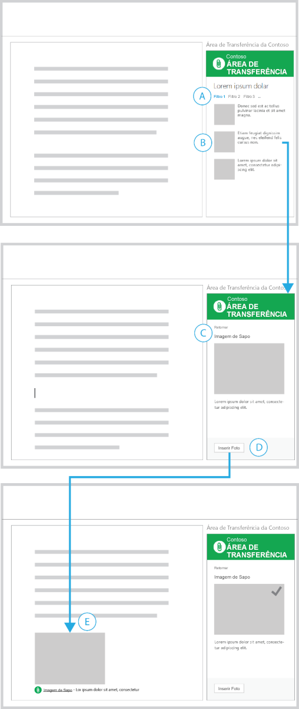
 
<ul><li>
Você filtrou uma lista de retornos de pesquisa (A) e selecionou o conteúdo a ser inserido (B).
</li><li>
Um modo de exibição Detalhes do conteúdo selecionado é exibido (C) com um botão que o leva de volta à lista.
</li><li>
Um botão Inserir Foto está localizado no rodapé (D). Depois que você escolhe esse botão, a imagem é inserida no documento.
</li><li>
Uma breve descrição de onde veio a imagem é incluída no conteúdo inserido (R). 
</li><li>
A interface do usuário no suplemento confirma visualmente o êxito da ação.
</li></ul>Mais adequado para:
<ul><li>
Suplementos para inserir conteúdo.
</li></ul>

## Inserir o texto selecionado com um suplemento do painel de tarefas

Neste padrão de interação, você seleciona um texto dos resultados da pesquisa para inserir no documento.

**Suplemento do painel de tarefas para inserir um texto**
 
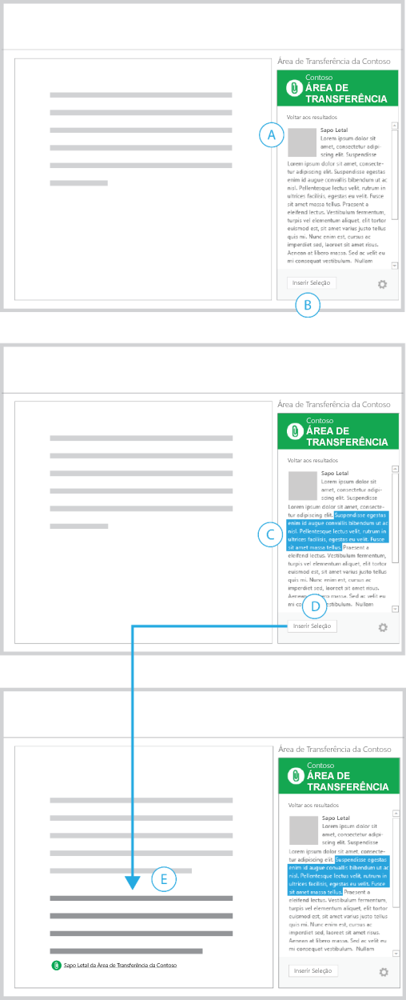
 
<ul><li>
Você já localizou uma parte do conteúdo (A).
</li><li>
Um botão Inserir Seleção desabilitado é exibido no rodapé (B).
</li><li>
Quando você seleciona uma cadeia de caracteres de texto (C), o botão Inserir Seleção fica ativo.
</li><li>
Depois que você escolhe esse botão, o suplemento insere o texto selecionado no documento, com uma referência para a fonte do conteúdo (R).
</li></ul>Mais adequado para:
<ul><li>
Suplementos para realizar pesquisas e inserir conteúdo.
</li></ul>

## Publicar em um serviço Web com um suplemento do painel de tarefas

Este exemplo mostra um suplemento do painel de tarefas para publicar um documento como postagem de blog.

Nesse padrão de interação, você concluiu a gravação do conteúdo em um documento e deseja postá-lo no seu blog.

**Suplemento do painel de tarefas para publicar um documento como uma postagem de blog**
 
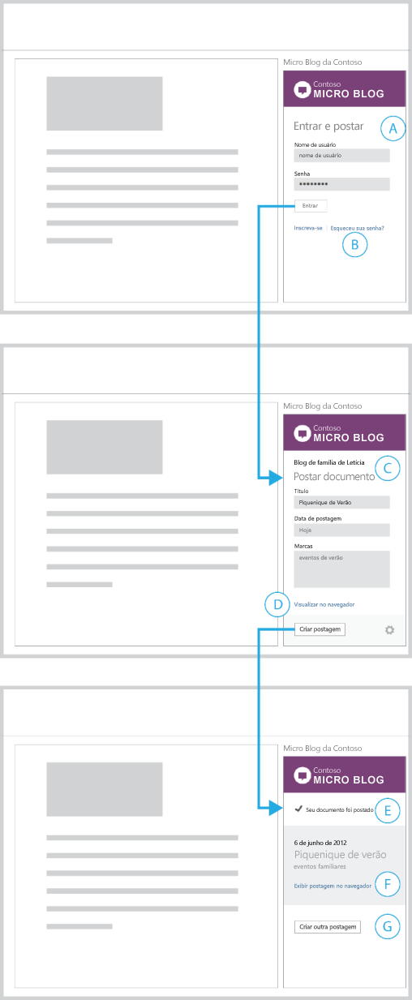
 
<ul><li>
Primeiro, um formulário de entrada é exibido para inserir suas credenciais (A).
</li><li>
Links para criar uma conta e lidar com problemas de entrada típicos são fornecidos (B). A escolha desses links abre estas páginas em um navegador.
</li><li>
Depois que você está conectado, o suplemento exibe um formulário para criar uma nova postagem de blog (C).
</li><li>
O nome da conta em que você entrou (e na qual postará) é mostrada na parte superior do suplemento. O suplemento fornece um link para visualizar a postagem (D). A escolha desse link exibe a visualização em um navegador.
</li><li>
Depois que você escolhe Criar postagem, o suplemento exibe uma exibição confirmando que o conteúdo do documento foi postado (R).
</li><li>
O suplemento fornece um link para exibir a postagem em um navegador (F), bem como um botão para criar outra postagem (G).
</li></ul>Mais adequado para:
<ul><li>
Suplementos que geram, publicam ou compartilham conteúdo em redes sociais, sites de blog e serviços Web.
</li><li>
Suplementos que exigem que você entre em um serviço.
</li></ul>

## Obter mais informações sobre pessoas com um suplemento do Outlook

 **Exemplo 1**

**Página de resultados e detalhes**
 
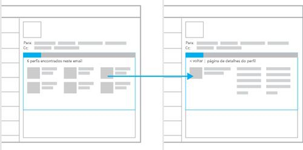
 
Mais adequado para:
<ul><li>
Exponha a abrangência de seu conteúdo, se você tiver grandes conjuntos de dados que sejam úteis para apresentação.
</li><li>
Páginas de detalhes que usam o tamanho completo do contêiner de suplemento
</li><li>
Modelos de navegação que se beneficiam de um fluxo de "trocas".
</li></ul>
 
 **Exemplo 2**

**Página de detalhes com navegação persistente**
 
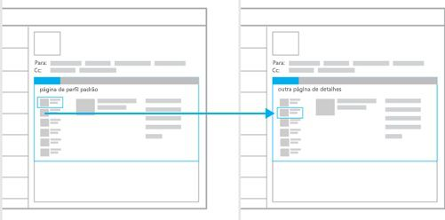
 
Mais adequado para:
<ul><li>
Exibir, por padrão, o primeiro resultado de um conjunto de dados.
</li><li>
Estruturas de navegação que funcionam como guias (único nível de navegação linear).
</li><li>
Reduzir ações de seleção, mantendo a navegação sempre disponível.
</li><li>
Fornecer espaço para exibir sempre a navegação.
</li></ul>

## Obter mais informações sobre o conteúdo com um suplemento do Outlook

 **Exemplo 1**

**Página de resultados e detalhes**
 
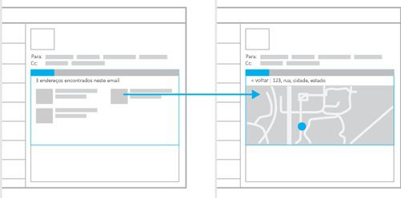
 
Mais adequado para:
<ul><li>
Exponha a abrangência de seu conteúdo, se você tiver grandes conjuntos de dados que sejam úteis para exibição.
</li><li>
Exigir que você faça uma escolha ou seleção antes de mostrar mais detalhes.
</li><li>
Páginas de detalhes que usam o tamanho máximo do contêiner de suplemento.
</li><li>
Modelos de navegação que se beneficiam de um fluxo de "trocas".
</li></ul>
 
 **Exemplo 2**

**Página de detalhes com conteúdo secundário**
 
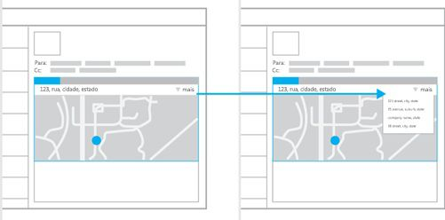
 
Mais adequado para:
<ul><li>
Casos em que você deseja destacar uma parte do conteúdo.
</li><li>
Expor o conteúdo sem interação do usuário.
</li><li>
Navegação persistente (pode ser adicionada a esse modelo para fornecer uma mistura de simplicidade e facilidade de navegação).
</li></ul>

## Conectar-se a um serviço online e apresentar dados

Esses exemplos mostram padrões de interação para a obtenção de dados e conteúdos de um serviço online. Eles podem ser usados em todos os três tipos de suplementos: suplementos de conteúdo, suplementos do painel de tarefas e suplementos do Outlook.

 **Exemplo 1**

**Carrossel**
 
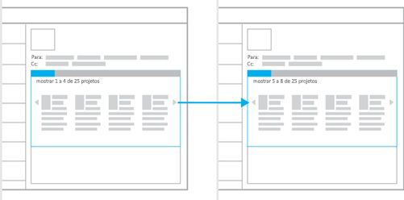
 
Mais adequado para:
<ul><li>
Pequenas quantidades de dados que podem ser expostos um de cada vez ou em grupos.
</li><li>
Expor o conteúdo em um formato de galeria, como apresentações de slides ou galerias de imagens.
</li><li>
Quando um modelo de navegação anterior/seguinte funciona bem.
</li></ul>
 
 **Exemplo 2**

**Assistente**
 
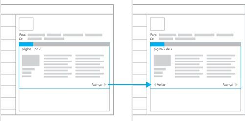
 
Mais adequado para:
<ul><li>
Conteúdo que precisa ser apresentado em uma ordem específica.
</li><li>
Grandes quantidades de conteúdo que é consumido da melhor forma em uma série de pequenos itens.
</li><li>
Experiências de consumo semelhantes a livros.
</li><li>
Quando uma série de etapas ou ações são necessárias para concluir uma tarefa.
</li></ul>
 
 **Exemplo 3**

**Formulário, resultados e detalhes**
 
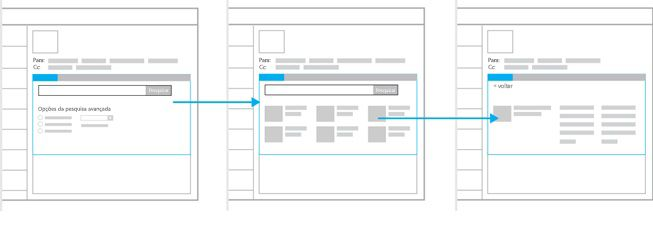
 
Mais adequado para:
<ul><li>
Suplementos que exigem a entrada de dados.
</li><li>
Um ponto de entrada para um padrão de resultados e detalhes.
</li></ul>

## Veja também

- [Diretrizes de design para suplementos do Office](../add-in-design.md)
    
