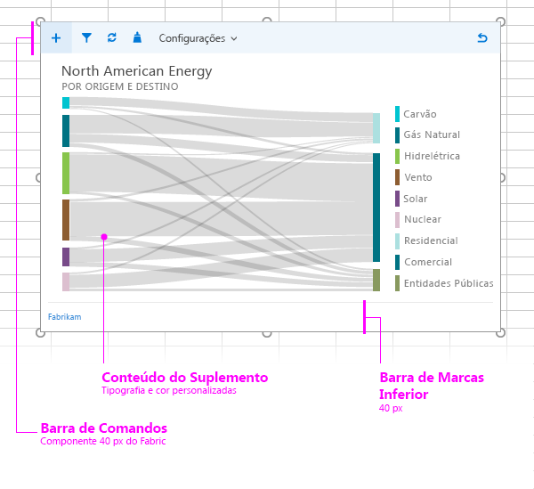

# Layout para suplementos de conteúdo

Crie uma aparência consistente para os suplementos de conteúdo usando o layout de design recomendado. O layout recomendado para um suplemento de conteúdo inclui os seguintes elementos: 

- Barra de comando (opcional) – Inclui ícones ou barra de navegação para os usuários e pode ser sobreposto ao suplemento de conteúdo. A altura máxima é de 80 pixels.
- Conteúdo do suplemento
- Elemento de identidade visual (opcional)

É possível também adicionar uma [interface do usuário personalizada com base em HTML](ui-elements.md#custom-html-based-ui) ao suplemento de conteúdo.

Para um exemplo que mostra como usar o Office UI Fabric nos suplementos do Office, confira [Exemplo de suplemento do Office UI Fabric](https://github.com/OfficeDev/Office-Add-in-Fabric-UI-Sample).

<!-- Add sample template for content add-in and individual building blocks - Command Bar, Input, layout components. -->

## Veja também

- [Diretrizes de design para suplementos do Office](../add-in-design.md)