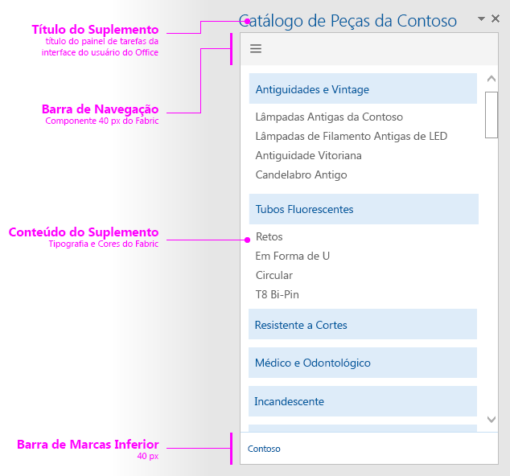

# Layout para contêineres do painel de tarefas

Crie uma aparência consistente para os contêineres do painel de tarefas usando o layout de design recomendado. O layout recomendado para um painel de tarefas inclui os seguintes elementos: 

- Elemento de navegação (opcional) – Inclui uma barra de navegação ou área dinâmica em uma barra sob o elemento da marca, caso você esteja usando um, com uma altura máxima de 80 pixels.
- Conteúdo do suplemento
- Elemento de identidade visual (opcional)

Também é possível adicionar uma [interface de usuário personalizada baseada em HTML](ui-elements.md#custom-html-based-ui) ao seu painel de tarefas.

Para um exemplo que mostra como usar o Office UI Fabric nos suplementos do Office, confira [Exemplo de suplemento do Office UI Fabric](https://github.com/OfficeDev/Office-Add-in-Fabric-UI-Sample).

<!-- Add sample template for content add-in and individual building blocks - Branding, Navigation bar or pivot, input, layout components -->

## Veja também

- [Diretrizes de design para suplementos do Office](../add-in-design.md)