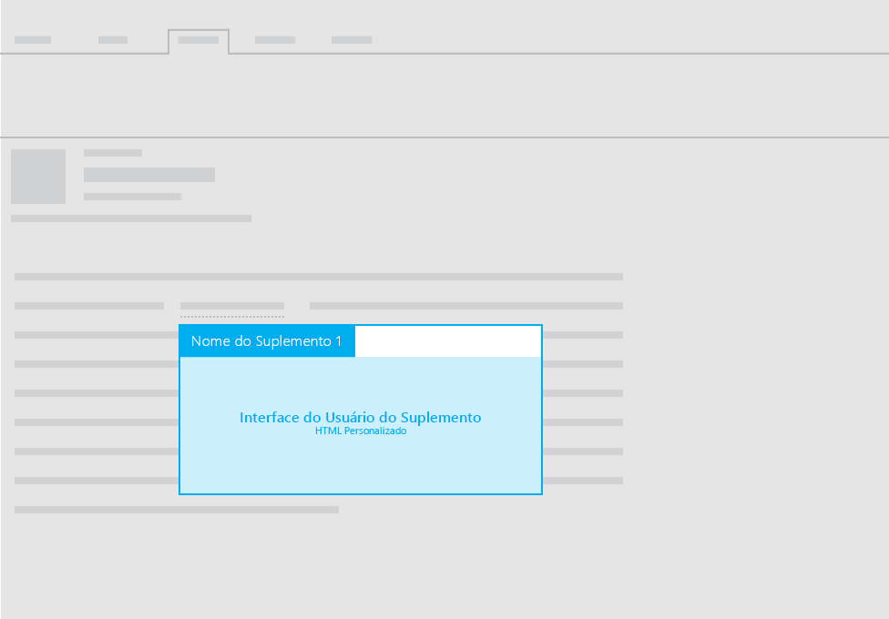

#Layouts para suplementos de email

Você pode usar todos os seguintes layouts para suplementos de email:

- Painel de tarefas
- Contextual
- Funções com notificações da Barra de Informações

Para obter diretrizes sobre o texto da interface do usuário nos suplementos, confira o artigo [Voz do Office](https://msdn.microsoft.com/en-us/library/office/mt484351.aspx).

##Painel de tarefas
 Para obter recomendações sobre layouts de painel de tarefas para suplementos de email, confira o artigo [Layout para suplementos de painel de tarefas](layout-for-task-pane-add-ins.md).

##Suplementos contextuais

A imagem a seguir mostra o layout recomendado para um [suplemento de email contextual](https://msdn.microsoft.com/EN-US/library/office/dn893542.aspx).

##Funções com notificações da Barra de Informações

Além de usar um painel de tarefas ou um painel contextual para exibir a interface do usuário HTML personalizada no suplemento de email, você pode executar funções de comandos. Você pode usar as notificações da Barra de Informações quando for necessário exibir o texto da interface do usuário como resultado de uma função. Por exemplo, você pode ter que usar uma notificação da Barra de Informações para exibir mensagens de erro ou de êxito. 

Para saber mais, confira o artigo [Comandos de suplemento para email](https://msdn.microsoft.com/EN-US/library/office/mt267546.aspx). 

