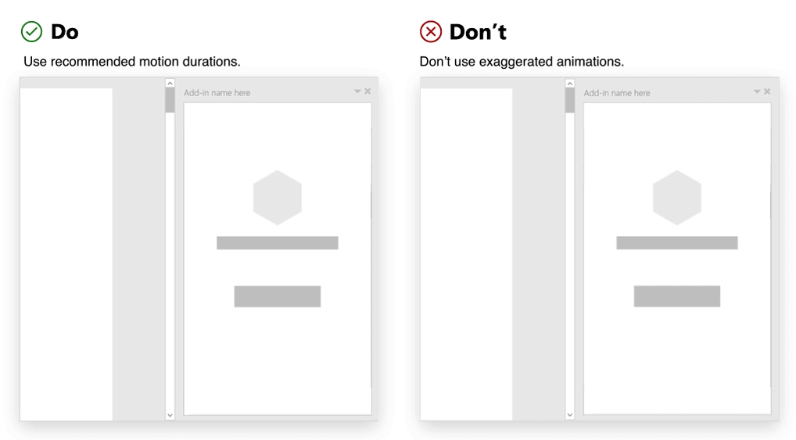

# Usar movimento em suplementos do Office

Ao criar um Suplemento do Office, é possível usar movimento para aprimorar a experiência do usuário. Os componentes, os controles e os elementos da interface do usuário geralmente têm comportamentos interativos que exigem transições, movimento ou animação. Características comuns de movimento entre elementos da interface do usuário definem os aspectos de animação de uma linguagem de design.

Como o Office é voltado para a produtividade, a linguagem de animação do Office dá suporte ao objetivo de ajudar os clientes a realizar tarefas. Ela permite o equilíbrio entre a resposta de alto desempenho, a coreografia confiável e a satisfação detalhada. Os suplementos inseridos no Office aproveitam essa linguagem de animação existente. Com base nesse contexto, é importante considerar estas diretrizes ao aplicar animação.

## Criar movimento com uma finalidade

O movimento deveria ter uma finalidade que transmita mais valor ao usuário. Considere o tom e a finalidade do conteúdo ao escolher as animações. Lide com mensagens críticas de forma diferente da navegação exploratória.

Os elementos padrão usados em um suplemento podem incorporar movimentos a fim de ajudar o usuário a focar, mostrar como os elementos se relacionam e validar as ações do usuário. Coreografe os elementos para reforçar a hierarquia e os modelos mentais.

### Práticas recomendadas

|Fazer|Não fazer|
|:-----|:-----|
|Identifique os elementos importantes no suplemento que devem ter movimento. Normalmente, os elementos animados em um suplemento são painéis, sobreposições, modais, dicas de ferramentas, menus e balões explicativos de ensino.| Não deixe o usuário incomodado animando cada elemento. Evite aplicar vários movimentos que tentem conduzir ou fazer o usuário focar em vários elementos de uma vez. |
|Use movimentos simples e sutis que se comportem de forma esperada. Considere a origem do elemento de disparo. Use animação para criar um vínculo entre a ação e a interface de usuário resultante. | Não crie um tempo de espera para uma animação. As animações em suplementos não devem comprometer a conclusão da tarefa.|

## Usar movimentos esperados

Recomendamos usar a [interface](https://developer.microsoft.com/fluentui#/) do usuário fluente para criar uma conexão visual com  a plataforma Office, e também incentivamos o uso de animações de interface do usuário fluente para criar movimentos que se alinham com o idioma de movimento do Fabric.

Use para ajustar perfeitamente no Office. Ele ajudará a criar experiências que são mais sentidas do que observadas. As classes CSS de animação fornecem direção, entrada/saída e especificações de duração que reforçam modelos mentais do Office e fornecem oportunidades para que os clientes saibam como interagir com o suplemento.

### Práticas recomendadas

|Fazer|Não fazer|
|:-----|:-----|
|Use o movimento que se alinha aos comportamentos na interface do usuário fluente.| Não crie movimentos que interfiram ou entrem em conflito com padrões de movimento comuns no Office.
|Verifique se há uma aplicação consistente de movimento em elementos como.| Não use movimentos diferentes para animar o mesmo componente ou objeto.|
|Crie consistência com o uso de direção na animação. Por exemplo, um painel que abre a partir da direita deve fechar para a direita.|Não anime um elemento usando várias direções.

## Evitar movimento sem caractere para um elemento

Considere o tamanho da tela HTML (painel de tarefas, caixa de diálogo ou suplemento de conteúdo) ao implementar o movimento. Evite a sobrecarga em espaços restritos. Os elementos em movimento devem estar de acordo com o Office. O caractere do movimento do suplemento deve ser eficaz, confiável e fluido. Em vez de afetar a produtividade, procure informar e direcionar.

### Práticas recomendadas

|Fazer|Não fazer|
|:-----|:-----|
| Use [durações de movimento recomendadas](https://developer.microsoft.com/fluentui#/styles/web/motion). | Não use animações exageradas. Evite criar experiências belas, mas que desviam a atenção dos clientes.
| Siga as [curvas de atenuação recomendadas](/windows/uwp/design/motion/timing-and-easing#easing-in-fluent-motion).  |Não mova os elementos de uma maneira irregular ou desconexa. Evite antecipações, saltos, pulos ou outros efeitos que emulem as características físicas do mundo natural.|

## Confira também

* [Diretrizes de animação da interface do usuário fluente](https://developer.microsoft.com/fluentui#/styles/web/motion)
* [Movimento para aplicativos da Plataforma Universal do Windows](/windows/uwp/design/motion)
