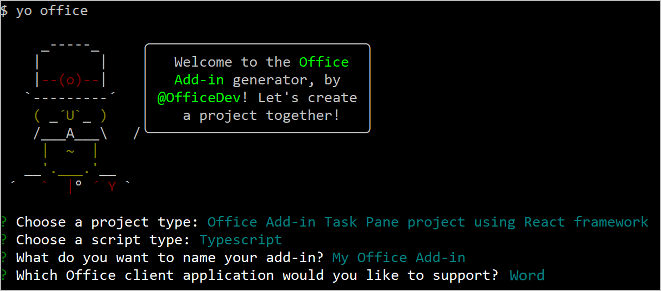

# <a name="use-office-ui-fabric-react-in-office-add-ins"></a>Usar o Office UI Fabric React em Suplementos do Office

O Office UI Fabric é uma estrutura de front-end JavaScript destinada à criação de experiências de usuário para Office e Office 365. Se você criar o suplemento usando o React, considere o uso do Fabric React para criar a experiência do usuário. O Fabric fornece diversos componentes da experiência de usuário baseados no React, como botões e caixas de seleção, que você pode usar no suplemento.

Este artigo descreve como criar um suplemento usando o React e componentes do Fabric React. 

> [!NOTE]
> [O Fabric Core](office-ui-fabric.md#use-fabric-core-icons-fonts-colors) acompanha o Fabric React, o que significa que o seu suplemento também terá acesso ao Fabric Core após a conclusão das etapas deste artigo.

## <a name="create-an-add-in-project"></a>Criar um projeto de suplemento

Você usará o gerador Yeoman para Suplementos do Office para criar um projeto de suplemento que use o React.

### <a name="install-the-prerequisites"></a>Instalar os pré-requisitos

[!include[Yeoman generator prerequisites](../includes/quickstart-yo-prerequisites.md)]

### <a name="create-the-project"></a>Criar o projeto

[!include[Yeoman generator create project guidance](../includes/yo-office-command-guidance.md)]

- **Escolha o tipo de projeto:** `Office Add-in Task Pane project using React framework`
- **Escolha o tipo de script:** `TypeScript`
- **Qual será o nome do suplemento?** `My Office Add-in`
- **Você gostaria de proporcionar suporte para qual aplicativo cliente do Office?** `Word`



Depois que você concluir o assistente, o gerador criará o projeto e instalará os componentes Nó de suporte.

[!include[Yeoman generator next steps](../includes/yo-office-next-steps.md)]

### <a name="try-it-out"></a>Experimente

1. Navegue até a pasta raiz do projeto.

    ```command&nbsp;line
    cd "My Office Add-in"
    ```

2. Conclua as etapas a seguir para iniciar o servidor Web local e fazer o sideload do seu suplemento.

    > [!NOTE]
    > Os Suplementos do Office devem usar HTTPS, e não HTTP, mesmo durante o desenvolvimento. Se você for solicitado a instalar um certificado após executar um dos seguintes comandos, aceite a solicitação para instalar o certificado que o gerador do Yeoman fornecer.

    > [!TIP]
    > Se você estiver testando o seu suplemento no Mac, execute o seguinte comando antes de continuar. O servidor Web local é iniciado quando este comando é executado.
    >
    > ```command&nbsp;line
    > npm run dev-server
    > ```

    - Para testar seu suplemento no Word, execute o seguinte comando no diretório raiz do seu projeto. Isso inicia o servidor Web local (caso ainda não esteja em execução) e abre o Word com o suplemento carregado.

        ```command&nbsp;line
        npm start
        ```

    - Para testar seu suplemento no Word em um navegador, execute o seguinte comando no diretório raiz do seu projeto. Quando você executar este comando, o servidor Web local será iniciado (se ainda não estiver em execução).

        ```command&nbsp;line
        npm run start:web
        ```

        Para usar o seu suplemento, abra um novo documento no Word na Web e em seguida realize o sideload no suplemento de acordo com as instruções em [Realizar Sideload nos Suplementos do Office no Office na Web](../testing/sideload-office-add-ins-for-testing.md#sideload-an-office-add-in-in-office-on-the-web).

3. No Word, escolha a guia **Página Inicial** e o botão **Mostrar Painel de Tarefas** na faixa de opções para abrir o painel de tarefas do suplemento. Observe o texto padrão e o botão **Executar** na parte inferior do painel de tarefas. No restante deste passo a passo, você redefinirá esse texto e botão criando um componente Reagir que usa componentes UX do Fabric React.

    


## <a name="create-a-react-component-that-uses-fabric-react"></a>Criar um componente React que use o Fabric React

Neste ponto, você criou um suplemento muito básico do painel de tarefas usando o React. Em seguida, siga as etapas abaixo para criar um novo componente React (`ButtonPrimaryExample`) dentro do projeto de suplemento. O componente usa o `Label` e `PrimaryButton` os componentes do Fabric React.

1. Abra a pasta do projeto criada pelo gerador Yeoman e acesse **src\taskpane\components**.
2. Nesta pasta, crie um novo arquivo chamado **Button.tsx**.
3. Em **Button.tsx**, adicione o código a seguir para definir o componente `ButtonPrimaryExample`.

```typescript
import * as React from 'react';
import { PrimaryButton, IButtonProps } from 'office-ui-fabric-react/lib/Button';
import { Label } from 'office-ui-fabric-react/lib/Label';

export class ButtonPrimaryExample extends React.Component<IButtonProps, {}> {
  public constructor(props) {
    super(props);
  }

  insertText = async () => {
    // In the click event, write text to the document.
    await Word.run(async (context) => {
      let body = context.document.body;
      body.insertParagraph('Hello Office UI Fabric React!', Word.InsertLocation.end);
      await context.sync();
    });
  }

  public render() {
    let { disabled } = this.props;
    return (
      <div className='ms-BasicButtonsExample'>
        <Label>Click the button to insert text.</Label>
        <PrimaryButton
          data-automation-id='test'
          disabled={ disabled }
          text='Insert text...'
          onClick={ this.insertText } />
      </div>
    );
  }
}
```

Esse código faz o seguinte:

- Faz referência à biblioteca React usando `import * as React from 'react';`.
- Faz referência aos componentes do Fabric (`PrimaryButton`, `IButtonProps`, `Label`) que são usados para criar `ButtonPrimaryExample`.
- Declara o novo `ButtonPrimaryExample` componente usando `export class ButtonPrimaryExample extends React.Component`.
- Declara a `insertText` função que manipulará o evento do `onClick` botão.
- Define a interface do usuário do componente do React na função `render`. A marcação HTML usa os componentes `Label` e `PrimaryButton` da Fabric React e especifica que quando `onClick` o evento for acionado, a `insertText` função será executada.

## <a name="add-the-react-component-to-your-add-in"></a>Adicionar o componente do React ao suplemento

Adicionar o `ButtonPrimaryExample` componente ao suplemento abrindo **src\components\App.tsx** e seguir as seguintes etapas:

1. Adicione a seguinte declaração de importação para a referência `ButtonPrimaryExample` do **Button.tsx**.

    ```typescript
    import {ButtonPrimaryExample} from './Button';
    ```

2. Remova as duas instruções de importação a seguir.

    ```typescript
    import { Button, ButtonType } from 'office-ui-fabric-react';
    ...
    import Progress from './Progress';
    ```

3. Substitua a função padrão `render()` pelo código a seguir, que usa `ButtonPrimaryExample`.

    ```typescript
    render() {
      return (
        <div className="ms-welcome">
        <Header logo="assets/logo-filled.png" title={this.props.title} message="Welcome" />
        <HeroList message="Discover what this add-in can do for you today!" items={this.state.listItems} >
          <ButtonPrimaryExample />
        </HeroList>
        </div>
      );
    }
    ```

  4. Salve as alterações feitas em **App.tsx**.

## <a name="see-the-result"></a>Ver o resultado

No Word, o painel de tarefas do suplemento será atualizado automaticamente quando você salvar as alterações em **App.tsx**. O texto padrão e o botão na parte inferior do painel de tarefas agora mostram a IU definida pelo `ButtonPrimaryExample` componente. Feche o botão **Insert text...** para inserir o texto no documento.


Parabéns, você criou com êxito um suplemento do painel de tarefas usando React e o Office UI Fabric React! 

## <a name="see-also"></a>Confira também

- [Office UI Fabric em Suplementos do Office](office-ui-fabric.md)
- [Office UI Fabric React](https://developer.microsoft.com/fabric)
- [Padrões de design da experiência do usuário para suplementos do Office](ux-design-pattern-templates.md)
- [Introdução ao exemplo de código do Fabric React](https://github.com/OfficeDev/Word-Add-in-GettingStartedFabricReact)
