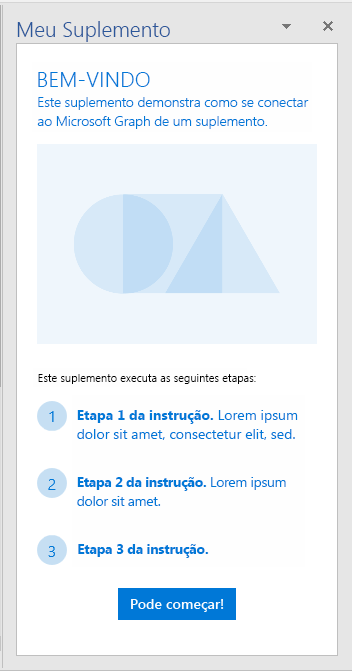
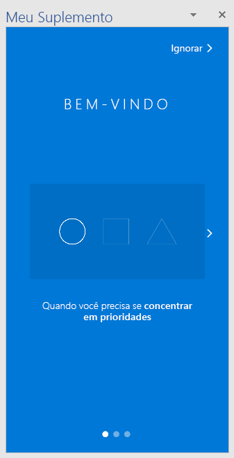
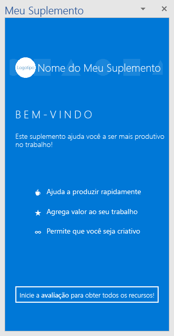
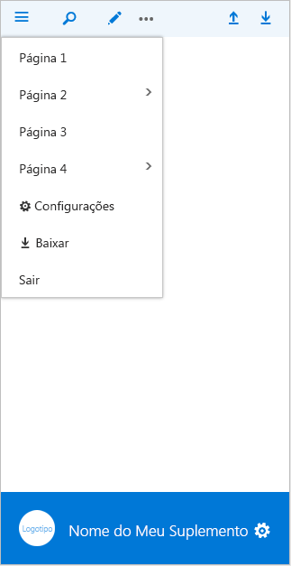
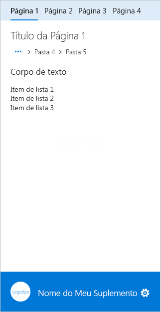
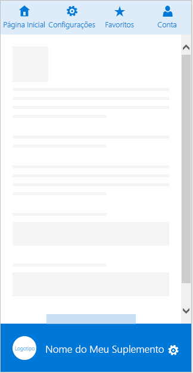
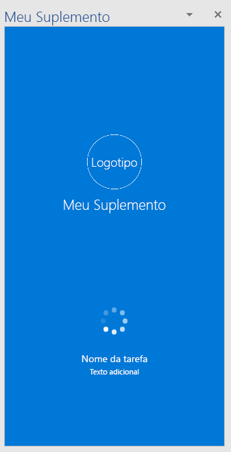
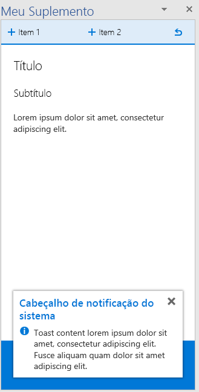

# Modelos de padr?o de design da experi?ncia do usu?rio para Suplementos do Office

O [projeto de padr?es de design da experi?ncia do usu?rio para Suplementos do Office](https://github.com/OfficeDev/Office-Add-in-UX-Design-Patterns-Code "projeto de padr?es de design da experi?ncia do usu?rio para Suplementos do Office") cont?m arquivos HTML, JavaScript e CSS que voc? pode usar para criar a experi?ncia de usu?rio para seu suplemento.   

Use o projeto de padr?es de design da experi?ncia do usu?rio para:

* Aplicar solu??es a cen?rios comuns de clientes.
* Aplicar as pr?ticas recomendadas de design.
* Incorporar componentes e estilos do [Office UI Fabric](https://dev.office.com/fabric#/get-started).
* Criar suplementos que se integram visualmente ? interface do usu?rio padr?o do Office.  

## Usar os padr?es de design da UX

Voc? pode usar o [Kit de ferramentas de design de suplementos do Office](https://aka.ms/addins_toolkit) junto com o [Kit de ferramentas de design de malha](https://aka.ms/fabric-toolkit) como um guia ao criar seu pr?prio suplemento do Office. Voc? tamb?m pode adicionar [c?digo-fonte](https://github.com/OfficeDev/Office-Add-in-UX-Design-Patterns-Code/tree/master/templates) diretamente ao seu projeto.

Para usar as especifica??es para compilar uma maquete da interface do usu?rio do seu suplemento:

1. Fa?a download de arquivos de ativos de design e comece a criar sua pr?pria interface do usu?rio:
    * [Kit de ferramentas de design de suplementos do Office](https://aka.ms/addins_toolkit)
    * [Kit de ferramentas de design de malha](https://aka.ms/fabric-toolkit)

2. Voc? encontra diretrizes nos seguintes artigos:
    * Melhores pr?ticas para [projetar seus Suplementos do Office](add-in-design.md)
    * [Kits de ferramentas do Office UI Fabric](https://developer.microsoft.com/en-us/fabric#/resources)

> [!NOTE]
> Alguns padr?es UX no kit de ferramentas de design de suplementos n?o correspondem aos padr?es de design UX detalhados abaixo. Estamos planejando lan?ar uma documenta??o atualizada que se alinhar? ao kit de ferramentas.

Para adicionar o c?digo-fonte:

1. Clone o [reposit?rio do projeto de padr?es de design da experi?ncia do usu?rio para suplementos do Office](https://github.com/OfficeDev/Office-Add-in-UX-Design-Patterns-Code "projeto de padr?es de design da experi?ncia do usu?rio para suplementos do Office").
2. Copie a [pasta de ativos](https://github.com/OfficeDev/Office-Add-in-UX-Design-Pattern-Code/tree/master/assets) e a pasta de c?digo do padr?o espec?fico que voc? escolheu para o projeto do seu suplemento.  
3. Incorpore o padr?o individual ao seu suplemento. Por exemplo:
    - Edite o local de origem ou a URL de comando do suplemento no manifesto.
    - Use o padr?o de design da experi?ncia do usu?rio como modelo para outras p?ginas.
    - Crie um link de ou para o padr?o de design da experi?ncia do usu?rio.

> [!NOTE]
> Algumas especifica??es do padr?o da experi?ncia do usu?rio n?o correspondem ao c?digo-fonte. Estamos trabalhando arduamente para alinhar todos os ativos. Observe tamb?m que algumas especifica??es s?o apresentadas como arquivadas. Estamos avaliando essas especifica??es arquivadas para verificar o valor para a plataforma. Cada padr?o pretende representar um modelo exclusivo e um padr?o de intera??o. Os padr?es n?o devem se sobrepor entre si e devem ser diferenciados dos componentes do Office Fabric UI.

## Tipos de padr?es de design da experi?ncia do usu?rio
### P?ginas gen?ricas

Modelos de p?ginas gen?ricas podem ser aplicados a qualquer p?gina no seu suplemento e n?o t?m uma finalidade especial. Um exemplo de uma p?gina com finalidade especial seria qualquer um dos padr?es de apresenta??o. A lista a seguir descreve os tipos de p?ginas gen?ricas dispon?veis:

* **P?gina de chegada**: uma p?gina de suplemento padr?o, por exemplo, a p?gina a que um usu?rio chega ap?s uma tela de apresenta??o ou processo de login. 
    * Saiba mais sobre as diretrizes para adotar a [linguagem de design do Office](add-in-design-language.md) no seu suplemento.
    * [C?digo da p?gina de chegada](https://github.com/OfficeDev/Office-Add-in-UX-Design-Patterns-Code/tree/master/templates/generic/landing-page)
* **Imagem da marca na barra da marca**: a p?gina de chegada com uma imagem no rodap? que representa sua marca. 
    * [Especifica??o da barra da marca](https://github.com/OfficeDev/Office-Add-in-UX-Design-Patterns/blob/master/patterns/brand-bar.md)
    * [C?digo da barra da marca](https://github.com/OfficeDev/Office-Add-in-UX-Design-Patterns-Code/tree/master/templates/generic/brand-bar)

<table>
 <tr><th>Chegada</th><th>Barra da marca</th></tr>
 <tr><td></td>
<td></td></tr>
 </table>
 
### Tela de apresenta??o

Uma tela de apresenta??o ? a experi?ncia que o usu?rio tem ao abrir o suplemento pela primeira vez. Est?o dispon?veis os seguintes modelos de padr?o de design de apresenta??o: 

* **Etapas para iniciar**: fornece aos usu?rios uma lista ordenada de etapas a serem executadas para come?ar a usar o suplemento. 
    * [Etapas para come?ar a especifica??o](https://github.com/OfficeDev/Office-Add-in-UX-Design-Patterns/blob/master/assets/archived-patterns/fre_stepsToStart.pdf) (Este padr?o de design de experi?ncia de usu?rio foi arquivado. Enquanto avaliamos seu valor, confira a [Especifica??o do valor da Tela de apresenta??o](https://github.com/OfficeDev/Office-Add-in-UX-Design-Patterns/blob/master/patterns/value-placemat.md)  
    * [Etapas para iniciar o c?digo](https://github.com/OfficeDev/Office-Add-in-UX-Design-Patterns-Code/tree/master/templates/first-run/instruction-step)
* **Valor**: comunica a proposta de valor do suplemento.
    * [Especifica??o do valor](https://github.com/OfficeDev/Office-Add-in-UX-Design-Patterns/blob/master/patterns/value-placemat.md)
    * [C?digo do valor](https://github.com/OfficeDev/Office-Add-in-UX-Design-Patterns-Code/tree/master/templates/first-run/value-placemat)
* **V?deo**: mostra aos usu?rios um v?deo antes que eles comecem a usar o suplemento.
    * [Especifica??o do v?deo](https://github.com/OfficeDev/Office-Add-in-UX-Design-Patterns/blob/master/patterns/video-placemat.md)
    * [C?digo do v?deo](https://github.com/OfficeDev/Office-Add-in-UX-Design-Patterns-Code/tree/master/templates/first-run/video-placemat)
* **Passo a passo**: apresenta aos usu?rios uma s?rie de recursos ou informa??es antes que eles comecem a usar o suplemento.
    * [Especifica??o de carrossel](https://github.com/OfficeDev/Office-Add-in-UX-Design-Patterns/blob/master/patterns/carousel.md) (esse padr?o de design da experi?ncia do usu?rio foi renomeado como ?Carrossel?. As especifica??es anteriores o chamavam de ?Painel de pagina??o?. Os ativos do c?digo o chamam de "Passo a passo da Tela de apresenta??o". 
    * [Passo a passo do c?digo](https://github.com/OfficeDev/Office-Add-in-UX-Design-Patterns-Code/tree/master/templates/first-run/walkthrough)

O [AppSource](https://docs.microsoft.com/en-us/office/dev/store/use-the-seller-dashboard-to-submit-to-the-office-store) tem um sistema que gerencia vers?es de avalia??o de um suplemento, mas se voc? quiser controlar a interface do usu?rio da experi?ncia de avalia??o para o seu suplemento, use os seguintes padr?es:

* **Avalia??o**: mostra aos usu?rios como come?ar a usar uma vers?o de avalia??o do suplemento.
    * [Especifica??o de avalia??o](https://github.com/OfficeDev/Office-Add-in-UX-Design-Patterns/blob/master/assets/archived-patterns/fre_trialVersion.pdf) (esse padr?o de design da experi?ncia do usu?rio foi arquivado. Enquanto avaliamos seu valor, consulte este PDF).
    * [C?digo da avalia??o](https://github.com/OfficeDev/Office-Add-in-UX-Design-Patterns-Code/tree/master/templates/first-run/trial-placemat)
* **Recurso de avalia??o**: avisa aos usu?rios que o recurso que eles est?o tentando usar n?o est? dispon?vel na vers?o de avalia??o do suplemento. Como alternativa, se o seu suplemento for gratuito, mas houver um recurso que exija uma assinatura, considere usar esse padr?o. Voc? tamb?m pode usar esse padr?o para fornecer uma experi?ncia de vers?o limitada ap?s o t?rmino do per?odo de avalia??o.
    * [Especifica??o de recurso de avalia??o](https://github.com/OfficeDev/Office-Add-in-UX-Design-Patterns/blob/master/assets/archived-patterns/fre_trialFeature.pdf) (esse padr?o de design da experi?ncia do usu?rio foi arquivado. Enquanto avaliamos seu valor, consulte este PDF).
    * [C?digo do recurso de avalia??o](https://github.com/OfficeDev/Office-Add-in-UX-Design-Patterns-Code/tree/master/templates/first-run/trial-placemat-feature)

> [!IMPORTANT]
> Se voc? decidir gerenciar sua pr?pria avalia??o e n?o usar o AppSource, certifique-se de incluir a marca **Compra adicional pode ser necess?ria** nas anota??es de testes no painel do vendedor.

Considere se mostrar aos usu?rios a tela de apresenta??o uma ou muitas vezes ? importante para seu cen?rio. Por exemplo, se seu suplemento for usado periodicamente, talvez os usu?rios se esque?am de como us?-lo, e pode ser ?til ver a tela de apresenta??o mais de uma vez. 

 <table>
 <tr><th>Etapas para iniciar</th><th>Valor</th><th>V?deo</th></tr>
 <tr>
<td></td>
<td></td>
<td></td></tr>
 </table>

 <table>
 <tr><th>P?gina inicial de explica??o passo a passo</th><th>Avalia??o</th><th>Recurso de avalia??o</th></tr>
 <tr>
<td></td>
<td></td>
<td></td></tr>
 </table> 

### Navega??o

Os usu?rios precisam navegar entre as diferentes p?ginas do seu suplemento. Os seguintes modelos de navega??o mostram diferentes op??es que voc? pode usar para organizar p?ginas e comandos no seu suplemento.

* **Bot?es Voltar e Pr?xima p?gina**: mostra um painel de tarefas com os bot?es Voltar e Pr?xima p?gina. Use esse padr?o para garantir que os usu?rios sigam uma s?rie de etapas ordenadas.
    * [Especifica??o dos Bot?es Voltar e Pr?xima p?gina](https://github.com/OfficeDev/Office-Add-in-UX-Design-Patterns/blob/master/patterns/back-button.md)
    * [C?digo do Bot?o Voltar e Pr?xima P?gina](https://github.com/OfficeDev/Office-Add-in-UX-Design-Patterns-Code/tree/master/templates/navigation/back-button) 
* **Navega??o**: mostra um menu, comumente conhecido como menu vertical clic?vel, com itens de menu da p?gina em um painel de tarefas. 
    * [Especifica??o da navega??o](https://github.com/OfficeDev/Office-Add-in-UX-Design-Patterns/blob/master/patterns/contextual-menu.md)
    * [C?digo da navega??o](https://github.com/OfficeDev/Office-Add-in-UX-Design-Patterns-Code/tree/master/templates/navigation/navigation) 
* **Navega??o com comandos**: mostra o menu vertical clic?vel com bot?es de comando (ou de a??o) em um painel de tarefas. Use este padr?o quando quiser fornecer as op??es de navega??o e comando juntas. 
    * [Especifica??o da navega??o com comandos](https://github.com/OfficeDev/Office-Add-in-UX-Design-Patterns/blob/master/patterns/command-bar.md)
    * [C?digo da navega??o com comandos](https://github.com/OfficeDev/Office-Add-in-UX-Design-Patterns-Code/tree/master/templates/navigation/navigation-commands)
* **Navega??o din?mica**: mostra a navega??o din?mica dentro de um painel de tarefas. Use a navega??o din?mica para permitir que os usu?rios naveguem entre diferentes conte?dos.
    * [Especifica??o da navega??o din?mica](https://github.com/OfficeDev/Office-Add-in-UX-Design-Patterns/blob/master/patterns/pivot.md)
    * [C?digo da navega??o din?mica](https://github.com/OfficeDev/Office-Add-in-UX-Design-Patterns-Code/tree/master/templates/navigation/pivot)
* **Barra de guias**: mostra a navega??o usando bot?es com texto empilhado na vertical e ?cones. Use a barra de guias para fornecer a navega??o usando guias com t?tulos curtos e descritivos.
    * [Especifica??o da barra de guias](https://github.com/OfficeDev/Office-Add-in-UX-Design-Patterns/blob/master/patterns/tab-bar.md)
    * [C?digo da barra de guias](https://github.com/OfficeDev/Office-Add-in-UX-Design-Patterns-Code/tree/master/templates/navigation/tab-bar) 

<table>
<tr><th>Bot?o Voltar</th><th>Navega??o</th><th>Navega??o com comandos</th></tr>
<tr>
    <td>
        
    </td>
    <td>
        
    </td>
    <td>
        
    </td>
</tr>
 </table>

<table>
<tr><th>Navega??o din?mica</th><th>Barra de guias</th></tr>
<tr><td></td>
<td></td>
</tr>
 </table>

### Notifica??es

Seu suplemento pode notificar os usu?rios sobre eventos, como erros, ou sobre o progresso de v?rias maneiras. Est?o dispon?veis os seguintes modelos de notifica??o: 

* **Caixa de di?logo incorporada**: mostra uma caixa de di?logo dentro do painel de tarefas que fornece informa??es e, opcionalmente, uma experi?ncia interativa, usando bot?es ou outros controles. Considere usar uma para solicitar que o usu?rio confirme uma a??o. Use o padr?o da caixa de di?logo incorporada quando quiser manter a experi?ncia do usu?rio no painel de tarefas.
    * [Especifica??o da caixa de di?logo incorporada](https://github.com/OfficeDev/Office-Add-in-UX-Design-Patterns/blob/master/patterns/embedded-dialog.md)
    * [C?digo da caixa de di?logo incorporada](https://github.com/OfficeDev/Office-Add-in-UX-Design-Patterns-Code/tree/master/templates/notifications/embedded-dialog)
* **Mensagem embutida**: indica o erro, o ?xito ou as informa??es, e pode ser exibida em um local especificado no painel de tarefas. Por exemplo, se um usu?rio inserir um endere?o de email com formato incorreto em uma caixa de texto, uma mensagem de erro aparecer? logo abaixo da caixa. 
    * [Especifica??o de mensagem embutida](https://github.com/OfficeDev/Office-Add-in-UX-Design-Patterns/blob/master/assets/archived-patterns/notification_inlineMessage.pdf) (Esse padr?o de design de experi?ncia de usu?rio foi arquivado. Enquanto avaliamos seu valor, consulte este PDF).
    * [C?digo da mensagem embutida](https://github.com/OfficeDev/Office-Add-in-UX-Design-Patterns-Code/tree/master/templates/notifications/inline-message)
* **Faixa de mensagem**: fornece informa??es e, opcionalmente, uma chamada simples ? a??o em uma faixa que pode ser recolhida para uma ?nica linha, expandida para v?rias linhas ou ignorada. Use faixas de mensagem para relatar uma atualiza??o de servi?o ou uma dica ?til quando o suplemento inicia. 
    * [Especifica??o da faixa de mensagem](https://github.com/OfficeDev/Office-Add-in-UX-Design-Patterns/blob/master/assets/archived-patterns/message_bar.pdf) (Esse padr?o de design de experi?ncia de usu?rio foi arquivado. Enquanto avaliamos seu valor, consulte este PDF).
    * [C?digo da faixa de mensagem](https://github.com/OfficeDev/Office-Add-in-UX-Design-Patterns-Code/tree/master/templates/notifications/message-banner)
* **Barra de progresso**: indica o andamento de um processo demorado e s?ncrono, como uma tarefa de configura??o que deve ser conclu?da antes do usu?rio poder executar outras a??es. ? uma p?gina de transi??o separada que tamb?m refor?a a marca do suplemento. Use uma barra de progresso quando o processo puder enviar medi??es peri?dicas de seu progresso ao suplemento.
    * [Especifica??o da barra de progresso](https://github.com/OfficeDev/Office-Add-in-UX-Design-Patterns/blob/master/patterns/progress-indicator.md)
    * [C?digo da barra de progresso](https://github.com/OfficeDev/Office-Add-in-UX-Design-Patterns-Code/tree/master/templates/notifications/progress-bar)
* **Controle girat?rio**: indica que um processo demorado e s?ncrono est? em andamento, mas n?o fornece uma indica??o do progresso. ? uma p?gina de transi??o separada que tamb?m refor?a a marca do suplemento. Use um controle girat?rio quando o suplemento n?o puder saber com seguran?a o progresso de um processo. 
    * [Especifica??o do controle girat?rio](https://github.com/OfficeDev/Office-Add-in-UX-Design-Patterns/blob/master/patterns/spinner.md)
    * [C?digo do controle girat?rio](https://github.com/OfficeDev/Office-Add-in-UX-Design-Patterns-Code/tree/master/templates/notifications/spinner)
* **Notifica??o do sistema**: fornece uma breve mensagem que desaparece ap?s alguns segundos. Como o usu?rio pode n?o ver a mensagem, use a notifica??o do sistema somente para informa??es n?o essenciais. ? uma boa op??o notificar os usu?rios sobre um evento em um sistema remoto, como o recebimento de um email.
    * [Especifica??o da notifica??o do sistema](https://github.com/OfficeDev/Office-Add-in-UX-Design-Patterns/blob/master/patterns/toast.md)
    * [C?digo da notifica??o do sistema](https://github.com/OfficeDev/Office-Add-in-UX-Design-Patterns-Code/tree/master/templates/notifications/toast)

 <table>
 <tr><th>Caixa de di?logo incorporada</th><th>Mensagem embutida</th><th>Faixa de mensagem</th></tr>
 <tr><td></td>
<td></td>
<td></td></tr>
 </table>

 <table>
 <tr><th>Barra de progresso</th><th>Controle girat?rio</th><th>Notifica??o do sistema</th></tr>
 <tr><td></td>
<td></td>
<td></td></tr>
 </table>
 

### Componentes gerais

A seguir apresentamos os componentes gerais que voc? pode usar em seus suplementos em v?rios cen?rios.  

#### Caixas de di?logo de cliente

As caixas de di?logo de cliente oferecem outra maneira para seus usu?rios trabalharem com seu suplemento fora de um painel de tarefas. Est?o dispon?veis os seguintes modelos de caixa de di?logo:

* **Caixa de di?logo typeramp**: mostra uma caixa de di?logo com conte?do textual. Use a caixa de di?logo typeramp para exibir informa??es elaborativas para os usu?rios. 
    * Saiba mais sobre a cria??o de [caixas de di?logo nos suplementos do Office](dialog-boxes.md). Siga tamb?m nossa diretrizes para [Tipografia em suplementos do Office](add-in-design-language.md#typography).
    * [C?digo da caixa de di?logo typeramp](https://github.com/OfficeDev/Office-Add-in-UX-Design-Patterns-Code/tree/master/templates/dialog/typeramp)
* **Caixa de di?logo de alerta**: mostra uma caixa de alerta com informa??es importantes aos usu?rios, como erros ou notifica??es.  
    * [Especifica??o de caixa de di?logo de alerta](https://github.com/OfficeDev/Office-Add-in-UX-Design-Patterns/blob/master/assets/archived-patterns/notification_alert.pdf) (Esse padr?o de design da experi?ncia do usu?rio foi arquivado. Enquanto avaliamos seu valor, consulte este PDF).
    * [C?digo da caixa de di?logo de alerta](https://github.com/OfficeDev/Office-Add-in-UX-Design-Patterns-Code/tree/master/templates/dialog/alert)
* **Caixa de di?logo de navega??o**: mostra uma caixa de di?logo com navega??o. Use a caixa de di?logo de navega??o para permitir que os usu?rios naveguem entre conte?dos diferentes. 
    * Saiba mais sobre a cria??o de [caixas de di?logo em suplementos do Office](dialog-boxes.md). Saiba mais tamb?m sobre como usar o Office UI Fabric em [Componentes din?micos em suplementos do Office](pivot.md).
    * [C?digo da caixa de di?logo de navega??o](https://github.com/OfficeDev/Office-Add-in-UX-Design-Patterns-Code/tree/master/templates/dialog/navigation)

<table>
 <tr><th>Caixa de di?logo typeramp</th><th>Caixa de di?logo de alerta</th></tr>
<tr>
<td></td>
<td></td>
</tr></tr>
 </table>
 
 <table>
 <tr><th>Caixa de di?logo de navega??o</th></tr>
<tr><td></td></tr>
</tr>
 </table>

#### Coment?rios e classifica??es

Para melhorar a visibilidade e a ado??o do seu suplemento, voc? deve fornecer aos usu?rios a capacidade de classificar e comentar sobre seu suplemento no AppSource. Este padr?o mostra dois m?todos para apresentar coment?rios e classifica??es de dentro do suplemento:

- Coment?rios iniciados pelo usu?rio: um usu?rio opta por enviar coment?rios usando o menu de navega??o (por exemplo, usando o link **Enviar coment?rios**) ou um ?cone no rodap?.
- Coment?rios iniciados pelo sistema: depois que o suplemento ? executado tr?s vezes, uma mensagem solicita ao usu?rio para fornecer coment?rios por uma faixa de mensagem.

Os dois m?todos abrem uma caixa de di?logo que cont?m a p?gina do suplemento no AppSource.

* [Especifica??o de coment?rios e classifica??es](https://github.com/OfficeDev/Office-Add-in-UX-Design-Patterns/blob/master/assets/archived-patterns/notification_feedback.pdf) (Esse padr?o de design da experi?ncia do usu?rio foi arquivado. Enquanto avaliamos seu valor, consulte este PDF).
* [C?digo dos coment?rios e classifica??es](https://github.com/OfficeDev/Office-Add-in-UX-Design-Patterns-Code/tree/master/templates/feedback/office-store)

> [!IMPORTANT]
> Esse padr?o atualmente aponta para a p?gina inicial do AppSource. Certifique-se de atualizar essa URL para indicar a URL da p?gina do seu suplemento no AppSource.

 <table>
 <tr><th>Coment?rios e classifica??es</th></tr>
<tr><td></td></tr>
</tr>
 </table>

#### Configura??es e privacidade

Suplementos podem precisar de uma p?gina de configura??es que permita aos usu?rios definir as configura??es que controlam o comportamento do suplemento. Al?m disso, conv?m fornecer aos usu?rios as pol?ticas de privacidade a que seu suplemento est? sujeito. 

* **Configura??es**: mostra um painel de tarefas com componentes de configura??o que controlam o comportamento do suplemento. Uma p?gina de configura??es fornece op??es para o usu?rio escolher.
    * [Especifica??o das configura??es](https://github.com/OfficeDev/Office-Add-in-UX-Design-Patterns/blob/master/patterns/settings.md)
    * [C?digo das configura??es](https://github.com/OfficeDev/Office-Add-in-UX-Design-Patterns-Code/tree/master/templates/settings)
* **Pol?tica de privacidade**: mostra o painel de tarefas com informa??es importantes sobre as pol?ticas de privacidade. 
    * [Especifica??o de pol?tica de privacidade](https://github.com/OfficeDev/Office-Add-in-UX-Design-Patterns/blob/master/assets/archived-patterns/general_multiSection.pdf) (esse padr?o de design da experi?ncia do usu?rio foi arquivado. Enquanto avaliamos seu valor, consulte este PDF).
    * [C?digo da pol?tica de privacidade](https://github.com/OfficeDev/Office-Add-in-UX-Design-Patterns-Code/tree/master/templates/settings)

<table>
 <tr><th>Configura??es</th><th>Pol?tica de privacidade</th></tr>
<tr>
<td></td>
<td></td>
</tr></tr>
 </table>

## Confira tamb?m

* [Pr?ticas recomendadas para o desenvolvimento de suplementos do Office](../concepts/add-in-development-best-practices.md)
* [Office UI Fabric](http://dev.office.com/fabric/)
