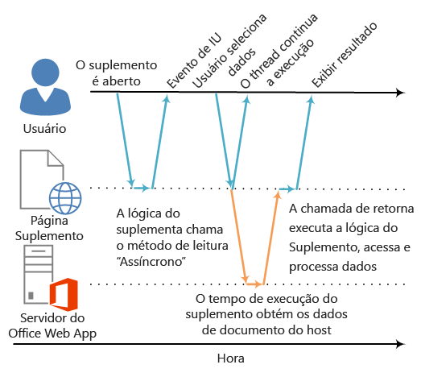

# <a name="asynchronous-programming-in-office-add-ins"></a>Programação assíncrona em Suplementos do Office

Por que a API de Suplementos do Office usa a programação assíncrona? Como o JavaScript é uma linguagem de thread único, se o script invocar um processo síncrono demorado, todas as execuções subsequentes do script serão bloqueadas até que o processo seja concluído. Como certas operações para clientes Web do Office (mas também para clientes avançados) podem impedir a execução se estiverem sendo executadas em sincronia, a maioria dos métodos na API do JavaScript para Office foi desenvolvido para execução assíncrona. Isso garante que os Suplementos do Office sejam responsivos e tenham alto desempenho. Em geral, isso também requer que você escreva funções de retorno de chamada ao trabalhar com esses métodos assíncronos.

Os nomes de todos os métodos assíncronos na API terminam com "Async", como os métodos [Document.getSelectedDataAsync](http://dev.office.com/reference/add-ins/shared/document.getselecteddataasync), [Binding.getDataAsync](http://dev.office.com/reference/add-ins/shared/binding.getdataasync) ou [Item.loadCustomPropertiesAsync](http://dev.office.com/reference/add-ins/outlook/Office.context.mailbox.item). Quando um método "Async" é chamado, ele é executado imediatamente e qualquer execução subsequente do script poderá continuar. A função de retorno de chamada opcional que você passar para um método de "Async" é executada assim que os dados ou a operação solicitada está pronta. Isso geralmente ocorre imediatamente, mas pode haver um pequeno atraso antes de retornar.

O diagrama a seguir mostra o fluxo de execução de uma chamada para um método de "Async" que lê os dados selecionados pelo usuário em um documento aberto no Word Online ou Excel Online baseados no servidor. No ponto em que a chamada "Async" é feita, o thread de execução do JavaScript fica livre para executar qualquer processamento adicional do lado do cliente. (Embora nenhum seja mostrado no diagrama.) Quando o método "Async" retorna, o retorno de chamada retoma a execução no thread e o suplemento pode acessar os dados, fazer algo com eles e exibir os resultados. O mesmo padrão de execução assíncrona ocorre ao trabalhar com aplicativos host de clientes avançados do Office, como Word 2013 ou Excel 2013.

**Figura 1. Fluxo de execução da programação assíncrono**




O suporte a esse design assíncrono em clientes Web e avançados faz parte das metas de design "gravar plataforma cruzada já executada" do modelo de desenvolvimento de Suplementos do Office. Por exemplo, você pode um suplemento do painel de tarefas ou conteúdo com uma única base de código que será executada no Excel 2013 e Excel Online.

## <a name="writing-the-callback-function-for-an-async-method"></a>Gravar a função de retorno de chamada para um método "Async"


A função de retorno de chamada que você transmite como o argumento _callback_ para um método de "Async" deve declarar um único parâmetro que o tempo de execução do suplemento usará para fornecer acesso a um objeto [AsyncResult](http://dev.office.com/reference/add-ins/shared/asyncresult) quando a função de retorno de chamada for executada. Você pode gravar:


- Uma função anônima que deve ser gravada e transmitida diretamente embutida com a chamada para o método "Async" como o parâmetro _callback_ do método "Async".
    
- Uma função nomeada, transmitindo o nome da função como o parâmetro _callback_ de um método "Async".
    
Uma função anônima é útil se você só for usar seu código uma vez - porque ele não possui um nome, você não pode referenciá-la em outra parte do seu código. Uma função nomeada é útil se você quiser reutilizar a função retorno de chamada para mais de um método "Async".


### <a name="writing-an-anonymous-callback-function"></a>Gravar uma função de retorno de chamada anônima

A seguinte função de retorno de chamada anônima declara um único parâmetro chamado `result` que recupera os dados da propriedade [AsyncResult.value](http://dev.office.com/reference/add-ins/shared/asyncresult.status) quando o retorno de chamada retornar.


```js
function (result) {
        write('Selected data: ' + result.value);
}
```

O exemplo a seguir mostra como transmitir essa função de retorno de chamada anônima de acordo com o contexto de um retorno de chamada completo do método "Async" para o método **Document.getSelectedDataAsync**.


- O primeiro argumento _coercionType_, `Office.CoercionType.Text`, especifica para retornar os dados selecionados como uma cadeia de texto.
    
- O segundo argumento _callback_ é a função anônima transmitida de acordo com o método. Quando a função é executada, ela usa o parâmetro _result_ para acessar a propriedade **value** do objeto **AsyncResult** para exibir os dados selecionados pelo usuário no documento.
    


```js
Office.context.document.getSelectedDataAsync(Office.CoercionType.Text, 
    function (result) {
        write('Selected data: ' + result.value);
    }
});

// Function that writes to a div with id='message' on the page.
function write(message){
    document.getElementById('message').innerText += message; 
}
```

Você também pode usar o parâmetro da sua função de retorno de chamada para acessar outras propriedades do objeto **AsyncResult**. Use a propriedade [AsyncResult.status](http://dev.office.com/reference/add-ins/shared/asyncresult.error) para determinar se a chamada teve êxito ou falhou. Se sua chamada falhar, você pode usar a propriedade [AsyncResult.error](http://dev.office.com/reference/add-ins/shared/asyncresult.context) para acessar um objeto [Error](http://dev.office.com/reference/add-ins/shared/error) para informações sobre o erro.

Para saber mais sobre como usar o método **getSelectedDataAsync**, consulte [Ler e gravar dados na seção seleção ativa em um documento ou planilha](../../docs/develop/read-and-write-data-to-the-active-selection-in-a-document-or-spreadsheet.md). 


### <a name="writing-a-named-callback-function"></a>Gravar uma função de retorno de chamada nomeada

Como alternativa, você pode escrever uma função nomeada e transmitir o nome dela para o parâmetro _callback_ de um método "Async". Por exemplo, o exemplo anterior pode ser reescrito para transmitir uma função chamada `writeDataCallback` como o parâmetro _callback_ assim.


```js
Office.context.document.getSelectedDataAsync(Office.CoercionType.Text, 
    writeDataCallback);

// Callback to write the selected data to the add-in UI.
function writeDataCallback(result) {
    write('Selected data: ' + result.value);
}

// Function that writes to a div with id='message' on the page.
function write(message){
    document.getElementById('message').innerText += message; 
}
```


## <a name="differences-in-whats-returned-to-the-asyncresultvalue-property"></a>Diferenças entre o que é retornado para a propriedade AsyncResult.value


As propriedades **asyncContext**, **status** e **error** do objeto **AsyncResult** retornam os mesmos tipos de informações para a função de retorno de chamada transmitida para todos os métodos de "Async". No entanto, o que é retornado para a propriedade **AsyncResult.value** varia de acordo com a funcionalidade do método "Async".

Por exemplo, os métodos **addHandlerAsync** (dos objetos [Binding](http://dev.office.com/reference/add-ins/shared/binding), [CustomXmlPart](http://dev.office.com/reference/add-ins/shared/customxmlpart.customxmlpart), [Document](http://dev.office.com/reference/add-ins/shared/document), [RoamingSettings](http://dev.office.com/reference/add-ins/outlook/RoamingSettings) e [Settings](http://dev.office.com/reference/add-ins/shared/settings)) são usados para adicionar funções de manipulador de eventos aos itens representados por esses objetos. Você pode acessar a propriedade **AsyncResult.value** a partir da função de retorno de chamada transmitida para qualquer um dos métodos **addHandlerAsync**, mas como nenhum dado ou objeto está sendo acessado quando você adiciona um manipulador de eventos, a propriedade **value** sempre retornará **undefined** se você tentar acessá-la.

Por outro lado, se você chamar o método **Document.getSelectedDataAsync**, ele retornará os dados que os usuários selecionaram no documento para a propriedade **AsyncResult.value** no retorno de chamada. Ou, se você chamar o método [Bindings.getAllAsync](http://dev.office.com/reference/add-ins/shared/bindings.getallasync), ele retornará uma matriz de todos os objetos **Binding** no documento. E se você chamar o método [Bindings.getByIdAsync](http://dev.office.com/reference/add-ins/shared/bindings.getbyidasync), ele retornará um único objeto **Binding**.

Para obter uma descrição do que é retornado para a propriedade **AsyncResult.value** para um método "Async", consulte a seção "Valor de retorno de chamada" do tópico de referência do método. Para obter um resumo de todos os objetos que oferecem métodos "Async", consulte a tabela na parte inferior do tópico do objeto [AsyncResult](http://dev.office.com/reference/add-ins/shared/asyncresult).


## <a name="asynchronous-programming-patterns"></a>Padrões de programação assíncrona


A API do JavaScript para o Office oferece suporte a dois tipos de padrões de programação assíncrona:


- Usando retornos de chamada aninhados
    
- Usando o padrão de promessas
    
A programação assíncrona com funções de retorno de chamada frequentemente exigem que você aninhe o resultado retornado de um retorno de chamada dentro de dois ou mais retornos de chamada. Se você precisar fazer isso, é possível usar retornos de chamada aninhados de todos os métodos "Async" da API.

Usar retornos de chamada aninhados é um padrão de programação familiar para a maioria dos desenvolvedores de JavaScript, mas códigos com retornos de chamada profundamente aninhados podem ser difíceis de ler e entender. Como alternativa para retornos de chamada aninhados, a API do JavaScript para o Office também oferece suporte a uma implementação do padrão de promessas. No entanto, na versão atual da API do JavaScript para o Office, o padrão de promessas só funciona com o código para [associação em planilhas do Excel e documentos do Word](../../docs/develop/bind-to-regions-in-a-document-or-spreadsheet.md).

<a name="AsyncProgramming_NestedCallbacks" />
### <a name="asynchronous-programming-using-nested-callback-functions"></a>Programação assíncrona usando funções aninhadas de retorno de chamada


Frequentemente, você precisa executar duas ou mais operações assíncronas para concluir uma tarefa. Para fazer isso, você pode aninhar uma chamada "Async" dentro de outra. 

O exemplo de código a seguir aninha duas ou mais chamadas assíncronas. 


- Primeiro, o método [Bindings.getByIdAsync](http://dev.office.com/reference/add-ins/shared/bindings.getbyidasync) é chamado para acessar uma associação no documento chamado "MyBinding". O objeto **AsyncResult** retornado para o parâmetro `result` do retorno de chamada fornece acesso ao objeto de associação especificado da propriedade **AsyncResult.value**.
    
- Em seguida, o objeto de associação acessado do primeiro parâmetro `result` é usado para chamar o método [Binding.getDataAsync](http://dev.office.com/reference/add-ins/shared/binding.getdataasync).
    
- Por fim, o parâmetro `result2` do retorno de chamada transmitido para o método**Binding.getDataAsync** é usado para exibir os dados na associação.
    


```js
function readData() {
    Office.context.document.bindings.getByIdAsync("MyBinding", function (result) {
        result.value.getDataAsync({ coercionType: 'text' }, function (result2) {
            write(result2.value);
        });
    });
}

// Function that writes to a div with id='message' on the page.
function write(message){
    document.getElementById('message').innerText += message; 
}
```

Esse padrão de retorno de chamada aninhado básico pode ser usado para todos os métodos assíncronos na API do JavaScript para Office.

As seções a seguir mostram como usar funções anônimas ou nomeadas para retornos de chamada aninhados em métodos assíncronos.


#### <a name="using-anonymous-functions-for-nested-callbacks"></a>Usando funções anônimas para retornos de chamada aninhados

No exemplo a seguir, duas funções anônimas são declaradas embutidas e transmitidas para os métodos **getByIdAsync** e **getDataAsync** como retornos de chamada aninhados. Como as funções são simples e embutidas, a intenção da implementação fica imediatamente clara.


```js
Office.context.document.bindings.getByIdAsync('myBinding', function (bindingResult) {
    bindingResult.value.getDataAsync(function (getResult) {
        if (getResult.status == Office.AsyncResultStatus.Failed) {
            write('Action failed. Error: ' + asyncResult.error.message);
        } else {
            write('Data has been read successfully.');
        }
    });
});

// Function that writes to a div with id='message' on the page.
function write(message){
    document.getElementById('message').innerText += message; 
}
```


#### <a name="using-named-functions-for-nested-callbacks"></a>Usando funções nomeadas para retornos de chamada aninhados

Em implementações complexas, pode ser útil usar funções nomeadas para facilitar a leitura, manutenção e reutilização do seu código. No exemplo a seguir, as duas funções anônimas do exemplo na seção anterior foram reescritas como funções nomeadas `deleteAllData` e `showResult`. Essas funções nomeadas são então transmitidas para os métodos **getByIdAsync** e **deleteAllDataValuesAsync** como retornos de chamada por nome.


```js
Office.context.document.bindings.getByIdAsync('myBinding', deleteAllData);

function deleteAllData(asyncResult) {
    asyncResult.value.deleteAllDataValuesAsync(showResult);
}

function showResult(asyncResult) {
    if (asyncResult.status == Office.AsyncResultStatus.Failed) {
        write('Action failed. Error: ' + asyncResult.error.message);
    } else {
        write('Data has been deleted successfully.');
    }
}

// Function that writes to a div with id='message' on the page.
function write(message){
    document.getElementById('message').innerText += message; 
}
```


### <a name="asynchronous-programming-using-the-promises-pattern-to-access-data-in-bindings"></a>Programação assíncrona usando o padrão de promessas para acessar dados em associações


Em vez de transmitir a função de retorno de chamada e aguardar até que a função retorne antes da continuação da execução, o padrão de programação de promessas retorna imediatamente retorna um objeto de promessa que representa o resultado desejado. No entanto, ao contrário da verdadeira programação síncrona, nos bastidores o cumprimento do resultado prometido é, na verdade, adiado até que o ambiente de tempo de execução dos Suplementos do Office possa concluir a solicitação. Um manipulador _onError_ é fornecido para atender a situações em que a solicitação não pode ser cumprida.

A API do JavaScript para Office fornece o método [Office.select](http://dev.office.com/reference/add-ins/shared/office.select) para dar suporte ao padrão de promessas para funcionar com objetos de associação existentes. O objeto de promessa retornado para o método **Office.select** oferece suporte somente aos quatro métodos que você pode acessar diretamente do objeto [Binding](http://dev.office.com/reference/add-ins/shared/binding): [getDataAsync](http://dev.office.com/reference/add-ins/shared/binding.getdataasync), [setDataAsync](http://dev.office.com/reference/add-ins/shared/binding.setdataasync), [addHandlerAsync](http://dev.office.com/reference/add-ins/shared/asyncresult.value) e [removeHandlerAsync](http://dev.office.com/reference/add-ins/shared/binding.removehandlerasync).

O padrão de promessas para funcionar com associações tem este formato:

 **Office.select(**_selectorExpression_,  _onError_**).**_BindingObjectAsyncMethod_

O parâmetro _selectorExpression_ assume a forma `"bindings#bindingId"`, em que _bindingId_ é o nome (**id**) de uma associação que você criou anteriormente no documento ou planilha (usando um dos métodos "addFrom" da coleção **Bindings**: **addFromNamedItemAsync**, **addFromPromptAsync** ou **addFromSelectionAsync**). Por exemplo, a expressão seletora `bindings#cities` especifica que você deseja acessar a associação com uma **id** de “cidades”.

O parâmetro _onError_ é uma função de manipulação de erro que usa um único parâmetro do tipo **AsyncResult** que pode ser usado para acessar um objeto **Error**, se o método **select** falhar ao acessar as associações especificadas. O exemplo a seguir mostra uma função de manipulador de erro básica que pode ser transmitida para o parâmetro _onError_.


```js
function onError(result){
    var err = result.error;
    write(err.name + ": " + err.message);
}
// Function that writes to a div with id='message' on the page.
function write(message){
    document.getElementById('message').innerText += message; 
}
```

Substitua o espaço reservado _BindingObjectAsyncMethod_ por uma chamada a qualquer um dos quatro métodos de objeto **Binding** com suporte pelo objeto de promessa: **getDataAsync**, **setDataAsync**, **addHandlerAsync** ou **removeHandlerAsync**. As chamadas para esses métodos não oferecem suporte a promessas adicionais. Você deve chamá-los usando o [padrão de função de retorno de chamada aninhado](../../docs/develop/asynchronous-programming-in-office-add-ins.md#AsyncProgramming_NestedCallbacks).

Depois que uma promessa de objeto **Binding** é cumprida, ela pode ser reutilizada na chamada do método encadeada como se fosse uma associação (o tempo de execução do suplemento não tentará novamente cumprir a promessa de forma assíncrona). Se a promessa do objeto **Binding** não puder ser cumprida, o tempo de execução do suplemento tentará novamente acessar o objeto de associação da próxima vez que um dos seus métodos assíncronos for chamado.

O exemplo de código a seguir usa o método **select** para recuperar uma associação com a **id** "`cities`" da coleção **Bindings** e, em seguida, chama o método [addHandlerAsync](http://dev.office.com/reference/add-ins/shared/asyncresult.value) para adicionar um manipulador de eventos ao evento [dataChanged](http://dev.office.com/reference/add-ins/shared/binding.bindingdatachangedevent) da associação.


```js
function addBindingDataChangedEventHandler() {
    Office.select("bindings#cities", function onError(){/* error handling code */}).addHandlerAsync(Office.EventType.BindingDataChanged,
    function (eventArgs) {
        doSomethingWithBinding(eventArgs.binding);
    });
}

```


 >**Importante:** A promessa do objeto **Binding** retornada pelo método **Office.select** oferece acesso a apenas um dos quatro métodos do objeto **Binding**. Se você precisar acessar qualquer um dos outros membros do objeto **Binding**, em vez disso, você deve usar a propriedade **Document.bindings** e os métodos **Bindings.getByIdAsync** ou **Bindings.getAllAsync** para recuperar o objeto **Binding**. Por exemplo, se você precisar acessar qualquer uma das propriedades do objeto **Binding** (as propriedades **document**, **id** ou **type**) ou precisar acessar as propriedades dos objetos [MatrixBinding](http://dev.office.com/reference/add-ins/shared/binding.matrixbinding) ou [TableBinding](http://dev.office.com/reference/add-ins/shared/binding.tablebinding), deverá usar os métodos **getByIdAsync** ou **getAllAsync** para recuperar um objeto **Binding**.


## <a name="passing-optional-parameters-to-asynchronous-methods"></a>Transmitir parâmetros opcionais para métodos assíncronos


A sintaxe comum para todos os métodos "Async" segue este padrão:

 _AsyncMethod_ `(`_RequiredParameters_`, [`_OptionalParameters_`],`_CallbackFunction_`);`

Todos os métodos assíncronos dão suporte parâmetros opcionais, que são passados como um objeto JSON (JavaScript Object Notation) contendo um ou mais parâmetros opcionais. O objeto JSON que contém os parâmetros opcionais é uma coleção desordenada de pares de valores e chaves com o caractere ":" separando os valores e as chaves. Cada par do objeto é separado por vírgula e o conjunto completo de pares é incluído entre chaves. A chave é o nome do parâmetro e o valor é o valor a ser transmitido para esse parâmetro.

Você pode criar o objeto JSON que contém parâmetros opcionais embutidos ou criando um objeto `options` e transmitindo ele como o parâmetro _options_.


### <a name="passing-optional-parameters-inline"></a>Transmitir parâmetros opcionais embutidos

Por exemplo, a sintaxe para chamar o método [Document.setSelectedDataAsync](http://dev.office.com/reference/add-ins/shared/document.setselecteddataasync) com parâmetros opcionais embutidos tem esta aparência:

```js
 Office.context.document.setSelectedDataAsync(data, {coercionType: 'coercionType', asyncContext:' asyncContext},callback);

```

Neste formulário da sintaxe de chamada, os dois parâmetros opcionais, _coercionType_ e _asyncContext_, são definidos como um objeto JSON embutido entre chaves.

O exemplo a seguir mostra como chamar o método **Document.setSelectedDataAsync** especificando parâmetros opcionais embutidos.


```js
Office.context.document.setSelectedDataAsync(
    "<html><body>hello world</body></html>",
    {coercionType: "html", asyncContext: 42},
    function(asyncResult) {
        write(asyncResult.status + " " + asyncResult.asyncContext);
    }
)

// Function that writes to a div with id='message' on the page.
function write(message){
    document.getElementById('message').innerText += message; 
}
```


> **Observação:**  É possível especificar parâmetros opcionais em qualquer ordem no objeto JSON desde que seus nomes sejam especificados corretamente.


### <a name="passing-optional-parameters-in-an-options-object"></a>Transmitir parâmetros opcionais em um objeto de opções

Como alternativa, você pode criar um objeto nomeado `options` que especifica os parâmetros opcionais separadamente da chamada do método e, em seguida, transmitir o objeto `options` como o argumento _options_.

O exemplo a seguir mostra uma maneira de criar o objeto `options`, onde `parameter1`, `value1` e assim por diante, são espaços reservados para os valores e nomes reais de parâmetros.


```js
var options = {
    parameter1: value1,
    parameter2: value2,
    ...
    parameterN: valueN
};

```

Que é semelhante ao exemplo a seguir quando usado para especificar os parâmetros [ValueFormat](http://dev.office.com/reference/add-ins/shared/valueformat-enumeration) e [FilterType](http://dev.office.com/reference/add-ins/shared/filtertype-enumeration).


```js
var options = {
    valueFormat: "unformatted",
    filterType: "all"
};
```

Esta é outra maneira de criar o objeto `options`.


```js
var options = {};
options[parameter1] = value1;
options[parameter2] = value2;
...
options[parameterN] = valueN;
```

Que é semelhante ao exemplo a seguir quando usado para especificar os parâmetros **ValueFormat** e **FilterType**.


```js
var options = {};
options["ValueFormat"] = "unformatted";
options["FilterType"] = "all";
```


 >**Observação**  Ao usar um dos métodos para a criação do objeto `options`, você pode especificar parâmetros opcionais em qualquer ordem desde que seus nomes sejam especificados corretamente.

O exemplo a seguir mostra como chamar o método **Document.setSelectedDataAsync** especificando parâmetros opcionais em um objeto `options`.


```js
var options = {
   coercionType: "html",
   asyncContext: 42
};

document.setSelectedDataAsync(
    "<html><body>hello world</body></html>",
    options,
    function(asyncResult) {
        write(asyncResult.status + " " + asyncResult.asyncContext);
    }
)

// Function that writes to a div with id='message' on the page.
function write(message){
    document.getElementById('message').innerText += message; 
}
```


Em ambos os exemplos de parâmetros opcionais, o parâmetro _callback_ é especificado como o último parâmetro (acompanhando os parâmetros opcionais embutido ou seguindo o objeto do argumento _options_). Como alternativa, você pode especificar o parâmetro _callback_ dentro o objeto JSON embutido ou no objeto `options`. No entanto, você pode transmitir o parâmetro _callback_ em um só local: no objeto _options_ (embutido ou criado externamente) ou como o último parâmetro, mas não ambos.


## <a name="additional-resources"></a>Recursos adicionais


- [Noções básicas da API JavaScript para Office](../../docs/develop/understanding-the-javascript-api-for-office.md)
    
- [API JavaScript para Office](http://dev.office.com/reference/add-ins/javascript-api-for-office)
     
