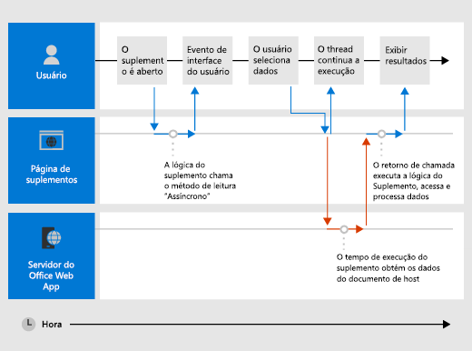

# <a name="asynchronous-programming-in-office-add-ins"></a>Programação assíncrona em Suplementos do Office

[!include[information about the common API](../includes/alert-common-api-info.md)]

Por que a API de Suplementos do Office usa a programação assíncrona? Como o JavaScript é uma linguagem de thread único, se o script invocar um processo síncrono demorado, todas as execuções subsequentes do script serão bloqueadas até que o processo seja concluído. Como determinadas operações em relação Office clientes Web (mas clientes ricos também) podem bloquear a execução se elas são executadas de forma síncrona, a maioria das APIs javaScript Office são projetadas para executar de forma assíncrona. Isso garante que os Office de Ads sejam responsivos e rápidos. Em geral, isso também requer que você escreva funções de retorno de chamada ao trabalhar com esses métodos assíncronos.

Os nomes de todos os métodos assíncronos na API terminam com "Async", como `Document.getSelectedDataAsync` os métodos , ou `Binding.getDataAsync` `Item.loadCustomPropertiesAsync` . Quando um método "Async" é chamado, ele é executado imediatamente e qualquer execução subsequente do script poderá continuar. A função de retorno de chamada opcional que você passar para um método de "Async" é executada assim que os dados ou a operação solicitada está pronta. Isso geralmente ocorre imediatamente, mas pode haver um pequeno atraso antes de retornar.

O diagrama a seguir mostra o fluxo de execução de uma chamada para um método "Async" que lê os dados selecionados pelo usuário em um documento aberto no Word ou no Excel. No ponto em que a chamada "Async" é feita, o thread de execução javascript é gratuito para executar qualquer processamento adicional do lado do cliente (embora nenhum seja mostrado no diagrama). Quando o método "Async" retorna, o retorno de chamada retoma a execução no thread, e o complemento pode acessar dados, fazer algo com ele e exibir o resultado. O mesmo padrão de execução assíncrona mantém ao trabalhar com os aplicativos cliente Office rich, como o Word 2013 ou Excel 2013.

*Figura 1. Fluxo de execução da programação assíncrona*



O suporte a este design assíncrono em clientes Web e avançados faz parte das metas de design "gravar plataforma cruzada já executada" do modelo de desenvolvimento de Suplementos do Office. Por exemplo, você pode criar um suplemento do painel de tarefas ou conteúdo com uma única base de código que será executada no Excel 2013 e Excel Online.

## <a name="write-the-callback-function-for-an-async-method"></a>Gravar a função de retorno de chamada para um método "Async"

A função de retorno de chamada que você passa como o argumento _de_ retorno de chamada para um método "Async" deve declarar um único parâmetro que o tempo de execução do complemento usará para fornecer acesso a um [objeto AsyncResult](/javascript/api/office/office.asyncresult) quando a função de retorno de chamada for executada. Você pode gravar:

- Uma função anônima que deve ser escrita e passada diretamente em linha com a chamada para o método "Async" como o parâmetro _de_ retorno de chamada do método "Async".

- Uma função nomeada, passando o nome dessa função como o _parâmetro de retorno_ de chamada de um método "Async".

Uma função anônima é útil se você só for usar seu código uma vez – porque ele não possui um nome, você não pode referenciá-la em outra parte do seu código. Uma função nomeada é útil se você quiser reutilizar a função retorno de chamada para mais de um método "Async".

### <a name="write-an-anonymous-callback-function"></a>Gravar uma função de retorno de chamada anônima

A função de retorno de chamada anônima a seguir declara um único parâmetro chamado que recupera dados da `result` [propriedade AsyncResult.value](/javascript/api/office/office.asyncresult#value) quando o retorno de chamada retorna.

```js
function (result) {
        write('Selected data: ' + result.value);
}
```

O exemplo a seguir mostra como passar essa função de retorno de chamada anônima na linha no contexto de uma chamada completa do método "Async" para o `Document.getSelectedDataAsync` método.

- O primeiro _argumento coercionType,_ , especifica para `Office.CoercionType.Text` retornar os dados selecionados como uma cadeia de caracteres de texto.

- O segundo _argumento de retorno_ de chamada é a função anônima passada em linha para o método. Quando a função é executada, ela usa o parâmetro result para acessar a propriedade do objeto para exibir os dados selecionados pelo usuário no  `value` `AsyncResult` documento.

```js
Office.context.document.getSelectedDataAsync(Office.CoercionType.Text, 
    function (result) {
        write('Selected data: ' + result.value);
    }
});

// Function that writes to a div with id='message' on the page.
function write(message){
    document.getElementById('message').innerText += message; 
}
```

Você também pode usar o parâmetro da função de retorno de chamada para acessar outras propriedades do `AsyncResult` objeto. Use a propriedade [AsyncResult.status](/javascript/api/office/office.asyncresult#status) para determinar se a chamada teve êxito ou falhou. Se sua chamada falhar, você pode usar a propriedade [AsyncResult.error](/javascript/api/office/office.asyncresult#error) para acessar um objeto [Error](/javascript/api/office/office.error) para informações sobre o erro.

Para obter mais informações sobre como usar o método, consulte Ler e gravar dados na seleção `getSelectedDataAsync` ativa em um documento ou [planilha.](read-and-write-data-to-the-active-selection-in-a-document-or-spreadsheet.md) 

### <a name="write-a-named-callback-function"></a>Gravar uma função de retorno de chamada nomeada

Como alternativa, você pode gravar uma função nomeada e passar seu nome para o parâmetro _de retorno_ de chamada de um método "Async". Por exemplo, o exemplo anterior pode ser reescrito para transmitir uma função chamada `writeDataCallback` como o parâmetro _callback_ assim.

```js
Office.context.document.getSelectedDataAsync(Office.CoercionType.Text, 
    writeDataCallback);

// Callback to write the selected data to the add-in UI.
function writeDataCallback(result) {
    write('Selected data: ' + result.value);
}

// Function that writes to a div with id='message' on the page.
function write(message){
    document.getElementById('message').innerText += message;
}
```


## <a name="differences-in-whats-returned-to-the-asyncresultvalue-property"></a>Diferenças entre o que é retornado para a propriedade AsyncResult.value

As propriedades , e do objeto retornam os mesmos tipos de informações para a função de retorno de chamada passada para todos os `asyncContext` `status` métodos `error` `AsyncResult` "Async". No entanto, o que é retornado à propriedade varia dependendo da funcionalidade `AsyncResult.value` do método "Async".

Por exemplo, os métodos (dos objetos `addHandlerAsync` [Binding](/javascript/api/office/office.binding), [CustomXmlPart](/javascript/api/office/office.customxmlpart), [Document,](/javascript/api/office/office.document) [RoamingSettings](/javascript/api/outlook/office.roamingsettings)e [Configurações)](/javascript/api/office/office.settings) são usados para adicionar funções de manipulador de eventos aos itens representados por esses objetos. Você pode acessar a propriedade a partir da função de retorno de chamada que passar para qualquer um dos métodos, mas como nenhum dado ou objeto está sendo acessado quando você adiciona um manipulador de eventos, a propriedade sempre retorna indefinida se você tentar `AsyncResult.value` `addHandlerAsync` acessá-lo. `value` 

Por outro lado, se você chamar o método, ele retornará os dados selecionados pelo usuário no documento para a propriedade `Document.getSelectedDataAsync` `AsyncResult.value` no retorno de chamada. Ou, se você chamar o [método Bindings.getAllAsync,](/javascript/api/office/office.bindings#getAllAsync_options__callback_) ele retornará uma matriz de todos os `Binding` objetos no documento. E, se você chamar o [método Bindings.getByIdAsync,](/javascript/api/office/office.bindings#getByIdAsync_id__options__callback_) ele retornará um único `Binding` objeto.

Para uma descrição do que é retornado à propriedade de um método, consulte a seção "Valor de retorno de chamada" do tópico de referência `AsyncResult.value` `Async` desse método. Para um resumo de todos os objetos que fornecem métodos, consulte a tabela na parte inferior do tópico do `Async` [objeto AsyncResult.](/javascript/api/office/office.asyncresult)

## <a name="asynchronous-programming-patterns"></a>Padrões de programação assíncrona

A Office JavaScript oferece suporte a dois tipos de padrões de programação assíncronos.

- Usando retornos de chamada aninhados
- Usando o padrão de promessas

A programação assíncrona com funções de retorno de chamada frequentemente exigem que você aninhe o resultado retornado de um retorno de chamada dentro de dois ou mais retornos de chamada. Se você precisar fazer isso, é possível usar retornos de chamada aninhados de todos os métodos "Async" da API.

Usar retornos de chamada aninhados é um padrão de programação familiar para a maioria dos desenvolvedores de JavaScript, mas códigos com retornos de chamada profundamente aninhados podem ser difíceis de ler e entender. Como alternativa aos retornos de chamada aninhados, Office API JavaScript também oferece suporte a uma implementação do padrão de promessas.

> [!NOTE]
> Na versão atual da API javaScript *Office,* o suporte interno para o padrão de promessas só funciona com código para vinculações em planilhas Excel e documentos [do Word.](bind-to-regions-in-a-document-or-spreadsheet.md) No entanto, você pode quebrar outras funções que têm retornos de chamada dentro de sua própria função de retorno de promessa personalizada. Para obter mais informações, [consulte Wrap Common APIs in Promise-returning functions](#wrap-common-apis-in-promise-returning-functions).

### <a name="asynchronous-programming-using-nested-callback-functions"></a>Programação assíncrona usando funções aninhadas de retorno de chamada

Frequentemente, você precisa executar duas ou mais operações assíncronas para concluir uma tarefa. Para fazer isso, você pode aninhar uma chamada "Async" dentro de outra.

O exemplo de código a seguir aninha duas ou mais chamadas assíncronas.

- Primeiro, o método [Bindings.getByIdAsync](/javascript/api/office/office.bindings#getByIdAsync_id__options__callback_) é chamado para acessar uma associação no documento chamado "MyBinding". O objeto retornado ao parâmetro desse retorno de chamada fornece `AsyncResult` acesso ao objeto de associação especificado da `result` `AsyncResult.value` propriedade.
- Em seguida, o objeto binding acessado do primeiro `result` parâmetro é usado para chamar o método [Binding.getDataAsync.](/javascript/api/office/office.binding#getDataAsync_options__callback_)
- Por fim, o parâmetro do retorno de chamada passado para o método é usado para `result2` exibir os dados na `Binding.getDataAsync` associação.

```js
function readData() {
    Office.context.document.bindings.getByIdAsync("MyBinding", function (result) {
        result.value.getDataAsync({ coercionType: 'text' }, function (result2) {
            write(result2.value);
        });
    });
}

// Function that writes to a div with id='message' on the page.
function write(message){
    document.getElementById('message').innerText += message; 
}
```

Esse padrão de retorno de chamada aninhado básico pode ser usado para todos os métodos assíncronos Office API JavaScript.

As seções a seguir mostram como usar funções anônimas ou nomeadas para retornos de chamada aninhados em métodos assíncronos.

#### <a name="use-anonymous-functions-for-nested-callbacks"></a>Usar funções anônimas para retornos de chamada aninhados

No exemplo a seguir, duas funções anônimas são declaradas em linha e passadas para os métodos e como retornos de `getByIdAsync` `getDataAsync` chamada aninhados. Como as funções são simples e embutidas, a intenção da implementação fica imediatamente clara.

```js
Office.context.document.bindings.getByIdAsync('myBinding', function (bindingResult) {
    bindingResult.value.getDataAsync(function (getResult) {
        if (getResult.status == Office.AsyncResultStatus.Failed) {
            write('Action failed. Error: ' + asyncResult.error.message);
        } else {
            write('Data has been read successfully.');
        }
    });
});

// Function that writes to a div with id='message' on the page.
function write(message){
    document.getElementById('message').innerText += message;
}
```

#### <a name="use-named-functions-for-nested-callbacks"></a>Usar funções nomeadas para retornos de chamada aninhados

Em implementações complexas, pode ser útil usar funções nomeadas para facilitar a leitura, manutenção e reutilização do seu código. No exemplo a seguir, as duas funções anônimas do exemplo na seção anterior foram reescritas como funções nomeadas `deleteAllData` e `showResult` . Essas funções nomeadas são então passadas para os métodos `getByIdAsync` e `deleteAllDataValuesAsync` como retornos de chamada por nome.

```js
Office.context.document.bindings.getByIdAsync('myBinding', deleteAllData);

function deleteAllData(asyncResult) {
    asyncResult.value.deleteAllDataValuesAsync(showResult);
}

function showResult(asyncResult) {
    if (asyncResult.status == Office.AsyncResultStatus.Failed) {
        write('Action failed. Error: ' + asyncResult.error.message);
    } else {
        write('Data has been deleted successfully.');
    }
}

// Function that writes to a div with id='message' on the page.
function write(message){
    document.getElementById('message').innerText += message;
}
```

### <a name="asynchronous-programming-using-the-promises-pattern-to-access-data-in-bindings"></a>Programação assíncrona usando o padrão de promessas para acessar dados em associações

Em vez de transmitir a função de retorno de chamada e aguardar até que a função retorne antes da continuação da execução, o padrão de programação de promessas retorna imediatamente retorna um objeto de promessa que representa o resultado desejado. No entanto, ao contrário da verdadeira programação síncrona, nos bastidores o cumprimento do resultado prometido é, na verdade, adiado até que o ambiente de tempo de execução dos Suplementos do Office possa concluir a solicitação. Um manipulador _onError_ é fornecido para atender a situações em que a solicitação não pode ser cumprida.

A Office API JavaScript fornece o [método Office.select](/javascript/api/office#Office_select_expression__callback_) para dar suporte ao padrão de promessas para trabalhar com objetos de associação existentes. O objeto promise retornado ao método dá suporte apenas aos quatro métodos que você pode acessar diretamente do objeto `Office.select` [Binding:](/javascript/api/office/office.binding) [getDataAsync](/javascript/api/office/office.binding#getDataAsync_options__callback_), [setDataAsync,](/javascript/api/office/office.binding#setDataAsync_data__options__callback_) [addHandlerAsync](/javascript/api/office/office.binding#addHandlerAsync_eventType__handler__options__callback_)e [removeHandlerAsync](/javascript/api/office/office.binding#removeHandlerAsync_eventType__options__callback_).

O padrão de promessas para trabalhar com vinculações assume esse formulário.

**Office.select(**_selectorExpression_, _onError_**).** _BindingObjectAsyncMethod_

O _parâmetro selectorExpression_ assume o formulário , onde bindingId é o nome ( ) de uma associação que você criou anteriormente no documento ou planilha (usando um dos métodos `"bindings#bindingId"`  `id` "addFrom" da `Bindings` coleção: `addFromNamedItemAsync` , , ou `addFromPromptAsync` `addFromSelectionAsync` ). Por exemplo, a expressão seletor especifica que você deseja acessar a associação `bindings#cities` com uma **id** de "cidades".

O _parâmetro onError_ é uma função de tratamento de erros que utiliza um único parâmetro do tipo que pode ser usado para acessar um objeto, se o método não acessar a `AsyncResult` associação `Error` `select` especificada. O exemplo a seguir mostra uma função de manipulador de erro básica que pode ser transmitida para o parâmetro _onError_.

```js
function onError(result){
    var err = result.error;
    write(err.name + ": " + err.message);
}
// Function that writes to a div with id='message' on the page.
function write(message){
    document.getElementById('message').innerText += message; 
}
```

Substitua o espaço reservado _BindingObjectAsyncMethod_ por uma chamada para qualquer um dos quatro métodos de objeto suportados pelo `Binding` objeto promise: `getDataAsync` , , `setDataAsync` ou `addHandlerAsync` `removeHandlerAsync` . As chamadas para esses métodos não oferecem suporte a promessas adicionais. Você deve chamá-los usando o [padrão de função de retorno de chamada aninhado](#asynchronous-programming-using-nested-callback-functions).

Depois que uma promessa de objeto é cumprida, ela pode ser reutilizada na chamada de método encadeado como se fosse uma associação (o tempo de execução do add-in não repetirá a promessa de forma assíncrona). `Binding` Se a promessa de objeto não puder ser cumprida, o tempo de execução do add-in tentará novamente acessar o objeto de associação na próxima vez que um de seus `Binding` métodos assíncronos for invocado.

O exemplo de código a seguir usa o método para recuperar uma associação com o " " da coleção e chama o `select` `id` método `cities` `Bindings` [addHandlerAsync](/javascript/api/office/office.binding#addHandlerAsync_eventType__handler__options__callback_) para adicionar um manipulador de eventos para o [evento dataChanged](/javascript/api/office/office.bindingdatachangedeventargs) da associação.

```js
function addBindingDataChangedEventHandler() {
    Office.select("bindings#cities", function onError(){/* error handling code */}).addHandlerAsync(Office.EventType.BindingDataChanged,
    function (eventArgs) {
        doSomethingWithBinding(eventArgs.binding);
    });
}

```

> [!IMPORTANT]
> A `Binding` promessa de objeto retornada pelo método fornece acesso apenas aos quatro métodos do `Office.select` `Binding` objeto. Se você precisar acessar qualquer um dos outros membros do objeto, em vez disso, você deve usar a propriedade e os métodos `Binding` `Document.bindings` para recuperar o `Bindings.getByIdAsync` `Bindings.getAllAsync` `Binding` objeto. Por exemplo, se você precisar acessar qualquer uma das propriedades do objeto (as propriedades , ou precisar acessar as propriedades dos objetos `Binding` `document` `id` `type` [MatrixBinding](/javascript/api/office/office.matrixbinding) ou [TableBinding),](/javascript/api/office/office.tablebinding) `getByIdAsync` `getAllAsync` você deve usar os métodos ou para recuperar um `Binding` objeto.

## <a name="pass-optional-parameters-to-asynchronous-methods"></a>Passar parâmetros opcionais para métodos assíncronos

A sintaxe comum para todos os métodos "Async" segue esse padrão.

 _AsyncMethod_ `(`_RequiredParameters_`, [`_OptionalParameters_`],`_CallbackFunction_`);`

Todos os métodos assíncronos dão suporte parâmetros opcionais, que são passados como um objeto JSON (JavaScript Object Notation) contendo um ou mais parâmetros opcionais. O objeto JSON que contém os parâmetros opcionais é uma coleção desordenada de pares de valores e chaves com o caractere ":" separando os valores e as chaves. Cada par do objeto é separado por vírgula e o conjunto completo de pares é incluído entre chaves. A chave é o nome do parâmetro e o valor é o valor a ser transmitido para esse parâmetro.

Você pode criar o objeto JSON que contém parâmetros opcionais em linha ou criando um objeto e `options` passando-o como o parâmetro _options._

### <a name="pass-optional-parameters-inline"></a>Passar parâmetros opcionais em linha

Por exemplo, a sintaxe para chamar o método [Document.setSelectedDataAsync](/javascript/api/office/office.document#setSelectedDataAsync_data__options__callback_) com parâmetros opcionais embutidos tem esta aparência:

```js
 Office.context.document.setSelectedDataAsync(data, {coercionType: 'coercionType', asyncContext: 'asyncContext'},callback);

```

Nesta forma da sintaxe de chamada, os dois parâmetros opcionais, _coercionType_ e _asyncContext_, são definidos como um objeto JSON em linha entre chaves.

O exemplo a seguir mostra como chamar o método `Document.setSelectedDataAsync` especificando parâmetros opcionais em linha.

```js
Office.context.document.setSelectedDataAsync(
    "<html><body>hello world</body></html>",
    {coercionType: "html", asyncContext: 42},
    function(asyncResult) {
        write(asyncResult.status + " " + asyncResult.asyncContext);
    }
)

// Function that writes to a div with id='message' on the page.
function write(message){
    document.getElementById('message').innerText += message; 
}
```

> [!NOTE]
> É possível especificar parâmetros opcionais em qualquer ordem no objeto JSON desde que seus nomes sejam especificados corretamente.

### <a name="pass-optional-parameters-in-an-options-object"></a>Passar parâmetros opcionais em um objeto options

Como alternativa, você pode criar um objeto chamado que especifica os parâmetros opcionais separadamente da chamada de método e, em seguida, passar o objeto `options` `options` como o argumento _options._

O exemplo a seguir mostra uma maneira de criar o objeto, onde , e assim por diante, são espaços reservados para os nomes e valores de `options` `parameter1` `value1` parâmetros reais.

```js
var options = {
    parameter1: value1,
    parameter2: value2,
    ...
    parameterN: valueN
};

```

Que é semelhante ao exemplo a seguir quando usado para especificar os parâmetros [ValueFormat](/javascript/api/office/office.valueformat) e [FilterType](/javascript/api/office/office.filtertype).

```js
var options = {
    valueFormat: "unformatted",
    filterType: "all"
};
```

Aqui está outra maneira de criar o `options` objeto.

```js
var options = {};
options[parameter1] = value1;
options[parameter2] = value2;
...
options[parameterN] = valueN;
```

Que se parece com o exemplo a seguir quando usado para especificar `ValueFormat` os `FilterType` parâmetros e:

```js
var options = {};
options["ValueFormat"] = "unformatted";
options["FilterType"] = "all";
```

> [!NOTE]
> Ao usar qualquer método de criação do objeto, você pode especificar parâmetros opcionais em qualquer ordem, desde que `options` seus nomes sejam especificados corretamente.

O exemplo a seguir mostra como chamar o método `Document.setSelectedDataAsync` especificando parâmetros opcionais em um `options` objeto.

```js
var options = {
   coercionType: "html",
   asyncContext: 42
};

document.setSelectedDataAsync(
    "<html><body>hello world</body></html>",
    options,
    function(asyncResult) {
        write(asyncResult.status + " " + asyncResult.asyncContext);
    }
)

// Function that writes to a div with id='message' on the page.
function write(message){
    document.getElementById('message').innerText += message; 
}
```

Em ambos os exemplos de parâmetro opcional, o parâmetro _callback_ é especificado como o último parâmetro (seguindo os parâmetros opcionais em linha ou seguindo o _objeto de argumento options)._ Como alternativa, você pode especificar o parâmetro _callback_ dentro o objeto JSON embutido ou no objeto `options`. No entanto, você pode transmitir o parâmetro _callback_ em um só local: no objeto _options_ (embutido ou criado externamente) ou como o último parâmetro, mas não ambos.

## <a name="wrap-common-apis-in-promise-returning-functions"></a>Wrap COMMON APIs in Promise-returning functions

Os métodos API comum (e Outlook API) não [retornam Promessas](https://developer.mozilla.org/docs/Web/JavaScript/Reference/Global_Objects/Promise). Portanto, você não pode usar [a espera](https://developer.mozilla.org/docs/Web/JavaScript/Reference/Operators/await) para pausar a execução até que a operação assíncrona seja concluída. Se precisar de `await` comportamento, você pode envolver a chamada de método em um Promise criado explicitamente. 

O padrão básico é criar um método *assíncrono* que retorna um objeto Promise imediatamente e  resolve esse objeto Promise quando o método interno é concluído ou rejeita o objeto se o método falhar. Apresentamos um exemplo simples a seguir.

```javascript
function getDocumentFilePath() {
    return new OfficeExtension.Promise(function (resolve, reject) {
        try {
            Office.context.document.getFilePropertiesAsync(function (asyncResult) {
                resolve(asyncResult.value.url);
            });
        }
        catch (error) {
            reject(WordMarkdownConversion.errorHandler(error));
        }
    })
}
```

Quando esse método precisa ser aguardado, ele pode ser chamado com a palavra-chave ou como `await` a função passada para uma `then` função.

> [!NOTE]
> Essa técnica é especialmente útil quando você precisa chamar uma das APIs Comuns dentro de uma chamada do método em um dos modelos de objeto `run` específicos do aplicativo. Para ver um exemplo da função acima usada dessa maneira, consulte o arquivo [Home.js no exemplo Word-Add-in-JavaScript-MDConversion](https://github.com/OfficeDev/Word-Add-in-MarkdownConversion/blob/master/Word-Add-in-JavaScript-MDConversionWeb/Home.js).

A seguir está um exemplo usando TypeScript.

```typescript
readDocumentFileAsync(): Promise<any> {
    return new Promise((resolve, reject) => {
        const chunkSize = 65536;
        const self = this;

        Office.context.document.getFileAsync(Office.FileType.Compressed, { sliceSize: chunkSize }, (asyncResult) => {
            if (asyncResult.status === Office.AsyncResultStatus.Failed) {
                reject(asyncResult.error);
            } else {
                // `getAllSlices` is a Promise-wrapped implementation of File.getSliceAsync.
                self.getAllSlices(asyncResult.value).then(result => {
                    if (result.IsSuccess) {
                        resolve(result.Data);
                    } else {
                        reject(asyncResult.error);
                    }
                });
            }
        });
    });
}
```

## <a name="see-also"></a>Confira também

- [Entendendo a API de JavaScript do Office](understanding-the-javascript-api-for-office.md)
- [API JavaScript para Office](../reference/javascript-api-for-office.md)
