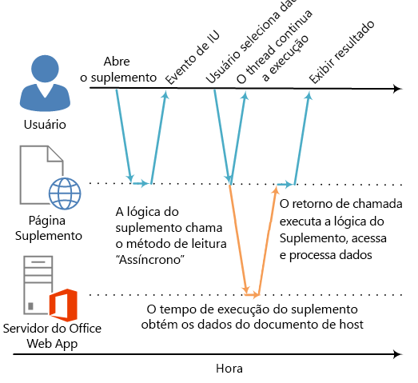

# <a name="asynchronous-programming-in-office-add-ins"></a><span data-ttu-id="a0a65-102">Programação assíncrona em Suplementos do Office</span><span class="sxs-lookup"><span data-stu-id="a0a65-102">Asynchronous programming in Office Add-ins</span></span>

<span data-ttu-id="a0a65-p101">Por que a API de Suplementos do Office usa a programação assíncrona? Como o JavaScript é uma linguagem de thread único, se o script invocar um processo síncrono demorado, todas as execuções subsequentes do script serão bloqueadas até que o processo seja concluído. Como certas operações para clientes Web do Office (mas também para clientes avançados) podem impedir a execução se estiverem sendo executadas em sincronia, a maioria dos métodos na API do JavaScript para Office foi desenvolvido para execução assíncrona. Isso garante que os Suplementos do Office sejam responsivos e tenham alto desempenho. Em geral, isso também requer que você escreva funções de retorno de chamada ao trabalhar com esses métodos assíncronos.</span><span class="sxs-lookup"><span data-stu-id="a0a65-p101">Why does the Office Add-ins API use asynchronous programming? Because JavaScript is a single-threaded language, if script invokes a long-running synchronous process, all subsequent script execution will be blocked until that process completes. Because certain operations against Office web clients (but rich clients as well) could block execution if they are run synchronously, most of the methods in the JavaScript API for Office are designed to execute asynchronously. This makes sure that Office Add-ins are responsive and highly performing. It also frequently requires you to write callback functions when working with these asynchronous methods.</span></span>

<span data-ttu-id="a0a65-p102">Os nomes de todos os métodos assíncronos na API terminam com "Async", como os métodos [Document.getSelectedDataAsync](https://dev.office.com/reference/add-ins/shared/document.getselecteddataasync), [Binding.getDataAsync](https://dev.office.com/reference/add-ins/shared/binding.getdataasync) ou [Item.loadCustomPropertiesAsync](https://dev.office.com/reference/add-ins/outlook/Office.context.mailbox.item). Quando um método "Async" é chamado, ele é executado imediatamente e qualquer execução subsequente do script poderá continuar. A função de retorno de chamada opcional que você passar para um método de "Async" é executada assim que os dados ou a operação solicitada está pronta. Isso geralmente ocorre imediatamente, mas pode haver um pequeno atraso antes de retornar.</span><span class="sxs-lookup"><span data-stu-id="a0a65-p102">The names of all asynchronous methods in the API end with "Async", such as the  [Document.getSelectedDataAsync](https://dev.office.com/reference/add-ins/shared/document.getselecteddataasync), [Binding.getDataAsync](https://dev.office.com/reference/add-ins/shared/binding.getdataasync), or [Item.loadCustomPropertiesAsync](https://dev.office.com/reference/add-ins/outlook/Office.context.mailbox.item) methods. When an "Async" method is called, it executes immediately and any subsequent script execution can continue. The optional callback function you pass to an "Async" method executes as soon as the data or requested operation is ready. This generally occurs promptly, but there can be a slight delay before it returns.</span></span>

<span data-ttu-id="a0a65-p103">O diagrama a seguir mostra o fluxo de execução de uma chamada para um método de "Async" que lê os dados selecionados pelo usuário em um documento aberto no Word Online ou Excel Online baseados no servidor. No ponto em que a chamada "Async" é feita, o thread de execução do JavaScript fica livre para executar qualquer processamento adicional do lado do cliente. (Embora nenhum seja mostrado no diagrama.) Quando o método "Async" retorna, o retorno de chamada retoma a execução no thread e o suplemento pode acessar os dados, fazer algo com eles e exibir os resultados. O mesmo padrão de execução assíncrona ocorre ao trabalhar com aplicativos host de clientes avançados do Office, como Word 2013 ou Excel 2013.</span><span class="sxs-lookup"><span data-stu-id="a0a65-p103">The following diagram shows the flow of execution for a call to an "Async" method that reads the data the user selected in a document open in the server-based Word Online or Excel Online. At the point when the "Async" call is made, the JavaScript execution thread is free to perform any additional client-side processing. (Although none are shown in the diagram.) When the "Async" method returns, the callback resumes execution on the thread, and the add-in can the access data, do something with it, and display the result. The same asynchronous execution pattern holds when working with the Office rich client host applications, such as Word 2013 or Excel 2013.</span></span>

<span data-ttu-id="a0a65-116">*Figura 1. Fluxo de execução da programação assíncrono*</span><span class="sxs-lookup"><span data-stu-id="a0a65-116">*Figure 1. Asynchronous programing execution flow*</span></span>



<span data-ttu-id="a0a65-p104">O suporte a esse design assíncrono em clientes Web e avançados faz parte das metas de design "gravar plataforma cruzada já executada" do modelo de desenvolvimento de Suplementos do Office. Por exemplo, você pode um suplemento do painel de tarefas ou conteúdo com uma única base de código que será executada no Excel 2013 e Excel Online.</span><span class="sxs-lookup"><span data-stu-id="a0a65-p104">Support for this asynchronous design in both rich and web clients is part of the "write once-run cross-platform" design goals of the Office Add-ins development model. For example, you can create a content or task pane add-in with a single code base that will run in both Excel 2013 and Excel Online.</span></span>

## <a name="writing-the-callback-function-for-an-async-method"></a><span data-ttu-id="a0a65-120">Gravar a função de retorno de chamada para um método "Async"</span><span class="sxs-lookup"><span data-stu-id="a0a65-120">Writing the callback function for an "Async" method</span></span>


<span data-ttu-id="a0a65-p105">A função de retorno de chamada que você transmite como o argumento _callback_ para um método de "Async" deve declarar um único parâmetro que o tempo de execução do suplemento usará para fornecer acesso a um objeto [AsyncResult](https://dev.office.com/reference/add-ins/shared/asyncresult) quando a função de retorno de chamada for executada. Você pode gravar:</span><span class="sxs-lookup"><span data-stu-id="a0a65-p105">The callback function you pass as the  _callback_ argument to an "Async" method must declare a single parameter that the add-in runtime will use to provide access to an [AsyncResult](https://dev.office.com/reference/add-ins/shared/asyncresult) object when the callback function executes. You can write:</span></span>


- <span data-ttu-id="a0a65-123">Uma função anônima que deve ser gravada e transmitida diretamente embutida com a chamada para o método "Async" como o parâmetro _callback_ do método "Async".</span><span class="sxs-lookup"><span data-stu-id="a0a65-123">An anonymous function that must be written and passed directly in line with the call to the "Async" method as the  _callback_ parameter of the "Async" method.</span></span>
    
- <span data-ttu-id="a0a65-124">Uma função nomeada, transmitindo o nome da função como o parâmetro _callback_ de um método "Async".</span><span class="sxs-lookup"><span data-stu-id="a0a65-124">A named function, passing the name of that function as the  _callback_ parameter of an "Async" method.</span></span>
    
<span data-ttu-id="a0a65-p106">Uma função anônima é útil se você só for usar seu código uma vez – porque ele não possui um nome, você não pode referenciá-la em outra parte do seu código. Uma função nomeada é útil se você quiser reutilizar a função retorno de chamada para mais de um método "Async".</span><span class="sxs-lookup"><span data-stu-id="a0a65-p106">An anonymous function is useful if you are only going to use its code once - because it has no name, you can't reference it in another part of your code. A named function is useful if you want to reuse the callback function for more than one "Async" method.</span></span>


### <a name="writing-an-anonymous-callback-function"></a><span data-ttu-id="a0a65-127">Gravar uma função de retorno de chamada anônima</span><span class="sxs-lookup"><span data-stu-id="a0a65-127">Writing an anonymous callback function</span></span>

<span data-ttu-id="a0a65-128">A seguinte função de retorno de chamada anônima declara um único parâmetro chamado `result` que recupera os dados da propriedade [AsyncResult.value](https://dev.office.com/reference/add-ins/shared/asyncresult.status) quando o retorno de chamada retornar.</span><span class="sxs-lookup"><span data-stu-id="a0a65-128">The following anonymous callback function declares a single parameter named  `result` that retrieves data from the [AsyncResult.value](https://dev.office.com/reference/add-ins/shared/asyncresult.status) property when the callback returns.</span></span>


```js
function (result) {
        write('Selected data: ' + result.value);
}
```

<span data-ttu-id="a0a65-129">O exemplo a seguir mostra como transmitir essa função de retorno de chamada anônima de acordo com o contexto de um retorno de chamada completo do método "Async" para o método **Document.getSelectedDataAsync**.</span><span class="sxs-lookup"><span data-stu-id="a0a65-129">The following example shows how to pass this anonymous callback function in line in the context of a full "Async" method call to the  **Document.getSelectedDataAsync** method.</span></span>


- <span data-ttu-id="a0a65-130">O primeiro argumento _coercionType_, `Office.CoercionType.Text`, especifica para retornar os dados selecionados como uma cadeia de texto.</span><span class="sxs-lookup"><span data-stu-id="a0a65-130">The first  _coercionType_ argument, `Office.CoercionType.Text`, specifies to return the selected data as a string of text.</span></span>
    
- <span data-ttu-id="a0a65-p107">O segundo argumento _callback_ é a função anônima transmitida de acordo com o método. Quando a função é executada, ela usa o parâmetro _result_ para acessar a propriedade **value** do objeto **AsyncResult** para exibir os dados selecionados pelo usuário no documento.</span><span class="sxs-lookup"><span data-stu-id="a0a65-p107">The second  _callback_ argument is the anonymous function passed in-line to the method. When the function executes, it uses the _result_ parameter to access the **value** property of the **AsyncResult** object to display the data selected by the user in the document.</span></span>
    


```js
Office.context.document.getSelectedDataAsync(Office.CoercionType.Text, 
    function (result) {
        write('Selected data: ' + result.value);
    }
});

// Function that writes to a div with id='message' on the page.
function write(message){
    document.getElementById('message').innerText += message; 
}
```

<span data-ttu-id="a0a65-p108">Você também pode usar o parâmetro da sua função de retorno de chamada para acessar outras propriedades do objeto **AsyncResult**. Use a propriedade [AsyncResult.status](https://dev.office.com/reference/add-ins/shared/asyncresult.error) para determinar se a chamada teve êxito ou falhou. Se sua chamada falhar, você pode usar a propriedade [AsyncResult.error](https://dev.office.com/reference/add-ins/shared/asyncresult.context) para acessar um objeto [Error](https://dev.office.com/reference/add-ins/shared/error) para informações sobre o erro.</span><span class="sxs-lookup"><span data-stu-id="a0a65-p108">You can also use the parameter of your callback function to access other properties of the  **AsyncResult** object. Use the [AsyncResult.status](https://dev.office.com/reference/add-ins/shared/asyncresult.error) property to determine if the call succeeded or failed. If your call fails you can use the [AsyncResult.error](https://dev.office.com/reference/add-ins/shared/asyncresult.context) property to access an [Error](https://dev.office.com/reference/add-ins/shared/error) object for error information.</span></span>

<span data-ttu-id="a0a65-136">Para saber mais sobre como usar o método **getSelectedDataAsync**, consulte [Ler e gravar dados na seção seleção ativa em um documento ou planilha](read-and-write-data-to-the-active-selection-in-a-document-or-spreadsheet.md).</span><span class="sxs-lookup"><span data-stu-id="a0a65-136">For more information about using the  **getSelectedDataAsync** method, see [Read and write data to the active selection in a document or spreadsheet](read-and-write-data-to-the-active-selection-in-a-document-or-spreadsheet.md).</span></span> 


### <a name="writing-a-named-callback-function"></a><span data-ttu-id="a0a65-137">Gravar uma função de retorno de chamada nomeada</span><span class="sxs-lookup"><span data-stu-id="a0a65-137">Writing a named callback function</span></span>

<span data-ttu-id="a0a65-p109">Como alternativa, você pode escrever uma função nomeada e transmitir o nome dela para o parâmetro _callback_ de um método "Async". Por exemplo, o exemplo anterior pode ser reescrito para transmitir uma função chamada `writeDataCallback` como o parâmetro _callback_ assim.</span><span class="sxs-lookup"><span data-stu-id="a0a65-p109">Alternatively, you can write a named function and pass its name to the  _callback_ parameter of an "Async" method. For example, the previous example can be rewritten to pass a function named `writeDataCallback` as the _callback_ parameter like this.</span></span>


```js
Office.context.document.getSelectedDataAsync(Office.CoercionType.Text, 
    writeDataCallback);

// Callback to write the selected data to the add-in UI.
function writeDataCallback(result) {
    write('Selected data: ' + result.value);
}

// Function that writes to a div with id='message' on the page.
function write(message){
    document.getElementById('message').innerText += message; 
}
```


## <a name="differences-in-whats-returned-to-the-asyncresultvalue-property"></a><span data-ttu-id="a0a65-140">Diferenças entre o que é retornado para a propriedade AsyncResult.value</span><span class="sxs-lookup"><span data-stu-id="a0a65-140">Differences in what's returned to the AsyncResult.value property</span></span>


<span data-ttu-id="a0a65-p110">As propriedades **asyncContext**, **status** e **error** do objeto **AsyncResult** retornam os mesmos tipos de informações para a função de retorno de chamada transmitida para todos os métodos de "Async". No entanto, o que é retornado para a propriedade **AsyncResult.value** varia de acordo com a funcionalidade do método "Async".</span><span class="sxs-lookup"><span data-stu-id="a0a65-p110">The  **asyncContext**,  **status**, and  **error** properties of the **AsyncResult** object return the same kinds of information to the callback function passed to all "Async" methods. However, what's returned to the **AsyncResult.value** property varies depending on the functionality of the "Async" method.</span></span>

<span data-ttu-id="a0a65-p111">Por exemplo, os métodos **addHandlerAsync** (dos objetos [Binding](https://dev.office.com/reference/add-ins/shared/binding), [CustomXmlPart](https://dev.office.com/reference/add-ins/shared/customxmlpart.customxmlpart), [Document](https://dev.office.com/reference/add-ins/shared/document), [RoamingSettings](https://dev.office.com/reference/add-ins/outlook/RoamingSettings) e [Settings](https://dev.office.com/reference/add-ins/shared/settings)) são usados para adicionar funções de manipulador de eventos aos itens representados por esses objetos. Você pode acessar a propriedade **AsyncResult.value** a partir da função de retorno de chamada transmitida para qualquer um dos métodos **addHandlerAsync**, mas como nenhum dado ou objeto está sendo acessado quando você adiciona um manipulador de eventos, a propriedade **value** sempre retornará **undefined** se você tentar acessá-la.</span><span class="sxs-lookup"><span data-stu-id="a0a65-p111">For example, the  **addHandlerAsync** methods (of the [Binding](https://dev.office.com/reference/add-ins/shared/binding), [CustomXmlPart](https://dev.office.com/reference/add-ins/shared/customxmlpart.customxmlpart), [Document](https://dev.office.com/reference/add-ins/shared/document), [RoamingSettings](https://dev.office.com/reference/add-ins/outlook/RoamingSettings), and [Settings](https://dev.office.com/reference/add-ins/shared/settings) objects) are used to add event handler functions to the items represented by these objects. You can access the **AsyncResult.value** property from the callback function you pass to any of the **addHandlerAsync** methods, but since no data or object is being accessed when you add an event handler, the **value** property always returns **undefined** if you attempt to access it.</span></span>

<span data-ttu-id="a0a65-p112">Por outro lado, se você chamar o método **Document.getSelectedDataAsync**, ele retornará os dados que os usuários selecionaram no documento para a propriedade **AsyncResult.value** no retorno de chamada. Ou, se você chamar o método [Bindings.getAllAsync](https://dev.office.com/reference/add-ins/shared/bindings.getallasync), ele retornará uma matriz de todos os objetos **Binding** no documento. E se você chamar o método [Bindings.getByIdAsync](https://dev.office.com/reference/add-ins/shared/bindings.getbyidasync), ele retornará um único objeto **Binding**.</span><span class="sxs-lookup"><span data-stu-id="a0a65-p112">On the other hand, if you call the  **Document.getSelectedDataAsync** method, it returns the data the user selected in the document to the **AsyncResult.value** property in the callback. Or, if you call the [Bindings.getAllAsync](https://dev.office.com/reference/add-ins/shared/bindings.getallasync) method, it returns an array of all of the **Binding** objects in the document. And, if you call the [Bindings.getByIdAsync](https://dev.office.com/reference/add-ins/shared/bindings.getbyidasync) method, it returns a single **Binding** object.</span></span>

<span data-ttu-id="a0a65-p113">Para obter uma descrição do que é retornado para a propriedade **AsyncResult.value** para um método "Async", consulte a seção "Valor de retorno de chamada" do tópico de referência do método. Para obter um resumo de todos os objetos que oferecem métodos "Async", consulte a tabela na parte inferior do tópico do objeto [AsyncResult](https://dev.office.com/reference/add-ins/shared/asyncresult).</span><span class="sxs-lookup"><span data-stu-id="a0a65-p113">For a description of what's returned to the  **AsyncResult.value** property for an "Async" method, see the "Callback value" section of that method's reference topic. For a summary of all of the objects that provide "Async" methods, see the table at the bottom of the [AsyncResult](https://dev.office.com/reference/add-ins/shared/asyncresult) object topic.</span></span>


## <a name="asynchronous-programming-patterns"></a><span data-ttu-id="a0a65-150">Padrões de programação assíncrona</span><span class="sxs-lookup"><span data-stu-id="a0a65-150">Asynchronous programming patterns</span></span>


<span data-ttu-id="a0a65-151">A API do JavaScript para o Office oferece suporte a dois tipos de padrões de programação assíncrona:</span><span class="sxs-lookup"><span data-stu-id="a0a65-151">The JavaScript API for Office supports two kinds of asynchronous programming patterns:</span></span>


- <span data-ttu-id="a0a65-152">Usando retornos de chamada aninhados</span><span class="sxs-lookup"><span data-stu-id="a0a65-152">Using nested callbacks</span></span>
    
- <span data-ttu-id="a0a65-153">Usando o padrão de promessas</span><span class="sxs-lookup"><span data-stu-id="a0a65-153">Using the promises pattern</span></span>
    
<span data-ttu-id="a0a65-p114">A programação assíncrona com funções de retorno de chamada frequentemente exigem que você aninhe o resultado retornado de um retorno de chamada dentro de dois ou mais retornos de chamada. Se você precisar fazer isso, é possível usar retornos de chamada aninhados de todos os métodos "Async" da API.</span><span class="sxs-lookup"><span data-stu-id="a0a65-p114">Asynchronous programming with callback functions frequently requires you to nest the returned result of one callback within two or more callbacks. If you need to do so, you can use nested callbacks from all "Async" methods of the API.</span></span>

<span data-ttu-id="a0a65-p115">Usar retornos de chamada aninhados é um padrão de programação familiar para a maioria dos desenvolvedores de JavaScript, mas códigos com retornos de chamada profundamente aninhados podem ser difíceis de ler e entender. Como alternativa para retornos de chamada aninhados, a API do JavaScript para o Office também oferece suporte a uma implementação do padrão de promessas. No entanto, na versão atual da API do JavaScript para o Office, o padrão de promessas só funciona com o código para [associação em planilhas do Excel e documentos do Word](bind-to-regions-in-a-document-or-spreadsheet.md).</span><span class="sxs-lookup"><span data-stu-id="a0a65-p115">Using nested callbacks is a programming pattern familiar to most JavaScript developers, but code with deeply nested callbacks can be difficult to read and understand. As an alternative to nested callbacks, the JavaScript API for Office also supports an implementation of the promises pattern. However, in the current version of the JavaScript API for Office, the promises pattern only works with code for [bindings in Excel spreadsheets and Word documents](bind-to-regions-in-a-document-or-spreadsheet.md).</span></span>

<a name="AsyncProgramming_NestedCallbacks" />
### <a name="asynchronous-programming-using-nested-callback-functions"></a><span data-ttu-id="a0a65-159">Programação assíncrona usando funções aninhadas de retorno de chamada</span><span class="sxs-lookup"><span data-stu-id="a0a65-159">Asynchronous programming using nested callback functions</span></span>


<span data-ttu-id="a0a65-p116">Frequentemente, você precisa executar duas ou mais operações assíncronas para concluir uma tarefa. Para fazer isso, você pode aninhar uma chamada "Async" dentro de outra.</span><span class="sxs-lookup"><span data-stu-id="a0a65-p116">Frequently, you need to perform two or more asynchronous operations to complete a task. To accomplish that, you can nest one "Async" call inside another.</span></span> 

<span data-ttu-id="a0a65-162">O exemplo de código a seguir aninha duas ou mais chamadas assíncronas.</span><span class="sxs-lookup"><span data-stu-id="a0a65-162">The following code example nests two asynchronous calls.</span></span> 


- <span data-ttu-id="a0a65-p117">Primeiro, o método [Bindings.getByIdAsync](https://dev.office.com/reference/add-ins/shared/bindings.getbyidasync) é chamado para acessar uma associação no documento chamado "MyBinding". O objeto **AsyncResult** retornado para o parâmetro `result` do retorno de chamada fornece acesso ao objeto de associação especificado da propriedade **AsyncResult.value**.</span><span class="sxs-lookup"><span data-stu-id="a0a65-p117">First, the [Bindings.getByIdAsync](https://dev.office.com/reference/add-ins/shared/bindings.getbyidasync) method is called to access a binding in the document named "MyBinding". The **AsyncResult** object returned to the `result` parameter of that callback provides access to the specified binding object from the **AsyncResult.value** property.</span></span>
    
- <span data-ttu-id="a0a65-165">Em seguida, o objeto de associação acessado do primeiro parâmetro `result` é usado para chamar o método [Binding.getDataAsync](https://dev.office.com/reference/add-ins/shared/binding.getdataasync).</span><span class="sxs-lookup"><span data-stu-id="a0a65-165">Then, the binding object accessed from the first  `result` parameter is used to call the [Binding.getDataAsync](https://dev.office.com/reference/add-ins/shared/binding.getdataasync) method.</span></span>
    
- <span data-ttu-id="a0a65-166">Por fim, o parâmetro `result2` do retorno de chamada transmitido para o método**Binding.getDataAsync** é usado para exibir os dados na associação.</span><span class="sxs-lookup"><span data-stu-id="a0a65-166">Finally, the  `result2` parameter of the callback passed to the **Binding.getDataAsync** method is used to display the data in the binding.</span></span>
    


```js
function readData() {
    Office.context.document.bindings.getByIdAsync("MyBinding", function (result) {
        result.value.getDataAsync({ coercionType: 'text' }, function (result2) {
            write(result2.value);
        });
    });
}

// Function that writes to a div with id='message' on the page.
function write(message){
    document.getElementById('message').innerText += message; 
}
```

<span data-ttu-id="a0a65-167">Esse padrão de retorno de chamada aninhado básico pode ser usado para todos os métodos assíncronos na API do JavaScript para Office.</span><span class="sxs-lookup"><span data-stu-id="a0a65-167">This basic nested callback pattern can be used for all asynchronous methods in the JavaScript API for Office.</span></span>

<span data-ttu-id="a0a65-168">As seções a seguir mostram como usar funções anônimas ou nomeadas para retornos de chamada aninhados em métodos assíncronos.</span><span class="sxs-lookup"><span data-stu-id="a0a65-168">The following sections show how to use either anonymous or named functions for nested callbacks in asynchronous methods.</span></span>


#### <a name="using-anonymous-functions-for-nested-callbacks"></a><span data-ttu-id="a0a65-169">Usando funções anônimas para retornos de chamada aninhados</span><span class="sxs-lookup"><span data-stu-id="a0a65-169">Using anonymous functions for nested callbacks</span></span>

<span data-ttu-id="a0a65-p118">No exemplo a seguir, duas funções anônimas são declaradas embutidas e transmitidas para os métodos **getByIdAsync** e **getDataAsync** como retornos de chamada aninhados. Como as funções são simples e embutidas, a intenção da implementação fica imediatamente clara.</span><span class="sxs-lookup"><span data-stu-id="a0a65-p118">In the following example, two anonymous functions are declared inline and passed into the  **getByIdAsync** and **getDataAsync** methods as nested callbacks. Because the functions are simple and inline, the intent of the implementation is immediately clear.</span></span>


```js
Office.context.document.bindings.getByIdAsync('myBinding', function (bindingResult) {
    bindingResult.value.getDataAsync(function (getResult) {
        if (getResult.status == Office.AsyncResultStatus.Failed) {
            write('Action failed. Error: ' + asyncResult.error.message);
        } else {
            write('Data has been read successfully.');
        }
    });
});

// Function that writes to a div with id='message' on the page.
function write(message){
    document.getElementById('message').innerText += message; 
}
```


#### <a name="using-named-functions-for-nested-callbacks"></a><span data-ttu-id="a0a65-172">Usando funções nomeadas para retornos de chamada aninhados</span><span class="sxs-lookup"><span data-stu-id="a0a65-172">Using named functions for nested callbacks</span></span>

<span data-ttu-id="a0a65-p119">Em implementações complexas, pode ser útil usar funções nomeadas para facilitar a leitura, manutenção e reutilização do seu código. No exemplo a seguir, as duas funções anônimas do exemplo na seção anterior foram reescritas como funções nomeadas `deleteAllData` e `showResult`. Essas funções nomeadas são então transmitidas para os métodos **getByIdAsync** e **deleteAllDataValuesAsync** como retornos de chamada por nome.</span><span class="sxs-lookup"><span data-stu-id="a0a65-p119">In complex implementations, it may be helpful to use named functions to make your code easier to read, maintain, and reuse. In the following example, the two anonymous functions from the example in the previous section have been rewritten as functions named  `deleteAllData` and `showResult`. These named functions are then passed into the  **getByIdAsync** and **deleteAllDataValuesAsync** methods as callbacks by name.</span></span>


```js
Office.context.document.bindings.getByIdAsync('myBinding', deleteAllData);

function deleteAllData(asyncResult) {
    asyncResult.value.deleteAllDataValuesAsync(showResult);
}

function showResult(asyncResult) {
    if (asyncResult.status == Office.AsyncResultStatus.Failed) {
        write('Action failed. Error: ' + asyncResult.error.message);
    } else {
        write('Data has been deleted successfully.');
    }
}

// Function that writes to a div with id='message' on the page.
function write(message){
    document.getElementById('message').innerText += message; 
}
```


### <a name="asynchronous-programming-using-the-promises-pattern-to-access-data-in-bindings"></a><span data-ttu-id="a0a65-176">Programação assíncrona usando o padrão de promessas para acessar dados em associações</span><span class="sxs-lookup"><span data-stu-id="a0a65-176">Asynchronous programming using the promises pattern to access data in bindings</span></span>


<span data-ttu-id="a0a65-p120">Em vez de transmitir a função de retorno de chamada e aguardar até que a função retorne antes da continuação da execução, o padrão de programação de promessas retorna imediatamente retorna um objeto de promessa que representa o resultado desejado. No entanto, ao contrário da verdadeira programação síncrona, nos bastidores o cumprimento do resultado prometido é, na verdade, adiado até que o ambiente de tempo de execução dos Suplementos do Office possa concluir a solicitação. Um manipulador _onError_ é fornecido para atender a situações em que a solicitação não pode ser cumprida.</span><span class="sxs-lookup"><span data-stu-id="a0a65-p120">Instead of passing a callback function and waiting for the function to return before execution continues, the promises programming pattern immediately returns a promise object that represents its intended result. However, unlike true synchronous programming, under the covers the fulfillment of the promised result is actually deferred until the Office Add-ins runtime environment can complete the request. An _onError_ handler is provided to cover situations when the request can't be fulfilled.</span></span>

<span data-ttu-id="a0a65-p121">A API do JavaScript para Office fornece o método [Office.select](https://dev.office.com/reference/add-ins/shared/office.select) para dar suporte ao padrão de promessas para funcionar com objetos de associação existentes. O objeto de promessa retornado para o método **Office.select** oferece suporte somente aos quatro métodos que você pode acessar diretamente do objeto [Binding](https://dev.office.com/reference/add-ins/shared/binding): [getDataAsync](https://dev.office.com/reference/add-ins/shared/binding.getdataasync), [setDataAsync](https://dev.office.com/reference/add-ins/shared/binding.setdataasync), [addHandlerAsync](https://dev.office.com/reference/add-ins/shared/asyncresult.value) e [removeHandlerAsync](https://dev.office.com/reference/add-ins/shared/binding.removehandlerasync).</span><span class="sxs-lookup"><span data-stu-id="a0a65-p121">The JavaScript API for Office provides the [Office.select](https://dev.office.com/reference/add-ins/shared/office.select) method to support the promises pattern for working with existing binding objects. The promise object returned to the **Office.select** method supports only the four methods that you can access directly from the [Binding](https://dev.office.com/reference/add-ins/shared/binding) object: [getDataAsync](https://dev.office.com/reference/add-ins/shared/binding.getdataasync), [setDataAsync](https://dev.office.com/reference/add-ins/shared/binding.setdataasync), [addHandlerAsync](https://dev.office.com/reference/add-ins/shared/asyncresult.value), and [removeHandlerAsync](https://dev.office.com/reference/add-ins/shared/binding.removehandlerasync).</span></span>

<span data-ttu-id="a0a65-182">O padrão de promessas para funcionar com associações tem este formato:</span><span class="sxs-lookup"><span data-stu-id="a0a65-182">The promises pattern for working with bindings takes this form:</span></span>

 <span data-ttu-id="a0a65-183">**Office.select(**_selectorExpression_,  _onError_**).**_BindingObjectAsyncMethod_</span><span class="sxs-lookup"><span data-stu-id="a0a65-183">**Office.select(**_selectorExpression_,  _onError_**).**_BindingObjectAsyncMethod_</span></span>

<span data-ttu-id="a0a65-p122">O parâmetro _selectorExpression_ assume a forma `"bindings#bindingId"`, em que _bindingId_ é o nome (**id**) de uma associação que você criou anteriormente no documento ou planilha (usando um dos métodos "addFrom" da coleção **Bindings**: **addFromNamedItemAsync**, **addFromPromptAsync** ou **addFromSelectionAsync**). Por exemplo, a expressão seletora `bindings#cities` especifica que você deseja acessar a associação com uma **id** de "cidades".</span><span class="sxs-lookup"><span data-stu-id="a0a65-p122">The  _selectorExpression_ parameter takes the form `"bindings#bindingId"`, where  _bindingId_ is the name ( **id**) of a binding that you created previously in the document or spreadsheet (using one of the "addFrom" methods of the  **Bindings** collection: **addFromNamedItemAsync**,  **addFromPromptAsync**, or  **addFromSelectionAsync**). For example, the selector expression  `bindings#cities` specifies that you want to access the binding with an **id** of 'cities'.</span></span>

<span data-ttu-id="a0a65-p123">O parâmetro _onError_ é uma função de manipulação de erro que usa um único parâmetro do tipo **AsyncResult** que pode ser usado para acessar um objeto **Error**, se o método **select** falhar ao acessar as associações especificadas. O exemplo a seguir mostra uma função de manipulador de erro básica que pode ser transmitida para o parâmetro _onError_.</span><span class="sxs-lookup"><span data-stu-id="a0a65-p123">The  _onError_ parameter is an error handling function which takes a single parameter of type **AsyncResult** that can be used to access an **Error** object, if the **select** method fails to access the specified binding. The following example shows a basic error handler function that can be passed to the _onError_ parameter.</span></span>


```js
function onError(result){
    var err = result.error;
    write(err.name + ": " + err.message);
}
// Function that writes to a div with id='message' on the page.
function write(message){
    document.getElementById('message').innerText += message; 
}
```

<span data-ttu-id="a0a65-p124">Substitua o espaço reservado _BindingObjectAsyncMethod_ por uma chamada a qualquer um dos quatro métodos de objeto **Binding** com suporte pelo objeto de promessa: **getDataAsync**, **setDataAsync**, **addHandlerAsync** ou **removeHandlerAsync**. As chamadas para esses métodos não oferecem suporte a promessas adicionais. Você deve chamá-los usando o [padrão de função de retorno de chamada aninhado](#AsyncProgramming_NestedCallbacks).</span><span class="sxs-lookup"><span data-stu-id="a0a65-p124">Replace the  _BindingObjectAsyncMethod_ placeholder with a call to any of the four **Binding** object methods supported by the promise object: **getDataAsync**,  **setDataAsync**,  **addHandlerAsync**, or  **removeHandlerAsync**. Calls to these methods don't support additional promises. You must call them using the [nested callback function pattern](#AsyncProgramming_NestedCallbacks).</span></span>

<span data-ttu-id="a0a65-p125">Depois que uma promessa de objeto **Binding** é cumprida, ela pode ser reutilizada na chamada do método encadeada como se fosse uma associação (o tempo de execução do suplemento não tentará novamente cumprir a promessa de forma assíncrona). Se a promessa do objeto **Binding** não puder ser cumprida, o tempo de execução do suplemento tentará novamente acessar o objeto de associação da próxima vez que um dos seus métodos assíncronos for chamado.</span><span class="sxs-lookup"><span data-stu-id="a0a65-p125">After a  **Binding** object promise is fulfilled, it can be reused in the chained method call as if it were a binding (the add-in runtime won't asynchronously retry fulfilling the promise). If the **Binding** object promise can't be fulfilled, the add-in runtime will try again to access the binding object the next time one of its asynchronous methods is invoked.</span></span>

<span data-ttu-id="a0a65-193">O exemplo de código a seguir usa o método **select** para recuperar uma associação com a **id** "`cities`" da coleção **Bindings** e, em seguida, chama o método [addHandlerAsync](https://dev.office.com/reference/add-ins/shared/asyncresult.value) para adicionar um manipulador de eventos ao evento [dataChanged](https://dev.office.com/reference/add-ins/shared/binding.bindingdatachangedevent) da associação.</span><span class="sxs-lookup"><span data-stu-id="a0a65-193">The following code example uses the  **select** method to retrieve a binding with the **id** " `cities`" from the  **Bindings** collection, and then calls the [addHandlerAsync](https://dev.office.com/reference/add-ins/shared/asyncresult.value) method to add an event handler for the [dataChanged](https://dev.office.com/reference/add-ins/shared/binding.bindingdatachangedevent) event of the binding.</span></span>


```js
function addBindingDataChangedEventHandler() {
    Office.select("bindings#cities", function onError(){/* error handling code */}).addHandlerAsync(Office.EventType.BindingDataChanged,
    function (eventArgs) {
        doSomethingWithBinding(eventArgs.binding);
    });
}

```


> [!IMPORTANT]
> <span data-ttu-id="a0a65-p126">A promessa do objeto **Binding** retornada pelo método **Office.select** oferece acesso a apenas um dos quatro métodos do objeto **Binding**. Se precisar acessar qualquer um dos outros membros do objeto **Binding**, você deverá usar a propriedade **Document.bindings** e os métodos **Bindings.getByIdAsync** ou **Bindings.getAllAsync** para recuperar o objeto **Binding**. Por exemplo, se você precisar acessar qualquer uma das propriedades do objeto **Binding** (as propriedades **document**, **id** ou **type**) ou caso precise acessar as propriedades dos objetos [MatrixBinding](https://dev.office.com/reference/add-ins/shared/binding.matrixbinding) ou [TableBinding](https://dev.office.com/reference/add-ins/shared/binding.tablebinding), você deverá usar os métodos **getByIdAsync** ou **getAllAsync** para recuperar um objeto **Binding**.</span><span class="sxs-lookup"><span data-stu-id="a0a65-p126">The  **Binding** object promise returned by the **Office.select** method provides access to only the four methods of the **Binding** object. If you need to access any of the other members of the **Binding** object, instead you must use the **Document.bindings** property and **Bindings.getByIdAsync** or **Bindings.getAllAsync** methods to retrieve the **Binding** object. For example, if you need to access any of the **Binding** object's properties (the **document**,  **id**, or  **type** properties), or need to access the properties of the [MatrixBinding](https://dev.office.com/reference/add-ins/shared/binding.matrixbinding) or [TableBinding](https://dev.office.com/reference/add-ins/shared/binding.tablebinding) objects, you must use the **getByIdAsync** or **getAllAsync** methods to retrieve a **Binding** object.</span></span>


## <a name="passing-optional-parameters-to-asynchronous-methods"></a><span data-ttu-id="a0a65-197">Transmitir parâmetros opcionais para métodos assíncronos</span><span class="sxs-lookup"><span data-stu-id="a0a65-197">Passing optional parameters to asynchronous methods</span></span>


<span data-ttu-id="a0a65-198">A sintaxe comum para todos os métodos "Async" segue este padrão:</span><span class="sxs-lookup"><span data-stu-id="a0a65-198">The common syntax for all "Async" methods follows this pattern:</span></span>

 <span data-ttu-id="a0a65-199">_AsyncMethod_ `(`_RequiredParameters_`, [`_OptionalParameters_`],`_CallbackFunction_ `);`</span><span class="sxs-lookup"><span data-stu-id="a0a65-199">_AsyncMethod_ `(` _RequiredParameters_ `, [` _OptionalParameters_ `],` _CallbackFunction_ `);`</span></span>

<span data-ttu-id="a0a65-p127">Todos os métodos assíncronos dão suporte parâmetros opcionais, que são passados como um objeto JSON (JavaScript Object Notation) contendo um ou mais parâmetros opcionais. O objeto JSON que contém os parâmetros opcionais é uma coleção desordenada de pares de valores e chaves com o caractere ":" separando os valores e as chaves. Cada par do objeto é separado por vírgula e o conjunto completo de pares é incluído entre chaves. A chave é o nome do parâmetro e o valor é o valor a ser transmitido para esse parâmetro.</span><span class="sxs-lookup"><span data-stu-id="a0a65-p127">All asynchronous methods support optional parameters, which are passed in as a JavaScript Object Notation (JSON) object that contains one or more optional parameters. The JSON object containing the optional parameters is an unordered collection of key-value pairs with the ":" character separating the key and the value. Each pair in the object is comma-separated, and the entire set of pairs is enclosed in braces. The key is the parameter name, and value is the value to pass for that parameter.</span></span>

<span data-ttu-id="a0a65-204">Você pode criar o objeto JSON que contém parâmetros opcionais embutidos ou criando um objeto `options` e transmitindo ele como o parâmetro _options_.</span><span class="sxs-lookup"><span data-stu-id="a0a65-204">You can create the JSON object that contains optional parameters inline, or by creating an  `options` object and passing that in as the _options_ parameter.</span></span>


### <a name="passing-optional-parameters-inline"></a><span data-ttu-id="a0a65-205">Transmitir parâmetros opcionais embutidos</span><span class="sxs-lookup"><span data-stu-id="a0a65-205">Passing optional parameters inline</span></span>

<span data-ttu-id="a0a65-206">Por exemplo, a sintaxe para chamar o método [Document.setSelectedDataAsync](https://dev.office.com/reference/add-ins/shared/document.setselecteddataasync) com parâmetros opcionais embutidos tem esta aparência:</span><span class="sxs-lookup"><span data-stu-id="a0a65-206">For example, the syntax for calling the [Document.setSelectedDataAsync](https://dev.office.com/reference/add-ins/shared/document.setselecteddataasync) method with optional parameters inline looks like this:</span></span>

```js
 Office.context.document.setSelectedDataAsync(data, {coercionType: 'coercionType', asyncContext:' asyncContext},callback);

```

<span data-ttu-id="a0a65-207">Neste formulário da sintaxe de chamada, os dois parâmetros opcionais, _coercionType_ e _asyncContext_, são definidos como um objeto JSON embutido entre chaves.</span><span class="sxs-lookup"><span data-stu-id="a0a65-207">In this form of the calling syntax, the two optional parameters,  _coercionType_ and _asyncContext_, are defined as a JSON object inline enclosed in braces.</span></span>

<span data-ttu-id="a0a65-208">O exemplo a seguir mostra como chamar o método **Document.setSelectedDataAsync** especificando parâmetros opcionais embutidos.</span><span class="sxs-lookup"><span data-stu-id="a0a65-208">The following example shows how to call to the  **Document.setSelectedDataAsync** method by specifying optional parameters inline.</span></span>


```js
Office.context.document.setSelectedDataAsync(
    "<html><body>hello world</body></html>",
    {coercionType: "html", asyncContext: 42},
    function(asyncResult) {
        write(asyncResult.status + " " + asyncResult.asyncContext);
    }
)

// Function that writes to a div with id='message' on the page.
function write(message){
    document.getElementById('message').innerText += message; 
}
```


> [!NOTE]
> <span data-ttu-id="a0a65-209">É possível especificar parâmetros opcionais em qualquer ordem no objeto JSON desde que seus nomes sejam especificados corretamente.</span><span class="sxs-lookup"><span data-stu-id="a0a65-209">You can specify optional parameters in any order in the JSON object as long as their names are specified correctly.</span></span>


### <a name="passing-optional-parameters-in-an-options-object"></a><span data-ttu-id="a0a65-210">Transmitir parâmetros opcionais em um objeto de opções</span><span class="sxs-lookup"><span data-stu-id="a0a65-210">Passing optional parameters in an options object</span></span>

<span data-ttu-id="a0a65-211">Como alternativa, você pode criar um objeto nomeado `options` que especifica os parâmetros opcionais separadamente da chamada do método e, em seguida, transmitir o objeto `options` como o argumento _options_.</span><span class="sxs-lookup"><span data-stu-id="a0a65-211">Alternatively, you can create an object named  `options` that specifies the optional parameters separately from the method call, and then pass the `options` object as the _options_ argument.</span></span>

<span data-ttu-id="a0a65-212">O exemplo a seguir mostra uma maneira de criar o objeto `options`, onde `parameter1`, `value1` e assim por diante, são espaços reservados para os valores e nomes reais de parâmetros.</span><span class="sxs-lookup"><span data-stu-id="a0a65-212">The following example shows one way of creating the  `options` object, where `parameter1`,  `value1`, and so on, are placeholders for the actual parameter names and values.</span></span>


```js
var options = {
    parameter1: value1,
    parameter2: value2,
    ...
    parameterN: valueN
};

```

<span data-ttu-id="a0a65-213">Que é semelhante ao exemplo a seguir quando usado para especificar os parâmetros [ValueFormat](https://dev.office.com/reference/add-ins/shared/valueformat-enumeration) e [FilterType](https://dev.office.com/reference/add-ins/shared/filtertype-enumeration).</span><span class="sxs-lookup"><span data-stu-id="a0a65-213">Which looks like the following example when used to specify the [ValueFormat](https://dev.office.com/reference/add-ins/shared/valueformat-enumeration) and [FilterType](https://dev.office.com/reference/add-ins/shared/filtertype-enumeration) parameters.</span></span>


```js
var options = {
    valueFormat: "unformatted",
    filterType: "all"
};
```

<span data-ttu-id="a0a65-214">Esta é outra maneira de criar o objeto `options`.</span><span class="sxs-lookup"><span data-stu-id="a0a65-214">Here's another way of creating the  `options` object.</span></span>


```js
var options = {};
options[parameter1] = value1;
options[parameter2] = value2;
...
options[parameterN] = valueN;
```

<span data-ttu-id="a0a65-215">Que é semelhante ao exemplo a seguir quando usado para especificar os parâmetros **ValueFormat** e **FilterType**.</span><span class="sxs-lookup"><span data-stu-id="a0a65-215">Which looks like the following example when used to specify the  **ValueFormat** and **FilterType** parameters.:</span></span>


```js
var options = {};
options["ValueFormat"] = "unformatted";
options["FilterType"] = "all";
```


> [!NOTE]
> <span data-ttu-id="a0a65-216">Ao usar um dos métodos para a criação do objeto `options`, é possível especificar parâmetros opcionais em qualquer ordem, desde que os nomes deles sejam especificados corretamente.</span><span class="sxs-lookup"><span data-stu-id="a0a65-216">When using either method of creating the  `options` object, you can specify optional parameters in any order as long as their names are specified correctly.</span></span>

<span data-ttu-id="a0a65-217">O exemplo a seguir mostra como chamar o método **Document.setSelectedDataAsync** especificando parâmetros opcionais em um objeto `options`.</span><span class="sxs-lookup"><span data-stu-id="a0a65-217">The following example shows how to call to the  **Document.setSelectedDataAsync** method by specifying optional parameters in an `options` object.</span></span>


```js
var options = {
   coercionType: "html",
   asyncContext: 42
};

document.setSelectedDataAsync(
    "<html><body>hello world</body></html>",
    options,
    function(asyncResult) {
        write(asyncResult.status + " " + asyncResult.asyncContext);
    }
)

// Function that writes to a div with id='message' on the page.
function write(message){
    document.getElementById('message').innerText += message; 
}
```


<span data-ttu-id="a0a65-p128">Em ambos os exemplos de parâmetros opcionais, o parâmetro _callback_ é especificado como o último parâmetro (acompanhando os parâmetros opcionais embutido ou seguindo o objeto do argumento _options_). Como alternativa, você pode especificar o parâmetro _callback_ dentro o objeto JSON embutido ou no objeto `options`. No entanto, você pode transmitir o parâmetro _callback_ em um só local: no objeto _options_ (embutido ou criado externamente) ou como o último parâmetro, mas não ambos.</span><span class="sxs-lookup"><span data-stu-id="a0a65-p128">In both optional parameter examples, the  _callback_ parameter is specified as the last parameter (following the inline optional parameters, or following the _options_ argument object). Alternatively, you can specify the _callback_ parameter inside either the inline JSON object, or in the `options` object. However, you can pass the _callback_ parameter in only one location: either in the _options_ object (inline or created externally), or as the last parameter, but not both.</span></span>


## <a name="see-also"></a><span data-ttu-id="a0a65-221">Veja também</span><span class="sxs-lookup"><span data-stu-id="a0a65-221">See also</span></span>

- [<span data-ttu-id="a0a65-222">Noções básicas da API JavaScript para Office</span><span class="sxs-lookup"><span data-stu-id="a0a65-222">Understanding the JavaScript API for Office</span></span>](understanding-the-javascript-api-for-office.md) 
- [<span data-ttu-id="a0a65-223">API JavaScript para Office</span><span class="sxs-lookup"><span data-stu-id="a0a65-223">JavaScript API for Office</span></span>](https://dev.office.com/reference/add-ins/javascript-api-for-office)
     
