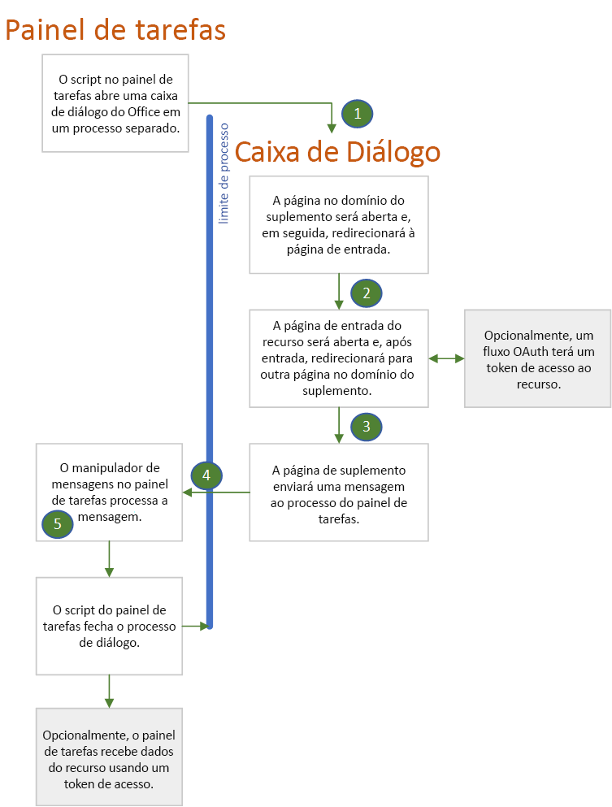

# Autenticação e autorização com a API da caixa de diálogo do OfficeAuthenticate and authorize with the Office dialog API

Várias autoridades de identidade, também chamadas de Serviços de Token Seguro (STS), impedem que a página de logon seja aberta em um IFrame.Many identity authorities, also called Secure Token Services (STS), prevent their login page from opening in an iframe. Isso inclui o Google, o Facebook e os serviços protegidos pela Plataforma de Identidade da Microsoft (antigo Azure AD V 2.0), como uma conta da Microsoft, uma conta corporativa ou de estudante do Microsoft 365 ou outra conta comum.These include Google, Facebook, and services protected by Microsoft Identity Platform (formerly Azure AD V 2.0) such as a Microsoft account, a Microsoft 365 Education or work account, or other common account. Isso cria um problema para os suplementos do Office, porque quando o suplemento é executado no **Office na Web**, o painel de tarefas é um IFrame.This creates a problem for Office Add-ins because when the add-in is running in **Office on the web**, the task pane is an iframe. Os usuários de um suplemento só podem fazer logon em um desses serviços se o suplemento puder abrir uma instância do navegador completamente separada.Users of an add-in can only login to one of these services if the add-in can open an entirely separate browser instance. Isso porque o Office fornece a [API da Caixa de Diálogo](dialog-api-in-office-add-ins.md), especificamente o método [displayDialogAsync](/javascript/api/office/office.ui).This is why Office provides its [Office dialog API](dialog-api-in-office-add-ins.md), specifically the [displayDialogAsync](/javascript/api/office/office.ui) method.

> [!NOTE]
> Esse artigo presume que você esteja familiarizado com o [Uso da API da Caixa de Diálogo do Office nos suplementos do Office.](dialog-api-in-office-add-ins.md).This article assumes that you are familiar with [Use the Office dialog API in your Office Add-ins](dialog-api-in-office-add-ins.md).

A caixa de diálogo que é aberta com essa API tem as seguintes características:The dialog box that is opened with this API has the following characteristics:

- [Não é restrita](https://en.wikipedia.org/wiki/Dialog_box).It is [nonmodal](https://en.wikipedia.org/wiki/Dialog_box).
- É uma instância do navegador completamente separada do painel de tarefas, ou seja:It is a completely separate browser instance from the task pane, meaning:
  - Tem o seu próprio ambiente de tempo de execução do JavaScript, objeto de janela e variáveis globais.It has its own JavaScript runtime environment and window object and global variables.
  - Não há nenhum ambiente de execução compartilhado com o painel de tarefas.There is no shared execution environment with the task pane.
  - Não compartilha o mesmo armazenamento de sessão (a propriedade [Window.sessionStorage](https://developer.mozilla.org/docs/Web/API/Window/sessionStorage)) como o painel de tarefas.It does not share the same session storage (the [Window.sessionStorage](https://developer.mozilla.org/docs/Web/API/Window/sessionStorage) property) as the task pane.
- A primeira página aberta na caixa de diálogo deve estar hospedada no mesmo domínio que o painel de tarefas, incluindo o protocolo, os subdomínios e a porta, se houver.The first page opened in the dialog box must be hosted in the same domain as the task pane, including protocol, subdomains, and port, if any.
- A caixa de diálogo pode enviar informações de volta para o painel de tarefas usando o método [messageParent](/javascript/api/office/office.ui#messageparent-message-), porém esse método só pode ser chamado a partir de uma página hospedada no mesmo domínio que o painel de tarefas, incluindo o protocolo, os subdomínios e a porta.The dialog box can send information back to the task pane by using the [messageParent](/javascript/api/office/office.ui#messageparent-message-) method, but this method can be called only from a page that is hosted in the same domain as the task pane, including protocol, subdomains, and port.

Quando a caixa de diálogo não é um iframe (que é o padrão), ela pode abrir a página de logon de um provedor de identidade.When the dialog box is not an iframe (which is the default), it can open the login page of an identity provider. Como é mostrado a seguir, as características da caixa de diálogo têm implicações sobre como você usa as bibliotecas de autenticação ou autorização, como a MSAL e o Passport.As you'll see below, the characteristics of the Office dialog box have implications for how you use authentication or authorization libraries such as MSAL and Passport.

> [!NOTE]
> Há uma maneira de configurar a caixa de diálogo para abrir em um iframe flutuante: basta passar a opção `displayInIframe: true` na chamada do `displayDialogAsync`.There is a way to configure the dialog box to open in a floating iframe: you simply pass the `displayInIframe: true` option in the call to `displayDialogAsync`. *Não* faça isso quando estiver usando a API da Caixa de Diálogo do Office para logon.Do *not* do this when you are using the Office dialog API for login.

## Fluxo de autenticação com a caixa de diálogo do OfficeAuthentication flow with the Office dialog box

O que vem a seguir é um fluxo de autenticação simples e típico.The following is a simple and typical authentication flow. Os detalhes estão após o diagrama.Details are after the diagram.

1. A primeira página que é aberta na caixa de diálogo é uma página local (ou outro recurso) que está hospedada no domínio do suplemento; ou seja, o mesmo domínio da janela do painel de tarefas.The first page that opens in the dialog box is a page (or other resource) that is hosted in the add-in's domain; that is, the same domain as the task pane window. Essa página pode ter uma única interface de usuário que informa "Aguarde. Estamos redirecionando você para a página onde poderá entrar no *NOME-DO-PROVEDOR*."This page can have a simple UI that says "Please wait, we are redirecting you to the page where you can sign in to *NAME-OF-PROVIDER*." O código nessa página constrói a URL da página de entrada do provedor de identidade usando as informações que são transmitidas para a caixa de diálogo, conforme descrito em [Transmitir informações para a caixa de diálogo](dialog-api-in-office-add-ins.md#pass-information-to-the-dialog-box) ou é codificado em um arquivo de configuração do suplemento, como um arquivo web.config.The code in this page constructs the URL of the identity provider's sign-in page with information that is either passed to the dialog box as described in [Pass information to the dialog box](dialog-api-in-office-add-ins.md#pass-information-to-the-dialog-box) or is hardcoded into a configuration file of the add-in, such as a web.config file.
2. A janela da caixa de diálogo redireciona então para a página de entrada.The dialog box window then redirects to the sign-in page. A URL inclui um parâmetro de consulta que informa o provedor de identidade para redirecionar a janela da caixa de diálogo a uma página específica após o usuário entrar.The URL includes a query parameter that tells the identity provider to redirect the dialog box window to a specific page after the user signs in. Nesse artigo, chamaremos essa página de **redirectPage.html**.In this article, we'll call this page **redirectPage.html**. *Essa deve ser uma página no mesmo domínio da janela do host*, para que os resultados da tentativa de entrada possam ser passados ao painel de tarefas com uma chamada de `messageParent`.*This must be a page in the same domain as the host window*, so that the results of the sign-in attempt can be passed to the task pane with a call of `messageParent`.
3. O serviço do provedor de identidade processa a solicitação GET recebida da janela da caixa de diálogo.The identity provider's service processes the incoming GET request from the dialog box window. Se o usuário já estiver conectado, ele imediatamente redirecionará a janela para **redirectPage.html** e incluirá os dados do usuário como um parâmetro de consulta.If the user is already signed in, it immediately redirects the window to **redirectPage.html** and includes user data as a query parameter. Se o usuário ainda não tiver entrado, a página de entrada do provedor aparecerá na janela para que o usuário possa entrar.If the user is not already signed in, the provider's sign-in page appears in the window, and the user signs in. Para a maioria dos provedores, se o usuário não consegue entrar com êxito, o provedor mostra uma página de erro na janela da caixa de diálogo e não redireciona para **redirectPage.html**.For most providers, if the user cannot sign in successfully, the provider shows an error page in the dialog box window and does not redirect to **redirectPage.html**. O usuário precisa fechar a janela selecionando o **X** no canto.The user must close the window by selecting the **X** in the corner. Se o usuário entrar com êxito, a janela de diálogo será redirecionada para **redirectPage.html** e os dados do usuário serão incluídos como um parâmetro de consulta.If the user successfully signs in, the dialog box window is redirected to **redirectPage.html** and user data is included as a query parameter.
4. Quando a página **redirectPage.html** é aberta, ela chama a `messageParent` para relatar o êxito ou a falha na página do painel de tarefas e opcionalmente também pode informar os dados do usuário ou os dados de erro.When the **redirectPage.html** page opens, it calls `messageParent` to report the success or failure to the task pane page and optionally also report user data or error data. Outras mensagens possíveis incluem passar um token de acesso ou informar ao painel de tarefas que o token está no armazenamento.Other possible messages include passing an access token or telling the task pane that the token is in storage.
5. O evento `DialogMessageReceived` é acionado na página do painel de tarefas, seu manipulador fecha a janela da caixa de diálogo e assim a mensagem pode ser processada.The `DialogMessageReceived` event fires in the task pane page and its handler closes the dialog box window and may further process of the message.

#### Prestar suporte a vários provedores de identidadeSupport multiple identity providers

Se o seu suplemento oferece ao usuário diversas opções de provedores, como a conta da Microsoft, o Google ou o Facebook, você precisa de uma primeira página local (confira a seção anterior) que forneça uma interface de usuário para a escolha de um provedor. A escolha do provedor acionará a construção do URL de entrada e o redirecionamento para ele.If your add-in gives the user a choice of providers, such as a Microsoft account, Google, or Facebook, you need a local first page (see preceding section) that provides a UI for the user to select a provider. Selection triggers the construction of the sign-in URL and redirection to it.

#### Autorização do suplemento para um recurso externoAuthorization of the add-in to an external resource

Na Web moderna, os usuários e aplicativos da Web são entidades de segurança.In the modern web, users and web applications are security principals. O aplicativo tem sua própria identidade e permissões para recursos online, como o Microsoft 365, o Google Plus, o Facebook ou o LinkedIn.The application has its own identity and permissions to an online resource such as Microsoft 365, Google Plus, Facebook, or LinkedIn. O aplicativo é registrado no provedor de recursos antes da implantação.The application is registered with the resource provider before it is deployed. O registro inclui:The registration includes:

- Uma lista das permissões que o aplicativo precisa.A list of the permissions that the application needs.
- Uma URL para a qual o serviço do recurso deve retornar um token de acesso quando o aplicativo acessa o serviço.A URL to which the resource service should return an access token when the application accesses the service.  

Quando um usuário invoca uma função no aplicativo que acessa os dados do usuário no serviço do recurso, ele é solicitado a entrar no serviço e a conceder ao aplicativo as permissões necessárias para os recursos do usuário. Em seguida, o serviço redireciona a janela de entrada para a URL previamente registrada e transmite o token de acesso. O aplicativo usa o token de acesso para acessar os recursos do usuário.When a user invokes a function in the application that accesses the user's data in the resource service, they are prompted to sign in to the service and then prompted to grant the application the permissions it needs to the user's resources. The service then redirects the sign-in window to the previously registered URL and passes the access token. The application uses the access token to access the user's resources.

Você pode usar a API da Caixa de Diálogo do Office para gerenciar esse processo usando um fluxo semelhante àquele descrito para os usuários entrarem.You can use the Office dialog API to manage this process by using a flow that is similar to the one described for users to sign in. As únicas diferenças são:The only differences are:

- Se o usuário ainda não tiver concedido ao aplicativo as permissões necessárias, será solicitado a fazê-lo na caixa de diálogo após entrar.If the user hasn't previously granted the application the permissions it needs, the user is prompted to do so in the dialog box after signing in.
- A janela da caixa de diálogo envia o token de acesso à janela do host usando `messageParent` para enviar o token de acesso em formato de cadeia de caracteres ou armazenando o token de acesso em um local onde a janela do host poderá recuperá-lo (e usando `messageParent` para informar à janela do host que o token está disponível).The dialog box window sends the access token to the host window either by using `messageParent` to send the stringified access token or by storing the access token where the host window can retrieve it (and using `messageParent` to tell the host window that the token is available). O token tem um limite de tempo, mas enquanto durar, a janela do host poder usá-lo para acessar recursos do usuário de forma direta, sem outras solicitações.The token has a time limit, but while it lasts, the host window can use it to directly access the user's resources without any further prompting.

Alguns suplementos de exemplo de autenticação que usam a API da Caixa de Diálogo do Office para essa finalidade estão listados em [Amostras](#samples).Some authentication sample add-ins that use the Office dialog API for this purpose are listed in [Samples](#samples).

## Usar bibliotecas de autenticação pela caixa de diálogoUsing authentication libraries with the dialog box

O fato de a Caixa de Diálogo do Office e o painel de tarefas serem executados em navegadores diferentes e no tempo de execução do JavaScript, as instâncias significam que você deve usar muitas bibliotecas de autenticação/autorização de maneira diferente de como elas são usadas quando a autenticação e a autorização ocorrem na mesma janela.The fact that the Office dialog box and the task pane run in different browser, and JavaScript runtime, instances means that you must use many authentication/authorization libraries in the way that is different from how they are used when authentication and authorization can take place in the same window. As seções a seguir descrevem as principais maneiras pelas quais, geralmente, você não pode usar essas bibliotecas e a maneira que você *pode* usá-las.The following sections describe the main ways that you usually cannot use these libraries and the way that you *can* use them.

### Geralmente, você não pode usar o cache interno da biblioteca para armazenar tokensYou usually cannot use the library's internal cache to store tokens

Normalmente, as bibliotecas relacionadas à autenticação fornecem um cache na memória para armazenar o token de acesso.Typically, auth-related libraries provide an in-memory cache to store the access token. Se chamadas subsequentes para o provedor de recursos (por exemplo, Google, Microsoft Graph, Facebook, etc.) forem feitas, a biblioteca primeiro verificará se o token no cache está expirado.If subsequent calls to the resource provider (such as Google, Microsoft Graph, Facebook, etc.) are made, the library will first check to see if the token in its cache is expired. Caso não tenha expirado, a biblioteca retornará o token em cache, em vez de retornar ao STS para obter um novo token.If it is unexpired, the library returns the cached token rather than making another round-trip to the STS for a new token. No entanto, esse padrão não pode ser usado em Suplementos do Office. Uma vez que o logon ocorre na instância do navegador da caixa de diálogo do Office, o cache do token estará nessa instância.But this pattern is not usable in Office Add-ins. Since the login occurs in the Office dialog box's browser instance, the token cache is in that instance.

Estritamente relacionado a isso está o fato de que uma biblioteca normalmente fornece métodos interativos e "silenciosos" para obter um token.Closely related to this is the fact that a library will typically provide both interactive and "silent" methods for getting a token. Quando for possível fazer tanto a autenticação quanto as chamadas de dados ao recurso na mesma instância do navegador, o código chamará o método silencioso para obter um token imediatamente antes do código adicionar o token à chamada de dados.When you can do both the authentication and the data calls to the resource in the same browser instance, your code calls the silent method to obtain a token just before your code adds the token to the data call. O método silencioso procurará por um token não expirado no cache e o retornará, caso haja um.The silent method checks for an unexpired token in the cache and returns it, if there is one. Caso contrário, o método silencioso chamará o método interativo que será redirecionado para o logon do STS.Otherwise, the silent method calls the interactive method which redirects to the STS's login. Após a conclusão do logon, o método interativo retorna o token e o armazena na memória.After login completes, the interactive method returns the token, but also caches it in memory. No entanto, quando a API da Caixa de Diálogo do Office está sendo usada, as chamadas de dados do recurso, que chamam o método silencioso, estão na instância do navegador do painel de tarefas.But when the Office dialog API is being used, the data calls to the resource, which would call the silent method, are in the task pane's browser instance. O cache de token da biblioteca não existe nessa instância.The library's token cache does not exist in that instance.

Como alternativa, a instância do navegador da Caixa de Diálogo do suplemento pode chamar diretamente o método interativo da biblioteca.As an alternative, your add-in's dialog box browser instance can directly call the library's interactive method. Quando esse método retorna um token, o código deve armazenar explicitamente o token em algum lugar onde a instância do navegador do painel de tarefas pode recuperá-lo, como o Armazenamento Local\* ou um banco de dados do lado do servidor.When that method returns a token, your code must explicitly store the token someplace where the task pane's browser instance can retrieve it, such as Local Storage\* or a server-side database. Outra opção é passar o token para o painel de tarefas com o método `messageParent`.Another option is to pass the token to the task pane with the `messageParent` method. Essa alternativa só é possível se o método interativo armazenar o token de acesso em um local onde o código possa lê-lo.This alternative is only possible if the interactive method stores the access token in a place where your code can read it. Às vezes, o método interativo de uma biblioteca é projetado para armazenar o token em uma propriedade particular de um objeto que está inacessível ao código.Sometimes a library's interactive method is designed to store the token in a private property of an object that is inaccessible to your code.

> [!NOTE]
> \* Há um bug que afetará sua estratégia de tratamento de tokens.\* There is a bug that will effect your strategy for token handling. Se o suplemento estiver sendo executado no **Office na Web** nos navegadores Safari ou Microsoft Edge, o painel de tarefas e a caixa de diálogo não compartilharão o mesmo Armazenamento Local, portanto, ele não poderá ser usado para a comunicação entre eles.If the add-in is running in **Office on the web** in either the Safari or Edge browser, the dialog box and task pane do not share the same Local Storage, so it cannot be used to communicate between them.

### Geralmente, você não pode usar o objeto "contexto de autenticação" da bibliotecaYou usually cannot use the library's "auth context" object

Frequentemente, uma biblioteca relacionada à autenticação possui um método que obtém tanto um token de forma interativa, como também cria um objeto de "contexto de autenticação" retornado pelo método.Often, an auth-related library has a method that both obtains a token interactively and also creates an "auth-context" object which the method returns. O token é uma propriedade do objeto (possivelmente particular e inacessível diretamente do código).The token is a property of the object (possibly private and inaccessible directly from your code). Esse objeto tem os métodos que recebem os dados do recurso.That object has the methods that get data from the resource. Esses métodos incluem o token nas Solicitações HTTP feitas ao provedor de recursos (por exemplo, Google, Microsoft Graph, Facebook, etc.).These methods include the token in the HTTP Requests that they make to the resource provider (such as Google, Microsoft Graph, Facebook, etc.).

Esses objetos de contexto de autenticação e os métodos que os criam não podem ser usados nos Suplementos do Office. Como o logon ocorre na instância do navegador da caixa de diálogo do Office, o objeto teria que ser criado lá.These auth-context objects, and the methods that create them, are not usable in Office Add-ins. Since the login occurs in the Office dialog box's browser instance, the object would have to be created there. Mas as chamadas de dados do recurso estão na instância do navegador do painel de tarefas e não há como enviar o objeto de uma instância para outra.But the data calls to the resource are in the task pane browser instance and there is no way to get the object from one instance to another. Por exemplo, não é possível passar o objeto pela `messageParent`, porque a `messageParent` só pode passar valores booleanos ou cadeias de caracteres.For example, you cannot pass the object with `messageParent` because `messageParent` can only pass strings or boolean values. Um objeto do JavaScript com métodos não pode ser transformado em cadeia de caracteres de maneira confiável.A JavaScript object with methods cannot be reliably stringified.

### Como usar as bibliotecas através da API da Caixa de Diálogo do OfficeHow you can use libraries with the Office dialog API

Além dos objetos monolíticos de "contexto de autenticação", a maioria das bibliotecas fornecem APIs em um nível inferior de abstração que permite que o código crie objetos auxiliares menos monolíticos.In addition to, or instead of, monolithic "auth context" objects, most libraries provide APIs at a lower level of abstraction that enable your code to create less monolithic helper objects. Por exemplo, [MSAL.NET](https://github.com/AzureAD/microsoft-authentication-library-for-dotnet/wiki#conceptual-documentation) v.For example, [MSAL.NET](https://github.com/AzureAD/microsoft-authentication-library-for-dotnet/wiki#conceptual-documentation) v. 3.x.x tem uma API para construir uma URL de logon e outra API que constrói um objeto AuthResult que contém um token de acesso em uma propriedade que pode ser acessada pelo código.3.x.x has an API to construct a login URL, and another API that constructs an AuthResult object that contains an access token in a property that is accessible to your code. Para obter exemplos de MSAL.NET em um suplemento do Office, confira: [ASP.NET Microsoft Graph no Suplemento do Office](https://github.com/OfficeDev/PnP-OfficeAddins/tree/master/Samples/auth/Office-Add-in-Microsoft-Graph-ASPNET) e [ASP.NET Microsoft Graph no Suplemento do Outlook](https://github.com/OfficeDev/PnP-OfficeAddins/tree/master/Samples/auth/Outlook-Add-in-Microsoft-Graph-ASPNET).For examples of MSAL.NET in an Office add-in see: [Office Add-in Microsoft Graph ASP.NET](https://github.com/OfficeDev/PnP-OfficeAddins/tree/master/Samples/auth/Office-Add-in-Microsoft-Graph-ASPNET) and [Outlook Add-in Microsoft Graph ASP.NET](https://github.com/OfficeDev/PnP-OfficeAddins/tree/master/Samples/auth/Outlook-Add-in-Microsoft-Graph-ASPNET). Para ver um exemplo de como usar o [msal.js](https://github.com/AzureAD/microsoft-authentication-library-for-js) em um suplemento, confira [Microsoft Graph React no Suplemento do Office](https://github.com/OfficeDev/PnP-OfficeAddins/tree/master/Samples/auth/Office-Add-in-Microsoft-Graph-React).For an example of using [msal.js](https://github.com/AzureAD/microsoft-authentication-library-for-js) in an add-in, see [Office Add-in Microsoft Graph React](https://github.com/OfficeDev/PnP-OfficeAddins/tree/master/Samples/auth/Office-Add-in-Microsoft-Graph-React).

Para saber mais sobre as bibliotecas de autenticação e autorização, confira [Microsoft Graph: bibliotecas recomendadas](authorize-to-microsoft-graph-without-sso.md#recommended-libraries-and-samples) e [Outros serviços externos: bibliotecas](auth-external-add-ins.md#libraries).For more information about authentication and authorization libraries, see [Microsoft Graph: Recommended libraries](authorize-to-microsoft-graph-without-sso.md#recommended-libraries-and-samples) and [Other external services: Libraries](auth-external-add-ins.md#libraries).

## ExemplosSamples

- [ASP.NET Microsoft Graph no Suplemento do Office](https://github.com/OfficeDev/PnP-OfficeAddins/tree/master/Samples/auth/Office-Add-in-Microsoft-Graph-ASPNET): um suplemento com base em ASP.NET (Excel, Word ou PowerPoint) que usa a biblioteca MSAL.NET e o Fluxo de Código de Autorização para efetuar logon e obter um token de acesso para dados do Microsoft Graph.[Office Add-in Microsoft Graph ASP.NET](https://github.com/OfficeDev/PnP-OfficeAddins/tree/master/Samples/auth/Office-Add-in-Microsoft-Graph-ASPNET): An ASP.NET based add-in (Excel, Word, or PowerPoint) that uses the MSAL.NET library and the Authorization Code Flow to log in and get an access token for Microsoft Graph data.
- [ASP.NET Microsoft Graph no Suplemento do Outlook](https://github.com/OfficeDev/PnP-OfficeAddins/tree/master/Samples/auth/Outlook-Add-in-Microsoft-Graph-ASPNET): semelhante a exibida acima, mas o aplicativo do Office sendo o Outlook.[Outlook Add-in Microsoft Graph ASP.NET](https://github.com/OfficeDev/PnP-OfficeAddins/tree/master/Samples/auth/Outlook-Add-in-Microsoft-Graph-ASPNET): Just like the one above, but the Office application is Outlook.
- [Microsoft Graph React no Suplemento do Office](https://github.com/OfficeDev/PnP-OfficeAddins/tree/master/Samples/auth/Office-Add-in-Microsoft-Graph-React): um suplemento com base em NodeJS (Excel, Word ou PowerPoint) que usa a biblioteca msal.js e o Fluxo Implícito para efetuar logon e obter um token de acesso para dados do Microsoft Graph.[Office Add-in Microsoft Graph React](https://github.com/OfficeDev/PnP-OfficeAddins/tree/master/Samples/auth/Office-Add-in-Microsoft-Graph-React): A NodeJS based add-in (Excel, Word, or PowerPoint) that uses the msal.js library and the Implicit Flow to log in and get an access token for Microsoft Graph data.

Para saber mais, confira:For more information, see:
- [Autorizar serviços externos no Suplemento do OfficeAuthorize external services in your Office Add-in](auth-external-add-ins.md)
- [Usar a API da Caixa de Diálogo do Office nos suplementos do OfficeUse the Office dialog API in your Office Add-ins](dialog-api-in-office-add-ins.md)
