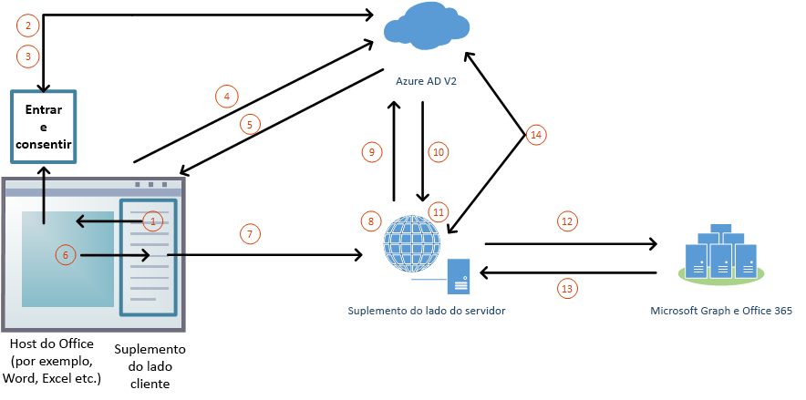

# Autorizar para o Microsoft Graph no seu Suplemento do Office (visualização)Authorize to Microsoft Graph in your Office Add-in (preview)

Os usuários entram no Office (nas plataformas online, celular e área de trabalho) usando uma conta pessoal da Microsoft ou uma conta de corporativa ou de estudante (Office 365). A melhor forma para um suplemento do Office obter acesso autorizado ao [Microsoft Graph](https://developer.microsoft.com/graph/docs) é usar as credenciais de logon do usuário no Office. Isso permite que eles acessem seus dados do Microsoft Graph sem precisar entrar uma segunda vez.Users sign in to Office (online, mobile, and desktop platforms) using either their personal Microsoft account or their work or school (Office 365) account. The best way for an Office add-in to get authorized access to [Microsoft Graph](https://developer.microsoft.com/graph/docs) is to use the credentials from the user's Office sign on. This enables them to access their Microsoft Graph data without needing to sign in a second time. 

> [!NOTE]
> Atualmente a API de logon único tem suporte em versão prévia para Word, Excel e PowerPoint.The Single Sign-on API is currently supported in preview for Word, Excel, Outlook, and PowerPoint. Confira mais informações sobre os programas para os quais a API de logon único tem suporte no momento em [Conjuntos de requisitos da IdentityAPI](https://docs.microsoft.com/javascript/office/requirement-sets/identity-api-requirement-sets?view=office-js).For more information about where the Single Sign-on API is currently supported, see [IdentityAPI requirement sets](https://docs.microsoft.com/javascript/office/requirement-sets/identity-api-requirement-sets?view=office-js).
> Se você estiver trabalhando com um suplemento do Outlook, certifique-se de habilitar a Autenticação Moderna para a locação do Office 365.If you are working with an Outlook add-in, be sure to enable Modern Authentication for the Office 365 tenancy. Confira mais informações sobre como fazer isso em [Exchange Online: como habilitar seu locatário para autenticação moderna](https://social.technet.microsoft.com/wiki/contents/articles/32711.exchange-online-how-to-enable-your-tenant-for-modern-authentication.aspx).For information about how to do this, see [Exchange Online: How to enable your tenant for modern authentication](https://social.technet.microsoft.com/wiki/contents/articles/32711.exchange-online-how-to-enable-your-tenant-for-modern-authentication.aspx).

## Arquitetura do suplemento para SSO e Microsoft GraphAdd-in architecture for SSO and Microsoft Graph

Além de hospedar as páginas e o JavaScript do aplicativo web, o suplemento também deve hospedar, ao mesmo tempo o [nome de domínio totalmente qualificado](https://docs.microsoft.com/windows/desktop/DNS/f-gly#_dns_fully_qualified_domain_name_fqdn__gly), uma ou mais APIs web que obterá um token de acesso ao Microsoft Graph e fará solicitações a ele.In addition to hosting the pages and JavaScript of the web application, the add-in must also host, at the same [fully qualified domain name](https://docs.microsoft.com/windows/desktop/DNS/f-gly#_dns_fully_qualified_domain_name_fqdn__gly), one or more web APIs that will get an access token to Microsoft Graph and make requests to it.

O manifesto do suplemento contém a marcação que especifica como ele está registrado no ponto de extremidade v2.0 do Azure Active Directory (Azure AD) e especifica todas as permissões para o Microsoft Graph que o suplemento precisa.The add-in manifest contains markup that specifies how the add-in is registered in the Azure Active Directory (Azure AD) v2.0 endpoint, and it specifies any permissions to Microsoft Graph that the add-in needs.

### Como ele funciona em tempo de execuçãoHow it works at runtime

O diagrama a seguir mostra como o processo de entrada e acesso ao Microsoft Graph funciona.The following diagram shows how the process of signing in and getting access to Microsoft Graph works.

1. No suplemento, o JavaScript chama a nova API Office.js [ getAccessTokenAsync](https://docs.microsoft.com/office/dev/add-ins/develop/sso-in-office-add-ins#sso-api-reference) . Isso informa ao aplicativo host do Office para obter um token de acesso ao suplemento. (A partir de agora, ele será chamado de \*\* token de acesso de inicialização\*\*  porque será substituído por um segundo token mais tarde no processo. Para um exemplo de token de acesso de inicialização decodificado, confira [  Exemplo de token de acesso](sso-in-office-add-ins.md#example-access-token) .)In the add-in, JavaScript calls a new Office.js API . This tells the Office host application to obtain an access token to the add-in. (Hereafter, this is called the **bootstrap access token** because it is replaced with a second token later in the process. For an example of a decoded bootstrap access token, see [Example access token](sso-in-office-add-ins.md#example-access-token).)
1. Se o usuário não estiver conectado, o aplicativo host do Office abrirá uma janela pop-up para o usuário entrar.If the user is not signed in, the Office host application opens a pop-up window for the user to sign in.
1. Se essa for a primeira vez que o usuário atual usa seu suplemento, será solicitado que ele dê o consentimento.If this is the first time the current user has used your add-in, he or she is prompted to consent.
1. O aplicativo host do Office solicita o **token de acesso de inicialização** do ponto de extremidade do Azure AD v2.0 para o usuário atual.The Office host application requests the **add-in token** from the Azure AD v2.0 endpoint for the current user.
1. O Azure AD envia o token de inicialização ao aplicativo host do Office.Azure AD sends the add-in token to the Office host application.
1. O aplicativo host do Office envia o **token de acesso de inicialização** ao suplemento como parte do objeto de resultado que retornou pela chamada de `getAccessTokenAsync`.The Office host application sends the **add-in token** to the add-in as part of the result object returned by the `getAccessTokenAsync` call.
1. O JavaScript no suplemento faz uma solicitação HTTP a uma API da Web que está hospedada no mesmo domínio totalmente qualificado que o suplemento e inclui o **token de acesso de inicialização** como prova de autorização.JavaScript in the add-in makes an HTTP request to a web API that is hosted at the same fully-qualified domain as the add-in, and it includes the **add-in token** as authorization proof.  
1. O código do servidor valida o **token de acesso de inicialização** de entrada.Server-side code validates the incoming **add-in token**.
1. O código do servidor usa o fluxo “em nome de” (definido em [Troca de Token do OAuth2](https://tools.ietf.org/html/draft-ietf-oauth-token-exchange-02) e o [daemon ou aplicativo para servidores para o cenário da API da Web do Azure](https://docs.microsoft.com/azure/active-directory/develop/active-directory-authentication-scenarios#daemon-or-server-application-to-web-api)) para obter um token de acesso para o Microsoft Graph em troca do token de acesso de inicialização.Server-side code uses the “on behalf of” flow (defined at [OAuth2 Token Exchange](https://tools.ietf.org/html/draft-ietf-oauth-token-exchange-02) and the [daemon or server application to web API Azure scenario](https://docs.microsoft.com/azure/active-directory/develop/active-directory-authentication-scenarios#daemon-or-server-application-to-web-api)) to obtain an access token for Microsoft Graph (hereafter, the "MSG token") in exchange for the add-in token.
1. O Azure AD retorna o token de acesso ao Microsoft Graph (e um token de atualização, se o suplemento solicitar a permissão *offline_access*) para o suplemento.Azure AD returns the MSG token (and a refresh token, if the add-in requests offline_access permission) to the add-in.
1. O código do servidor armazena em cache o token de acesso ao Microsoft Graph.Server-side code caches the access token to Microsoft Graph.
1. O código do lado do servidor faz solicitações ao Microsoft Graph e inclui o token de acesso ao Microsoft Graph.Server-side code makes requests to Microsoft Graph and includes the MSG token.
1. O Microsoft Graph retorna os dados para o suplemento, que pode transmiti-los à interface do usuário do suplemento.Microsoft Graph returns data to the add-in, which can pass it on to the add-in’s UI.
1. Quando o token de acesso ao Microsoft Graph expira, o código do servidor pode usar seu token de atualização para obter um novo token de acesso ao Microsoft Graph.When the access token to Microsoft Graph expires, the server-side code can use its refresh token to get a new access token to Microsoft Graph.

## Desenvolver um suplemento SSO que acesse o Microsoft GraphDevelop an SSO add-in that accesses Microsoft Graph

Você desenvolve um suplemento que acessa o Microsoft Graph como faria com qualquer outro suplemento que usa SSO.You develop an add-in that accesses Microsoft Graph just as you would any other add-in that uses SSO. Para uma descrição detalhada, veja [Ativar logon único para Suplementos do Office](https://docs.microsoft.com/office/dev/add-ins/develop/sso-in-office-add-ins). A diferença é que é obrigatório que o suplemento tenha uma API da Web do servidor e o que é chamado de token de acesso nesse artigo é chamado de "token de acesso de inicialização".For a thorough description, see [Enable single sign-on for Office Add-ins](https://docs.microsoft.com/office/dev/add-ins/develop/sso-in-office-add-ins). The difference is that it is mandatory that the add-in have a server-side Web API, and what's called the access token in that article is called the "bootstrap access token." 

Dependendo do seu idioma e estrutura, podem existir bibliotecas disponíveis para simplificar o código do lado do servidor que você precisar escrever.Depending on your language and framework, libraries might be available that will simplify the code you have to write. Seu código deve fazer o seguinte:Your server-side code should do the following:

* Validar o token de acesso de inicialização do suplemento recebido do manipulador de token que você criou.Validate the add-in token that is received from the token handler you created earlier. Para mais informações, veja [Validar o token de acesso](sso-in-office-add-ins.md#validate-the-access-token).For more information, see [Validate the access token](sso-in-office-add-ins.md#validate-the-access-token). 
* Iniciar o fluxo "em nome de" com uma chamada para o ponto de extremidade v2.0 do Azure AD que inclui o token de acesso de inicialização, alguns metadados sobre o usuário e as credenciais do suplemento (seu ID e segredo).Initiate the “on behalf of” flow with a call to the Azure AD v2.0 endpoint that includes the add-in access token, some metadata about the user, and the credentials of the add-in (its ID and secret).
* Armazenar em cache o token de acesso ao Microsoft Graph que foi retornado.Use the access token to call Microsoft Graph. Para mais informações sobre esse fluxo, veja [Fluxo em nome de do Active Directory do Azure v2.0 e OAuth 2.0](https://docs.microsoft.com/azure/active-directory/develop/active-directory-v2-protocols-oauth-on-behalf-of).For more information about this flow see [Azure Active Directory v2.0 and OAuth 2.0 On-Behalf-Of flow](https://docs.microsoft.com/azure/active-directory/develop/active-directory-v2-protocols-oauth-on-behalf-of).
* Criar um ou mais métodos de API da Web que obtenham dados do Microsoft Graph passando o token de acesso em cache para o Microsoft Graph.Create one or more Web API methods that get Microsoft Graph data by passing the cached access token to Microsoft Graph.

> [!NOTE]
> Para ver exemplos de tokens de acesso decodificados para o Microsoft Graph e obtidos pelo fluxo "em nome de", veja [Fluxo em nome de do Active Directory do Azure v2.0 e OAuth 2.0](https://docs.microsoft.com/azure/active-directory/develop/active-directory-v2-protocols-oauth-on-behalf-of).For examples of decoded access tokens for Microsoft Graph that have been obtained by the "on-behalf-of" flow, see [Azure Active Directory v2.0 and OAuth 2.0 On-Behalf-Of flow](https://docs.microsoft.com/azure/active-directory/develop/active-directory-v2-protocols-oauth-on-behalf-of).

Confira exemplos de passo a passo e cenários detalhados em:For examples of detailed walkthroughs, see:

* [Criar um Suplemento do Office com Node.js que usa logon únicoCreate a Node.js Office Add-in that uses single sign-on](create-sso-office-add-ins-nodejs.md)
* [Criar um Suplemento do Office com ASP.NET que usa logon únicoCreate an ASP.NET Office Add-in that uses single sign-on](create-sso-office-add-ins-aspnet.md)
* [Cenário: implementar o logon único no serviço em um suplemento do OutlookScenario: Implement single sign-on to your service in an Outlook Add-in](https://docs.microsoft.com/outlook/add-ins/implement-sso-in-outlook-add-in)

