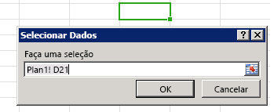

# <a name="bind-to-regions-in-a-document-or-spreadsheet"></a><span data-ttu-id="5e2d4-102">Associar a regiões em um documento ou em uma planilha</span><span class="sxs-lookup"><span data-stu-id="5e2d4-102">Bind to regions in a document or spreadsheet</span></span>

<span data-ttu-id="5e2d4-p101">O acesso a dados baseado em associação permite que os suplementos de conteúdo e de painéis de tarefas acessem determinada região de um documento ou planilha por meio de um identificador. Primeiro, o suplemento precisa estabelecer a associação. Para isso, ele chama um dos métodos que associa uma parte do documento a um identificador exclusivo: [addFromPromptAsync], [addFromSelectionAsync] ou [addFromNamedItemAsync]. Depois que a associação é estabelecida, o suplemento pode usar o identificador fornecido para acessar os dados contidos na região associada do documento ou da planilha. A criação de associações proporciona o seguinte valor para o seu suplemento:</span><span class="sxs-lookup"><span data-stu-id="5e2d4-p101">Binding-based data access enables content and task pane add-ins to consistently access a particular region of a document or spreadsheet through an identifier. The add-in first needs to establish the binding by calling one of the methods that associates a portion of the document with a unique identifier: [addFromPromptAsync], [addFromSelectionAsync], or [addFromNamedItemAsync]. After the binding is established, the add-in can use the provided identifier to access the data contained in the associated region of the document or spreadsheet. Creating bindings provides the following value to your add-in:</span></span>


- <span data-ttu-id="5e2d4-107">Permite o acesso a estruturas comuns de dados em aplicativos compatíveis do Office, como: tabelas, intervalos ou texto (uma execução contígua de caracteres).</span><span class="sxs-lookup"><span data-stu-id="5e2d4-107">Permits access to common data structures across supported Office applications, such as: tables, ranges, or text (a contiguous run of characters).</span></span>
    
- <span data-ttu-id="5e2d4-108">Habilita operações de leitura/gravação sem exigir que o usuário realize uma seleção.</span><span class="sxs-lookup"><span data-stu-id="5e2d4-108">Enables read/write operations without requiring the user to make a selection.</span></span>
    
- <span data-ttu-id="5e2d4-p102">Estabelece uma relação entre o suplemento e os dados presentes no documento. As associações estão presentes no documento e podem ser acessadas em um momento posterior.</span><span class="sxs-lookup"><span data-stu-id="5e2d4-p102">Establishes a relationship between the add-in and the data in the document. Bindings are persisted in the document, and can be accessed at a later time.</span></span>
    
<span data-ttu-id="5e2d4-p103">A criação de uma associação também permite que você se inscreva em eventos de alteração de seleção e de dados que apresentem um escopo definido para essa região específica do documento ou da planilha. Isso significa que o suplemento só é notificado sobre alterações que ocorrem dentro da região associada, e não sobre alterações gerais que ocorrem em todo o documento ou planilha.</span><span class="sxs-lookup"><span data-stu-id="5e2d4-p103">Establishing a binding also allows you to subscribe to data and selection change events that are scoped to that particular region of the document or spreadsheet. This means that the add-in is only notified of changes that happen within the bound region as opposed to general changes across the whole document or spreadsheet.</span></span>

<span data-ttu-id="5e2d4-p104">O objeto [Bindings] expõe um método [getAllAsync], que dá acesso ao conjunto de todas as associações estabelecidas no documento ou na planilha. Uma associação individual pode ser acessada por sua ID, usando o método Bindings.[getByIdAsync] ou [Office.select]. Você pode estabelecer novas associações e remover as existentes usando um dos seguintes métodos do objeto [Bindings]: [addFromSelectionAsync], [addFromPromptAsync], [addFromNamedItemAsync] ou [releaseByIdAsync].</span><span class="sxs-lookup"><span data-stu-id="5e2d4-p104">The [Bindings] object exposes a [getAllAsync] method that gives access to the set of all bindings established on the document or spreadsheet. An individual binding can be accessed by its ID using either the Bindings.[getByIdAsync] or [Office.select] methods. You can establish new bindings as well as remove existing ones by using one of the following methods of the [Bindings] object: [addFromSelectionAsync], [addFromPromptAsync], [addFromNamedItemAsync], or [releaseByIdAsync].</span></span>


## <a name="binding-types"></a><span data-ttu-id="5e2d4-116">Tipos de associação</span><span class="sxs-lookup"><span data-stu-id="5e2d4-116">Binding types</span></span>

<span data-ttu-id="5e2d4-117">Há [três tipos diferentes de associações][Office.BindingType] que podem ser especificadas com o parâmetro _bindingType_ ao criar uma associação com os métodos [addFromSelectionAsync], [addFromPromptAsync] ou [addFromNamedItemAsync]:</span><span class="sxs-lookup"><span data-stu-id="5e2d4-117">There are [three different types of bindings][Office.BindingType] that you specify with the  _bindingType_ parameter when you create a binding with the [addFromSelectionAsync], [addFromPromptAsync] or [addFromNamedItemAsync] methods:</span></span>

1. <span data-ttu-id="5e2d4-118">**[Text Binding][TextBinding]**: associa a uma região do documento que pode ser representada como texto.</span><span class="sxs-lookup"><span data-stu-id="5e2d4-118">**[Text Binding][TextBinding]** - Binds to a region of the document that can be represented as text.</span></span>

    <span data-ttu-id="5e2d4-p105">No Word, a maioria das seleções contíguas são válidas, enquanto no Excel apenas as seleções de células únicas podem ser usadas para uma associação de texto. No Excel, só há suporte para texto sem formatação. No Word, há suporte para três formatos: texto sem formatação, HTML e Open XML do Office.</span><span class="sxs-lookup"><span data-stu-id="5e2d4-p105">In Word, most contiguous selections are valid, while in Excel only single cell selections can be the target of a text binding. In Excel, only plain text is supported. In Word, three formats are supported: plain text, HTML, and Open XML for Office.</span></span>

2. <span data-ttu-id="5e2d4-p106">**[Matrix Binding][MatrixBinding]**: associa uma região fixa de um documento que contém dados tabulares sem cabeçalhos. Os dados em uma associação de matriz são gravados ou lidos como uma **Array** bidimensional, que é implementada no JavaScript como uma matriz de matrizes. Por exemplo, duas linhas de valores da  **cadeia de caracteres** em duas colunas podem ser gravadas ou lidas como ` [['a', 'b'], ['c', 'd']]` e uma única coluna de três linhas pode ser gravada ou lida como  `[['a'], ['b'], ['c']]`.</span><span class="sxs-lookup"><span data-stu-id="5e2d4-p106">**[Matrix Binding][MatrixBinding]** - Binds to a fixed region of a document that contains tabular data without headers.Data in a matrix binding is written or read as a two dimensional  **Array**, which in JavaScript is implemented as an array of arrays. For example, two rows of  **string** values in two columns can be written or read as ` [['a', 'b'], ['c', 'd']]`, and a single column of three rows can be written or read as  `[['a'], ['b'], ['c']]`.</span></span>

    <span data-ttu-id="5e2d4-p107">No Excel, qualquer seleção contígua de células pode ser usada para estabelecer uma associação de matriz. No Word, apenas as tabelas dão suporte à associação de matriz.</span><span class="sxs-lookup"><span data-stu-id="5e2d4-p107">In Excel, any contiguous selection of cells can be used to establish a matrix binding. In Word, only tables support matrix binding.</span></span>

3. <span data-ttu-id="5e2d4-p108">**[Table Binding][TableBinding]**: associa uma região de um documento que contém uma tabela com cabeçalhos. Os dados em uma associação de tabela são gravados ou lidos como um objeto [TableData](https://docs.microsoft.com/javascript/api/office/office.tabledata?view=office-js). O objeto `TableData` expõe os dados por meio das propriedades `headers` e `rows`.</span><span class="sxs-lookup"><span data-stu-id="5e2d4-p108">**[Table Binding][TableBinding]** - Binds to a region of a document that contains a table with headers.Data in a table binding is written or read as a [TableData](https://docs.microsoft.com/javascript/api/office/office.tabledata?view=office-js) object. The `TableData` object exposes the data through the `headers` and `rows` properties.</span></span>

    <span data-ttu-id="5e2d4-p109">Qualquer tabela do Excel ou Word pode ser a base para uma associação de tabela. Após estabelecer uma associação de tabelas, as linhas ou colunas novas que um usuário adicionar à tabela são automaticamente incluídas na associação.</span><span class="sxs-lookup"><span data-stu-id="5e2d4-p109">Any Excel or Word table can be the basis for a table binding. After you establish a table binding, each new row or column a user adds to the table is automatically included in the binding.</span></span>

<span data-ttu-id="5e2d4-p110">Depois que uma associação é criada usando um dos três métodos "addFrom" do objeto `Bindings` é possível trabalhar com dados e as propriedades da associação usando os métodos do objeto correspondente: [MatrixBinding], [TableBinding] ou [TextBinding]. Esses três objetos herdam os métodos  [getDataAsync] e [setDataAsync] do objeto `Binding`, o que permite interagir com os dados associados.</span><span class="sxs-lookup"><span data-stu-id="5e2d4-p110">After a binding is created by using one of the three "addFrom" methods of the  `Bindings` object, you can work with the binding's data and properties by using the methods of the corresponding object: [MatrixBinding], [TableBinding], or [TextBinding]. All three of these objects inherit the [getDataAsync] and [setDataAsync] methods of the `Binding` object that enable you to interact with the bound data.</span></span>

> [!NOTE]
> <span data-ttu-id="5e2d4-p111">**Quando devo usar a matriz ou as associações de tabela?** Quando os dados tabulares com os quais você está trabalhando contiverem uma linha de totais, você deverá usar uma associação de matriz se o script do suplemento precisar acessar valores na linha de totais ou detectar que a seleção do usuário está na linha de totais. Se você estabelecer uma associação de tabela para os dados tabulares que contêm uma linha de totais, a propriedade [TableBinding.rowCount] e as propriedades `rowCount` and `startRow` do objeto [BindingSelectionChangedEventArgs] nos manipuladores de eventos não refletirão a linha de totais em seus valores. Para resolver essa limitação, você deve estabelecer uma associação de matriz para trabalhar com a linha de totais.</span><span class="sxs-lookup"><span data-stu-id="5e2d4-p111">**When should you use matrix versus table bindings?** When the tabular data you are working with contains a total row, you must use a matrix binding if your add-in's script needs to access values in the total row or detect that the user's selection is in the total row. If you establish a table binding for tabular data that contains a total row, the [TableBinding.rowCount] property and the `rowCount` and `startRow` properties of the [BindingSelectionChangedEventArgs] object in event handlers won't reflect the total row in their values. To work around this limitation, you must use establish a matrix binding to work with the total row.</span></span>

## <a name="add-a-binding-to-the-users-current-selection"></a><span data-ttu-id="5e2d4-136">Adicionar uma associação à seleção atual do usuário</span><span class="sxs-lookup"><span data-stu-id="5e2d4-136">Add a binding to the user's current selection</span></span>

<span data-ttu-id="5e2d4-137">O exemplo a seguir mostra como adicionar uma associação de texto chamada `myBinding` à seleção atual em um documento usando o método [addFromSelectionAsync].</span><span class="sxs-lookup"><span data-stu-id="5e2d4-137">The following example shows how to add a text binding called  `myBinding` to the current selection in a document by using the [addFromSelectionAsync] method.</span></span>


```js
Office.context.document.bindings.addFromSelectionAsync(Office.BindingType.Text, { id: 'myBinding' }, function (asyncResult) {
    if (asyncResult.status == Office.AsyncResultStatus.Failed) {
        write('Action failed. Error: ' + asyncResult.error.message);
    } else {
        write('Added new binding with type: ' + asyncResult.value.type + ' and id: ' + asyncResult.value.id);
    }
});

// Function that writes to a div with id='message' on the page.
function write(message){
    document.getElementById('message').innerText += message; 
}
```

<span data-ttu-id="5e2d4-p112">Neste exemplo, o tipo de associação especificado é texto. Isso significa que um [TextBinding] será criado para a seleção. Diferentes tipos de associação expõem dados e operações diferentes. [Office.BindingType] é uma enumeração de valores de tipos de associações disponíveis.</span><span class="sxs-lookup"><span data-stu-id="5e2d4-p112">In this example, the specified binding type is text. This means that a [TextBinding] will be created for the selection. Different binding types expose different data and operations. [Office.BindingType] is an enumeration of available binding type values.</span></span>

<span data-ttu-id="5e2d4-p113">O segundo parâmetro opcional é um objeto que especifica a ID da nova associação que está sendo criada. Se uma ID não for especificada, uma será gerada automaticamente.</span><span class="sxs-lookup"><span data-stu-id="5e2d4-p113">The second optional parameter is an object that specifies the ID of the new binding being created. If an ID is not specified, one is generated automatically.</span></span>

<span data-ttu-id="5e2d4-p114">A função anônima transmitida para a função como o parâmetro _callback_ final é executada quando a criação da associação é concluída. A função é chamada com um único parâmetro, `asyncResult`, que fornece acesso a um objeto [AsyncResult] que fornece o status da chamada. A propriedade `AsyncResult.value` contém uma referência para um objeto [Binding] do tipo especificado para a associação recém-criada. Você pode usar esse objeto [Binding] para obter e definir os dados.</span><span class="sxs-lookup"><span data-stu-id="5e2d4-p114">The anonymous function that is passed into the function as the final  _callback_ parameter is executed when the creation of the binding is complete. The function is called with a single parameter, `asyncResult`, which provides access to an [AsyncResult] object that provides the status of the call. The `AsyncResult.value` property contains a reference to a [Binding] object of the type that is specified for the newly created binding. You can use this [Binding] object to get and set data.</span></span>

## <a name="add-a-binding-from-a-prompt"></a><span data-ttu-id="5e2d4-148">Adicionar uma associação a partir de um prompt</span><span class="sxs-lookup"><span data-stu-id="5e2d4-148">Add a binding from a prompt</span></span>

<span data-ttu-id="5e2d4-p115">O exemplo a seguir mostra como adicionar uma associação de texto chamada `myBinding` usando o método [addFromPromptAsync]. Este método permite ao usuário especificar o intervalo da associação usando o prompt de seleção de intervalo interno do aplicativo.</span><span class="sxs-lookup"><span data-stu-id="5e2d4-p115">The following example shows how to add a text binding called  `myBinding` by using the [addFromPromptAsync] method. This method lets the user specify the range for the binding by using the application's built-in range selection prompt.</span></span>


```js
function bindFromPrompt() {
    Office.context.document.bindings.addFromPromptAsync(Office.BindingType.Text, { id: 'myBinding' }, function (asyncResult) {
        if (asyncResult.status == Office.AsyncResultStatus.Failed) {
            write('Action failed. Error: ' + asyncResult.error.message);
        } else {
            write('Added new binding with type: ' + asyncResult.value.type + ' and id: ' + asyncResult.value.id);
        }
    });
}

// Function that writes to a div with id='message' on the page.
function write(message){
    document.getElementById('message').innerText += message; 
}
```

<span data-ttu-id="5e2d4-p116">Neste exemplo, o tipo de associação especificado é texto. Isso significa que um [TextBinding] será criado para a seleção que o usuário especificar no prompt.</span><span class="sxs-lookup"><span data-stu-id="5e2d4-p116">In this example, the specified binding type is text. This means that a [TextBinding] will be created for the selection that the user specifies in the prompt.</span></span>

<span data-ttu-id="5e2d4-p117">O segundo parâmetro é um objeto que contém a ID da nova associação que está sendo criada. Se uma ID não for especificada, uma será gerada automaticamente.</span><span class="sxs-lookup"><span data-stu-id="5e2d4-p117">The second parameter is an object that contains the ID of the new binding being created. If an ID is not specified, one is generated automatically.</span></span>

<span data-ttu-id="5e2d4-p118">A função anônima transmitida para a função como o terceiro parâmetro _callback_ é executada quando a criação da associação é concluída. Quando a função de retorno de chamada é executada, o objeto [AsyncResult] contém o status da chamada e a associação recém-criada.</span><span class="sxs-lookup"><span data-stu-id="5e2d4-p118">The anonymous function passed into the function as the third  _callback_ parameter is executed when the creation of the binding is complete. When the callback function executes, the [AsyncResult] object contains the status of the call and the newly created binding.</span></span>

<span data-ttu-id="5e2d4-157">A Figura 1 mostra o prompt de seleção do intervalo interno no Excel.</span><span class="sxs-lookup"><span data-stu-id="5e2d4-157">Figure 1 shows the built-in range selection prompt in Excel.</span></span>


<span data-ttu-id="5e2d4-158">*Figura 1. Selecionar IU de Dados do Excel*</span><span class="sxs-lookup"><span data-stu-id="5e2d4-158">*Figure 1. Excel Select Data UI*</span></span>




## <a name="add-a-binding-to-a-named-item"></a><span data-ttu-id="5e2d4-160">Adicionar uma associação a um item nomeado</span><span class="sxs-lookup"><span data-stu-id="5e2d4-160">Add a binding to a named item</span></span>


<span data-ttu-id="5e2d4-161">O exemplo a seguir mostra como adicionar uma associação ao item nomeado `myRange` existente como uma associação de "matriz" usando o método [addFromNamedItemAsync] e atribui a `id` da associação como "myMatrix".</span><span class="sxs-lookup"><span data-stu-id="5e2d4-161">The following example shows how to add a binding to the existing  `myRange` named item as a "matrix" binding by using the [addFromNamedItemAsync] method, and assigns the binding's `id` as "myMatrix".</span></span>


```js
function bindNamedItem() {
    Office.context.document.bindings.addFromNamedItemAsync("myRange", "matrix", {id:'myMatrix'}, function (result) {
        if (result.status == 'succeeded'){
            write('Added new binding with type: ' + result.value.type + ' and id: ' + result.value.id);
            }
        else
            write('Error: ' + result.error.message);
    });
}

// Function that writes to a div with id='message' on the page.
function write(message){
    document.getElementById('message').innerText += message; 
}

```

<span data-ttu-id="5e2d4-p119">**Para Excel**, o parâmetro `itemName` do método [addFromNamedItemAsync] pode se referir a um intervalo nomeado existente, a um intervalo especificado com o estilo de referência `A1` `("A1:A3")` ou a uma tabela. Por padrão, adicionar uma tabela no Excel atribui o nome "Tabela1" à primeira tabela adicionada, "Tabela2" à segunda tabela adicionada e assim por diante. Para atribuir um nome significativo para uma tabela na IU do Excel, use a propriedade **Table Name** na guia **Ferramentas da Tabela | Design** da faixa de opções.</span><span class="sxs-lookup"><span data-stu-id="5e2d4-p119">**For Excel**, the  `itemName` parameter of the [addFromNamedItemAsync] method can refer to an existing named range, a range specified with the `A1` reference style `("A1:A3")`, or a table. By default, adding a table in Excel assigns the name "Table1" for the first table you add, "Table2" for the second table you add, and so on. To assign a meaningful name for a table in the Excel UI, use the **Table Name** property on the **Table Tools | Design** tab of the ribbon.</span></span>


> [!NOTE]
> <span data-ttu-id="5e2d4-165">No Excel, ao especificar uma tabela como um item nomeado, é preciso qualificar totalmente o nome ao incluir o nome da planilha no nome da tabela neste formato: `"Sheet1!Table1"`.  `"Sheet1!Table1"`</span><span class="sxs-lookup"><span data-stu-id="5e2d4-165">In Excel, when specifying a table as a named item, you must fully qualify the name to include the worksheet name in the name of the table in this format:  `"Sheet1!Table1"`</span></span>

<span data-ttu-id="5e2d4-166">O exemplo a seguir cria uma associação no Excel para as três primeiras células na coluna A (`"A1:A3"`), atribui a ID `"MyCities"` e, em seguida, grava três nomes de cidades à associação.</span><span class="sxs-lookup"><span data-stu-id="5e2d4-166">The following example creates a binding in Excel to the first three cells in column A ( `"A1:A3"`), assigns the  id `"MyCities"`, and then writes three city names to that binding.</span></span>


```js
 function bindingFromA1Range() {
    Office.context.document.bindings.addFromNamedItemAsync("A1:A3", "matrix", {id: "MyCities" },
        function (asyncResult) {
            if (asyncResult.status == "failed") {
                write('Error: ' + asyncResult.error.message);
            }
            else {
                // Write data to the new binding.
                Office.select("bindings#MyCities").setDataAsync([['Berlin'], ['Munich'], ['Duisburg']], { coercionType: "matrix" },
                    function (asyncResult) {
                        if (asyncResult.status == "failed") {
                            write('Error: ' + asyncResult.error.message);
                        }
                    });
            }
        });
}
// Function that writes to a div with id='message' on the page.
function write(message){
    document.getElementById('message').innerText += message; 
}
```

<span data-ttu-id="5e2d4-p120">**Para o Word**, o parâmetro `itemName` do método [addFromNamedItemAsync] refere-se à propriedade `Title` de um controle de conteúdo `Rich Text`. (Não é possível associar controles de conteúdo diferentes do controle de conteúdo `Rich Text`.)</span><span class="sxs-lookup"><span data-stu-id="5e2d4-p120">**For Word**, the  `itemName` parameter of the [addFromNamedItemAsync] method refers to the `Title` property of a `Rich Text` content control. (You can't bind to content controls other than the `Rich Text` content control.)</span></span>

<span data-ttu-id="5e2d4-p121">Por padrão, um controle de conteúdo não tem um valor `Title*` atribuído. Para atribuir um nome significativo na IU do Word, após inserir um controle de conteúdo **Rich Text** do grupo **Controles** na guia **Desenvolvedor** da faixa de opções, use o comando **Propriedades** no grupo **Controles** para exibir a caixa de diálogo **Propriedades de Controle do Conteúdo**. Em seguida, defina a propriedade **Title** do controle de conteúdo para o nome que você deseja referenciar a partir de seu código.</span><span class="sxs-lookup"><span data-stu-id="5e2d4-p121">By default, a content control has no  `Title*`value assigned. To assign a meaningful name in the Word UI, after inserting a **Rich Text** content control from the **Controls** group on the **Developer** tab of the ribbon, use the **Properties** command in the **Controls** group to display the **Content Control Properties** dialog box. Then set the **Title** property of the content control to the name you want to reference from your code.</span></span>

<span data-ttu-id="5e2d4-172">O exemplo a seguir cria uma associação de texto no Word para um controle de conteúdo de rich text denominado `"FirstName"`, atribui a **id**`"firstName"` e, em seguida, exibe essas informações.</span><span class="sxs-lookup"><span data-stu-id="5e2d4-172">The following example creates a text binding in Word to a rich text content control named  `"FirstName"`, assigns the  **id** `"firstName"`, and then displays that information.</span></span>


```js
function bindContentControl() {
    Office.context.document.bindings.addFromNamedItemAsync('FirstName', 
        Office.BindingType.Text, {id:'firstName'},
        function (result) {
            if (result.status === Office.AsyncResultStatus.Succeeded) {
                write('Control bound. Binding.id: '
                    + result.value.id + ' Binding.type: ' + result.value.type);
            } else {
                write('Error:', result.error.message);
            }
    });
}
// Function that writes to a div with id='message' on the page.
function write(message){
    document.getElementById('message').innerText += message; 
}
```

## <a name="get-all-bindings"></a><span data-ttu-id="5e2d4-173">Obter todas as associações</span><span class="sxs-lookup"><span data-stu-id="5e2d4-173">Get all bindings</span></span>


<span data-ttu-id="5e2d4-174">O exemplo a seguir mostra como obter todas as associações em um documento usando o método Bindings.[getAllAsync].</span><span class="sxs-lookup"><span data-stu-id="5e2d4-174">The following example shows how to get all bindings in a document by using the Bindings.[getAllAsync] method.</span></span>


```js
Office.context.document.bindings.getAllAsync(function (asyncResult) {
    var bindingString = '';
    for (var i in asyncResult.value) {
        bindingString += asyncResult.value[i].id + '\n';
    }
    write('Existing bindings: ' + bindingString);
});

// Function that writes to a div with id='message' on the page.
function write(message){
    document.getElementById('message').innerText += message; 
}
```

<span data-ttu-id="5e2d4-p122">A função anônima transmitida para a função como o parâmetro `callback` é executada quando a operação é concluída. A função é chamada com um único parâmetro, `asyncResult`, que contém uma matriz das associações no documento. A matriz é repetida para compilar uma cadeia de caracteres contendo as IDs das associações. A cadeia de caracteres é, então, exibida em uma caixa de mensagem.</span><span class="sxs-lookup"><span data-stu-id="5e2d4-p122">The anonymous function that is passed into the function as the  `callback` parameter is executed when the operation is complete. The function is called with a single parameter, `asyncResult`, which contains an  array of the bindings in the document. The array is iterated to build a string that contains the IDs of the bindings. The string is then displayed in a message box.</span></span>


## <a name="get-a-binding-by-id-using-the-getbyidasync-method-of-the-bindings-object"></a><span data-ttu-id="5e2d4-179">Obter uma associação por ID usando o método getByIdAsync do objeto Bindings</span><span class="sxs-lookup"><span data-stu-id="5e2d4-179">Get a binding by ID using the getByIdAsync method of the Bindings object</span></span>


<span data-ttu-id="5e2d4-p123">O exemplo a seguir mostra como usar o método [getByIdAsync] para obter uma associação em um documento ao especificar sua ID. Este exemplo supõe que uma associação nomeada `'myBinding'` foi adicionada ao documento usando um dos métodos descritos anteriormente neste tópico.</span><span class="sxs-lookup"><span data-stu-id="5e2d4-p123">The following example shows how to use the [getByIdAsync] method to get a binding in a document by specifying its ID. This example assumes that a binding named `'myBinding'` was added to the document using one of the methods described earlier in this topic.</span></span>


```js
Office.context.document.bindings.getByIdAsync('myBinding', function (asyncResult) {
    if (asyncResult.status == Office.AsyncResultStatus.Failed) {
        write('Action failed. Error: ' + asyncResult.error.message);
    } 
    else {
        write('Retrieved binding with type: ' + asyncResult.value.type + ' and id: ' + asyncResult.value.id);
    }
});

// Function that writes to a div with id='message' on the page.
function write(message){
    document.getElementById('message').innerText += message; 
}
```

<span data-ttu-id="5e2d4-182">No exemplo, o primeiro parâmetro `id` é a ID da associação a recuperar.</span><span class="sxs-lookup"><span data-stu-id="5e2d4-182">In the example, the first  `id` parameter is the ID of the binding to retrieve.</span></span>

<span data-ttu-id="5e2d4-p124">A função anônima que é transmitida para a função como o segundo parâmetro _callback_ é executada quando a operação é concluída. A função é chamada com um único parâmetro, _asyncResult_, que contém o status da chamada e a associação com a ID "myBinding".</span><span class="sxs-lookup"><span data-stu-id="5e2d4-p124">The anonymous function that is passed into the function as the second  _callback_ parameter is executed when the operation is completed. The function is called with a single parameter, _asyncResult_, which contains the status of the call and the binding with the ID "myBinding".</span></span>


## <a name="get-a-binding-by-id-using-the-select-method-of-the-office-object"></a><span data-ttu-id="5e2d4-185">Obter uma associação pela ID usando o método selecionado do objeto Office</span><span class="sxs-lookup"><span data-stu-id="5e2d4-185">Get a binding by ID using the select method of the Office object</span></span>


<span data-ttu-id="5e2d4-p125">O exemplo a seguir mostra como usar o método [Office.select] para obter a promessa de um objeto [Binding] em um documento especificando sua ID em uma cadeia de caracteres do seletor. Em seguida, chama o método Binding.[getDataAsync] para obter os dados na associação especificada. Este exemplo supõe que uma associação denominada `'myBinding'` foi adicionada ao documento usando um dos métodos descritos anteriormente neste tópico.</span><span class="sxs-lookup"><span data-stu-id="5e2d4-p125">The following example shows how to use the [Office.select] method to get a [Binding] object promise in a document by specifying its ID in a selector string. It then calls the Binding.[getDataAsync] method to get data from the specified binding. This example assumes that a binding named `'myBinding'` was added to the document using one of the methods described earlier in this topic.</span></span>


```js
Office.select("bindings#myBinding", function onError(){}).getDataAsync(function (asyncResult) {
    if (asyncResult.status == Office.AsyncResultStatus.Failed) {
        write('Action failed. Error: ' + asyncResult.error.message);
    } else {
        write(asyncResult.value);
    }
});

// Function that writes to a div with id='message' on the page.
function write(message){
    document.getElementById('message').innerText += message; 
}
```


> [!NOTE]
> <span data-ttu-id="5e2d4-p126">Se a promessa do método `select` retornar um objeto [Binding] com êxito, esse objeto irá expor somente os seguintes quatro métodos do objeto: [getDataAsync], [setDataAsync], [addHandlerAsync], e [removeHandlerAsync]. Se a promessa não puder retornar um objeto Binding, o retorno de chamada `onError` pode ser usado para acessar um objeto [asyncResult].error para mais informações. Se for preciso chamar um membro do objeto Binding diferente dos quatro métodos expostos pela promessa do objeto Binding retornada pelo método `select`, use o método [getByIdAsync] utilizando a propriedade [Document.bindings] e o método Bindings.[getByIdAsync] para recuperar o objeto Binding\*\*.</span><span class="sxs-lookup"><span data-stu-id="5e2d4-p126">If the  `select` method promise successfully returns a [Binding] object, that object exposes only the following four methods of the object: [getDataAsync], [setDataAsync], [addHandlerAsync], and [removeHandlerAsync]. If the promise cannot return a  Binding object, the `onError` callback can be used to access an [asyncResult].error object to get more information.If you need to call a member of the Binding object other than the four methods exposed by the Binding object promise returned by the `select` method, instead use the [getByIdAsync] method by using the [Document.bindings] property and Bindings.[getByIdAsync] method to retrieve the Binding\*\* object.</span></span>

## <a name="release-a-binding-by-id"></a><span data-ttu-id="5e2d4-191">Liberar uma associação pela ID</span><span class="sxs-lookup"><span data-stu-id="5e2d4-191">Release a binding by ID</span></span>


<span data-ttu-id="5e2d4-192">O exemplo a seguir mostra como usar o método [releaseByIdAsync] para liberar uma associação em um documento, especificando sua ID.</span><span class="sxs-lookup"><span data-stu-id="5e2d4-192">The following example shows how use the [releaseByIdAsync] method to release a binding in a document by specifying its ID.</span></span>

```js
Office.context.document.bindings.releaseByIdAsync('myBinding', function (asyncResult) {
    write('Released myBinding!');
});

// Function that writes to a div with id='message' on the page.
function write(message){
    document.getElementById('message').innerText += message; 
}
```

<span data-ttu-id="5e2d4-193">No exemplo, o primeiro parâmetro `id` é a ID da associação a liberar.</span><span class="sxs-lookup"><span data-stu-id="5e2d4-193">In the example, the first `id` parameter is the ID of the binding to release.</span></span>

<span data-ttu-id="5e2d4-p127">A função anônima que é transmitida para a função como o segundo parâmetro é um retorno de chamada executado quando a operação é concluída. A função é chamada com um único parâmetro, [asyncResult], que contém o status da chamada.</span><span class="sxs-lookup"><span data-stu-id="5e2d4-p127">The anonymous function that is passed into the function as the second parameter is a callback that is executed when the operation is complete. The function is called with a single parameter,  [asyncResult], which contains the status of the call.</span></span>


## <a name="read-data-from-a-binding"></a><span data-ttu-id="5e2d4-196">Ler os dados de uma associação</span><span class="sxs-lookup"><span data-stu-id="5e2d4-196">Read data from a binding</span></span>


<span data-ttu-id="5e2d4-197">O exemplo a seguir mostra como usar o método [getDataAsync] para obter dados de uma associação existente.</span><span class="sxs-lookup"><span data-stu-id="5e2d4-197">The following example shows how to use the [getDataAsync] method to get data from an existing binding.</span></span>


```js
myBinding.getDataAsync(function (asyncResult) {
    if (asyncResult.status == Office.AsyncResultStatus.Failed) {
        write('Action failed. Error: ' + asyncResult.error.message);
    } else {
        write(asyncResult.value);
    }
});

// Function that writes to a div with id='message' on the page.
function write(message){
    document.getElementById('message').innerText += message; 
}
```

 <span data-ttu-id="5e2d4-p128">`myBinding` é uma variável que contém uma associação de texto existente no documento. Como alternativa, é possível usar [Office.select] para acessar a associação pela ID, e iniciar sua chamada para o método [getDataAsync], assim:</span><span class="sxs-lookup"><span data-stu-id="5e2d4-p128">`myBinding` is a variable that contains an existing text binding in the document. Alternatively, you could use the [Office.select] to access the binding by its ID, and start your call to the [getDataAsync] method, like this:</span></span> 

```js 
Office.select("bindings#myBindingID").getDataAsync
```


<span data-ttu-id="5e2d4-p129">A função anônima transmitida para a função é um retorno de chamada executado quando a operação é concluída. A propriedade [AsyncResult].value contém os dados em `myBinding`. O tipo do valor depende do tipo de associação. A associação neste exemplo é uma associação de texto. Portanto, o valor conterá uma cadeia de caracteres. Para obter mais exemplos de como trabalhar com as associações de tabela e matriz, confira o tópico do método [getDataAsync].</span><span class="sxs-lookup"><span data-stu-id="5e2d4-p129">The anonymous function that is passed into the function is a callback that is executed when the operation is complete. The [AsyncResult].value property contains the data within `myBinding`. The type of the value depends on the binding type. The binding in this example is a text binding. Therefore, the value will contain a string. For additional examples of working with matrix and table bindings, see the [getDataAsync] method topic.</span></span>


## <a name="write-data-to-a-binding"></a><span data-ttu-id="5e2d4-206">Gravar dados em uma associação</span><span class="sxs-lookup"><span data-stu-id="5e2d4-206">Write data to a binding</span></span>

<span data-ttu-id="5e2d4-207">O exemplo a seguir mostra como usar o método [setDataAsync] para definir os dados em uma associação existente.</span><span class="sxs-lookup"><span data-stu-id="5e2d4-207">The following example shows how to use the [setDataAsync] method to set data in an existing binding.</span></span>

```js
myBinding.setDataAsync('Hello World!', function (asyncResult) { });
```

 <span data-ttu-id="5e2d4-208">`myBinding` é uma variável que contém uma associação de texto existente no documento.</span><span class="sxs-lookup"><span data-stu-id="5e2d4-208">`myBinding` is a variable that contains an existing text binding in the document.</span></span>

<span data-ttu-id="5e2d4-p130">No exemplo, o primeiro parâmetro é o valor a definir em `myBinding`. Como esta é uma associação de texto, o valor é uma `string`. Diferentes tipos de associação aceitam diferentes tipos de dados.</span><span class="sxs-lookup"><span data-stu-id="5e2d4-p130">In the example, the first parameter is the value to set on  `myBinding`. Because this is a text binding, the value is a `string`. Different binding types accept different types of data.</span></span>

<span data-ttu-id="5e2d4-p131">A função anônima que é transmitida para a função é um retorno de chamada executado quando a operação é concluída. A função é chamada com um único parâmetro, `asyncResult`, que contém o status do resultado.</span><span class="sxs-lookup"><span data-stu-id="5e2d4-p131">The anonymous function that is passed into the function is a callback that is executed when the operation is complete. The function is called with a single parameter,  `asyncResult`, which contains the status of the result.</span></span>

> [!NOTE]
> <span data-ttu-id="5e2d4-214">A partir da versão do Excel 2013 SP1 e da compilação correspondente do Excel Online, agora é possível [definir a formatação ao escrever e atualizar dados em tabelas de vinculação](../excel/excel-add-ins-tables.md).</span><span class="sxs-lookup"><span data-stu-id="5e2d4-214">Starting with the release of the Excel 2013 SP1 and the corresponding build of Excel Online, you can now [set formatting when writing and updating data in bound tables](../excel/excel-add-ins-tables.md).</span></span>


## <a name="detect-changes-to-data-or-the-selection-in-a-binding"></a><span data-ttu-id="5e2d4-215">Detectar alterações nos dados ou a seleção em uma associação</span><span class="sxs-lookup"><span data-stu-id="5e2d4-215">Detect changes to data or the selection in a binding</span></span>


<span data-ttu-id="5e2d4-216">O exemplo a seguir mostra como anexar um manipulador de eventos ao evento [DataChanged](https://docs.microsoft.com/javascript/api/office/office.binding?view=office-js) de uma associação com uma id "MyBinding".</span><span class="sxs-lookup"><span data-stu-id="5e2d4-216">The following example shows how to attach an event handler to the [DataChanged](https://docs.microsoft.com/javascript/api/office/office.binding?view=office-js) event of a binding with an id of "MyBinding".</span></span>


```js
function addHandler() {
Office.select("bindings#MyBinding").addHandlerAsync(
    Office.EventType.BindingDataChanged, dataChanged);
}
function dataChanged(eventArgs) {
    write('Bound data changed in binding: ' + eventArgs.binding.id);
}
// Function that writes to a div with id='message' on the page.
function write(message){
    document.getElementById('message').innerText += message; 
}
```

<span data-ttu-id="5e2d4-217">é uma variável que contém uma associação de texto existente no documento.`myBinding`</span><span class="sxs-lookup"><span data-stu-id="5e2d4-217">The `myBinding` is a variable that contains an existing text binding in the document.</span></span>

<span data-ttu-id="5e2d4-p132">O primeiro parâmetro `eventType` do método [addHandlerAsync] especifica o nome do evento no qual se inscrever. [Office.EventType] é uma enumeração dos valores do tipo de evento disponíveis. `Office.EventType.BindingDataChanged evaluates to the string `"bindingDataChanged"\`.</span><span class="sxs-lookup"><span data-stu-id="5e2d4-p132">The first  `eventType` parameter of the [addHandlerAsync] method specifies the name of the event to subscribe to. [Office.EventType] is an enumeration of available event type values. `Office.EventType.BindingDataChanged evaluates to the string `"bindingDataChanged"\`.</span></span>

<span data-ttu-id="5e2d4-p133">A função `dataChanged` que é transmitida para a função como o segundo parâmetro _handler_ é um manipulador de eventos executado quando os dados na associação são alterados. A função é chamada com um único parâmetro, _eventArgs_, que contém uma referência para a associação. Essa associação pode ser usada para recuperar os dados atualizados.</span><span class="sxs-lookup"><span data-stu-id="5e2d4-p133">The  `dataChanged` function that is passed into the function as the second _handler_ parameter is an event handler that is executed when the data in the binding is changed. The function is called with a single parameter, _eventArgs_, which contains a reference to the binding. This binding can be used to retrieve the updated data.</span></span>

<span data-ttu-id="5e2d4-p134">Da mesma forma, é possível detectar quando um usuário altera a seleção em uma associação anexando um manipulador de eventos ao evento [SelectionChanged] de uma associação. Para fazer isso, especifique o parâmetro `eventType` do método [addHandlerAsync] como `Office.EventType.BindingSelectionChanged` ou `"bindingSelectionChanged"`.</span><span class="sxs-lookup"><span data-stu-id="5e2d4-p134">Similarly, you can detect when a user changes selection in a binding by attaching an event handler to the [SelectionChanged] event of a binding. To do that, specify the `eventType` parameter of the [addHandlerAsync] method as `Office.EventType.BindingSelectionChanged` or `"bindingSelectionChanged"`.</span></span>

<span data-ttu-id="5e2d4-p135">Você pode adicionar vários manipuladores de eventos para um determinado evento chamando o método [addHandlerAsync] novamente e transmitindo uma função do manipulador de eventos adicional para o parâmetro `handler`. Isso funcionará corretamente, contanto que o nome de cada função do manipulador de eventos seja exclusivo.</span><span class="sxs-lookup"><span data-stu-id="5e2d4-p135">You can add multiple event handlers for a given event by calling the [addHandlerAsync] method again and passing in an additional event handler function for the `handler` parameter. This will work correctly as long as the name of each event handler function is unique.</span></span>


### <a name="remove-an-event-handler"></a><span data-ttu-id="5e2d4-228">Remover um manipulador de eventos</span><span class="sxs-lookup"><span data-stu-id="5e2d4-228">Remove an event handler</span></span>


<span data-ttu-id="5e2d4-p136">Para remover um manipulador de eventos de um evento, chame o método [removeHandlerAsync] passando o tipo de evento como o primeiro parâmetro _eventType_ e o nome da função do manipulador de eventos a remover como o segundo parâmetro _handler_. Por exemplo, a função a seguir removerá a função de manipulador de eventos `dataChanged` adicionada no exemplo da seção anterior.</span><span class="sxs-lookup"><span data-stu-id="5e2d4-p136">To remove an event handler for an event, call the [removeHandlerAsync] method passing in the event type as the first _eventType_ parameter, and the name of the event handler function to remove as the second _handler_ parameter. For example, the following function will remove the `dataChanged` event handler function added in the previous section's example.</span></span>


```js
function removeEventHandlerFromBinding() {
    Office.select("bindings#MyBinding").removeHandlerAsync(
        Office.EventType.BindingDataChanged, {handler:dataChanged});
}
```


> [!IMPORTANT]
> <span data-ttu-id="5e2d4-231">Se o parâmetro opcional _handler_ for omitido ao chamar o método [removeHandlerAsync], todos os manipuladores de eventos do `eventType` especificado serão removidos.</span><span class="sxs-lookup"><span data-stu-id="5e2d4-231">If the optional  _handler_ parameter is omitted when the [removeHandlerAsync] method is called, all event handlers for the specified `eventType` will be removed.</span></span>


## <a name="see-also"></a><span data-ttu-id="5e2d4-232">Veja também</span><span class="sxs-lookup"><span data-stu-id="5e2d4-232">See also</span></span>

- [<span data-ttu-id="5e2d4-233">Noções básicas da API JavaScript para Office</span><span class="sxs-lookup"><span data-stu-id="5e2d4-233">Understanding the JavaScript API for Office</span></span>](understanding-the-javascript-api-for-office.md) 
- [<span data-ttu-id="5e2d4-234">Programação assíncrona nos Suplementos do Office</span><span class="sxs-lookup"><span data-stu-id="5e2d4-234">Asynchronous programming in Office Add-ins</span></span>](asynchronous-programming-in-office-add-ins.md)
- [<span data-ttu-id="5e2d4-235">Leia e grave dados na seleção ativa, em um documento ou em uma planilha</span><span class="sxs-lookup"><span data-stu-id="5e2d4-235">Read and write data to the active selection in a document or spreadsheet</span></span>](read-and-write-data-to-the-active-selection-in-a-document-or-spreadsheet.md)
    
[Associação]:               https://docs.microsoft.com/javascript/api/office/office.binding?view=office-js
[Binding]:               https://docs.microsoft.com/javascript/api/office/office.binding?view=office-js
[MatrixBinding]:         https://docs.microsoft.com/javascript/api/office/office.matrixbinding?view=office-js
[TableBinding]:          https://docs.microsoft.com/javascript/api/office/office.tablebinding
[TextBinding]:           https://docs.microsoft.com/javascript/api/office/office.textbinding
[getDataAsync]:          https://docs.microsoft.com/javascript/api/office/Office.Binding?view=office-js#getdataasync-options--callback-
[setDataAsync]:          https://docs.microsoft.com/javascript/api/office/Office.Binding?view=office-js#setdataasync-data--options--callback-
[SelectionChanged]:      https://docs.microsoft.com/javascript/api/office/office.bindingselectionchangedeventargs?view=office-js
[addHandlerAsync]:       https://docs.microsoft.com/javascript/api/office/Office.Binding?view=office-js#addhandlerasync-eventtype--handler--options--callback-
[removeHandlerAsync]:    https://docs.microsoft.com/en-us/javascript/api/office/Office.Binding?view=office-js#removehandlerasync-eventtype--options--callback-

[Associações]:              https://docs.microsoft.com/javascript/api/office/office.bindings?view=office-js
[Bindings]:              https://docs.microsoft.com/javascript/api/office/office.bindings?view=office-js
[getByIdAsync]:          https://docs.microsoft.com/javascript/api/office/office.bindings?view=office-js#getbyidasync-id--options--callback- 
[getAllAsync]:           https://docs.microsoft.com/javascript/api/office/office.bindings?view=office-js#getallasync-options--callback-
[addFromNamedItemAsync]: https://docs.microsoft.com/javascript/api/office/office.bindings?view=office-js#addfromnameditemasync-itemname--bindingtype--options--callback-
[addFromSelectionAsync]: https://docs.microsoft.com/javascript/api/office/office.bindings?view=office-js#addfromselectionasync-bindingtype--options--callback-
[addFromPromptAsync]:    https://docs.microsoft.com/javascript/api/office/office.bindings?view=office-js#addfrompromptasync-bindingtype--options--callback-
[releaseByIdAsync]:      https://docs.microsoft.com/javascript/api/office/office.bindings?view=office-js#releasebyidasync-id--options--callback-

[AsyncResult]:          https://docs.microsoft.com/en-us/javascript/api/office/office.asyncresult?view=office-js
[Office.BindingType]:   https://docs.microsoft.com/en-us/javascript/api/office/office.bindingtype?view=office-js
[Office.select]:        https://docs.microsoft.com/en-us/javascript/api/office?view=office-js 
[Office.EventType]:     https://docs.microsoft.com/en-us/javascript/api/office/office.eventtype?view=office-js 
[Document.bindings]:    https://docs.microsoft.com/en-us/javascript/api/office/office.document?view=office-js


[TableBinding.rowCount]: https://docs.microsoft.com/en-us/javascript/api/office/office.tablebinding?view=office-js
[BindingSelectionChangedEventArgs]: https://docs.microsoft.com/en-us/javascript/api/office/office.bindingselectionchangedeventargs?view=office-js
