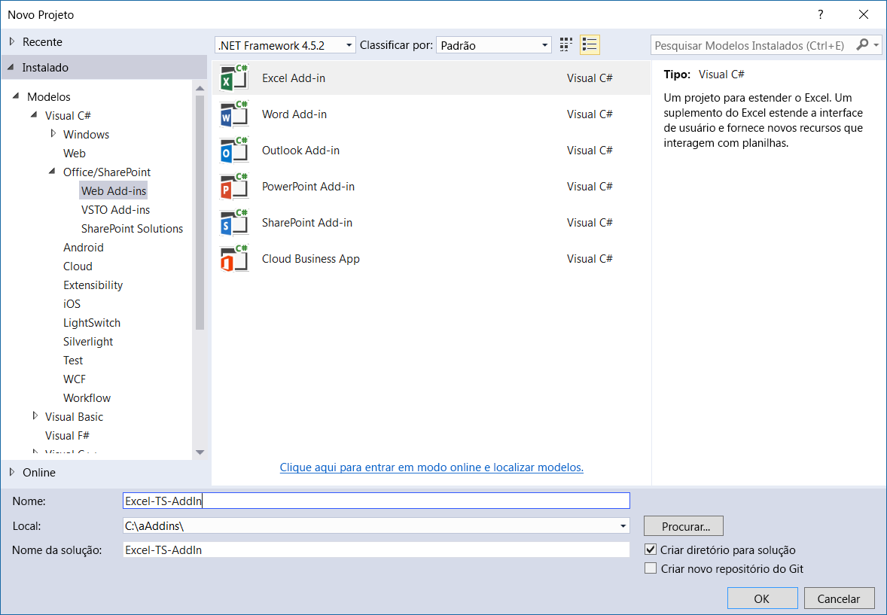
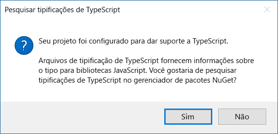
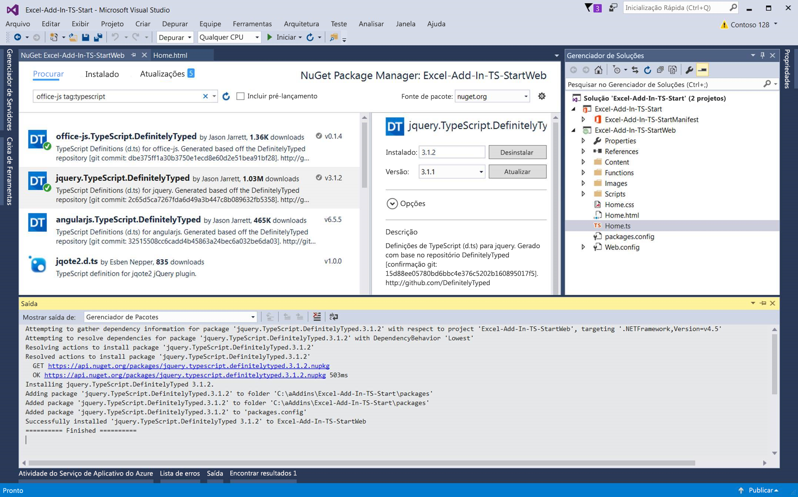

# <a name="convert-an-office-add-in-task-pane-template-in-visual-studio-to-typescript"></a>Converter um modelo do painel de tarefas de Suplemento do Office no Visual Studio para TypeScript


Você pode usar o modelo JavaScript de Suplemento do Office no Visual Studio para criar um suplemento que usa TypeScript. Depois de criar o novo suplemento no Visual Studio, você pode converter o projeto para TypeScript.  Dessa forma, não é preciso começar o projeto em TypeScript de Suplemento do Office do zero.  

   > **Observação:** Para saber como criar um projeto em TypeScript de Suplemento do Office sem o Visual Studio, confira [Criar um Suplemento usando qualquer editor](../get-started/create-an-office-add-in-using-any-editor.md).

Em seu projeto em TypeScript, você pode ter uma combinação de arquivos TypeScript e JavaScript e seu projeto irá compilar. Isso ocorre porque o TypeScript é um superconjunto tipado do JavaScript que compila o JavaScript. 

Este artigo mostra como converter um modelo de painel de tarefas de suplemento do Excel no Visual Studio de JavaScript para TypeScript. Você pode usar as mesmas instruções para converter outros modelos em JavaScript de Suplemento do Office para TypeScript.

Para exibir ou baixar o código de exemplo no qual este artigo se baseia, confira [Excel-Add-In-TS-Start](https://github.com/officedev/Excel-Add-In-TS-Start) no GitHub.

## <a name="prerequisites"></a>Pré-requisitos

Verifique se os seguintes itens estão instalados:

* [Visual Studio 2015 ou posterior](https://www.visualstudio.com/downloads/)
* [Office Developer Tools para Visual Studio](https://www.visualstudio.com/pt-BR/features/office-tools-vs.aspx)
* [Versão de Serviço Cumulativa para Microsoft Visual Studio 2015 Atualização 3 (KB3165756)](https://msdn.microsoft.com/pt-BR/library/mt752379.aspx)
* Excel 2016
* [TypeScript 2.1 para Visual Studio 2015](http://download.microsoft.com/download/6/D/8/6D8381B0-03C1-4BD2-AE65-30FF0A4C62DA/TS2.1-dev14update3-20161206.2/TypeScript_Dev14Full.exe) (após a instalação do Visual Studio 2015 Atualização 3)

    > **Observação:**  Para mais informações sobre como instalar o TypeScript 2.1, confira [Anunciando o TypeScript 2.1](https://blogs.msdn.microsoft.com/typescript/2016/12/07/announcing-typescript-2-1/).

## <a name="create-new-add-in-project"></a>Criar novo projeto de suplemento

1.  Abra o Visual Studio e vá para **Arquivo** > **Novo** > **Projeto**. 
2.  Em **Office/SharePoint**, escolha **Suplemento do Excel** e, em seguida, selecione **OK**.

    

3.  No assistente de criação de aplicativos, selecione **Adicionar novas funcionalidades ao Excel** e **Concluir**.
4.  Faça um teste rápido do suplemento do Excel recém-criado pressionando F5 ou o botão verde **Iniciar** para iniciar o suplemento. O suplemento será hospedado localmente no IIS e o Excel abrirá com o suplemento carregado.

## <a name="convert-the-add-in-project-to-typescript"></a>Converter o projeto do suplemento para TypeScript

1. No **Explorador de Soluções**, altere o arquivo Home.js para Home.ts.
2. Selecione **Sim** para confirmar que você tem certeza de que deseja alterar a extensão do nome de arquivo.  
3. Selecione **Sim** quando surgir a pergunta se você deseja procurar tipificações de TypeScript no nuget, conforme mostrado na captura de tela a seguir. Isso abre o **Gerenciador de Pacotes do NuGet**.

    

4. Escolha **Procurar** no **Gerenciador de Pacotes do Nuget**.  
5. Na caixa de pesquisa, digite **office-js tag:typescript**.
6. Instale o **office.js.TypeScript.DefinitelyTyped** e o **jquery.TypeScript.DefinitelyTyped**, conforme exibido na seguinte captura de tela.

    

7. Abra o Home.ts (anteriormente conhecido como Home.js). Remova a seguinte referência da parte superior do arquivo Home.ts:

    ```///<reference path="/Scripts/FabricUI/MessageBanner.js" />```

8. Adicione a seguinte declaração à parte superior do arquivo Home.js:

    ```declare var fabric: any;```

9. Altere de **‘1.1’** para **1.1**; ou seja, remova as aspas da linha a seguir no arquivo Home.ts:

    ```if (!Office.context.requirements.isSetSupported('ExcelApi', 1.1)) {```
 
## <a name="run-the-converted-add-in-project"></a>Executar o projeto do suplemento convertido

1. Pressione F5 ou o botão verde **Iniciar** para iniciar o suplemento. 
2. Após a inicialização do Excel, pressione o botão **Mostrar o Painel de Tarefas** na faixa de opções **Página Inicial**.
3. Selecione todas as células com números.
4. Pressione o botão **Realçar** no painel de tarefas. 

## <a name="homets-code-file"></a>Arquivo de código Home.ts

Para referência, este é o código incluído no arquivo Home.ts. Esse arquivo contém o número mínimo de alterações necessárias para que seu suplemento seja executado.

>**Observação:** Para obter um exemplo completo de um arquivo JavaScript que foi convertido para TypeScript, confira [Excel-Add-In-TS-StartWeb/Home.ts](https://github.com/officedev/Excel-Add-In-TS-Start/blob/master/Excel-Add-In-TS-StartWeb/Home.ts). 

```
declare var fabric: any;

(function () {
    "use strict";

    var cellToHighlight;
    var messageBanner;

    // The initialize function must be run each time a new page is loaded.
    Office.initialize = function (reason) {
        $(document).ready(function () {
            // Initialize the FabricUI notification mechanism and hide it
            var element = document.querySelector('.ms-MessageBanner');
            messageBanner = new fabric.MessageBanner(element);
            messageBanner.hideBanner();
            
            // If not using Excel 2016, use fallback logic.
            if (!Office.context.requirements.isSetSupported('ExcelApi', 1.1)) {
                $("#template-description").text("This sample will display the value of the cells you have selected in the spreadsheet.");
                $('#button-text').text("Display!");
                $('#button-desc').text("Display the selection");

                $('#highlight-button').click(
                    displaySelectedCells);
                return;
            }

            $("#template-description").text("This sample highlights the highest value from the cells you have selected in the spreadsheet.");
            $('#button-text').text("Highlight!");
            $('#button-desc').text("Highlights the largest number.");
                
            loadSampleData();

            // Add a click event handler for the highlight button.
            $('#highlight-button').click(
                hightlightHighestValue);
        });
    }

    function loadSampleData() {

        var values = [
                        [Math.floor(Math.random() * 1000), Math.floor(Math.random() * 1000), Math.floor(Math.random() * 1000)],
                        [Math.floor(Math.random() * 1000), Math.floor(Math.random() * 1000), Math.floor(Math.random() * 1000)],
                        [Math.floor(Math.random() * 1000), Math.floor(Math.random() * 1000), Math.floor(Math.random() * 1000)]
        ];

        // Run a batch operation against the Excel object model.
        Excel.run(function (ctx) {
            // Create a proxy object for the active sheet
            var sheet = ctx.workbook.worksheets.getActiveWorksheet();
            // Queue a command to write the sample data to the worksheet
            sheet.getRange("B3:D5").values = values;

            // Run the queued-up commands, and return a promise to indicate task completion
            return ctx.sync();
        })
        .catch(errorHandler);
    }

    function hightlightHighestValue() {

        // Run a batch operation against the Excel object model.
        Excel.run(function (ctx) {

            // Create a proxy object for the selected range and load its address and values properties.
            var sourceRange = ctx.workbook.getSelectedRange().load("values, address, rowIndex, columnIndex, rowCount, columnCount");

            // Run the queued-up command, and return a promise to indicate task completion
            return ctx.sync().
                .then(function () {
                    var highestRow = 0;
                    var highestCol = 0;
                    var highestValue = sourceRange.values[0][0];

                    // Find the cell to highlight
                    for (var i = 0; i < sourceRange.rowCount; i++) {
                        for (var j = 0; j < sourceRange.columnCount; j++) {
                            if (!isNaN(sourceRange.values[i][j]) && sourceRange.values[i][j] > highestValue) {
                                highestRow = i;
                                highestCol = j;
                                highestValue = sourceRange.values[i][j];
                            }
                        }
                    }

                    cellToHighlight = sourceRange.getCell(highestRow, highestCol);
                    sourceRange.worksheet.getUsedRange().format.fill.clear();
                    sourceRange.worksheet.getUsedRange().format.font.bold = false;

                    cellToHighlight.load("values");
                })
                   // Run the queued-up commands.
                .then(ctx.sync)
                .then(function () {
                    // Highlight the cell
                    cellToHighlight.format.fill.color = "orange";
                    cellToHighlight.format.font.bold = true;
                })
                .then(ctx.sync)
        })
        .catch(errorHandler);
    }

    function displaySelectedCells() {
        Office.context.document.getSelectedDataAsync(Office.CoercionType.Text,
            function (result) {
                if (result.status === Office.AsyncResultStatus.Succeeded) {
                    showNotification('The selected text is:', '"' + result.value + '"');
                } else {
                    showNotification('Error', result.error.message);
                }
            });
    }

    // Helper function for treating errors.
    function errorHandler(error) {
        // Always be sure to catch any accumulated errors that bubble up from the Excel.run execution
        showNotification("Error", error);
        console.log("Error: " + error);
        if (error instanceof OfficeExtension.Error) {
            console.log("Debug info: " + JSON.stringify(error.debugInfo));
        }
    }

    // Helper function for displaying notifications
    function showNotification(header, content) {
        $("#notificationHeader").text(header);
        $("#notificationBody").text(content);
        messageBanner.showBanner();
        messageBanner.toggleExpansion();
    }
})();

```

## <a name="additional-resources"></a>Recursos adicionais

* [Discussão de implementação do Promise no StackOverflow](https://stackoverflow.com/questions/44461312/office-addins-file-in-its-typescript-version-doesnt-work)
* [Exemplos de Suplementos do Office no GitHub](https://github.com/officedev)
