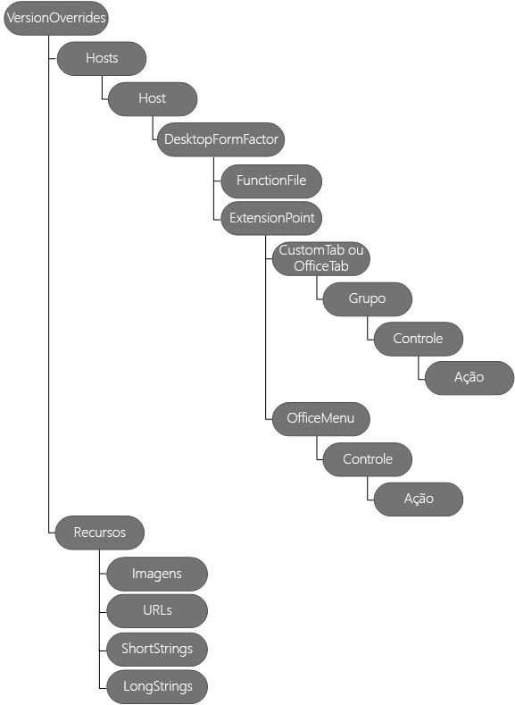

# <a name="create-add-in-commands-in-your-manifest-for-excel-word-and-powerpoint"></a><span data-ttu-id="4e5f6-104">Criar comandos de suplemento no manifesto para Excel, Word e PowerPoint</span><span class="sxs-lookup"><span data-stu-id="4e5f6-104">Create add-in commands in your manifest for Excel, Word, and PowerPoint</span></span>


<span data-ttu-id="4e5f6-p102">Use **[VersionOverrides](/office/dev/add-ins/reference/manifest/versionoverrides)** no manifesto para definir comandos de suplemento para Excel, Word e PowerPoint. Os comandos de suplemento fornecem uma maneira fácil de personalizar a interface do usuário padrão do Office com elementos de interface do usuário especificados que executam ações. Você pode usar comandos de suplemento para:</span><span class="sxs-lookup"><span data-stu-id="4e5f6-p102">Use **[VersionOverrides](/office/dev/add-ins/reference/manifest/versionoverrides)** in your manifest to define add-in commands for Excel, Word, and PowerPoint. Add-in commands provide an easy way to customize the default Office user interface (UI) with specified UI elements that perform actions. You can use add-in commands to:</span></span>
- <span data-ttu-id="4e5f6-108">Criar elementos de interface do usuário ou pontos de entrada que facilitam o uso da funcionalidade dos suplementos.</span><span class="sxs-lookup"><span data-stu-id="4e5f6-108">Create UI elements or entry points that make your add-in's functionality easier to use.</span></span>  
  
- <span data-ttu-id="4e5f6-109">Adicionar botões ou uma lista suspensa de botões à faixa de opções.</span><span class="sxs-lookup"><span data-stu-id="4e5f6-109">Add buttons or a drop-down list of buttons to the ribbon.</span></span>
  
- <span data-ttu-id="4e5f6-110">Adicionar itens de menu individuais — cada um contendo submenus opcionais — aos menus de contexto específicos (atalho).</span><span class="sxs-lookup"><span data-stu-id="4e5f6-110">Add individual menu items — each containing optional submenus — to specific context (shortcut) menus.</span></span>
  
- <span data-ttu-id="4e5f6-p103">Executar ações quando seu comando de suplemento é escolhido. É possível:</span><span class="sxs-lookup"><span data-stu-id="4e5f6-p103">Perform actions when your add-in command is chosen. You can:</span></span>

  - <span data-ttu-id="4e5f6-p104">Mostrar um ou mais suplementos de painel de tarefa com os quais os usuários podem interagir. Dentro do suplemento de painel de tarefa, é possível exibir HTML que use a malha da interface do usuário do Office para criar uma interface do usuário personalizada.</span><span class="sxs-lookup"><span data-stu-id="4e5f6-p104">Show one or more task pane add-ins for users to interact with. Inside your task pane add-in, you can display HTML that uses Office UI Fabric to create a custom UI.</span></span>

     <span data-ttu-id="4e5f6-115">*ou*</span><span class="sxs-lookup"><span data-stu-id="4e5f6-115">*or*</span></span>

  - <span data-ttu-id="4e5f6-116">Executar código JavaScript, que normalmente é executado sem exibir qualquer interface do usuário.</span><span class="sxs-lookup"><span data-stu-id="4e5f6-116">Run JavaScript code, which normally runs without displaying any UI.</span></span>

<span data-ttu-id="4e5f6-p105">Este artigo descreve como editar seu manifesto para definir comandos de suplemento. O diagrama a seguir mostra a hierarquia de elementos usada para definir comandos de suplemento. Descrevemos esses elementos com mais detalhes neste artigo.</span><span class="sxs-lookup"><span data-stu-id="4e5f6-p105">This article describes how to edit your manifest to define add-in commands. The following diagram shows the hierarchy of elements used to define add-in commands. These elements are described in more detail in this article.</span></span> 

<span data-ttu-id="4e5f6-p106">A imagem a seguir representa uma visão geral dos elementos dos comandos de suplemento no manifesto. </span><span class="sxs-lookup"><span data-stu-id="4e5f6-p106">The following image is an overview of add-in commands elements in the manifest. </span></span>

## <a name="step-1-start-from-a-sample"></a><span data-ttu-id="4e5f6-122">Etapa 1: iniciar usando uma amostra</span><span class="sxs-lookup"><span data-stu-id="4e5f6-122">Step 1: Start from a sample</span></span>

<span data-ttu-id="4e5f6-p107">É altamente recomendável iniciar usando uma das amostras fornecidas em [Amostras de comandos de suplemento do Office](https://github.com/OfficeDev/Office-Add-in-Command-Sample). Como opção, você pode criar seu próprio manifesto seguindo as etapas neste guia. É possível validar o manifesto usando o arquivo XSD no site de Amostras de comandos de suplemento do Office. Não deixe de ler o artigo [Comandos de suplemento para Excel, Word e PowerPoint](../design/add-in-commands.md), antes de usar os comandos de suplemento.</span><span class="sxs-lookup"><span data-stu-id="4e5f6-p107">We strongly recommend that you start from one of the samples we provide in  [Office Add-in Commands Samples](https://github.com/OfficeDev/Office-Add-in-Command-Sample). Optionally, you can create your own manifest by following the steps in this guide. You can validate your manifest using the XSD file in the Office Add-in Commands Samples site. Ensure that you have read  [Add-in commands for Excel, Word and PowerPoint](../design/add-in-commands.md) before using add-in commands.</span></span>

## <a name="step-2-create-a-task-pane-add-in"></a><span data-ttu-id="4e5f6-127">Etapa 2: criar um suplemento de painel de tarefas</span><span class="sxs-lookup"><span data-stu-id="4e5f6-127">Step 2: Create a task pane add-in</span></span>

<span data-ttu-id="4e5f6-p108">Para começar a usar os comandos de suplemento, primeiramente, é preciso criar um suplemento de painel de tarefas e modificar o manifesto do suplemento, conforme descrito neste artigo. Não é possível usar comandos de suplemento com suplementos de conteúdo. Se for atualizar um manifesto existente, você deverá adicionar o **XML namespaces** apropriado, além do elemento **VersionOverrides** ao manifesto, conforme descrito na [Etapa 3: adicionar o elemento VersionOverrides](#step-3-add-versionoverrides-element).</span><span class="sxs-lookup"><span data-stu-id="4e5f6-p108">To start using add-in commands, you must first create a task pane add-in, and then modify the add-in's manifest as described in this article. You can't use add-in commands with content add-ins. If you're updating an existing manifest, you must add the appropiate **XML namespaces** as well as add the **VersionOverrides** element to the manifest as described in [Step 3: Add VersionOverrides element](#step-3-add-versionoverrides-element).</span></span>

<span data-ttu-id="4e5f6-p109">O exemplo a seguir mostra o manifesto de um suplemento do Office 2013. Não há comandos de suplemento nesse manifesto porque não há elemento **VersionOverrides**. O Office 2013 não dá suporte a comandos de suplemento, mas com a adição de **VersionOverrides** a esse manifesto, o suplemento será executado no Office 2013 e no Office 2016. No Office 2013, o suplemento não exibirá comandos de suplemento e usa o valor de **SourceLocation** para executar seu suplemento como um único suplemento de painel de tarefas. No Office 2016, se nenhum elemento **VersionOverrides** estiver incluído, **SourceLocation** será usado para executar o suplemento. Entretanto, se você incluir **VersionOverrides**, o suplemento exibirá apenas os comandos de suplemento e não exibirá o suplemento como um único suplemento de painel de tarefas.</span><span class="sxs-lookup"><span data-stu-id="4e5f6-p109">The following example shows an Office 2013 add-in's manifest. There are no add-in commands in this manifest because there is no **VersionOverrides** element. Office 2013 doesn't support add-in commands, but by adding **VersionOverrides** to this manifest, your add-in will run in both Office 2013 and Office 2016. In Office 2013, your add-in won't display add-in commands, and uses the value of **SourceLocation** to run your add-in as a single task pane add-in. In Office 2016, if no **VersionOverrides** element is included, **SourceLocation** is used to run your add-in. If you include **VersionOverrides**, however, your add-in displays the add-in commands only, and doesn't display your add-in as a single task pane add-in.</span></span>
  
```xml
<OfficeApp xmlns="http://schemas.microsoft.com/office/appforoffice/1.1" xmlns:xsi="https://www.w3.org/2001/XMLSchema-instance" xmlns:bt="http://schemas.microsoft.com/office/officeappbasictypes/1.0" xmlns:ov="http://schemas.microsoft.com/office/taskpaneappversionoverrides" xsi:type="TaskPaneApp">
  <Id>657a32a9-ab8a-4579-ac9f-df1a11a64e52</Id>
  <Version>1.0.0.0</Version>
  <ProviderName>Contoso</ProviderName>
  <DefaultLocale>en-US</DefaultLocale>
  <DisplayName DefaultValue="Contoso Add-in Commands" />
  <Description DefaultValue="Contoso Add-in Commands"/>
  <IconUrl DefaultValue="~remoteAppUrl/Images/Icon_32.png" />
 
  <AppDomains>
    <AppDomain>AppDomain1</AppDomain>
    <AppDomain>AppDomain2</AppDomain>
    <AppDomain>AppDomain3</AppDomain>
  </AppDomains>
  <Hosts>
    <Host Name="Workbook" />
  </Hosts>
  <DefaultSettings>
    <SourceLocation DefaultValue="https://www.contoso.com/Pages/Home.aspx" />
  </DefaultSettings>
  <Permissions>ReadWriteDocument</Permissions>

 <!-- The VersionOverrides element is inserted at this location in the manifest. -->

</OfficeApp>
```

## <a name="step-3-add-versionoverrides-element"></a><span data-ttu-id="4e5f6-136">Etapa 3: adicionar o elemento VersionOverrides</span><span class="sxs-lookup"><span data-stu-id="4e5f6-136">Step 3: Add VersionOverrides element</span></span>

<span data-ttu-id="4e5f6-p110">O elemento **VersionOverrides** é o elemento raiz que contém a definição do comando de suplemento. **VersionOverrides** é um elemento filho do elemento **OfficeApp** no manifesto. A tabela a seguir lista os atributos do elemento **VersionOverrides**.</span><span class="sxs-lookup"><span data-stu-id="4e5f6-p110">The **VersionOverrides** element is the root element that contains the definition of your add-in command. **VersionOverrides** is a child element of the **OfficeApp** element in the manifest. The following table lists the attributes of the **VersionOverrides** element.</span></span>

|<span data-ttu-id="4e5f6-140">**Atributo**</span><span class="sxs-lookup"><span data-stu-id="4e5f6-140">**Attribute**</span></span>|<span data-ttu-id="4e5f6-141">**Descrição**</span><span class="sxs-lookup"><span data-stu-id="4e5f6-141">**Description**</span></span>|
|:-----|:-----|
|<span data-ttu-id="4e5f6-142">**xmlns**</span><span class="sxs-lookup"><span data-stu-id="4e5f6-142">**xmlns**</span></span> <br/> | <span data-ttu-id="4e5f6-143">Obrigatório.</span><span class="sxs-lookup"><span data-stu-id="4e5f6-143">Required.</span></span> <span data-ttu-id="4e5f6-144">O local do esquema, que deve ser `http://schemas.microsoft.com/office/taskpaneappversionoverrides`.</span><span class="sxs-lookup"><span data-stu-id="4e5f6-144">The schema location, which must be `http://schemas.microsoft.com/office/taskpaneappversionoverrides`.</span></span> <br/> |
|<span data-ttu-id="4e5f6-145">**xsi:type**</span><span class="sxs-lookup"><span data-stu-id="4e5f6-145">**xsi:type**</span></span> <br/> |<span data-ttu-id="4e5f6-p112">Obrigatório. A versão do esquema. A versão descrita neste artigo é "VersionOverridesV1_0".</span><span class="sxs-lookup"><span data-stu-id="4e5f6-p112">Required. The schema version. The version described in this article is "VersionOverridesV1_0".</span></span>  <br/> |

<span data-ttu-id="4e5f6-149">A tabela a seguir identifica os elementos filho de **VersionOverrides**.</span><span class="sxs-lookup"><span data-stu-id="4e5f6-149">The following table identifies the child elements of **VersionOverrides**.</span></span>
  
|<span data-ttu-id="4e5f6-150">**Elemento**</span><span class="sxs-lookup"><span data-stu-id="4e5f6-150">**Element**</span></span>|<span data-ttu-id="4e5f6-151">**Descrição**</span><span class="sxs-lookup"><span data-stu-id="4e5f6-151">**Description**</span></span>|
|:-----|:-----|
|<span data-ttu-id="4e5f6-152">**Descrição**</span><span class="sxs-lookup"><span data-stu-id="4e5f6-152">**Description**</span></span> <br/> |<span data-ttu-id="4e5f6-p113">Opcional. Descreve o suplemento. Esse elemento filho **Description** substitui um elemento **Description** anterior na parte pai do manifesto. O atributo **resid** para esse elemento **Description** é definido como a **id** de um elemento **String**. O elemento **String** contém o texto para **Description**. </span><span class="sxs-lookup"><span data-stu-id="4e5f6-p113">Optional. Describes the add-in. This child **Description** element overrides a previous **Description** element in the parent portion of the manifest. The **resid** attribute for this **Description** element is set to the **id** of a **String** element. The **String** element contains the text for **Description**. </span></span><br/> |
|<span data-ttu-id="4e5f6-158">**Requisitos**</span><span class="sxs-lookup"><span data-stu-id="4e5f6-158">**Requirements**</span></span> <br/> |<span data-ttu-id="4e5f6-p114">Opcional. Especifica o conjunto de requisitos mínimos e a versão do Office.js exigida pelo suplemento. Esse elemento filho **Requirements** substitui o elemento **Requirements** na parte pai do manifesto. Para saber mais, confira [Especificar requisitos de API e hosts do Office](../develop/specify-office-hosts-and-api-requirements.md).  </span><span class="sxs-lookup"><span data-stu-id="4e5f6-p114">Optional. Specifies the minimum requirement set and version of Office.js that the add-in requires. This child **Requirements** element overrides the **Requirements** element in the parent portion of the manifest. For more information, see [Specify Office hosts and API requirements](../develop/specify-office-hosts-and-api-requirements.md).  </span></span><br/> |
|<span data-ttu-id="4e5f6-163">**Hosts**</span><span class="sxs-lookup"><span data-stu-id="4e5f6-163">**Hosts**</span></span> <br/> |<span data-ttu-id="4e5f6-p115">Obrigatório. Especifica um conjunto de hosts do Office. O elemento filho **Hosts** substitui o elemento **Hosts** na parte pai do manifesto. Você deve incluir um conjunto de atributos **xsi:type** como "Pasta de trabalho" ou "Documento". </span><span class="sxs-lookup"><span data-stu-id="4e5f6-p115">Required. Specifies a collection of Office hosts. The child **Hosts** element overrides the **Hosts** element in the parent portion of the manifest. You must include a **xsi:type** attribute set to "Workbook" or "Document". </span></span><br/> |
|<span data-ttu-id="4e5f6-168">**Resources**</span><span class="sxs-lookup"><span data-stu-id="4e5f6-168">**Resources**</span></span> <br/> |<span data-ttu-id="4e5f6-p116">Define um conjunto de recursos (cadeias de caracteres, URLs e imagens) referenciado por outros elementos de manifesto. Por exemplo, o valor do elemento **Description** refere-se a um elemento filho em **Resources**. O elemento **Resources** é descrito na [Etapa 7: adicionar o elemento Resources](#step-7-add-the-resources-element) mais adiante neste artigo. </span><span class="sxs-lookup"><span data-stu-id="4e5f6-p116">Defines a collection of resources (strings, URLs, and images) that other manifest elements reference. For example, the **Description** element's value refers to a child element in **Resources**. The **Resources** element is described in [Step 7: Add the Resources element](#step-7-add-the-resources-element) later in this article. </span></span><br/> |

<span data-ttu-id="4e5f6-172">O exemplo a seguir mostra como usar o elemento **VersionOverrides** e seus elementos filho.</span><span class="sxs-lookup"><span data-stu-id="4e5f6-172">The following example shows how to use the **VersionOverrides** element and its child elements.</span></span>

```xml
<OfficeApp>
...
  <VersionOverrides xmlns="http://schemas.microsoft.com/office/taskpaneappversionoverrides" xsi:type="VersionOverridesV1_0">
    <Description resid="residDescription" />
    <Requirements>
      <!-- add information about requirement sets -->
    </Requirements>
    <Hosts>
      <Host xsi:type="Workbook">
        <!-- add information about form factors -->
      </Host>
      <Host xsi:type="Document">
        <!-- add information about form factors -->
      </Host>
    </Hosts>
    <Resources> 
      <!-- add information about resources -->
    </Resources>
  </VersionOverrides>
...
</OfficeApp>
```

## <a name="step-4-add-hosts-host-and-desktopformfactor-elements"></a><span data-ttu-id="4e5f6-173">Etapa 4: adicionar os elementos Hosts, Host e DesktopFormFactor</span><span class="sxs-lookup"><span data-stu-id="4e5f6-173">Step 4: Add Hosts, Host, and DesktopFormFactor elements</span></span>

<span data-ttu-id="4e5f6-p117">O elemento **Hosts** contém um ou mais elementos **Host**. Um elemento **Host** especifica um determinado host do Office. O elemento **Host** contém elementos filho que especificam os comandos de suplemento que serão exibidos após a instalação do suplemento nesse host do Office. Para mostrar os mesmos comandos de suplemento em dois ou mais hosts do Office diferentes, você deve duplicar os elementos filho em cada **Host**.</span><span class="sxs-lookup"><span data-stu-id="4e5f6-p117">The **Hosts** element contains one or more **Host** elements. A **Host** element specifies a particular Office host. The **Host** element contains child elements that specify the add-in commands to display after your add-in is installed in that Office host. To show the same add-in commands in two or more different Office hosts, you must duplicate the child elements in each **Host**.</span></span>

<span data-ttu-id="4e5f6-178">O elemento **DesktopFormFactor** especifica as configurações para um suplemento que é executado no Office, na área de trabalho do Windows, e no Office Online (no navegador).</span><span class="sxs-lookup"><span data-stu-id="4e5f6-178">The **DesktopFormFactor** element specifies the settings for an add-in that runs in Office on Windows desktop, and Office Online (in browser).</span></span>

<span data-ttu-id="4e5f6-179">Veja a seguir um exemplo dos elementos **Hosts**, **Host** e **DesktopFormFactor**.</span><span class="sxs-lookup"><span data-stu-id="4e5f6-179">The following is an example of **Hosts**, **Host**, and **DesktopFormFactor** elements.</span></span>

```xml
<OfficeApp>
...
  <VersionOverrides xmlns="http://schemas.microsoft.com/office/taskpaneappversionoverrides" xsi:type="VersionOverridesV1_0">
  ...
    <Hosts>
      <Host xsi:type="Workbook">
        <DesktopFormFactor>

              <!-- information about FunctionFile and ExtensionPoint -->

        </DesktopFormFactor>
      </Host>
    </Hosts>
  ...
  </VersionOverrides>
...
</OfficeApp>
```

## <a name="step-5-add-the-functionfile-element"></a><span data-ttu-id="4e5f6-180">Etapa 5: adicionar o elemento FunctionFile</span><span class="sxs-lookup"><span data-stu-id="4e5f6-180">Step 5: Add the FunctionFile element</span></span>

<span data-ttu-id="4e5f6-p118">O elemento **FunctionFile** especifica um arquivo que contém o código JavaScript a ser executado quando um comando de suplemento usa a ação **ExecuteFunction** (confira [Controles de botão](/office/dev/add-ins/reference/manifest/control#button-control) para obter uma descrição). O atributo **resid** do elemento **FunctionFile** é definido como um arquivo HTML que inclui todos os arquivos JavaScript exigidos por seus comandos de suplemento. Você não pode criar um vínculo diretamente com um arquivo JavaScript, mas somente com um arquivo HTML. O nome do arquivo é especificado como um elemento **Url** no elemento **Resources**.</span><span class="sxs-lookup"><span data-stu-id="4e5f6-p118">The **FunctionFile** element specifies a file that contains JavaScript code to run when an add-in command uses the **ExecuteFunction** action (see [Button controls](/office/dev/add-ins/reference/manifest/control#button-control) for a description). The **FunctionFile** element's **resid** attribute is set to a HTML file that includes all the JavaScript files your add-in commands require. You can't link directly to a JavaScript file. You can only link to an HTML file. The file name is specified as a **Url** element in the **Resources** element.</span></span>

<span data-ttu-id="4e5f6-186">Veja a seguir um exemplo do elemento **FunctionFile**.</span><span class="sxs-lookup"><span data-stu-id="4e5f6-186">The following is an example of the **FunctionFile** element.</span></span>
  
```xml
<DesktopFormFactor>
    <FunctionFile resid="residDesktopFuncUrl" />
    <ExtensionPoint xsi:type="PrimaryCommandSurface">
      <!-- information about this extension point -->
    </ExtensionPoint> 

    <!-- You can define more than one ExtensionPoint element as needed -->
</DesktopFormFactor>
```

> [!IMPORTANT]
> <span data-ttu-id="4e5f6-187">Verifique se seu código JavaScript chama `Office.initialize`.</span><span class="sxs-lookup"><span data-stu-id="4e5f6-187">Make sure your JavaScript code calls  `Office.initialize`.</span></span>

<span data-ttu-id="4e5f6-p119">O JavaScript no arquivo HTML referenciado pelo elemento **FunctionFile** deve chamar `Office.initialize`. O elemento **FunctionName** (confira [Controles de botão](/office/dev/add-ins/reference/manifest/control#button-control) para obter uma descrição) usa as funções em **FunctionFile**.</span><span class="sxs-lookup"><span data-stu-id="4e5f6-p119">The JavaScript in the HTML file referenced by the **FunctionFile** element must call `Office.initialize`. The **FunctionName** element (see [Button controls](/office/dev/add-ins/reference/manifest/control#button-control) for a description) uses the functions in **FunctionFile**.</span></span>

<span data-ttu-id="4e5f6-190">O código a seguir mostra como implementar a função usada por **FunctionName**.</span><span class="sxs-lookup"><span data-stu-id="4e5f6-190">The following code shows how to implement the function used by **FunctionName**.</span></span>

```javascript

<script>
    // The initialize function must be run each time a new page is loaded.
    (function () {
        Office.initialize = function (reason) {
            // If you need to initialize something you can do so here.
        };
    })();

    // Your function must be in the global namespace.
    function writeText(event) {

        // Implement your custom code here. The following code is a simple example.  
        Office.context.document.setSelectedDataAsync("ExecuteFunction works. Button ID=" + event.source.id,
            function (asyncResult) {
                var error = asyncResult.error;
                if (asyncResult.status === Office.AsyncResultStatus.Failed) {
                    // Show error message.
                }
                else {
                    // Show success message.
                }
            });

        // Calling event.completed is required. event.completed lets the platform know that processing has completed. 
        event.completed();
    }
</script>
```

> [!IMPORTANT]
> <span data-ttu-id="4e5f6-p120">A chamada para **event.completed** sinaliza que o evento foi manipulado. Quando uma função é chamada várias vezes, por exemplo, com vários cliques no mesmo comando de suplemento, todos os eventos são enfileirados automaticamente. O primeiro evento é executado automaticamente, enquanto os outros eventos permanecem na fila. Quando sua função chama **event.completed**, a próxima chamada em fila para essa função é executada. Você deve implementar **event.completed**; caso contrário, sua função não será executada.</span><span class="sxs-lookup"><span data-stu-id="4e5f6-p120">The call to **event.completed** signals that you have successfully handled the event. When a function is called multiple times, such as multiple clicks on the same add-in command, all events are automatically queued. The first event runs automatically, while the other events remain on the queue. When your function calls **event.completed**, the next queued call to that function runs. You must implement **event.completed**, otherwise your function will not run.</span></span>

## <a name="step-6-add-extensionpoint-elements"></a><span data-ttu-id="4e5f6-196">Etapa 6: adicionar elementos do ExtensionPoint</span><span class="sxs-lookup"><span data-stu-id="4e5f6-196">Step 6: Add ExtensionPoint elements</span></span>

<span data-ttu-id="4e5f6-p121">O elemento **ExtensionPoint** define onde os comandos de suplemento devem aparecer na interface do usuário do Office. Você pode definir os elementos **ExtensionPoint** com estes valores de **xsi:type**:</span><span class="sxs-lookup"><span data-stu-id="4e5f6-p121">The **ExtensionPoint** element defines where add-in commands should appear in the Office UI. You can define **ExtensionPoint** elements with these **xsi:type** values:</span></span>

- <span data-ttu-id="4e5f6-199">**PrimaryCommandSurface**, que se refere à faixa de opções no Office.</span><span class="sxs-lookup"><span data-stu-id="4e5f6-199">**PrimaryCommandSurface**, which refers to the ribbon in Office.</span></span>

- <span data-ttu-id="4e5f6-200">**ContextMenu**, que é o menu de atalho exibido quando você clica com o botão direito na interface do usuário do Office.</span><span class="sxs-lookup"><span data-stu-id="4e5f6-200">**ContextMenu**, which is the shortcut menu that appears when you right-click in the Office UI.</span></span>

<span data-ttu-id="4e5f6-201">Os exemplos a seguir mostram como usar o elemento **ExtensionPoint** com os valores de atributo **PrimaryCommandSurface** e **ContextMenu** e os elementos filho que devem ser usados com cada um.</span><span class="sxs-lookup"><span data-stu-id="4e5f6-201">The following examples show how to use the **ExtensionPoint** element with **PrimaryCommandSurface** and **ContextMenu** attribute values, and the child elements that should be used with each.</span></span>

> [!IMPORTANT]
> <span data-ttu-id="4e5f6-p122">Para os elementos que contêm um atributo ID, forneça uma ID exclusiva. Recomendamos usar o nome da sua empresa com a ID. Por exemplo, use o seguinte formato: `<CustomTab id="mycompanyname.mygroupname">`</span><span class="sxs-lookup"><span data-stu-id="4e5f6-p122">For elements that contain an ID attribute, make sure you provide a unique ID. We recommend that you use your company's name along with your ID. For example, use the following format: `<CustomTab id="mycompanyname.mygroupname">`.</span></span> 
  
```xml
<ExtensionPoint xsi:type="PrimaryCommandSurface">
  <CustomTab id="Contoso Tab">
  <!-- If you want to use a default tab that comes with Office, remove the above CustomTab element, and then uncomment the following OfficeTab element -->
  <!-- <OfficeTab id="TabData"> -->
    <Label resid="residLabel4" />
    <Group id="Group1Id12">
      <Label resid="residLabel4" />
      <Icon>
        <bt:Image size="16" resid="icon1_32x32" />
        <bt:Image size="32" resid="icon1_32x32" />
        <bt:Image size="80" resid="icon1_32x32" />
      </Icon>
      <Tooltip resid="residToolTip" />
      <Control xsi:type="Button" id="Button1Id1">

        <!-- information about the control -->
      </Control>
      <!-- other controls, as needed -->
    </Group>
  </CustomTab>
</ExtensionPoint>
<ExtensionPoint xsi:type="ContextMenu">
  <OfficeMenu id="ContextMenuCell">
    <Control xsi:type="Menu" id="ContextMenu2">
            <!-- information about the control -->
    </Control>
    <!-- other controls, as needed -->
  </OfficeMenu>
</ExtensionPoint>
```

|<span data-ttu-id="4e5f6-205">**Elemento**</span><span class="sxs-lookup"><span data-stu-id="4e5f6-205">**Element**</span></span>|<span data-ttu-id="4e5f6-206">**Descrição**</span><span class="sxs-lookup"><span data-stu-id="4e5f6-206">**Description**</span></span>|
|:-----|:-----|
|<span data-ttu-id="4e5f6-207">**CustomTab**</span><span class="sxs-lookup"><span data-stu-id="4e5f6-207">**CustomTab**</span></span> <br/> |<span data-ttu-id="4e5f6-p123">Obrigatório se você quiser adicionar uma guia personalizada à faixa de opções (usando **PrimaryCommandSurface**). Se você usar o elemento **CustomTab**, o elemento **OfficeTab** não poderá ser usado. O atributo **id** é obrigatório. </span><span class="sxs-lookup"><span data-stu-id="4e5f6-p123">Required if you want to add a custom tab to the ribbon (using **PrimaryCommandSurface**). If you use the **CustomTab** element, you can't use the **OfficeTab** element. The **id** attribute is required. </span></span><br/> |
|<span data-ttu-id="4e5f6-211">**OfficeTab**</span><span class="sxs-lookup"><span data-stu-id="4e5f6-211">**OfficeTab**</span></span> <br/> |<span data-ttu-id="4e5f6-p124">Obrigatório se você quiser estender uma guia de faixa de opções padrão do Office (usando **PrimaryCommandSurface**). Se você usar o elemento **OfficeTab**, o elemento **CustomTab** não poderá ser usado. </span><span class="sxs-lookup"><span data-stu-id="4e5f6-p124">Required if you want to extend a default Office ribbon tab (using **PrimaryCommandSurface**). If you use the **OfficeTab** element, you can't use the **CustomTab** element. </span></span><br/> <span data-ttu-id="4e5f6-214">Para obter mais valores de guia a serem usados com o atributo **id**, confira [Valores de guia para guias de faixa de opções padrão do Office](/office/dev/add-ins/reference/manifest/officetab).</span><span class="sxs-lookup"><span data-stu-id="4e5f6-214">For more tab values to use with the **id** attribute, see [Tab values for default Office ribbon tabs](/office/dev/add-ins/reference/manifest/officetab).</span></span>  <br/> |
|<span data-ttu-id="4e5f6-215">**OfficeMenu**</span><span class="sxs-lookup"><span data-stu-id="4e5f6-215">**OfficeMenu**</span></span> <br/> | <span data-ttu-id="4e5f6-p125">Obrigatório se você estiver adicionando comandos de suplemento a um menu de contexto padrão (usando **ContextMenu**). O atributo **id** deve ser definido como: </span><span class="sxs-lookup"><span data-stu-id="4e5f6-p125">Required if you're adding add-in commands to a default context menu (using **ContextMenu**). The **id** attribute must be set to: </span></span><br/> <span data-ttu-id="4e5f6-p126">**ContextMenuText** para Excel ou Word. Exibe o item no menu de contexto quando o texto é selecionado e o usuário clica com o botão direito do mouse no texto selecionado. </span><span class="sxs-lookup"><span data-stu-id="4e5f6-p126">**ContextMenuText** for Excel or Word. Displays the item on the context menu when text is selected and then the user right-clicks on the selected text. </span></span><br/> <span data-ttu-id="4e5f6-p127">**ContextMenuCell** para Excel. Exibe o item no menu de contexto quando o usuário clica com o botão direito do mouse em uma célula na planilha. </span><span class="sxs-lookup"><span data-stu-id="4e5f6-p127">**ContextMenuCell** for Excel. Displays the item on the context menu when the user right-clicks on a cell on the spreadsheet. </span></span><br/> |
|<span data-ttu-id="4e5f6-222">**Group**</span><span class="sxs-lookup"><span data-stu-id="4e5f6-222">**Group**</span></span> <br/> |<span data-ttu-id="4e5f6-p128">Um grupo de pontos de extensão de interface do usuário em uma guia. Um grupo pode ter até seis controles. O atributo **id** é obrigatório. É uma cadeia de caracteres com, no máximo, 125 caracteres. </span><span class="sxs-lookup"><span data-stu-id="4e5f6-p128">A group of user interface extension points on a tab. A group can have up to six controls. The **id** attribute is required. It's a string with a maximum of 125 characters. </span></span><br/> |
|<span data-ttu-id="4e5f6-226">**Label**</span><span class="sxs-lookup"><span data-stu-id="4e5f6-226">**Label**</span></span> <br/> |<span data-ttu-id="4e5f6-p129">Obrigatório. O rótulo do grupo. O atributo **resid** deve ser definido como o valor do atributo **id** de um elemento **String**. O elemento **String** é um elemento filho do elemento **ShortStrings**, que é elemento filho do elemento **Resources**. </span><span class="sxs-lookup"><span data-stu-id="4e5f6-p129">Required. The label of the group. The **resid** attribute must be set to the value of the **id** attribute of a **String** element. The **String** element is a child element of the **ShortStrings** element, which is a child element of the **Resources** element. </span></span><br/> |
|<span data-ttu-id="4e5f6-231">**Icon**</span><span class="sxs-lookup"><span data-stu-id="4e5f6-231">**Icon**</span></span> <br/> |<span data-ttu-id="4e5f6-p130">Obrigatório. Especifica o ícone do grupo a ser usado em dispositivos de fator forma pequeno ou quando muitos botões são exibidos. O atributo **resid** deve ser definido como o valor do atributo **id** de um elemento **Image**. O elemento **Image** é um elemento filho do elemento **Images**, que é um elemento filho do elemento **Resources**. O atributo **size** fornece o tamanho da imagem em pixels. Três tamanhos de imagem são obrigatórios: 16, 32 e 80 pixels. Também há suporte para cinco tamanhos opcionais: 20, 24, 40, 48 e 64 pixels. </span><span class="sxs-lookup"><span data-stu-id="4e5f6-p130">Required. Specifies the group's icon to be used on small form factor devices, or when too many buttons are displayed. The **resid** attribute must be set to the value of the **id** attribute of an **Image** element. The **Image** element is a child element of the **Images** element, which is a child element of the **Resources** element. The **size** attribute gives the size, in pixels, of the image. Three image sizes are required: 16, 32, and 80. Five optional sizes are also supported: 20, 24, 40, 48, and 64. </span></span><br/> |
|<span data-ttu-id="4e5f6-239">**Tooltip**</span><span class="sxs-lookup"><span data-stu-id="4e5f6-239">**Tooltip**</span></span> <br/> |<span data-ttu-id="4e5f6-p131">Opcional. A dica de ferramenta do grupo. O atributo **resid** deve ser definido como o valor do atributo **id** de um elemento **String**. O elemento **String** é um elemento filho do elemento **LongStrings**, que é um elemento filho do elemento **Resources**. </span><span class="sxs-lookup"><span data-stu-id="4e5f6-p131">Optional. The tooltip of the group. The **resid** attribute must be set to the value of the **id** attribute of a **String** element. The **String** element is a child element of the **LongStrings** element, which is a child element of the **Resources** element. </span></span><br/> |
|<span data-ttu-id="4e5f6-244">**Control**</span><span class="sxs-lookup"><span data-stu-id="4e5f6-244">**Control**</span></span> <br/> |<span data-ttu-id="4e5f6-p132">Cada grupo exige pelo menos um controle. Um elemento **Control** pode ser um **Button** ou um **Menu**. Use **Menu** para especificar uma lista suspensa de controles de botão. Atualmente, há suporte apenas para botões e menus. Confira as seguintes seções [Controles de botão](/office/dev/add-ins/reference/manifest/control#button-control) e [Controles de menu](/office/dev/add-ins/reference/manifest/control#menu-dropdown-button-controls) para saber mais.</span><span class="sxs-lookup"><span data-stu-id="4e5f6-p132">Each group requires at least one control. A **Control** element can be either a **Button** or a **Menu**. Use **Menu** to specify a drop-down list of button controls. Currently, only buttons and menus are supported. See the  [Button controls](/office/dev/add-ins/reference/manifest/control#button-control) and [Menu controls](/office/dev/add-ins/reference/manifest/control#menu-dropdown-button-controls) sections for more information. </span></span><br/><span data-ttu-id="4e5f6-250">**Observação:** para facilitar a solução de problemas, recomendamos adicionar um elemento **Control** e os elementos filho **Resources** relacionados, um de cada vez.</span><span class="sxs-lookup"><span data-stu-id="4e5f6-250">**Note:** To make troubleshooting easier, we recommend that you add a **Control** element and the related **Resources** child elements one at a time.</span></span>          |


### <a name="button-controls"></a><span data-ttu-id="4e5f6-251">Controles de botão</span><span class="sxs-lookup"><span data-stu-id="4e5f6-251">Button controls</span></span>

<span data-ttu-id="4e5f6-p133">Um botão executa uma única ação quando o usuário o seleciona. Pode ser a execução de uma função JavaScript ou a exibição de um painel de tarefas. O exemplo a seguir mostra como definir dois botões. O primeiro botão executa uma função JavaScript sem mostrar uma interface do usuário e o segundo botão mostra um painel de tarefas. No elemento **Control**:</span><span class="sxs-lookup"><span data-stu-id="4e5f6-p133">A button performs a single action when the user selects it. It can either execute a JavaScript function or show a task pane. The following example shows how to define two buttons. The first button runs a JavaScript function without showing a UI, and the second button shows a task pane. In the **Control** element:</span></span>

- <span data-ttu-id="4e5f6-257">O atributo **type** é obrigatório e deve ser definido como **Button**.</span><span class="sxs-lookup"><span data-stu-id="4e5f6-257">The **type** attribute is required, and must be set to **Button**.</span></span>

- <span data-ttu-id="4e5f6-258">O atributo **id** do elemento **Control** é uma cadeia de caracteres com, no máximo, 125 caracteres.</span><span class="sxs-lookup"><span data-stu-id="4e5f6-258">The **id** attribute of the **Control** element is a string with a maximum of 125 characters.</span></span>

```xml
<!-- Define a control that calls a JavaScript function. -->
<Control xsi:type="Button" id="Button1Id1">
  <Label resid="residLabel" />
  <Tooltip resid="residToolTip" />
  <Supertip>
    <Title resid="residLabel" />
    <Description resid="residToolTip" />
  </Supertip>
  <Icon>
    <bt:Image size="16" resid="icon1_32x32" />
    <bt:Image size="32" resid="icon1_32x32" />
    <bt:Image size="80" resid="icon1_32x32" />
  </Icon>
  <Action xsi:type="ExecuteFunction">
    <FunctionName>getData</FunctionName>
  </Action>
</Control>

<!-- Define a control that shows a task pane. -->
<Control xsi:type="Button" id="Button2Id1">
  <Label resid="residLabel2" />
  <Tooltip resid="residToolTip" />
  <Supertip>
    <Title resid="residLabel" />
    <Description resid="residToolTip" />
  </Supertip>
  <Icon>
    <bt:Image size="16" resid="icon2_32x32" />
    <bt:Image size="32" resid="icon2_32x32" />
    <bt:Image size="80" resid="icon2_32x32" />
  </Icon>
  <Action xsi:type="ShowTaskpane">
    <SourceLocation resid="residUnitConverterUrl" />
  </Action>
</Control>
```

|<span data-ttu-id="4e5f6-259">**Elementos**</span><span class="sxs-lookup"><span data-stu-id="4e5f6-259">**Elements**</span></span>|<span data-ttu-id="4e5f6-260">**Descrição**</span><span class="sxs-lookup"><span data-stu-id="4e5f6-260">**Description**</span></span>|
|:-----|:-----|
|<span data-ttu-id="4e5f6-261">**Label**</span><span class="sxs-lookup"><span data-stu-id="4e5f6-261">**Label**</span></span> <br/> |<span data-ttu-id="4e5f6-p134">Obrigatório. O texto do botão. O atributo **resid** deve ser definido como o valor do atributo **id** de um elemento **String**. O elemento **String** é um elemento filho do elemento **ShortStrings**, que é elemento filho do elemento **Resources**. </span><span class="sxs-lookup"><span data-stu-id="4e5f6-p134">Required. The text for the button. The **resid** attribute must be set to the value of the **id** attribute of a **String** element. The **String** element is a child element of the **ShortStrings** element, which is a child element of the **Resources** element. </span></span><br/> |
|<span data-ttu-id="4e5f6-266">**Tooltip**</span><span class="sxs-lookup"><span data-stu-id="4e5f6-266">**Tooltip**</span></span> <br/> |<span data-ttu-id="4e5f6-p135">Opcional. A dica de ferramenta do botão. O atributo **resid** deve ser definido como o valor do atributo **id** de um elemento **String**. O elemento **String** é um elemento filho do elemento **LongStrings**, que é um elemento filho do elemento **Resources**. </span><span class="sxs-lookup"><span data-stu-id="4e5f6-p135">Optional. The tooltip for the button. The **resid** attribute must be set to the value of the **id** attribute of a **String** element. The **String** element is a child element of the **LongStrings** element, which is a child element of the **Resources** element. </span></span><br/> |
|<span data-ttu-id="4e5f6-271">**Supertip**</span><span class="sxs-lookup"><span data-stu-id="4e5f6-271">**Supertip**</span></span> <br/> | <span data-ttu-id="4e5f6-p136">Obrigatório. A superdica para esse botão, que é definida pelos seguintes itens: </span><span class="sxs-lookup"><span data-stu-id="4e5f6-p136">Required. The supertip for this button, which is defined by the following: </span></span><br/> <span data-ttu-id="4e5f6-274">**Título**</span><span class="sxs-lookup"><span data-stu-id="4e5f6-274">**Title**</span></span> <br/>  <span data-ttu-id="4e5f6-p137">Obrigatório. O texto da superdica. O atributo **resid** deve ser definido como o valor do atributo **id** de um elemento **String**. O elemento **String** é um elemento filho do elemento **ShortStrings**, que é elemento filho do elemento **Resources**. </span><span class="sxs-lookup"><span data-stu-id="4e5f6-p137">Required. The text for the supertip. The **resid** attribute must be set to the value of the **id** attribute of a **String** element. The **String** element is a child element of the **ShortStrings** element, which is a child element of the **Resources** element. </span></span><br/> <span data-ttu-id="4e5f6-279">**Descrição**</span><span class="sxs-lookup"><span data-stu-id="4e5f6-279">**Description**</span></span> <br/>  <span data-ttu-id="4e5f6-p138">Obrigatório. A descrição da superdica. O atributo **resid** deve ser definido como o valor do atributo **id** de um elemento **String**. O elemento **String** é um elemento filho do elemento **LongStrings**, que é um elemento filho do elemento **Resources**. </span><span class="sxs-lookup"><span data-stu-id="4e5f6-p138">Required. The description for the supertip. The **resid** attribute must be set to the value of the **id** attribute of a **String** element. The **String** element is a child element of the **LongStrings** element, which is a child element of the **Resources** element. </span></span><br/> |
|<span data-ttu-id="4e5f6-284">**Icon**</span><span class="sxs-lookup"><span data-stu-id="4e5f6-284">**Icon**</span></span> <br/> | <span data-ttu-id="4e5f6-p139">Obrigatório. Contém os elementos **Image** para o botão. Arquivos de imagem devem estar no formato .png. </span><span class="sxs-lookup"><span data-stu-id="4e5f6-p139">Required. Contains the **Image** elements for the button. Image files must be .png format. </span></span><br/> <span data-ttu-id="4e5f6-288">**Imagem**</span><span class="sxs-lookup"><span data-stu-id="4e5f6-288">**Image**</span></span> <br/>  <span data-ttu-id="4e5f6-p140">Define uma imagem a ser exibida no botão. O atributo **resid** deve ser definido como o valor do atributo **id** de um elemento **Image**. O elemento **Image** é um elemento filho do elemento **Images**, que é um elemento filho do elemento **Resources**. O atributo **size** indica o tamanho em pixels da imagem. Três tamanhos de imagem são obrigatórios: 16, 32 e 80 pixels. Também há suporte para cinco tamanhos opcionais: 20, 24, 40, 48 e 64 pixels. </span><span class="sxs-lookup"><span data-stu-id="4e5f6-p140">Defines an image to display on the button. The **resid** attribute must be set to the value of the **id** attribute of an **Image** element. The **Image** element is a child element of the **Images** element, which is a child element of the **Resources** element. The **size** attribute indicates the size, in pixels, of the image. Three image sizes are required: 16, 32, and 80. Five optional sizes are also supported: 20, 24, 40, 48, and 64. </span></span><br/> |
|<span data-ttu-id="4e5f6-295">**Action**</span><span class="sxs-lookup"><span data-stu-id="4e5f6-295">**Action**</span></span> <br/> | <span data-ttu-id="4e5f6-p141">Obrigatório. Especifica a ação a ser executada quando o usuário seleciona o botão. Você pode especificar um dos seguintes valores para o atributo **xsi:type**: </span><span class="sxs-lookup"><span data-stu-id="4e5f6-p141">Required. Specifies the action to perform when the user selects the button. You can specify one of the following values for the **xsi:type** attribute: </span></span><br/> <span data-ttu-id="4e5f6-p142">**ExecuteFunction**, que executa uma função JavaScript localizada no arquivo referenciado por **FunctionFile**. **ExecuteFunction** não exibe uma interface do usuário. O elemento filho **FunctionName** especifica o nome da função a ser executada. </span><span class="sxs-lookup"><span data-stu-id="4e5f6-p142">**ExecuteFunction**, which runs a JavaScript function located in the file referenced by **FunctionFile**. **ExecuteFunction** does not display a UI. The **FunctionName** child element specifies the name of the function to execute. </span></span><br/> <span data-ttu-id="4e5f6-p143">**ShowTaskPane**, que mostra um suplemento de painel de tarefas. O elemento filho **SourceLocation** especifica o local do arquivo de origem do suplemento de painel de tarefas a ser exibido. O atributo **resid** deve ser definido como o valor do atributo **id** de um elemento **Url** no elemento **Urls** do elemento **Resources**. </span><span class="sxs-lookup"><span data-stu-id="4e5f6-p143">**ShowTaskPane**, which shows a task pane add-in. The **SourceLocation** child element specifies the source file location of the task pane add-in to display. The **resid** attribute must be set to the value of the **id** attribute of a **Url** element in the **Urls** element in the **Resources** element. </span></span><br/> |


### <a name="menu-controls"></a><span data-ttu-id="4e5f6-305">Controles de menu</span><span class="sxs-lookup"><span data-stu-id="4e5f6-305">Menu controls</span></span>
<span data-ttu-id="4e5f6-306">Um controle **Menu** pode ser usado com **PrimaryCommandSurface** ou **ContextMenu** e define:</span><span class="sxs-lookup"><span data-stu-id="4e5f6-306">A **Menu** control can be used with either **PrimaryCommandSurface** or **ContextMenu**, and defines:</span></span>
  
- <span data-ttu-id="4e5f6-307">Um item de menu no nível raiz.</span><span class="sxs-lookup"><span data-stu-id="4e5f6-307">A root-level menu item.</span></span>

- <span data-ttu-id="4e5f6-308">Uma lista de itens de submenu.</span><span class="sxs-lookup"><span data-stu-id="4e5f6-308">A list of submenu items.</span></span>
 
<span data-ttu-id="4e5f6-p144">Quando usado com **PrimaryCommandSurface**, o item de menu raiz é exibido como um botão na faixa de opções. Quando o botão é selecionado, o submenu é exibido como uma lista suspensa. Quando usado com **ContextMenu**, um item de menu com um submenu é inserido no menu de contexto. Em ambos os casos, cada item de submenu pode executar uma função JavaScript ou mostrar um painel de tarefas. Somente um nível de submenus é compatível no momento.</span><span class="sxs-lookup"><span data-stu-id="4e5f6-p144">When used with **PrimaryCommandSurface**, the root menu item displays as a button on the ribbon. When the button is selected, the submenu displays as a drop-down list. When used with **ContextMenu**, a menu item with a submenu is inserted on the context menu. In both cases, individual submenu items can either execute a JavaScript function or show a task pane. Only one level of submenus is supported at this time.</span></span>

<span data-ttu-id="4e5f6-p145">O exemplo a seguir mostra como definir um item de menu com dois itens de submenu. O primeiro item do submenu mostra um painel de tarefas e o segundo item do submenu executa uma função JavaScript. No elemento **Control**:</span><span class="sxs-lookup"><span data-stu-id="4e5f6-p145">The following example shows how to define a menu item with two submenu items. The first submenu item shows a task pane, and the second submenu item runs a JavaScript function. In the **Control** element:</span></span>

- <span data-ttu-id="4e5f6-317">O atributo **xsi:type** é obrigatório e deve ser definido como **Menu**.</span><span class="sxs-lookup"><span data-stu-id="4e5f6-317">The **xsi:type** attribute is required, and must be set to **Menu**.</span></span>
  
- <span data-ttu-id="4e5f6-318">O atributo **id** é uma cadeia de caracteres com, no máximo, 125 caracteres.</span><span class="sxs-lookup"><span data-stu-id="4e5f6-318">The **id** attribute is a string with a maximum of 125 characters.</span></span>

```xml

<Control xsi:type="Menu" id="TestMenu2">
  <Label resid="residLabel3" />
  <Tooltip resid="residToolTip" />
  <Supertip>
    <Title resid="residLabel" />
    <Description resid="residToolTip" />
  </Supertip>
  <Icon>
    <bt:Image size="16" resid="icon1_32x32" />
    <bt:Image size="32" resid="icon1_32x32" />
    <bt:Image size="80" resid="icon1_32x32" />
  </Icon>
  <Items>
    <Item id="showGallery2">
      <Label resid="residLabel3"/>
      <Supertip>
        <Title resid="residLabel" />
        <Description resid="residToolTip" />
      </Supertip>
      <Icon>
        <bt:Image size="16" resid="icon1_32x32" />
        <bt:Image size="32" resid="icon1_32x32" />
        <bt:Image size="80" resid="icon1_32x32" />
      </Icon>
      <Action xsi:type="ShowTaskpane">
        <TaskpaneId>MyTaskPaneID1</TaskpaneId>
        <SourceLocation resid="residUnitConverterUrl" />
      </Action>
    </Item>
    <Item id="showGallery3">
      <Label resid="residLabel5"/>
      <Supertip>
        <Title resid="residLabel" />
        <Description resid="residToolTip" />
      </Supertip>
      <Icon>
        <bt:Image size="16" resid="icon4_32x32" />
        <bt:Image size="32" resid="icon4_32x32" />
        <bt:Image size="80" resid="icon4_32x32" />
      </Icon>
      <Action xsi:type="ExecuteFunction">
        <FunctionName>getButton</FunctionName>
      </Action>
    </Item>
  </Items>
</Control>
```

|<span data-ttu-id="4e5f6-319">**Elementos**</span><span class="sxs-lookup"><span data-stu-id="4e5f6-319">**Elements**</span></span>|<span data-ttu-id="4e5f6-320">**Descrição**</span><span class="sxs-lookup"><span data-stu-id="4e5f6-320">**Description**</span></span>|
|:-----|:-----|
|<span data-ttu-id="4e5f6-321">**Label**</span><span class="sxs-lookup"><span data-stu-id="4e5f6-321">**Label**</span></span> <br/> |<span data-ttu-id="4e5f6-p146">Obrigatório. O texto do item de menu raiz. O atributo **resid** deve ser definido como o valor do atributo **id** de um elemento **String**. O elemento **String** é um elemento filho do elemento **ShortStrings**, que é elemento filho do elemento **Resources**. </span><span class="sxs-lookup"><span data-stu-id="4e5f6-p146">Required. The text of the root menu item. The **resid** attribute must be set to the value of the **id** attribute of a **String** element. The **String** element is a child element of the **ShortStrings** element, which is a child element of the **Resources** element. </span></span><br/> |
|<span data-ttu-id="4e5f6-326">**Tooltip**</span><span class="sxs-lookup"><span data-stu-id="4e5f6-326">**Tooltip**</span></span> <br/> |<span data-ttu-id="4e5f6-p147">Opcional. A dica de ferramenta do menu. O atributo **resid** deve ser definido como o valor do atributo **id** de um elemento **String**. O elemento **String** é um elemento filho do elemento **LongStrings**, que é um elemento filho do elemento **Resources**. </span><span class="sxs-lookup"><span data-stu-id="4e5f6-p147">Optional. The tooltip for the menu. The **resid** attribute must be set to the value of the **id** attribute of a **String** element. The **String** element is a child element of the **LongStrings** element, which is a child element of the **Resources** element. </span></span><br/> |
|<span data-ttu-id="4e5f6-331">**SuperTip**</span><span class="sxs-lookup"><span data-stu-id="4e5f6-331">**SuperTip**</span></span> <br/> | <span data-ttu-id="4e5f6-p148">Obrigatório. A superdica para o menu, que é definida pelos seguintes itens: </span><span class="sxs-lookup"><span data-stu-id="4e5f6-p148">Required. The supertip for the menu, which is defined by the following: </span></span><br/> <span data-ttu-id="4e5f6-334">**Título**</span><span class="sxs-lookup"><span data-stu-id="4e5f6-334">**Title**</span></span> <br/>  <span data-ttu-id="4e5f6-p149">Obrigatório. O texto da superdica. O atributo **resid** deve ser definido como o valor do atributo **id** de um elemento **String**. O elemento **String** é um elemento filho do elemento **ShortStrings**, que é elemento filho do elemento **Resources**. </span><span class="sxs-lookup"><span data-stu-id="4e5f6-p149">Required. The text of the supertip. The **resid** attribute must be set to the value of the **id** attribute of a **String** element. The **String** element is a child element of the **ShortStrings** element, which is a child element of the **Resources** element. </span></span><br/> <span data-ttu-id="4e5f6-339">**Descrição**</span><span class="sxs-lookup"><span data-stu-id="4e5f6-339">**Description**</span></span> <br/>  <span data-ttu-id="4e5f6-p150">Obrigatório. A descrição da superdica. O atributo **resid** deve ser definido como o valor do atributo **id** de um elemento **String**. O elemento **String** é um elemento filho do elemento **LongStrings**, que é um elemento filho do elemento **Resources**. </span><span class="sxs-lookup"><span data-stu-id="4e5f6-p150">Required. The description for the supertip. The **resid** attribute must be set to the value of the **id** attribute of a **String** element. The **String** element is a child element of the **LongStrings** element, which is a child element of the **Resources** element. </span></span><br/> |
|<span data-ttu-id="4e5f6-344">**Icon**</span><span class="sxs-lookup"><span data-stu-id="4e5f6-344">**Icon**</span></span> <br/> | <span data-ttu-id="4e5f6-p151">Obrigatório. Contém os elementos **Image** para o menu. Arquivos de imagem devem estar no formato .png. </span><span class="sxs-lookup"><span data-stu-id="4e5f6-p151">Required. Contains the **Image** elements for the menu. Image files must be .png format. </span></span><br/> <span data-ttu-id="4e5f6-348">**Image**</span><span class="sxs-lookup"><span data-stu-id="4e5f6-348">**Image**</span></span> <br/>  <span data-ttu-id="4e5f6-p152">Uma imagem para o menu. O atributo **resid** deve ser definido como o valor do atributo **id** de um elemento **Image**. O elemento **Image** é um elemento filho do elemento **Images**, que é um elemento filho do elemento **Resources**. O atributo **size** indica o tamanho em pixels da imagem. Três tamanhos de imagem, em pixels, são obrigatórios: 16, 32 e 80 pixels. Cinco tamanhos opcionais, em pixels, também têm suporte: 20, 24, 40, 48 e 64 pixels. </span><span class="sxs-lookup"><span data-stu-id="4e5f6-p152">An image for the menu. The **resid** attribute must be set to the value of the **id** attribute of an **Image** element. The **Image** element is a child element of the **Images** element, which is a child element of the **Resources** element. The **size** attribute indicates the size in pixels of the image. Three image sizes, in pixels, are required: 16, 32, and 80. Five optional sizes, in pixels, are also supported: 20, 24, 40, 48, and 64. </span></span><br/> |
|<span data-ttu-id="4e5f6-355">**Items**</span><span class="sxs-lookup"><span data-stu-id="4e5f6-355">**Items**</span></span> <br/> |<span data-ttu-id="4e5f6-p153">Obrigatório. Contém os elementos **Item** para cada item do submenu. Cada elemento **Item** contém os mesmos elementos filho que [Controles de botão](/office/dev/add-ins/reference/manifest/control#button-control).  </span><span class="sxs-lookup"><span data-stu-id="4e5f6-p153">Required. Contains the **Item** elements for each submenu item. Each **Item** element contains the same child elements as [Button controls](/office/dev/add-ins/reference/manifest/control#button-control).  </span></span><br/> |
   
## <a name="step-7-add-the-resources-element"></a><span data-ttu-id="4e5f6-359">Etapa 7: adicionar o elemento Resources</span><span class="sxs-lookup"><span data-stu-id="4e5f6-359">Step 7: Add the Resources element</span></span>

<span data-ttu-id="4e5f6-p154">O elemento **Resources** contém recursos usados pelos diferentes elementos filho do elemento **VersionOverrides**. Resources inclui ícones, cadeias de caracteres e URLs. Um elemento no manifesto pode usar um recurso fazendo referência a **id** do recurso. O uso da **id** ajuda a organizar o manifesto, especialmente quando há versões diferentes do recurso para localidades diferentes. Uma **id** tem no máximo 32 caracteres.</span><span class="sxs-lookup"><span data-stu-id="4e5f6-p154">The **Resources** element contains resources used by the different child elements of the **VersionOverrides** element. Resources include icons, strings, and URLs. An element in the manifest can use a resource by referencing the **id** of the resource. Using the **id** helps organize the manifest, especially when there are different versions of the resource for different locales. An **id** has a maximum of 32 characters.</span></span>
  
<span data-ttu-id="4e5f6-p155">Veja a seguir um exemplo de como usar o elemento **Resources**. Cada recurso pode ter um ou mais elementos filho **Override** para definir um recurso diferente para uma localidade específica.</span><span class="sxs-lookup"><span data-stu-id="4e5f6-p155">The following shows an example of how to use the **Resources** element. Each resource can have one or more **Override** child elements to define a different resource for a specific locale.</span></span>


```xml
<Resources>
  <bt:Images>
    <bt:Image id="icon1_16x16" DefaultValue="https://www.contoso.com/Images/icon_default.png">
      <bt:Override Locale="ja-jp" Value="https://www.contoso.com/Images/ja-jp16-icon_default.png" />
    </bt:Image>
    <bt:Image id="icon1_32x32" DefaultValue="https://www.contoso.com/Images/icon_default.png">
      <bt:Override Locale="ja-jp" Value="https://www.contoso.com/Images/ja-jp32-icon_default.png" />
    </bt:Image>
    <bt:Image id="icon1_80x80" DefaultValue="https://www.contoso.com/Images/icon_default.png">
      <bt:Override Locale="ja-jp" Value="https://www.contoso.com/Images/ja-jp80-icon_default.png" />
    </bt:Image>
  </bt:Images>
  <bt:Urls>
    <bt:Url id="residDesktopFuncUrl" DefaultValue="https://www.contoso.com/Pages/Home.aspx">
      <bt:Override Locale="ja-jp" Value="https://www.contoso.com/Pages/Home.aspx" />
    </bt:Url>
  </bt:Urls>
  <bt:ShortStrings>
    <bt:String id="residLabel" DefaultValue="GetData">
      <bt:Override Locale="ja-jp" Value="JA-JP-GetData" />
    </bt:String>
  </bt:ShortStrings>
  <bt:LongStrings>
    <bt:String id="residToolTip" DefaultValue="Get data for your document.">
      <bt:Override Locale="ja-jp" Value="JA-JP - Get data for your document." />
    </bt:String>
  </bt:LongStrings>
</Resources>
```

|<span data-ttu-id="4e5f6-367">**Recurso**</span><span class="sxs-lookup"><span data-stu-id="4e5f6-367">**Resource**</span></span>|<span data-ttu-id="4e5f6-368">**Descrição**</span><span class="sxs-lookup"><span data-stu-id="4e5f6-368">**Description**</span></span>|
|:-----|:-----|
|<span data-ttu-id="4e5f6-369">**Images**/ **Image**</span><span class="sxs-lookup"><span data-stu-id="4e5f6-369">**Images**/ **Image**</span></span> <br/> | <span data-ttu-id="4e5f6-p156">Fornece a URL HTTPS para um arquivo de imagem. Cada imagem precisa definir os três tamanhos de imagem necessários:</span><span class="sxs-lookup"><span data-stu-id="4e5f6-p156">Provides the HTTPS URL to an image file. Each image must define the three required image sizes:</span></span> <br/>  <span data-ttu-id="4e5f6-372">16×16</span><span class="sxs-lookup"><span data-stu-id="4e5f6-372">16×16</span></span> <br/>  <span data-ttu-id="4e5f6-373">32×32</span><span class="sxs-lookup"><span data-stu-id="4e5f6-373">32×32</span></span> <br/>  <span data-ttu-id="4e5f6-374">80×80</span><span class="sxs-lookup"><span data-stu-id="4e5f6-374">80×80</span></span> <br/>  <span data-ttu-id="4e5f6-375">Os seguintes tamanhos de imagem também têm suporte, mas não são obrigatórios:</span><span class="sxs-lookup"><span data-stu-id="4e5f6-375">The following image sizes are also supported, but not required:</span></span> <br/>  <span data-ttu-id="4e5f6-376">20×20</span><span class="sxs-lookup"><span data-stu-id="4e5f6-376">20×20</span></span> <br/>  <span data-ttu-id="4e5f6-377">24×24</span><span class="sxs-lookup"><span data-stu-id="4e5f6-377">24×24</span></span> <br/>  <span data-ttu-id="4e5f6-378">40×40</span><span class="sxs-lookup"><span data-stu-id="4e5f6-378">40×40</span></span> <br/>  <span data-ttu-id="4e5f6-379">48×48</span><span class="sxs-lookup"><span data-stu-id="4e5f6-379">48×48</span></span> <br/>  <span data-ttu-id="4e5f6-380">64×64</span><span class="sxs-lookup"><span data-stu-id="4e5f6-380">64×64</span></span> <br/> |
|<span data-ttu-id="4e5f6-381">**Urls**/ **Url**</span><span class="sxs-lookup"><span data-stu-id="4e5f6-381">**Urls**/ **Url**</span></span> <br/> |<span data-ttu-id="4e5f6-p157">Fornece um local para a URL HTTPS. Uma URL pode ter no máximo 2048 caracteres.</span><span class="sxs-lookup"><span data-stu-id="4e5f6-p157">Provides an HTTPS URL location. A URL can be a maximum of 2048 characters.</span></span>  <br/> |
|<span data-ttu-id="4e5f6-384">**ShortStrings**/ **String**</span><span class="sxs-lookup"><span data-stu-id="4e5f6-384">**ShortStrings**/ **String**</span></span> <br/> |<span data-ttu-id="4e5f6-p158">O texto para os elementos **Label** e **Title**. Cada **String** contém no máximo 125 caracteres. </span><span class="sxs-lookup"><span data-stu-id="4e5f6-p158">The text for **Label** and **Title** elements. Each **String** contains a maximum of 125 characters. </span></span><br/> |
|<span data-ttu-id="4e5f6-387">**LongStrings**/ **String**</span><span class="sxs-lookup"><span data-stu-id="4e5f6-387">**LongStrings**/ **String**</span></span> <br/> |<span data-ttu-id="4e5f6-p159">O texto para os elementos **Tooltip** e **Description**. Cada **String** contém no máximo 250 caracteres.</span><span class="sxs-lookup"><span data-stu-id="4e5f6-p159">The text for **Tooltip** and **Description** elements. Each **String** contains a maximum of 250 characters. </span></span><br/> |
   > [!NOTE]
> <span data-ttu-id="4e5f6-390">Use o protocolo SSL (Secure Sockets Layer) para todas as URLs nos elementos **Image** e **Url**.</span><span class="sxs-lookup"><span data-stu-id="4e5f6-390">You must use Secure Sockets Layer (SSL) for all URLs in the **Image** and **Url** elements.</span></span>

### <a name="tab-values-for-default-office-ribbon-tabs"></a><span data-ttu-id="4e5f6-391">Valores para as guias de faixa de opções padrão do Office</span><span class="sxs-lookup"><span data-stu-id="4e5f6-391">Tab values for default Office ribbon tabs</span></span>

<span data-ttu-id="4e5f6-p160">No Excel e no Word, é possível adicionar seus comandos de suplemento na faixa de opções usando as guias padrão da interface de usuário do Office. A tabela a seguir lista os valores que podem ser usados para o atributo **id** do elemento **OfficeTab**. Os valores da guia diferenciam maiúsculas de minúsculas.</span><span class="sxs-lookup"><span data-stu-id="4e5f6-p160">In Excel and Word, you can add your add-in commands to the ribbon by using the default Office UI tabs. The following table lists the values that you can use for the **id** attribute of the **OfficeTab** element. The tab values are case sensitive.</span></span>

|<span data-ttu-id="4e5f6-395">**Aplicativo host do Office**</span><span class="sxs-lookup"><span data-stu-id="4e5f6-395">**Office host application**</span></span>|<span data-ttu-id="4e5f6-396">**Valores de guia**</span><span class="sxs-lookup"><span data-stu-id="4e5f6-396">**Tab values**</span></span>|
|:-----|:-----|
|<span data-ttu-id="4e5f6-397">Excel</span><span class="sxs-lookup"><span data-stu-id="4e5f6-397">Excel</span></span>  <br/> |<span data-ttu-id="4e5f6-398">**TabHome**         **TabInsert**         **TabPageLayoutExcel**         **TabFormulas**         **TabData**         **TabReview**         **TabView**         **TabDeveloper**         **TabAddIns**         **TabPrintPreview**         **TabBackgroundRemoval**</span><span class="sxs-lookup"><span data-stu-id="4e5f6-398">**TabHome**         **TabInsert**         **TabPageLayoutExcel**         **TabFormulas**         **TabData**         **TabReview**         **TabView**         **TabDeveloper**         **TabAddIns**         **TabPrintPreview**         **TabBackgroundRemoval**</span></span> <br/> |
|<span data-ttu-id="4e5f6-399">Word</span><span class="sxs-lookup"><span data-stu-id="4e5f6-399">Word</span></span>  <br/> |<span data-ttu-id="4e5f6-400">**TabHome**         **TabInsert**         **TabWordDesign**         **TabPageLayoutWord**         **TabReferences**         **TabMailings**         **TabReviewWord**         **TabView**         **TabDeveloper**         **TabAddIns**         **TabBlogPost**         **TabBlogInsert**         **TabPrintPreview**         **TabOutlining**         **TabConflicts**         **TabBackgroundRemoval**         **TabBroadcastPresentation**</span><span class="sxs-lookup"><span data-stu-id="4e5f6-400">**TabHome**         **TabInsert**         **TabWordDesign**         **TabPageLayoutWord**         **TabReferences**         **TabMailings**         **TabReviewWord**         **TabView**         **TabDeveloper**         **TabAddIns**         **TabBlogPost**         **TabBlogInsert**         **TabPrintPreview**         **TabOutlining**         **TabConflicts**         **TabBackgroundRemoval**         **TabBroadcastPresentation**</span></span> <br/> |
|<span data-ttu-id="4e5f6-401">PowerPoint</span><span class="sxs-lookup"><span data-stu-id="4e5f6-401">PowerPoint</span></span>  <br/> |<span data-ttu-id="4e5f6-402">**TabHome**         **TabInsert**         **TabDesign**         **TabTransitions**         **TabAnimations**         **TabSlideShow**         **TabReview**         **TabView**         **TabDeveloper**         **TabAddIns**         **TabPrintPreview**         **TabMerge**         **TabGrayscale**         **TabBlackAndWhite**         **TabBroadcastPresentation**         **TabSlideMaster**         **TabHandoutMaster**         **TabNotesMaster**         **TabBackgroundRemoval**         **TabSlideMasterHome**</span><span class="sxs-lookup"><span data-stu-id="4e5f6-402">**TabHome**         **TabInsert**         **TabDesign**         **TabTransitions**         **TabAnimations**         **TabSlideShow**         **TabReview**         **TabView**         **TabDeveloper**         **TabAddIns**         **TabPrintPreview**         **TabMerge**         **TabGrayscale**         **TabBlackAndWhite**         **TabBroadcastPresentation**         **TabSlideMaster**         **TabHandoutMaster**         **TabNotesMaster**         **TabBackgroundRemoval**         **TabSlideMasterHome**</span></span>          <br/> |

## <a name="see-also"></a><span data-ttu-id="4e5f6-403">Confira também</span><span class="sxs-lookup"><span data-stu-id="4e5f6-403">See also</span></span>

-  [<span data-ttu-id="4e5f6-404">Comandos de suplemento para Excel, Word e PowerPoint</span><span class="sxs-lookup"><span data-stu-id="4e5f6-404">Add-in commands for Excel, Word and PowerPoint</span></span>](../design/add-in-commands.md)
