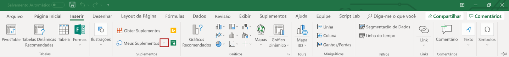

# Criar e depurar suplementos do Office no Visual StudioCreate and debug Office Add-ins in Visual Studio

Este artigo descreve como usar o Visual Studio 2017 para criar um suplemento do Office para Excel, Word, PowerPoint ou Outlook e depurar suplemento na área de trabalho do cliente Office no Windows.This article describes how to use Visual Studio 2017 to create an Office Add-in for Excel, Word, PowerPoint, or Outlook and debug the add-in in the Office desktop client on Windows. Se você estiver usando outra versão do Visual Studio, os procedimentos poderão variar um pouco.If you're using another version of Visual Studio, the procedures might vary slightly.

> [!NOTE]
> O Visual Studio não suporta a criação de suplementos do Office para o OneNote ou o Project, mas você pode usar o [Yeoman gerador de suplementos do Office](https://github.com/OfficeDev/generator-office) para criar esses tipos de suplementos.Visual Studio does not support creating Office Add-ins for OneNote or Project, but you can use the [Yeoman generator for Office Add-ins](https://github.com/OfficeDev/generator-office) to create these types of add-ins.
> - Para começar a usar um suplemento do OneNote, confira o artigo [Crie seu primeiro suplemento do OneNote](../quickstarts/onenote-quickstart.md).To get started with an add-in for OneNote, see [Build your first OneNote add-in](../quickstarts/onenote-quickstart.md).
>
> - Para começar a usar um suplemento do Project, confira o artigo [Crie seu primeiro suplemento do Project](../quickstarts/project-quickstart.md).To get started with an add-in for Project, see [Build your first Project add-in](../quickstarts/project-quickstart.md).

## Pré-requisitosPrerequisites

- [Visual Studio 2017](https://www.visualstudio.com/vs/) com a carga de trabalho de **desenvolvimento do Office/SharePoint** instalada[Visual Studio 2017](https://www.visualstudio.com/vs/) with the **Office/SharePoint development** workload installed

    > [!TIP]
    > Se você já instalou o Visual Studio 2017, [use o Instalador do Visual Studio](/visualstudio/install/modify-visual-studio) para garantir que a carga de trabalho de **desenvolvimento do Office/SharePoint** seja instalada.If you've previously installed Visual Studio 2017, [use the Visual Studio Installer](/visualstudio/install/modify-visual-studio) to ensure that the **Office/SharePoint development** workload is installed. Se essa carga de trabalho ainda não estiver instalada, use o instalador Visual Studio para [instalá-la](/visualstudio/install/modify-visual-studio?view=vs-2017#modify-workloads).If this workload is not yet installed, use the Visual Studio Installer to [install it](/visualstudio/install/modify-visual-studio?view=vs-2017#modify-workloads).

- Office 2013 ou posteriorOffice 2013 or later

    > [!TIP]
    > Se você não tiver o Office, você pode participar do[programa de desenvolvedor do Office 365](https://developer.microsoft.com/office/dev-program) para obter uma assinatura do Office 365 ou [Inscreva-se para uma avaliação gratuita de 1 mês](https://products.office.com/en-US/try?legRedir=true&WT.intid1=ODC_ENUS_FX101785584_XT104056786&CorrelationId=64c762de-7a97-4dd1-bb96-e231d7485735).If you don't already have Office, you can join the [Office 365 Developer Program](https://developer.microsoft.com/office/dev-program) to get an Office 365 subscription, or you can [register for a free 1-month trial](https://products.office.com/en-US/try?legRedir=true&WT.intid1=ODC_ENUS_FX101785584_XT104056786&CorrelationId=64c762de-7a97-4dd1-bb96-e231d7485735).

## Criar um projeto de suplemento no Visual StudioCreate the add-in project in Visual Studio

Inicie realizando estas três etapas e, em seguida, conclua as etapas na seção a seguir que corresponde ao tipo de suplemento que você está criando.Start by completing these three steps, and then complete the steps in the following section that corresponds to the type of add-in you're creating. 

1. Na barra de menus do Visual Studio, selecione **Arquivo** > **Novo**  >  **Projeto**.Open Visual Studio and from the Visual Studio menu bar, choose  **File** > **New** > **Project**.

2. Na lista de tipos de projeto em **Visual C#** ou no **Visual Basic**, expanda a opção **Office/SharePoint**, escolha **Suplementos** e escolha o tipo de projeto que você deseja criar.In the list of project types under **Visual C#** or **Visual Basic**, expand  **Office/SharePoint**, choose **Add-ins**, and then choose the type of add-in project you want to create. 

3. Dê um nome ao projeto e escolha **OK**.Name the project, and then choose **OK**.

### Suplemento do Word na Web ou suplemento do Outlook na WebWord Web Add-in or Outlook Web Add-in

Se você optou por criar um **Suplemento Word na Web** ou uma **Suplemento do Outlook Web**O Visual Studio cria uma solução e os dois projetos aparecem no**Explorador de soluções**.If you've chosen to create a **Word Web Add-in** or an **Outlook Web Add-in**, Visual Studio creates a solution and its two projects appear in **Solution Explorer**. Em seguida, você pode [explorar a solução do Visual Studio](#explore-the-visual-studio-solution).Next, you can [explore the Visual Studio solution](#explore-the-visual-studio-solution). 

### Suplemento do PowerPoint Web PowerPoint Web Add-in

Se você optou por criar um **suplemento PowerPoint Web**, a caixa de diálogo**Criar Suplemento do Office** aparece.If you've chosen to create a **PowerPoint Web Add-in**, the **Create Office Add-in** dialog appears. 

- Para criar um suplemento no painel tarefas, selecione **Adicionar novas funcionalidades para o PowerPoint** e, em seguida, escolha o botão **Concluir** para criar a  solução no Visual Studio.To create a task pane add-in, select **Add new functionalities to PowerPoint** and then choose the **Finish** button to create the Visual Studio solution.

- Para criar um suplemento de conteúdo, selecione **Inserir conteúdo nos slides do PowerPoint** e, em seguida, escolha o botão **Concluir** para criar a solução no Visual Studio.To create a content add-in, select **Insert content into PowerPoint slides** and then choose the **Finish** button to create the Visual Studio solution.

Em seguida, você pode [explorar a solução do Visual Studio](#explore-the-visual-studio-solution).Next, you can [explore the Visual Studio solution](#explore-the-visual-studio-solution).

### Suplemento do Excel WebExcel Web Add-in

Se você optou por criar um **suplemento Excel Web**, a caixa de diálogo**Criar Suplemento do Office** aparece.If you've chosen to create an **Excel Web Add-in**, the **Create Office Add-in** dialog appears. 

- Para criar um suplemento no painel tarefas, selecione **Adicionar novas funcionalidades para o Excel** e, em seguida, escolha o botão **Concluir** para criar a solução no Visual Studio.To create a task pane add-in, select **Add new functionalities to Excel** and then choose the **Finish** button to create the Visual Studio solution.

- Para criar um suplemento de conteúdo, selecione **Inserir conteúdo em planilhas do Excel**, escolha o botão **Próximo**, selecione uma das seguintes opções e, em seguida, escolha o botão **Concluir** para criar a solução no Visual Studio:To create a content add-in, select **Insert content into Excel spreadsheets**, choose the **Next** button, select one of the following options, and then choose the **Finish** button to create the Visual Studio solution:

    - **Suplemento Básico** – criar um projeto de suplemento de conteúdo com o código inicial mínimo**Basic Add-in** - to create a content add-in project with minimal starter code

    - **Documento visualização no** – criar um projeto de suplemento de conteúdo com o código inicial para visualizar e vincular a dados**Document Visualization Add-in** - to create a content add-in project with starter code to visualize and bind to data  

### Explorar a solução do Visual StudioExplore the Visual Studio solution

[!include[Description of Visual Studio projects](../includes/quickstart-vs-solution.md)]

## Modificar as configurações de suplementoModify your add-in settings

Para alterar as configurações no seu suplemento, edite o arquivo de manifesto XML no suplemento do projeto.To modify the settings of your add-in, edit the XML manifest file in the add-in project. No **Gerenciador de Soluções**, expanda o nó de projeto do suplemento, expanda a pasta que contém o manifesto XML e escolha o manifesto XML.In  **Solution Explorer**, expand the add-in project node, expand the folder that contains the XML manifest, and choose the XML manifest. Você pode apontar para qualquer elemento do arquivo para exibir uma dica de ferramenta que descreve a finalidade do elemento.You can point to any element in the file to view a tooltip that describes the purpose of the element. Para saber mais sobre o arquivo de manifesto, confira [Manifesto XML de suplementos do Office](../develop/add-in-manifests.md).For more information about the manifest file, see [Office Add-ins XML manifest](../develop/add-in-manifests.md).

## Desenvolver o conteúdo do suplementoDevelop the contents of your add-in

Enquanto o projeto de suplemento permite modificar as configurações que descrevem o suplemento, o aplicativo Web fornece o conteúdo que aparece no suplemento.While the add-in project lets you modify the settings that describe your add-in, the web application provides the content that appears in the add-in. 

O projeto de aplicativo Web contém um arquivo HTML padrão e o arquivo JavaScript e arquivo CSS que você pode usar para começar.The web application project contains a default HTML file, JavaScript file, and CSS file that you can use to get started. Alguns desses arquivos contêm referências a outras bibliotecas JavaScript, incluindo a API JavaScript para Office.Some of these files contain references to other JavaScript libraries including the JavaScript API for Office. Você pode desenvolver o suplemento para atualizar esses arquivos e/ou adicionar mais arquivos HTML e JavaScript.You can develop your add-in by updating these files and/or adding more HTML and JavaScript files. A tabela a seguir descreve os arquivos padrão que o projeto de aplicativo web contém quando a solução Visual Studio é criada.The following table describes the default files that the web application project contains when the Visual Studio solution is created.

|**Nome do arquivo****File name**|**Descrição****Description**|
|:-----|:-----|
|**Home.html****Home.html** (Excel, PowerPoint, Word)(Excel, PowerPoint, Word)  **MessageRead.html****MessageRead.html** (Outlook)(Outlook)|The default HTML page of the add-in.The default HTML page of the add-in. Essa página é exibida como a primeira no suplemento quando ele é ativado em um documento, mensagem de email ou item de compromisso.This page appears as the first page inside of the add-in when it is activated in a document, email message, or appointment item. Esse arquivo contém todas as referências de arquivo de que você precisa para começar.This file contains all of the file references that you need to get started. Você pode começar a desenvolver o suplemento, adicionando o código HTML para esse arquivo.You can start developing your add-in by adding your HTML code to this file.|
|**Home.js****Home.js** (Excel, PowerPoint, Word)(Excel, PowerPoint, Word)  **MessageRead.js****MessageRead.js** (Outlook)(Outlook)|O arquivo JavaScript associado a página **Home.html** (Excel, PowerPoint, Word) ou página **MessageRead.html** (Outlook).The JavaScript file associated with the **Home.html** page (Excel, PowerPoint, Word) or the **MessageRead.html** page (Outlook). Esse arquivo deve conter qualquer código específico para o comportamento da página **Home.html** (Excel, PowerPoint, Word) ou página **MessageRead.html**(Outlook).This file should contain any code that is specific to the behavior of the **Home.html** page (Excel, PowerPoint, Word) or the **MessageRead.html** page (Outlook). Esse contém código de exemplo para você começar.This file contains some example code to get you started.|
|**Home.CSS****Home.css** (Excel, PowerPoint, Word)(Excel, PowerPoint, Word)  **MessageRead.css****MessageRead.css** (Outlook)(Outlook)|Define os estilos padrão para aplicar ao suplemento.Defines the default styles to apply to your add-in. É recomendável usar a estrutura da interface do usuário do Office para design e estilos.We recommend using the Office UI Fabric for design and styles. Para saber mais, confira [Office UI Fabric em suplementos do Office](../design/office-ui-fabric.md).For more information see [Office UI Fabric in Office Add-ins](../design/office-ui-fabric.md).|

> [!NOTE]
> Não é necessário usar esses arquivos.You don't have to use these files. Fique à vontade para adicionar outros arquivos ao projeto e usá-los em vez disso.Feel free to add other files to the project and use those instead. Se desejar que outro arquivo HTML apareça como a página inicial do suplemento, abra o editor de manifesto e defina a propriedade **SourceLocation** para o nome do arquivo.If you want another HTML file to appear as the initial page of the add-in, open the manifest editor, and then set the  **SourceLocation** property to the name of the file.

## Depurar o suplementoDebug your add-in

Você pode usar o Visual Studio para depurar seu suplemento no cliente da área de trabalho do Office no Windows, conforme descrito nas seções a seguir:You can use Visual Studio to debug your add-in in the Office desktop client on Windows, as described in the following sections:

- [Revise as propriedades de build e depuraçãoReview the build and debug properties](#review-the-build-and-debug-properties)
- [Usar um documento existente para depurar o suplementoUse an existing document to debug the add-in](#use-an-existing-document-to-debug-the-add-in)
- [Iniciar o projetoStart the project](#start-the-project)
- [Depurar o código de um suplemento Excel, PowerPoint ou WordDebug the code for an Excel, PowerPoint, or Word add-in](#debug-the-code-for-an-excel-powerpoint-or-word-add-in)
- [Depurar o código de um suplemento do OutlookDebug the code for an Outlook add-in](#debug-the-code-for-an-outlook-add-in)

> [!NOTE]
> É possível usar o Visual Studio para depurar suplementos do Office no Office Online ou Office para Mac.You cannot use Visual Studio to debug Office Add-ins in Office Online or Office for Mac. Confira informações sobre a depuração nessas plataformas [Depurar Suplementos do Office no Office Online](../testing/debug-add-ins-in-office-online.md) ou [Depurar Suplementos do Office no iPad e no Mac](../testing/debug-office-add-ins-on-ipad-and-mac.md)For information about debugging on these platforms, see [Debug Office Add-ins in Office Online](../testing/debug-add-ins-in-office-online.md) or [Debug Office Add-ins on iPad and Mac](../testing/debug-office-add-ins-on-ipad-and-mac.md)

### Examinar as propriedades de compilação e depuraçãoReview the build and debug properties

Antes de começar a depuração, examine as propriedades de cada projeto para confirmar se o Visual Studio abrirá o aplicativo do host desejado e se as propriedades de compilação e depuração propriedades estão configuradas adequadamente.Before you start debugging, review the properties of each project to confirm that Visual Studio will open the desired host application and that other build and debug properties are set appropriately.

#### Propriedades do projeto de suplementoAdd-in project properties

Abrir a janela **Propriedades**para o projeto de suplemento revisar as propriedades do projeto:Open the **Properties** window for the add-in project to review project properties:

1. No **Explorador de soluções** Escolha o projeto do suplemento (*não* o projeto do aplicativo Web).In  **Solution Explorer**, choose the add-in project (*not* the web application project).

2. Na barra de menus, escolha **Exibir** >  **Janela Propriedades**.From the menu bar, choose  **View** >  **Properties Window**.

A tabela a seguir descreve as propriedades do projeto.The following table describes the properties of the add-in project.

|**Property****Property**|**Descrição****Description**|
|:-----|:-----|
|**Iniciar Ação****Start Action**|Especifica o modo de depuração do suplemento.Specifies the debug mode for your add-in. Atualmente, só **cliente de área de trabalho do Office** modo tem suporte para projetos de suplementos do Office.Currently only **Office Desktop Client** mode is supported for Office Add-in projects.|
|**Iniciar documento****Start Document**  (apenas suplementos Excel, PowerPoint e Word)(Excel, PowerPoint, and Word add-ins only)|Especifica o documento a ser aberto quando você iniciar o projeto.Specifies what document to open when you start the project.|
|**Projeto da Web****Web Project**|Especifica o nome do projeto Web associado ao suplemento.Specifies the name of the web project associated with the add-in.|
|**Email Address****Email Address** (Apenas suplementos do Outlook)(Outlook add-ins only)|Especifica o endereço de email da conta de usuário no Exchange Server ou no Exchange Online que você quer usar para testar o suplemento do Outlook.Specifies the email address of the user account in Exchange Server or Exchange Online that you want to use to test your Outlook add-in.|
|**EWS Url****EWS Url** (Apenas suplementos do Outlook)(Outlook add-ins only)|URL do serviço Web do Exchange (por exemplo: `https://www.contoso.com/ews/exchange.aspx`).Exchange Web service URL (For example: `https://www.contoso.com/ews/exchange.aspx`). |
|**OWA Url****OWA Url** (Apenas suplementos do Outlook)(Outlook add-ins only)|URL do Outlook Web App (Por exemplo: `https://www.contoso.com/owa`).Outlook Web App URL (For example: `https://www.contoso.com/owa`).|
|**Usar autenticação multifator****Use multi-factor auth** (Apenas suplementos do Outlook)(Outlook add-ins only)|Valor Booleano que indica se a autenticação multifator deve ser utilizada.Boolean value that indicates whether multi-factor authentication should be used.|
|**Nome de Usuário****User Name** (Apenas suplementos do Outlook)(Outlook add-ins only)|Especifica o nome da conta de usuário no Exchange Server ou no Exchange Online com a qual você deseja testar o suplemento do Outlook.Specifies the name of the user account in Exchange Server or Exchange Online that you want to use to test your Outlook add-in.|
|**Arquivo do projeto****Project File**|Especifica o nome do arquivo que contém informações de compilação, configuração e outras informações sobre o projeto.Specifies the name of the file containing build, configuration, and other information about the project.|
|**Pasta do projeto****Project Folder**|O local do arquivo do projeto.The location of the project file.|

> [!NOTE]
> Para um suplemento do Outlook, você pode optar por especificar valores para uma ou mais das propriedades *Apenas suplemento Outlook* na janela**Propriedades** mas isso não é necessário.For an Outlook add-in, you may choose to specify values for one or more of the *Outlook add-in only* properties in the **Properties** window, but doing so is not required.

#### Propriedades do projeto de aplicativo WebWeb application project properties

Abrir a janela **Propriedades**para o projeto de aplicativo Web para revisar as propriedades do projeto:Open the **Properties** window for the web application project to review project properties:

1. No **Explorador de soluções** Escolha o projeto o projeto do aplicativo Web.In  **Solution Explorer**, choose the web application project.

2. Na barra de menus, escolha **Exibir** >  **Janela Propriedades**.From the menu bar, choose  **View** >  **Properties Window**.

A tabela a seguir descreve as propriedades do projeto de aplicativo web que são mais relevantes para projetos de suplementos do Office.The following table describes the properties of the web application project that are most relevant to Office Add-in projects.

|**Property****Property**|**Descrição****Description**|
|:-----|:-----|
|**SSL habilitado****SSL Enabled**|Especifica se o SSL está habilitado no site.Specifies whether SSL is enabled on the site. Essa propriedade deve ser definida como **Verdadeira** para projetos de suplementos do Office.This property should be set to **True** for Office Add-in projects.|
|**URL SSL****SSL URL**|Especifica a URL HTTPS segura para o site.Specifies the secure HTTPS URL for the site. Somente leitura.Read-only.|
|**URL****URL**|Especifica a URL HTTP para o site.Specifies the HTTP URL for the site. Somente leitura.Read-only.|
|**Arquivo do projeto****Project File**|Especifica o nome do arquivo que contém informações de compilação, configuração e outras informações sobre o projeto.Specifies the name of the file containing build, configuration, and other information about the project.|
|**Pasta do projeto****Project Folder**|Especifica o local do arquivo do projeto.Specifies the location of the project file. Somente leitura.Read-only. O arquivo de manifesto do Visual Studio gerado no tempo de execução é escrito para a pasta `bin\Debug\OfficeAppManifests` neste local.The manifest file that Visual Studio generates at runtime is written to the `bin\Debug\OfficeAppManifests` folder in this location.|

### Usar um documento existente para depurar o suplementoUse an existing document to debug the add-in

Se você tiver um documento que contém os dados de teste deseja usar ao depurar seu suplemento o Excel, PowerPoint ou Word, o Visual Studio pode ser configurado para abrir esse documento quando você iniciar o projeto.If you have a document that contains test data you want to use while debugging your Excel, PowerPoint, or Word add-in, Visual Studio can be configured to open that document when you start the project. Para especificar um documento existente a ser usado durante a depuração do complemento, execute as etapas a seguir.To specify an existing document to use while debugging the add-in, complete the following steps.

1. No **Explorador de soluções** Escolha o projeto do suplemento (*não* o projeto do aplicativo Web).In **Solution Explorer**, choose the add-in project (*not* the web application project).

2. Na barra de menus, escolha **Projeto** > **Adicionar Item Existente**.From the menu bar, choose **Project** > **Add Existing Item**.

3. Na caixa de diálogo **Adicionar Item Existente**, localize e selecione o documento que você deseja adicionar.In the **Add Existing Item** dialog box, locate and select the document that you want to add.

4. Escolha o botão **Adicionar** para adicionar o documento ao projeto.Choose the **Add** button to add the document to your project.

5. No **Explorador de soluções** Escolha o projeto do suplemento (*não* o projeto do aplicativo Web).In **Solution Explorer**, choose the add-in project (*not* the web application project).

6. Na barra de menus, escolha **Exibir**,  > **Janela Propriedades**.From the menu bar, choose **View** > **Properties Window**.

7. Na janela **Propriedades**, escolha a lista **Iniciar Documento** e selecione o documento que você adicionou ao projeto.In the **Properties** window, choose the **Start Document** list, and then select the document that you added to the project. O projeto agora está configurado para iniciar o suplemento nesse documento.The project is now configured to start the add-in in that document.

### Iniciar o projetoStart the project

Iniciar o projeto escolhendo **Depurar** > **Iniciar Depuração** na barra do menu.Start the project by choosing **Debug** > **Start Debugging** from the menu bar. O Visual Studio compilará automaticamente a inicie o Office para hospedar o suplemento.Visual Studio will automatically build the solution and start Office to host your add-in.

> [!NOTE]
> Quando você inicia um projeto de um suplemento do Outlook, você será solicitado a inserir as credenciais de logon.When you start an Outlook add-in project, you'll be prompted for login credentials. Se você for solicitado a fazer logon repetidamente ou se receber um erro informando que você não está autorizado, a Autenticação Básica pode estar desabilitada para contas em seu locatário do Office 365.If you're asked to log in repeatedly or if you receive an error that you are unauthorized, then Basic Auth may be disabled for accounts on your Office 365 tenant. Nesse caso, tente usar uma conta da Microsoft.In this case, try using a Microsoft account instead. Você também pode precisar definir a propriedade "Usar autenticação multifator" como Verdadeiro na caixa de diálogo de propriedades do projeto de suplemento do Outlook na Web.You may also need to set the property "Use multi-factor auth" to True in the Outlook Web Add-in project properties dialog.

Quando o Visual Studio compila o projeto ele executa as seguintes tarefas:When Visual Studio builds the project it performs the following tasks:

1. Cria uma cópia do arquivo de manifesto XML e a adiciona ao diretório `_ProjectName_\bin\Debug\OfficeAppManifests`.Creates a copy of the XML manifest file and adds it to  `_ProjectName_\bin\Debug\OfficeAppManifests` directory. O aplicativo host consome esta cópia quando você inicia o Visual Studio e depura o suplemento.The host application consumes this copy when you start Visual Studio and debug the add-in.

2. Cria um conjunto de entradas de registro no computador que habilitam o suplemento a aparecer no aplicativo host.Creates a set of registry entries on your computer that enable the add-in to appear in the host application.

3. Compila o projeto de aplicativo Web e o implanta no servidor Web IIS local(https://localhost).Builds the web application project, and then deploys it to the local IIS web server (https://localhost).

4. Se este for o primeiro projeto de suplemento implantado no servidor Web do IIS local, talvez seja solicitado que você instale um Certificado Autoassinado no repositório de Certificado Raiz Confiável do usuário atual.If this is the first add-in project that you have deployed to local IIS web server, you may be prompted to install a Self-Signed Certificate to the current user's Trusted Root Certificate store. Isso é necessário para que o IIS Express exiba o conteúdo do seu suplemento corretamente.This is required for IIS Express to display the content of your add-in correctly.

> [!NOTE]
> A versão mais recente do Office pode usar um controle da Web mais recente para exibir o conteúdo do suplemento ao ser executado no Windows 10.The latest version of Office may use a newer web control to display the add-in contents when running on Windows 10. Se este for o caso, o Visual Studio pode solicitar que você adicione uma isenção de loopback de rede local.If this is the case, Visual Studio may prompt you to add a local network loopback exemption. Isso é necessário para que o controle da Web, no aplicativo host do Office, possa acessar o site implantado no servidor Web do IIS local.This is required for the web control, in the Office host application, to be able to access the website deployed to the local IIS web server. Você também pode alterar essa configuração a qualquer momento no Visual Studio, em **Ferramentas** > **Opções** > **Ferramentas do Office (Web)** > **Depuração do Suplemento da Web**.You can also change this setting anytime in Visual Studio under **Tools** > **Options** > **Office Tools (Web)** > **Web Add-In Debugging**.

Depois, o Visual Studio faz o seguinte:Next, Visual Studio does the following:

1. Modifica o elemento [SourceLocation](/office/dev/add-ins/reference/manifest/sourcelocation) do arquivo de manifesto XML, substituindo o token `~remoteAppUrl` pelo endereço totalmente qualificado da página inicial (por exemplo,`https://localhost:44302/Home.html` ).Modifies the [SourceLocation](/office/dev/add-ins/reference/manifest/sourcelocation) element of the XML manifest file by replacing the `~remoteAppUrl` token with the fully qualified address of the start page (for example, `https://localhost:44302/Home.html`).

2. Inicia o projeto de aplicativo Web no IIS Express.Starts the web application project in IIS Express.

3. Abre o aplicativo host.Opens the host application.

O Visual Studio não mostra erros de validação na janela **OUTPUT** ao compilar o projeto.Visual Studio doesn't show validation errors in the  **OUTPUT** window when you build the project. O Visual Studio relata erros e avisos na janela **ERRORLIST** à medida que eles ocorrem.Visual Studio reports errors and warnings in the **ERRORLIST** window as they occur. O Visual Studio também relata erros de validação mostrando sublinhados ondulados (conhecidos como rabiscos) de cores diferentes no editor de código e texto.Visual Studio also reports validation errors by showing wavy underlines (known as squiggles) of different colors in the code and text editor. Essas marcas o notificam de problemas que o Visual Studio detectou no código.These marks notify you of problems that Visual Studio detected in your code. Para saber mais, confira [Editor de código e texto](https://msdn.microsoft.com/library/se2f663y(v=vs.140).aspx).For more information, see [Code and Text Editor](https://msdn.microsoft.com/library/se2f663y(v=vs.140).aspx). Para saber mais sobre como habilitar ou desabilitar a validação, confira: [Opções, Editor de texto, JavaScript, IntelliSense](/visualstudio/ide/reference/options-text-editor-javascript-intellisense?view=vs-2017).For more information about how to enable or disable validation, see [Options, Text Editor, JavaScript, IntelliSense](/visualstudio/ide/reference/options-text-editor-javascript-intellisense?view=vs-2017).

Para examinar as regras de validação do arquivo de manifesto XML no projeto, confira [Manifesto XML de suplementos do Office](../develop/add-in-manifests.md).To review the validation rules of the XML manifest file in your project, see [Office Add-ins XML manifest](../develop/add-in-manifests.md).

### Depurar o código de um suplemento Excel, PowerPoint ou WordDebug the code for an Excel, PowerPoint, or Word add-in

Se o suplemento não está visível no documento que é exibido no aplicativo host (Excel, PowerPoint ou Word) após você[iniciar o projeto](#start-the-project), inicie manualmente o suplemento no aplicativo do host.If your add-in isn't visible within the document that's displayed in the host application (Excel, PowerPoint, or Word) after you've [started the project](#start-the-project), manually launch the add-in in the host application. Por exemplo, inicie o suplemento do painel de tarefas, escolhendo o **Mostrar painel de tarefas** botão na faixa de opções da guia **Home**. Depois do suplemento ser exibido no Excel, PowerPoint ou Word, você pode depurar seu código fazendo o seguinte:For example, launch your task pane add-in by choosing the **Show Taskpane** button in the ribbon of the **Home** tab. After your add-in is displayed in Excel, PowerPoint, or Word, you can debug your code by doing the following:

1. No Excel, PowerPoint ou Word, escolha o **Inserir** pressione tab e, em seguida, escolha a seta para baixo à direita de **Meus suplementos**.In Excel, PowerPoint, or Word, choose the **Insert** tab and then choose the down-arrow located to the right of **My Add-ins**.

    

2. Na lista de suplementos disponíveis, localize a seção**suplementos do desenvolvedor** e selecione o seu suplemento para registrar.In the list of available add-ins, find the **Developer Add-ins** section and select the your add-in to register it.

3. No Visual Studio, defina pontos de interrupção no seu código.In Visual Studio, set breakpoints in your code.

4. No Excel, PowerPoint ou Word, interaja com o suplemento.In Excel, PowerPoint, or Word, interact with your add-in.

5. Como os pontos de interrupção são atingidos no Visual Studio, percorra o código conforme necessário.As breakpoints are hit in Visual Studio, step through the code as needed.

Você pode alterar o código e examinar os efeitos das alterações no suplemento sem ter que fechar o aplicativo host e reiniciar o projeto.You can change your code and review the effects of those changes in your add-in without having to close the host application and restart the project. Depois de salvar o código, simplesmente recarregue o suplemento no aplicativo do host.After you save changes to your code, simply reload the add-in in the host application. Por exemplo, recarregue um suplemento do painel tarefas escolhendo o canto superior direito do painel de tarefas para ativar o [menu personalidade](../design/task-pane-add-ins.md#personality-menu) e, em seguida, escolha **Recarregar**.For example, reload a task pane add-in by choosing the top-right corner of the task pane to activate the [personality menu](../design/task-pane-add-ins.md#personality-menu) and then choose **Reload**.

### Depurar o código de um suplemento do OutlookDebug the code for an Outlook add-in

Após você [iniciar o projeto](#start-the-project) e o Visual Studio iniciar o Outlook para hospedar o suplemento, abra um item de compromisso ou uma mensagem de email.After you've [started the project](#start-the-project) and Visual Studio launches Outlook to host your add-in, open an email message or appointment item. 

O Outlook ativa o suplemento para o item, contanto que os critérios de ativação sejam atendidos. A barra de suplementos aparece na parte superior da janela Inspetor ou Painel de Leitura, e o suplemento do Outlook aparece como um botão na barra de suplementos. Se o suplemento tiver um comando de suplemento, aparecerá um botão na faixa de opções, na guia padrão ou em uma guia personalizada especificada, e o suplemento não aparecerá na barra de suplementos.Outlook activates the add-in for the item as long as the activation criteria are met. The add-in bar appears at the top of the Inspector window or Reading Pane, and your Outlook add-in appears as a button in the add-in bar. If your add-in has an add-in command, a button will appear in the ribbon, either in the default tab or a specified custom tab, and the add-in will not appear in the add-in bar.

Para exibir o suplemento do Outlook, escolha o botão do suplemento do Outlook.To view your Outlook add-in, choose the button for your Outlook add-in. Depois do suplemento ser exibido no Outlook, você pode depurar seu código fazendo o seguinte:After your add-in is displayed in Outlook, you can debug your code by doing the following:

1. No Visual Studio, defina pontos de interrupção no seu código.In Visual Studio, set breakpoints in your code.

2. No Outlook, interagir com o suplemento.In Outlook, interact with your add-in.

3. Como os pontos de interrupção são atingidos no Visual Studio, percorra o código conforme necessário.As breakpoints are hit in Visual Studio, step through the code as needed.

Você pode alterar o código e examinar os efeitos das alterações no suplemento sem ter que fechar o Outlook e reiniciar o projeto.You can change your code and review the effects of those changes in your add-in without having to close Outlook and restart the project. Após salvar as mudanças ao código, abra o menu de atalho do suplemento (no Outlook) e escolha **Recarregar**.After you save changes to your code, simply open the shortcut menu for the add-in (in Outlook), and then choose **Reload**.

## Próximas etapasNext steps

Depois do suplemento funcionar conforme desejado, veja [Implantar e publicar o suplemento Office](../publish/publish.md) para saber mais como você pode distribuir o suplemento para os usuários.After your add-in is working as desired, see [Deploy and publish your Office Add-in](../publish/publish.md) to learn about the ways you can distribute the add-in to users.
