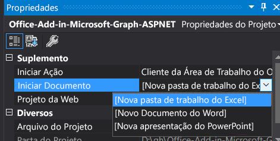

# <a name="create-an-aspnet-office-add-in-that-uses-single-sign-on"></a>Criar um Suplemento do Office com ASP.NET que use logon único

Quando os usuários estão conectados ao Office, o seu suplemento pode usar as mesmas credenciais para permitir que os usuários acessem vários aplicativos sem exigir que eles entrem uma segunda vez. Confira uma visão geral no artigo [Habilitar o SSO em um Suplemento do Office](sso-in-office-add-ins.md).
Este artigo orienta você pelo processo de habilitar o SSO (logon único) em um suplemento criado com o ASP.NET.

## <a name="prerequisites"></a>Pré-requisitos

* Visual Studio 2019 ou posterior.

* A **Office/SharePoint de** desenvolvimento ao configurar o Visual Studio.

* [Office Developer Tools](https://www.visualstudio.com/features/office-tools-vs.aspx)

[!include[additional prerequisites](../includes/sso-tutorial-prereqs.md)]

* Pelo menos alguns arquivos e pastas armazenados OneDrive for Business em sua Microsoft 365 assinatura.

* Uma conta do Azure com uma assinatura ativa – [crie uma conta gratuitamente](https://azure.microsoft.com/free/?WT.mc_id=A261C142F).

## <a name="set-up-the-starter-project"></a>Configure o projeto inicial

Clone ou baixe o repositório em [SSO com Suplemento ASPNET do Office](https://github.com/OfficeDev/Office-Add-in-samples/tree/main/Samples/auth/Office-Add-in-ASPNET-SSO).

> [!NOTE]
> Há duas versões do exemplo.
>
> * A pasta **Before** (antes) traz um projeto inicial. A interface do usuário e outros aspectos do suplemento que não estão diretamente ligados ao SSO ou à autorização já estão prontos. As próximas seções deste artigo apresentam uma orientação passo a passo para concluir o projeto.
> * A versão **Complete** (concluído) do exemplo apresenta como seria o suplemento quando concluídos os procedimentos apresentados neste artigo, com exceção de que o projeto concluído traz comentários de códigos que seriam redundantes neste artigo. Para usar a versão concluída, apenas siga as instruções apresentadas neste artigo, substituindo "Before" por "Complete" e pulando as seções **Codificar o lado do cliente** e **Codificar o lado do servidor**.

## <a name="register-the-add-in-through-an-app-registration"></a>Registrar o suplemento por meio de um registro de aplicativo

Primeiro, conclua as etapas [no Início Rápido: Registre](/azure/active-directory/develop/quickstart-register-app) um aplicativo com o plataforma de identidade da Microsoft para registrar o suplemento.

Use as configurações a seguir para o registro do aplicativo.

* Nome: `Office-Add-in-ASPNET-SSO`
* Tipos de conta com suporte: contas em qualquer diretório organizacional **(qualquer diretório Azure AD – multilocatário) e contas pessoais da Microsoft (por exemplo, Skype, Xbox)**

    > [!NOTE]
    >  Se você quiser que o suplemento seja utilizável somente por usuários na locação em que você o está registrando, poderá escolher Contas somente neste diretório organizacional **...** em vez disso, mas precisará passar por algumas etapas de configuração adicionais. Consulte **a Instalação para locatário único** posteriormente neste artigo.

* Plataforma: **Web**
* URI de redirecionamento: **https://localhost:44355/AzureADAuth/Authorize**
* Segredo do cliente: `*********` (O aplicativo Web usa o segredo do cliente para provar sua identidade quando solicita tokens. *Registre esse valor para uso em uma etapa posterior – ele é mostrado apenas uma vez.*)

### <a name="expose-a-web-api"></a>Expor uma API Web

1. No registro de aplicativo que você criou, selecione **Expor uma API > Adicionar um escopo**.
   Você será solicitado a definir um **URI da ID do** aplicativo se ainda não tiver configurado um.

    O URI da ID do aplicativo atua como o prefixo para os escopos que você referencia no código da API e deve ser globalmente exclusivo. Use o formulário `api://localhost:44355/[application-id-guid]`; por exemplo `api://localhost:44355/c6c1f32b-5e55-4997-881a-753cc1d563b7`.

1. Especifique os atributos do escopo no **painel Adicionar** um escopo.

    |Campo          |Valor  |
    |---------------|---------|
    |**Nome do Escopo** | `access_as_user`|
    |**Quem pode consentir?** | **Administradores e usuários**|
    |**Administração de exibição de consentimento** | Office pode atuar como o usuário.|
    |**Administração de consentimento** | Habilite Office para chamar as APIs Web do suplemento com os mesmos direitos que o usuário atual.|
    |**Nome de exibição de consentimento do usuário** | Office pode agir como você.|
    |**Descrição de consentimento do usuário** | Habilite Office para chamar as APIs Web do suplemento com os mesmos direitos que você tem.|

1. Defina **o Estado** **como Habilitado e** selecione **Adicionar escopo**.

    > [!NOTE]
    > A parte de domínio do nome de **Escopo** exibidos logo abaixo do campo de texto deve corresponder automaticamente ao URI de ID do aplicativo definidos na etapa anterior com `/access_as_user` acrescentado ao final; por exemplo, `api://localhost:6789/c6c1f32b-5e55-4997-881a-753cc1d563b7/access_as_user`.

1. Na seção **Aplicativos cliente autorizados**, insira a ID a seguir para pré-autorizar todos os Microsoft Office de extremidade do aplicativo.

   - `ea5a67f6-b6f3-4338-b240-c655ddc3cc8e`(Todos os Microsoft Office de extremidade do aplicativo)

    > [!NOTE]
    > A `ea5a67f6-b6f3-4338-b240-c655ddc3cc8e` ID pré-autoriza Office em todas as plataformas a seguir. Como alternativa, você pode inserir um subconjunto adequado das IDs a seguir se, por algum motivo, quiser negar a autorização para Office em algumas plataformas. Basta deixar de fora as IDs das plataformas das quais você deseja reprisar a autorização. Os usuários do suplemento nessas plataformas não poderão chamar suas APIs Web, mas outras funcionalidades no suplemento ainda funcionarão.
    >
    > - `d3590ed6-52b3-4102-aeff-aad2292ab01c` (Microsoft Office)
    > - `93d53678-613d-4013-afc1-62e9e444a0a5`(Office na Web)
    > - `bc59ab01-8403-45c6-8796-ac3ef710b3e3`(Outlook na Web)

1. Selecione **Adicionar um aplicativo cliente**. No painel que é aberto, defina a ID do Cliente como o respectivo GUID e marque a caixa para `api://localhost:44355/[application-id-guid]/access_as_user`.

1. Selecione **Adicionar aplicativo**.

### <a name="configure-microsoft-graph-permissions"></a>Configurar permissões Graph Microsoft

1. Selecione **permissões de API > Adicionar uma permissão > Microsoft Graph**.

1. Selecione **Permissões delegadas**. O Microsoft Graph expõe muitas permissões, com as mais comumente usadas na parte superior da lista.

1. Em **Selecionar permissões**, selecione as permissões a seguir.

    |Permissão     |Descrição  |
    |---------------|-------------|
    |Files.Read.All |Leia todos os arquivos que o usuário pode acessar. |
    |perfil        |Exiba o perfil básico dos usuários. Necessário para o aplicativo Office para obter um token para seu aplicativo Web de suplemento. |

    > [!NOTE]
    > A permissão `User.Read` pode já estar listada por padrão. É uma boa prática não pedir permissões desnecessárias, por isso recomendamos desmarcar a caixa para essa permissão se o suplemento não precisar dela.

1. Selecione **Adicionar permissões para** concluir o processo.

Sempre que você configurar permissões, os usuários do seu aplicativo serão solicitados na entrada a fornecer seu consentimento para permitir que seu aplicativo acesse a API do recurso em seu nome. Como administrador, você também pode conceder consentimento em nome de todos os usuários para que eles não precisem fazer isso.

1. Na mesma página, escolha o botão **conceder permissão de administrador para [nome do locatário]** e, em seguida, selecione **Aceitar** para a confirmação exibida.

    > [!NOTE]
    > Depois de escolher **Conceder consentimento de administrador para [nome do locatário]**, você verá uma mensagem solicitando que você tente novamente alguns minutos depois, para que a solicitação de consentimento possa ser construída. Nesse caso, você pode começar a trabalhar na próxima seção, mas não se esqueça de voltar ao **_portal e pressionar este botão_**!

## <a name="configure-the-solution"></a>Configurar a solução

1. Na raiz da pasta **Before** (antes), abra o arquivo de solução (.sln) no **Visual Studio**. Clique com o botão direito do mouse no nó superior no **Gerenciador de Soluções** (no nó Solução, não em qualquer um dos nós do projeto) e selecione **Configurar projetos de inicialização**.

1. Em **Propriedades Comuns**, selecione **Projeto de Inicialização** e **Vários projetos de inicialização**. Verifique se a **Ação** para ambos os projetos está definida como **Iniciar** e se o projeto terminado em "...WebAPI" está listado primeiro. Feche a caixa de diálogo.

1. De volta **Gerenciador de Soluções**, selecione (não clique com o botão direito do mouse) no projeto **Office-Add-in-ASPNET-SSO-WebAPI**. O painel **Propriedades** é exibido. Verifique se **SSL Habilitado** é **Verdadeiro**. Verifique se a **URL do SSL** é `http://localhost:44355/`.

1. Em "Web.config", use os valores copiados anteriormente. Defina **ida:ClientID** e **ida:Audience** para sua **ID do aplicativo (cliente)** e defina **ida:Password** para a senha de cliente. Além disso, **defina ida:Domain** como `http://localhost:44355` (sem barra "/" no final).

    > [!NOTE]
    > A **ID** do aplicativo (cliente) é o valor de "audiência" quando outros aplicativos, como o aplicativo cliente do Office (por exemplo, PowerPoint, Word, Excel), buscam acesso autorizado ao aplicativo. Também é a "ID do cliente" do aplicativo quando ela, por sua vez, busca acesso autorizado ao Microsoft Graph.

1. Se você não tiver escolhido "Somente contas neste diretório organizacional" para **TIPOS DE CONTA COM SUPORTE** ao registrar o suplemento, salve e feche o Web.config. Caso contrário, salve, mas deixe-o aberto.

1. Ainda no **Gerenciador de Soluções**, escolha o **projeto Office-Add-in-ASPNET-SSO**, abra o arquivo de manifesto do suplemento "Office-Add-in-ASPNET-SSO.xml" e role até a parte inferior do arquivo. Logo acima da marca `</VersionOverrides>` de término, você encontrará a marcação a seguir.

    ```xml
    <WebApplicationInfo>
      <Id>$application_GUID here$</Id>
      <Resource>api://localhost:44355/$application_GUID here$</Resource>
      <Scopes>
          <Scope>Files.Read.All</Scope>
          <Scope>profile</Scope>
      </Scopes>
    </WebApplicationInfo>
    ```

1. Substitua o espaço reservado "{$application_GUID here$}" *nos dois lugares* na marcação pela ID do Aplicativo que você copiou ao registrar seu suplemento. Os sinais "$" não fazem parte da ID, portanto não os inclua. Essa é a mesma ID usada para a ClientID e a Audience no web.config.

    > [!NOTE]
    > O valor **Recurso** é o **URI da ID de aplicativo** que você definiu quando registrou o suplemento. A seção **Scopes** só será usada para gerar uma caixa de diálogo de consentimento se o suplemento for vendido no AppSource.

1. Salve e feche o arquivo.

### <a name="setup-for-single-tenant"></a>Configuração para locatário único

Se você escolheu "Contas somente neste diretório organizacional" para TIPOS  DE CONTA COM SUPORTE quando registrou o suplemento, precisará executar estas etapas de configuração adicionais.

1. Volte para o Portal do Azure e abra a lâmina **Visão geral** do registro do suplemento. Copie a **ID de diretório (locatário)**.

1. Em Web.config, substitua o "comum" no valor de **ida:Authority** pela GUID copiada na etapa anterior. Ao terminar, o valor deverá ser similar a este: `<add key="ida:Authority" value="https://login.microsoftonline.com/12345678-91ab-cdef-0123-456789abcdef/oauth2/v2.0" />`.

1. Salve e feche o web.config.

## <a name="code-the-client-side"></a>Codificar o lado do cliente

1. Abra o arquivo HomeES6.js na pasta **Scripts**. Ele já tem algum código nele.

    * Um polyfill que atribui o objeto Office.Promise ao objeto de janela global, para que o suplemento possa ser executado quando o Office estiver usando o Internet Explorer para a interface de usuário. (Para obter mais detalhes, confira [Navegadores usados pelos Suplementos do Office](../concepts/browsers-used-by-office-web-add-ins.md).)
    * Uma atribuição ao método `Office.initialize` que, por sua vez, atribui um manipulador ao evento clicar do botão `getGraphAccessTokenButton`.
    * Um método `showResult` que exibirá os dados retornados do Microsoft Graph (ou uma mensagem de erro) na parte inferior do painel de tarefas.
    * Um método `logErrors` que registrará erros de console que não são destinados ao usuário final.
    * Código que implementa o sistema de autorização de fallback que o suplemento usará em cenários em que não há suporte para SSO ou ocorreu um erro.

1. Abaixo da atribuição a `Office.initialize`, adicione o código a seguir. Sobre este código, observe:


    * O processamento de erros no suplemento às vezes tentará novamente obter um token de acesso automaticamente, usando um conjunto diferente de opções. A variável de contador `retryGetAccessToken` é usada para garantir que o usuário não seja trocado repetidas vezes em tentativas falhas de obter um token.
    * A função `getGraphData` é definida com a palavra-chave ES6 `async`. Usar a sintaxe ES6 facilita o uso da API de SSO em Suplementos do Office. Esse é o único arquivo na solução que usará a sintaxe sem suporte do Internet Explorer. Colocamos "ES6" no nome do arquivo como um lembrete. A solução usa o transcompilador de tsc para transcompilar esse arquivo em ES5, para que o suplemento possa ser executado quando o Office estiver usando o Internet Explorer para a interface do usuário. (Veja o arquivo tsconfig.json na raiz do projeto.)

    ```javascript
    var retryGetAccessToken = 0;

    async function getGraphData() {
        await getDataWithToken({ allowSignInPrompt: true, allowConsentPrompt: true, forMSGraphAccess: true });
    }
    ```

1. Abaixo da função `getGraphData`, adicione a função a seguir. Observe que você criará a função `handleClientSideErrors` em uma etapa posterior.

    > [!NOTE]
    > Para distinguir entre os dois tokens de acesso com os que você trabalha neste artigo, o token retornado de getAccessToken() é conhecido como um token de inicialização. Posteriormente, ele é trocado por meio do fluxo On-Behalf-Of para um novo token com acesso ao Microsoft Graph.

    ```javascript
    async function getDataWithToken(options) {
        try {

            // TODO 1: Get the bootstrap token and send it to the server to exchange
            //         for a new access token to Microsoft Graph and then get the data
            //         from Microsoft Graph.

        }
        catch (exception) {
            if (exception.code) {
                handleClientSideErrors(exception);
            }
            else {
                showResult(["EXCEPTION: " + JSON.stringify(exception)]);
            }
        }
    }
    ```


1. Substitua `TODO 1` pelo código a seguir para obter o token de acesso do Office host. O **parâmetro** options contém as seguintes configurações passadas da função **getGraphData()** anterior.

    * `allowSignInPrompt` é definido como true. Isso informa Office solicitar que o usuário entre se o usuário ainda não estiver conectado ao Office.
    * `allowConsentPrompt` é definido como true. Isso informa Office solicitar que o usuário consenta em permitir que o suplemento acesse o perfil de Microsoft Azure Active Directory do usuário, se o consentimento ainda não tiver sido concedido. (O prompt resultante não *permite* que o usuário consenta com nenhum escopo do Microsoft Graph.)
    * `forMSGraphAccess` é definido como true. Isso informa Office retornar um erro (código 13012) se o usuário ou o administrador não tiver concedido consentimento Graph escopos para o suplemento. Para acessar o Microsoft Graph o suplemento deve trocar o token de acesso por um novo token de acesso por meio do fluxo on-behalf-of. Definir `forMSGraphAccess` como true ajuda a evitar o cenário em que **getAccessToken()** é bem-sucedido, mas, em seguida, o fluxo on-behalf-of falha mais tarde para o Microsoft Graph. O código do lado do cliente do suplemento pode responder ao 13012 por meio da ramificação para um sistema de autorização de fallback.

    Observe também o seguinte código:

    * Você criará a função `getData` em uma última etapa.
    * O `/api/values` parâmetro é a URL de um controlador do lado do servidor que usará o fluxo em nome de para trocar o token por um novo token de acesso para chamar o Microsoft Graph.

    ```javascript
    let bootstrapToken = await Office.auth.getAccessToken(options);

    getData("/api/values", bootstrapToken);
    ```

1. Abaixo da função `getGraphData`, adicione o seguinte. Sobre este código, observe:

    * Ele é usado pelos sistemas de autorização de fallback e SSO.
    * O parâmetro `relativeUrl` é um controlador do lado do servidor.
    * O parâmetro `accessToken` pode ser um token de bootstrap ou um token de acesso completo.
    * O `writeFileNamesToOfficeDocument` já faz parte do projeto.
    * Você criará a função `handleServerSideErrors` em uma última etapa.

    ```javascript
    function getData(relativeUrl, accessToken) {

        $.ajax({
            url: relativeUrl,
            headers: { "Authorization": "Bearer " + accessToken },
            type: "GET"
        })
            .done(function (result) {
                writeFileNamesToOfficeDocument(result)
                    .then(function () {
                        showResult(["Your data has been added to the document."]);
                    })
                    .catch(function (error) {
                        showResult([JSON.stringify(error)]);
                    });
            })
            .fail(function (result) {
                handleServerSideErrors(result);
            });
    }
    ```

### <a name="handle-client-side-errors"></a>Tratar erros do lado do cliente

1. Abaixo da função `getData`, adicione a função a seguir. Observe que `error.code` é um número, normalmente no intervalo 13xxx.

    ```javascript
    function handleClientSideErrors(error) {
        switch (error.code) {

            // TODO 2: Handle errors where the add-in should NOT invoke
            //         the alternative system of authorization.

            // TODO 3: Handle errors where the add-in should invoke
            //         the alternative system of authorization.

        }
    }
    ```

1. Substitua `TODO 2` pelo código a seguir. Para saber mais sobre esses erros, confira [Solucionar problemas de SSO em suplementos do Office em](troubleshoot-sso-in-office-add-ins.md).

    ```javascript
    case 13001:
        // No one is signed into Office. If the add-in cannot be effectively used when no one
        // is logged into Office, then the first call of getAccessToken should pass the
        // `allowSignInPrompt: true` option.
        showResult(["No one is signed into Office. But you can use many of the add-ins functions anyway. If you want to sign in, press the Get OneDrive File Names button again."]);
        break;
    case 13002:
        // The user aborted the consent prompt. If the add-in cannot be effectively used when consent
        // has not been granted, then the first call of getAccessToken should pass the `allowConsentPrompt: true` option.
        showResult(["You can use many of the add-ins functions even though you have not granted consent. If you want to grant consent, press the Get OneDrive File Names button again."]);
        break;
    case 13006:
        // Only seen in Office on the web.
        showResult(["Office on the web is experiencing a problem. Please sign out of Office, close the browser, and then start again."]);
        break;
    case 13008:
        // Only seen in Office on the web.
        showResult(["Office is still working on the last operation. When it completes, try this operation again."]);
        break;
    case 13010:
        // Only seen in Office on the web.
        showResult(["Follow the instructions to change your browser's zone configuration."]);
        break;
    ```

1. Substitua `TODO 3` pelo código a seguir. Para todos os outros erros, o suplemento ramificará para o sistema de autorização de fallback. Para obter mais informações sobre esses erros, consulte [Solucionar problemas de SSO Office suplementos](troubleshoot-sso-in-office-add-ins.md). Nesse suplemento, o sistema de fallback abre uma caixa de diálogo que exige que o usuário entre, mesmo que o usuário já esteja.

    ```javascript
    default:
        dialogFallback();
        break;
    ```

### <a name="handle-server-side-errors"></a>Resolver erros do lado do servidor

1. Abaixo da função `handleClientSideErrors`, adicione a função a seguir.

    ```javascript
    function handleServerSideErrors(result) {

    // TODO 4: Parse the JSON response.

    // TODO 5: Handle case where Microsoft Graph requires an additional form
    //         of authentication.

    // TODO 6: Handle other Azure AD errors

    }
    ```

1. Substitua `TODO 4` pelo seguinte. Sobre esse código, observe que as classes de erro ASP.NET foram criadas antes de haver algo como a MFA. Como um efeito colateral de como a lógica do lado do servidor lida com as solicitações de um segundo fator de autenticação, o erro do lado do servidor enviado para o cliente tem uma propriedade **Message**, mas não uma propriedade **ExceptionMessage**. Mas todos os outros erros terão uma propriedade **ExceptionMessage**, para que o código do cliente precise analisar a resposta para ambos. Uma ou outra variável será indefinida.

    ```javascript
    var message = JSON.parse(result.responseText).Message;
    var exceptionMessage = JSON.parse(result.responseText).ExceptionMessage;
    ```

1. Substitua `TODO 5` pelo seguinte. Quando o Microsoft Graph requer uma forma adicional de autenticação, ele envia o erro AADSTS50076. Isso inclui informações sobre os requisitos adicionais na propriedade **Message.Claims**. Para lidar com isso, o código faz uma segunda tentativa de obter o token de bootstrap, mas, desta vez, ele inclui a solicitação de um fator adicional, como o valor da opção `authChallenge`, que informa ao Azure AD a solicitar todos os formulários de autenticação necessários.

    ```javascript
    if (message) {
        if (message.indexOf("AADSTS50076") !== -1) {
            var claims = JSON.parse(message).Claims;
            var claimsAsString = JSON.stringify(claims);
            getDataWithToken({ authChallenge: claimsAsString });
            return;
        }
    }
    ```

1. Substitua `TODO 6` pelo seguinte.

    ```javascript
    if (exceptionMessage) {

        // TODO 7: Handle case where bootstrap token has expired.

        // TODO 8: Handle all other Azure AD errors.
    }
    ```

1. Substitua `TODO 7` pelo seguinte. Observe que, em raras ocasiões, o token de bootstrap fica não vencido quando o Office o valida, mas vence no momento em que ele é enviado ao Azure AD para o Exchange. O Azure AD responderá com o erro AADSTS500133. Quando isso acontece, o código recupera a API de SSO (mas não mais de uma vez). Desta vez, o Office retorna um novo token de bootstrap não vencido.

    ```javascript
    if ((exceptionMessage.indexOf("AADSTS500133") !== -1)
        && (retryGetAccessToken <= 0)) {

        retryGetAccessToken++;
        getGraphData();
    }
    ```

1. Substitua `TODO 8` pelo seguinte.

    ```javascript
    else {
        dialogFallback();
    }
    ```

1. Salve o arquivo.

## <a name="code-the-server-side"></a>Codifique o lado do servidor

### <a name="configure-the-owin-middleware"></a>Configurar o middleware OWIN

1. Abra o arquivo Startup.cs na raiz do projeto **Office-Add-in-ASPNET-SSO-WebAPI** e adicione o seguinte método à classe **Inicialização**. Observe que você criará o método `ConfigureAuth` em uma etapa posterior.

    ```csharp
    public void Configuration(IAppBuilder app)
    {
        ConfigureAuth(app);
    }
    ```

1. Salve e feche o arquivo.

1. Clique com botão direito do mouse na pasta **App_Start** e selecione **Adicionar > Classe**.

1. Na caixa de diálogo **Adicionar novo item** nomeie o arquivo **Startup.Auth.cs** e, em seguida, clique em **Adicionar**.

1. Encurte o nome do namespace no novo arquivo para `Office_Add_in_ASPNET_SSO_WebAPI`.

1. Verifique se todas as seguintes instruções `using` estão na parte superior do arquivo.

    ```csharp
    using Owin;
    using Microsoft.IdentityModel.Tokens;
    using System.Configuration;
    using Microsoft.Owin.Security.OAuth;
    using Microsoft.Owin.Security.Jwt;
    using Office_Add_in_ASPNET_SSO_WebAPI.App_Start;
    ```

1. Adicione a palavra-chave `partial` à declaração da classe `Startup`, se ainda não estiver lá. A linha deverá ser assim:

    `public partial class Startup`

1. Adicione o método a seguir à classe `Startup`. Este método especifica como o middleware OWIN validará os tokens de acesso que são transmitidos a ele do método `getData` no arquivo Home.js do lado do cliente. O processo de autorização é disparado sempre que um ponto de extremidade da API Web decorado com o atributo `[Authorize]` é chamado.

    ```csharp
    public void ConfigureAuth(IAppBuilder app)
    {
        // TODO 1: Configure the validation settings

        // TODO 2: Specify the type of authorization and the discovery endpoint
        //        of the secure token service.
    }
    ```

1. Substitua o `TODO 1` pelo seguinte. Sobre este código, observe:

    * O código instrui o OWIN a garantir que o público especificado no token de inicialização proveniente do aplicativo Office deve corresponder ao valor especificado no web.config.
    * As contas da Microsoft têm um GUID do emissor diferente de qualquer GUID de locatário organizacional, portanto, para dar suporte a ambos os tipos de contas, não validamos o emissor.
    * A `SaveSigninToken` configuração `true` faz com que o OWIN salve o token de inicialização bruto do Office aplicativo. O suplemento precisa dele para obter um token de acesso para o Microsoft Graph com o fluxo "on-behalf-of".
    * Os escopos não são validados pelo middleware OWIN. Os escopos do token de bootstrap, que devem conter `access_as_user`, são validados no controlador.

    ```csharp
    TokenValidationParameters tvps = new TokenValidationParameters
    {
        ValidAudience = ConfigurationManager.AppSettings["ida:Audience"],
        ValidateIssuer = false,
        SaveSigninToken = true
    };
    ```

1. Substitua `TODO 2` pelo seguinte. Sobre este código, observe:

    * O método `UseOAuthBearerAuthentication` é chamado em vez do `UseWindowsAzureActiveDirectoryBearerAuthentication` que é mais comum, porque este último não é compatível com o ponto de extremidade V2 do Azure AD.
    * A URL que é passada para o método é onde o middleware OWIN obtém instruções para obter a chave de que precisa para verificar a assinatura no token de inicialização recebido do Office aplicativo. O segmento de Autoridade da URL vem do Web.config. Ele é a cadeia de caracteres "comum" ou, para um suplemento de locatário único, uma GUID.

    ```csharp
    string[] endAuthoritySegments = { "oauth2/v2.0" };
    string[] parsedAuthority = ConfigurationManager.AppSettings["ida:Authority"].Split(endAuthoritySegments, System.StringSplitOptions.None);
    string wellKnownURL = parsedAuthority[0] + "v2.0/.well-known/openid-configuration";

    app.UseOAuthBearerAuthentication(new OAuthBearerAuthenticationOptions
    {
        AccessTokenFormat = new JwtFormat(tvps, new OpenIdConnectCachingSecurityTokenProvider(wellKnownURL))
    });
    ```

1. Salve e feche o arquivo.

### <a name="create-the-apivalues-controller"></a>Criar o controlador /api/values

1. Abra o arquivo **Controllers\ValueController.cs**. Esse controlador é usado quando o sistema SSO obtém um token de bootstrap com êxito. Ele não é usado como parte do sistema de autorização de fallback. Esse sistema usou o AzureADAuthController que foi criado para você.

1. Verifique se as seguintes instruções `using` estão na parte superior do arquivo.

    ```csharp
    using Microsoft.Identity.Client;
    using System.Configuration;
    using System.Linq;
    using System.Security.Claims;
    using System.Threading.Tasks;
    using System.Web.Http;
    using System;
    using System.Net;
    using System.Net.Http;
    using Office_Add_in_ASPNET_SSO_WebAPI.Helpers;
    ```

1. Logo acima da linha que declara o `ValuesController`, adicione o atributo `[Authorize]`. Isso garante que seu suplemento executará o processo de autorização configurado no último procedimento sempre que um método controlador for chamado. Apenas os chamadores com um token de acesso válido para o seu suplemento podem invocar os métodos do controlador.

1. Adicione o método a seguir ao `ValuesController`. Observe que é o valor de retorno é `Task<HttpResponseMessage>` em vez de `Task<IEnumerable<string>>`, como seria mais comum para um método `GET api/values`. Esse é um efeito colateral do fato de que a lógica de autorização OAuth deve estar no controlador, em vez de em um ASP.NET filtro. Algumas condições de erro na lógica exigem que um objeto de resposta HTTP seja enviado para o cliente do suplemento.

    ```csharp
    // GET api/values
    public async Task<HttpResponseMessage> Get()
    {
        // TODO 1: Validate the scopes of the bootstrap token.

        // TODO 2: Assemble all the information that is needed to get a
        //         token for Microsoft Graph using the on-behalf-of flow.

        // TODO 3: Get a new access token for Microsoft Graph.

        // TODO 4: Use the new access token to call Microsoft Graph.
    }
    ```

1. Substitua `TODO1` pelo seguinte código para validar que os escopos especificados no token incluam `access_as_user`. Observe que o segundo parâmetro do método `SendErrorToClient` é um objeto **Exception**. Nesse caso, o código passa `null` porque incluir o objeto **Exception** bloqueia a inclusão da propriedade **Message** na resposta HTTP que é gerada.


    ```csharp
    string[] addinScopes = ClaimsPrincipal.Current.FindFirst("http://schemas.microsoft.com/identity/claims/scope").Value.Split(' ');
    if (!(addinScopes.Contains("access_as_user")))
    {
        return HttpErrorHelper.SendErrorToClient(HttpStatusCode.Unauthorized, null, "Missing access_as_user.");
    }
    ```

1. Substitua `TODO 2` pelo seguinte código para montar todas as informações necessárias para obter um token do Microsoft Graph usando o fluxo "on behalf of". Sobre este código, observe:

    * Seu suplemento não está mais executando a função de um recurso (ou audiência) ao qual o Office aplicativo e o usuário precisam de acesso. Agora, ele mesmo é um cliente que precisa de acesso ao Microsoft Graph. `ConfidentialClientApplication` é o objeto "client context" da MSAL.
    * A partir da MSAL.NET 3.x.x, o `bootstrapContext` é apenas o token de bootstrap em si.
    * A Autoridade vem do Web.config. Ela é a cadeia de caracteres "comum" ou, para um suplemento de locatário único, uma GUID.
    * A MSAL `profile`gerará um erro se o código solicitar, que é realmente usado apenas quando o aplicativo cliente Office obtém o token para o aplicativo Web do suplemento. Então, apenas `Files.Read.All` é explicitamente solicitado.

    ```csharp
    string bootstrapContext = ClaimsPrincipal.Current.Identities.First().BootstrapContext.ToString();
    UserAssertion userAssertion = new UserAssertion(bootstrapContext);

    var cca = ConfidentialClientApplicationBuilder.Create(ConfigurationManager.AppSettings["ida:ClientID"])
                                                    .WithRedirectUri(ConfigurationManager.AppSettings["ida:Domain"])
                                                    .WithClientSecret(ConfigurationManager.AppSettings["ida:Password"])
                                                    .WithAuthority(ConfigurationManager.AppSettings["ida:Authority"])
                                                    .Build();

    string[] graphScopes = { "https://graph.microsoft.com/Files.Read.All" };
    ```

1. Substitua `TODO 3` pelo código a seguir. Sobre este código, observe:

    * O método `ConfidentialClientApplication.AcquireTokenOnBehalfOfAsync` procurará primeiro no cache da MSAL, que está na memória, para fazer a correspondência com o token de acesso. Somente se não houver um, ele iniciará o fluxo "on behalf of" com o ponto de extremidade V2 do Azure AD.
    * Quaisquer exceções que não forem do tipo `MsalServiceException` são intencionalmente não detectadas, e, portanto, se propagarão para o cliente como mensagens `500 Server Error`.

    ```csharp
    AcquireTokenOnBehalfOfParameterBuilder parameterBuilder = null;
    AuthenticationResult authResult = null;
    try
    {
        parameterBuilder = cca.AcquireTokenOnBehalfOf(graphScopes, userAssertion);
        authResult = await parameterBuilder.ExecuteAsync();
    }
    catch (MsalServiceException e)
    {
        // TODO 3a: Handle request for multi-factor authentication.

        // TODO 3b: Handle lack of consent and invalid scope (permission).

        // TODO 3c: Handle all other MsalServiceExceptions.
    }
    ```

1. Substitua `TODO 3a` pelo código a seguir. Sobre este código, observe:

    * Se a autenticação multifator for exigida pelo recurso Microsoft Graph e o usuário ainda não a tiver fornecido, o Azure AD retornará "400 Bad Request" com o erro `AADSTS50076` e uma propriedade **Declarações**. O MSAL exibe **MsalUiRequiredException** (que herda de **MsalServiceException**) com essas informações.
    * O **valor da** propriedade Claims deve ser passado para o cliente, que deve passá-lo para o aplicativo Office, que o inclui em uma solicitação para um novo token de inicialização. O Azure AD solicitará ao usuário todas as formas de autenticação necessárias.
    * As APIs que criam respostas HTTP a partir de exceções não conhecem a propriedade **Claims**, portanto, elas não a incluem no objeto de resposta. É necessário criar manualmente uma mensagem que inclua esse recurso. Uma propriedade **Message** personalizada, no entanto, impede a criação de uma propriedade **ExceptionMessage**, portanto, a única maneira de obter a ID de erro `AADSTS50076` para o cliente é adicioná-la à **Message** personalizada. O JavaScript no cliente precisará descobrir se uma resposta tem uma **Message** ou **ExceptionMessage** para saber qual ler.
    * A mensagem personalizada é formatada como JSON para que o JavaScript do cliente possa analisá-la com métodos de objeto `JSON` JavaScript conhecidos.

    ```csharp
    if (e.Message.StartsWith("AADSTS50076"))
    {
        string responseMessage = String.Format("{{\"AADError\":\"AADSTS50076\",\"Claims\":{0}}}", e.Claims);
        return HttpErrorHelper.SendErrorToClient(HttpStatusCode.Forbidden, null, responseMessage);
    }
    ```

1. Substitua `TODO 3b` pelo código a seguir. Sobre este código, observe:

    * Se a chamada para o Azure AD contiver pelo menos um escopo (permissão) que não tenha sido consentido pelo usuário ou por um administrador de locatários (ou se o consentimento foi revogado), o Azure AD retornará "400 Solicitação Incorreta" com o erro `AADSTS65001`. O MSAL exibe um **MsalUiRequiredException** com essas informações.
    * Se a chamada para o Azure AD contiver pelo menos um escopo que Azure AD não reconhece, o Azure AD retornará "400 Solicitação Incorreta" com o erro `AADSTS70011`. O MSAL exibe um **MsalUiRequiredException** com essas informações.
    * A descrição completa é incluída porque 70011 é retornado em outras condições e ele deverá ser processado neste suplemento somente quando significar que há um escopo inválido.
    * O objeto **MsalUiRequiredException** é passado para `SendErrorToClient`. Isso garante que uma propriedade **ExceptionMessage** contendo as informações de erro seja incluída na resposta HTTP.

    ```csharp
    if ((e.Message.StartsWith("AADSTS65001")) || (e.Message.StartsWith("AADSTS70011: The provided value for the input parameter 'scope' is not valid.")))
    {
        return HttpErrorHelper.SendErrorToClient(HttpStatusCode.Forbidden, e, null);
    }
    ```

1. Substitua `TODO 3c` pelo seguinte código para lidar com todas as outras **MsalServiceException** s.

    ```csharp
    else
    {
        throw e;
    }
    ```

1. Substitua `TODO 4` pelo código a seguir. O método `GraphApiHelper.GetOneDriveFileNames`, que foi criado para você, faz a solicitação de dados ao Microsoft Graph e inclui o token de acesso.

    ```csharp
    return await GraphApiHelper.GetOneDriveFileNames(authResult.AccessToken);
    ```

1. Salve e feche o arquivo.

## <a name="run-the-solution"></a>Executar a solução

1. Abra o arquivo de solução do Visual Studio.
1. No menu **Build**, selecione **Solução Limpa**. Quando terminar, abra o menu **Build** novamente e selecione **Solução de Build**.
1. No **Gerenciador de Soluções**, selecione o nó de projeto **Office-Add-in-ASPNET-SSO** (não o nó da solução principal e não o projeto cujo nome termina em "WebAPI").
1. No painel **Propriedades**, abra o menu suspenso **Iniciar documento** e escolha uma das três opções (Excel, Word ou PowerPoint).

    

1. Pressione F5.
1. No aplicativo do Office, na faixa de opções **Home**, selecione **Mostrar suplemento** no grupo **SSO ASP.NET** para abrir o suplemento do painel de tarefas.
1. Clique no botão **Definir Nome de Arquivos do One Drive**. Se você estiver conectado ao Office com uma conta corporativa ou Microsoft 365 Education ou uma conta da Microsoft e o SSO estiver funcionando conforme o esperado, os primeiros 10 nomes de arquivo e pasta no OneDrive for Business serão exibidos no painel de tarefas. Se você não estiver conectado ou estiver em um cenário que não dá suporte ao SSO, ou se o SSO não estiver funcionando por nenhum motivo, você será solicitado a entrar. Depois de entrar, os nomes de arquivo e pasta são exibidos.

### <a name="testing-the-fallback-path"></a>Testando o caminho de fallback

Para testar o caminho de autorização de fallback, force o caminho do SSO a falhar com as etapas a seguir.

1. Adicione o código a seguir à parte superior do método `getDataWithToken` no HomeES6.js arquivo.

    ```javascript
    function MockSSOError(code) {
        this.code = code;
    }
    ```

1. Em seguida, adicione a seguinte linha à parte superior do bloco `try` nesse mesmo método, logo acima da chamada para `getAccessToken`.

    ```javascript
    throw new MockSSOError("13003");
    ```

## <a name="updating-the-add-in-when-you-go-to-staging-and-production"></a>Atualizando o suplemento quando você vai para preparo e produção

Assim como Office suplementos da Web, quando você estiver pronto para migrar para um servidor de preparo ou de produção, `localhost:44355` deverá atualizar o domínio no manifesto com o novo domínio. Da mesma forma, você deve atualizar o domínio no web.config arquivo.

Como o domínio aparece no registro do AAD, você precisa atualizar esse registro para usar o novo domínio no lugar de `localhost:44355` onde quer que ele apareça.
