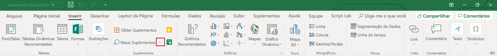

# Depurar Suplementos do Office no Visual Studio

Este artigo descreve como depurar o código do lado do cliente em Office de complementos criados com um dos modelos de projeto do Office Add-in no Visual Studio 2022.  Para obter informações sobre a depuração de código do lado do servidor em Office de Office, consulte [Overview of debugging Office Add-ins - Server-side ou client-side?](../testing/debug-add-ins-overview.md#server-side-or-client-side).

> [!NOTE]
> Você não pode usar o Visual Studio para depurar os Office no Mac. Para obter informações sobre a depuração em um Mac, consulte [Debug Office Add-ins on a Mac](../testing/debug-office-add-ins-on-ipad-and-mac.md).

## Examinar as propriedades de compilação e depuração

Antes de começar a depuração, revise as propriedades de cada projeto para confirmar se o Visual Studio abrirá o aplicativo Office desejado e que outras propriedades de compuração e depuração estão definidas adequadamente.

### Propriedades do projeto de suplemento

Abra a **janela Propriedades** do projeto do complemento para revisar as propriedades do projeto.

1. No **Explorador de soluções** Escolha o projeto do suplemento (*não* o projeto do aplicativo Web).

2. Na barra de menus, escolha **Exibir**,  > **Janela Propriedades**.

A tabela a seguir descreve as propriedades do projeto.

|Propriedade|Descrição|
|:-----|:-----|
|**Iniciar Ação**|Especifica o modo de depuração do suplemento. Isso deve ser definido como **Microsoft Edge** para um Outlook de dados. Para todos os outros Office, ele deve ser definido como **Office Desktop Client**.|
|**Iniciar documento**  (apenas suplementos Excel, PowerPoint e Word)|Especifica o documento a ser aberto quando você iniciar o projeto. Em um novo projeto, isso é definido como **[Nova Excel Workbook]**, **[Novo Documento do Word]**, **ou [Novo PowerPoint Apresentação]**. Para especificar um documento específico, siga as etapas em [Usar um documento existente para depurar o complemento](#use-an-existing-document-to-debug-the-add-in).|
|**Projeto da Web**|Especifica o nome do projeto Web associado ao suplemento.|
|**Email Address** (Apenas suplementos do Outlook)|Especifica o endereço de email da conta de usuário no Exchange Server ou no Exchange Online que você quer usar para testar o suplemento do Outlook. Se ficar em branco, você será solicitado a solicitar o endereço de email ao iniciar a depuração.|
|**EWS Url** (Apenas suplementos do Outlook)|Especifica a URL Exchange Web Services (Por exemplo: `https://www.contoso.com/ews/exchange.aspx`). Essa propriedade pode ser deixada em branco.|
|**OWA Url** (Apenas suplementos do Outlook)|Especifica a URL Outlook na Web (Por exemplo: `https://www.contoso.com/owa`). Essa propriedade pode ser deixada em branco.|
|**Usar autenticação multifator** (Apenas suplementos do Outlook)|Especifica o valor booleano que indica se a autenticação multifa factor deve ser usada. O padrão é **false**, mas a propriedade não tem efeito prático. Se você normalmente tiver que fornecer um segundo fator para fazer logon na conta de email, será solicitado ao iniciar a depuração. |
|**Nome de Usuário** (Apenas suplementos do Outlook)|Especifica o nome da conta de usuário no Exchange Server ou no Exchange Online com a qual você deseja testar o suplemento do Outlook. Essa propriedade pode ser deixada em branco.|
|**Arquivo do projeto**|Especifica o nome do arquivo que contém informações de compilação, configuração e outras informações sobre o projeto.|
|**Pasta do projeto**|Especifica o local do arquivo do projeto.|

> [!NOTE]
> Para um suplemento do Outlook, você pode optar por especificar valores para uma ou mais das propriedades *Apenas suplemento Outlook* na janela **Propriedades** mas isso não é necessário.

### Propriedades do projeto de aplicativo Web

Abra a **janela Propriedades** do projeto do aplicativo Web para revisar as propriedades do projeto.

1. No **Explorador de Soluções**, escolha o projeto do aplicativo Web.

2. Na barra de menus, escolha **Exibir**,  > **Janela Propriedades**.

A tabela a seguir descreve as propriedades do projeto de aplicativo web que são mais relevantes para projetos de suplementos do Office.

|Propriedade|Descrição|
|:-----|:-----|
|**SSL habilitado**|Especifica se o SSL está habilitado no site. Essa propriedade deve ser definida como **Verdadeira** para projetos de suplementos do Office.|
|**URL SSL**|Especifica a URL HTTPS segura para o site. Somente leitura.|
|**URL**|Especifica a URL HTTP para o site. Somente leitura.|
|**Arquivo do projeto**|Especifica o nome do arquivo que contém informações de compilação, configuração e outras informações sobre o projeto.|
|**Pasta do projeto**|Especifica o local do arquivo do projeto. Somente leitura. O arquivo de manifesto do Visual Studio gerado no tempo de execução é escrito para a pasta `bin\Debug\OfficeAppManifests` neste local.|

## Depurar um Excel, PowerPoint ou projeto de complemento do Word

Esta seção descreve como iniciar e depurar um Excel, PowerPoint ou um complemento do Word.

### Inicie o Excel, PowerPoint ou projeto de complemento do Word

Inicie o projeto escolhendo **DepurarStart** >  **Depuração** na barra de menus ou pressione o botão F5. Visual Studio criará automaticamente a solução e iniciará o Office host.

Quando Visual Studio cria o projeto, ele executa as seguintes tarefas:

1. Cria uma cópia do arquivo de manifesto XML e a adiciona ao  `_ProjectName_\bin\Debug\OfficeAppManifests` diretório. O Office aplicativo que hospeda seu complemento consome essa cópia quando você Visual Studio e depura o complemento.

2. Cria um conjunto de entradas do Registro no computador Windows que permite que o add-in apareça no aplicativo Office.

3. Cria o projeto do aplicativo Web e o implanta no servidor web local do IIS (`https://localhost`).

4. Se este for o primeiro projeto de add-in implantado no servidor Web local do IIS, talvez seja solicitado a instalar um Certificado Self-Signed no armazenamento de Certificados Raiz Confiáveis do usuário atual. Isso é necessário para que o IIS Express exiba o conteúdo do seu suplemento corretamente.

> [!NOTE]
> Se Office usar o controle edge Legacy webview (EdgeHTML) para executar os complementos em seu computador Windows, o Visual Studio poderá solicitar que você adicione uma isenção de loopback de rede local. Isso é necessário para que o controle webview possa acessar o site implantado no servidor web local do IIS. Você também pode alterar essa configuração a qualquer momento no Visual Studio, em **Ferramentas** > **Opções** > **Ferramentas do Office (Web)** > **Depuração do Suplemento da Web**. Para descobrir qual controle de navegador é usado em seu computador Windows, consulte [Navegadores usados por Office Desemp.](../concepts/browsers-used-by-office-web-add-ins.md)

Depois, o Visual Studio faz o seguinte:

1. Modifica o [elemento SourceLocation](../reference/manifest/sourcelocation.md) do arquivo de manifesto XML ( `_ProjectName_\bin\Debug\OfficeAppManifests` que foi copiado para o diretório) `~remoteAppUrl` substituindo o token pelo endereço totalmente qualificado da página inicial (por exemplo, `https://localhost:44302/Home.html`).

2. Inicia o projeto de aplicativo Web no IIS Express.

3. Valida o manifesto. Para examinar as regras de validação do arquivo de manifesto XML no projeto, confira [Manifesto XML de suplementos do Office](../develop/add-in-manifests.md). 

   > [!IMPORTANT]
   > Os Office XSD de manifesto que Visual Studio instalados estão desa atualizados. Se você receber erros de validação para o manifesto, sua primeira etapa de solução de problemas deve ser substituir um ou mais desses arquivos pelas versões mais recentes. Para obter instruções detalhadas, consulte [Manifest schema validation errors in Visual Studio projects](../testing/troubleshoot-development-errors.md#manifest-schema-validation-errors-in-visual-studio-projects).

4. Abre o Office aplicativo e descarrega o seu complemento.

### Depurar o Excel, PowerPoint ou o complemento do Word

1. Iniciar o add-in no Office aplicativo. Por exemplo, se for um complemento do painel de tarefas, ele terá adicionado um botão à faixa de opções início  (por exemplo, um botão **Mostrar Painel de** Tarefas). Selecione o botão na faixa de opções. 

   > [!NOTE]
   > Se o seu add-in não for sideload por Visual Studio, você poderá fazer sideload manualmente. Em Excel, PowerPoint ou Word, escolha a guia Inserir e escolha a seta  para baixo localizada à direita de **Meus Complementos**.
   >
   > 
   >
   > Na lista de suplementos disponíveis, localize a seção **suplementos do desenvolvedor** e selecione o seu suplemento para registrar.

   > [!TIP]
   > O painel de tarefas pode aparecer em branco quando ele for aberto pela primeira vez. Nesse caso, ele deve renderizar corretamente ao iniciar as ferramentas de depuração em uma etapa posterior.

3. Abra o [menu personalidade](../design/task-pane-add-ins.md#personality-menu) e escolha **Anexar um depurador**. Isso abrirá as ferramentas de depuração para o controle webview que Office está usando para executar os Windows computador. Você pode definir pontos de interrupção e passar o código conforme descrito em um dos seguintes artigos:

    - [Depurar os suplementos usando as ferramentas de desenvolvedor para o Internet Explorer](../testing/debug-add-ins-using-f12-tools-ie.md)
    - [Depurar suplementos usando ferramentas de desenvolvedor para Edge Legacy](../testing/debug-add-ins-using-devtools-edge-legacy.md)
    - [Depurar suplementos usando ferramentas de desenvolvedor no Microsoft Edge (baseado em Chromium)](../testing/debug-add-ins-using-devtools-edge-chromium.md)

4. Para fazer alterações no código, primeiro pare a sessão de depuração no Visual Studio e feche o Office aplicativo. Faça suas alterações e inicie uma nova sessão de depuração.

## Depurar um Outlook de um projeto de add-in

Esta seção descreve como iniciar e depurar um Outlook de um add-in.

### Iniciar o Outlook de Outlook de complemento

Inicie o projeto escolhendo **DepurarStart** >  **Depuração** na barra de menus ou pressione o botão F5. Visual Studio criará automaticamente a solução e iniciará Outlook página de Microsoft 365 de seu Microsoft 365.

Quando Visual Studio cria o projeto, ele executa as seguintes tarefas.

1. Solicita credenciais de logon. Se você for solicitado a entrar repetidamente ou se receber um erro não autorizado, a Auth Básica poderá ser desabilitada para contas em seu locatário Microsoft 365 locatário. Nesse caso, tente usar uma conta da Microsoft. Você também pode tentar definir a propriedade **Use multi-factor auth** como **True** no painel Outlook de propriedades do projeto do Web Add-in. Consulte [Propriedades do projeto de complemento](#add-in-project-properties).

1. Cria uma cópia do arquivo de manifesto XML e a adiciona ao `_ProjectName_\bin\Debug\OfficeAppManifests` diretório. Outlook consome essa cópia quando você Visual Studio e depura o complemento.

2. Cria o projeto do aplicativo Web e o implanta no servidor web local do IIS (`https://localhost`).

3. Se este for o primeiro projeto de add-in implantado no servidor Web local do IIS, talvez seja solicitado a instalar um Certificado Self-Signed no armazenamento de Certificados Raiz Confiáveis do usuário atual. Isso é necessário para que o IIS Express exiba o conteúdo do seu suplemento corretamente.

> [!NOTE]
> Se Office usar o controle edge Legacy webview (EdgeHTML) para executar os complementos em seu computador Windows, o Visual Studio poderá solicitar que você adicione uma isenção de loopback de rede local. Isso é necessário para que o controle webview possa acessar o site implantado no servidor web local do IIS. Você também pode alterar essa configuração a qualquer momento no Visual Studio, em **Ferramentas** > **Opções** > **Ferramentas do Office (Web)** > **Depuração do Suplemento da Web**. Para descobrir qual controle de navegador é usado em seu computador Windows, consulte [Navegadores usados por Office Desemp.](../concepts/browsers-used-by-office-web-add-ins.md)

Depois, o Visual Studio faz o seguinte:

1. Modifica o [elemento SourceLocation](../reference/manifest/sourcelocation.md) do arquivo de manifesto XML ( `_ProjectName_\bin\Debug\OfficeAppManifests` que foi copiado para o diretório) `~remoteAppUrl` substituindo o token pelo endereço totalmente qualificado da página inicial (por exemplo, `https://localhost:44302/Home.html`).

2. Inicia o projeto de aplicativo Web no IIS Express.

3. Valida o manifesto. Para examinar as regras de validação do arquivo de manifesto XML no projeto, confira [Manifesto XML de suplementos do Office](../develop/add-in-manifests.md). 

   > [!IMPORTANT]
   > Os Office XSD de manifesto que Visual Studio instalados estão desa atualizados. Se você receber erros de validação para o manifesto, sua primeira etapa de solução de problemas deve ser substituir um ou mais desses arquivos pelas versões mais recentes. Para obter instruções detalhadas, consulte [Manifest schema validation errors in Visual Studio projects](../testing/troubleshoot-development-errors.md#manifest-schema-validation-errors-in-visual-studio-projects).

4. Abre a Outlook da sua Microsoft 365 de Microsoft Edge.

### Depurar o Outlook de usuário

1. Na página Outlook, selecione uma mensagem de email ou item de compromisso para abri-la em sua própria janela. 

2. Pressione F12 para abrir a ferramenta de depuração de borda.

3. Depois que a ferramenta for aberta, iniciar o complemento. Por exemplo, na barra de ferramentas na parte superior de uma mensagem, selecione o botão Mais **aplicativos** e selecione o seu complemento no texto explicador que será aberto.

   

4. Use as instruções em um dos artigos a seguir para definir pontos de interrupção e passar o código. Cada um deles tem um link para orientações mais detalhadas.

   - [Depurar suplementos usando ferramentas de desenvolvedor para Edge Legacy](../testing/debug-add-ins-using-devtools-edge-legacy.md)
   - [Depurar suplementos usando ferramentas de desenvolvedor no Microsoft Edge (baseado em Chromium)](../testing/debug-add-ins-using-devtools-edge-chromium.md)

   > [!TIP]
   > Para depurar `Office.initialize` `Office.onReady` o código que é executado no método ou um método que é executado quando o complemento é aberto, desmarco seus pontos de interrupção e feche e reabra o complemento. Para obter mais informações sobre esses métodos, consulte [Initialize your Office Add-in](../develop/initialize-add-in.md).

5. Para fazer alterações no código, primeiro pare a sessão de depuração no Visual Studio e feche as páginas Outlook. Faça suas alterações e inicie uma nova sessão de depuração.

## Usar um documento existente para depurar o suplemento

Se você tiver um documento que contém os dados de teste deseja usar ao depurar seu suplemento o Excel, PowerPoint ou Word, o Visual Studio pode ser configurado para abrir esse documento quando você iniciar o projeto. Para especificar um documento existente a ser usado durante a depuração do complemento, execute as etapas a seguir.

1. No **Explorador de soluções** Escolha o projeto do suplemento (*não* o projeto do aplicativo Web).

2. Na barra de menus, escolha **Projeto** > **Adicionar Item Existente**.

3. Na caixa de diálogo **Adicionar Item Existente**, localize e selecione o documento que você deseja adicionar.

4. Escolha o botão **Adicionar** para adicionar o documento ao projeto.

5. No **Explorador de soluções** Escolha o projeto do suplemento (*não* o projeto do aplicativo Web).

6. Na barra de menus, escolha **Exibir**,  > **Janela Propriedades**.

7. Na janela **Propriedades**, escolha a lista **Iniciar Documento** e selecione o documento que você adicionou ao projeto. O projeto agora está configurado para iniciar o suplemento nesse documento.

## Próximas etapas

Depois do suplemento funcionar conforme desejado, veja [Implantar e publicar o suplemento Office](../publish/publish.md) para saber mais como você pode distribuir o suplemento para os usuários.
