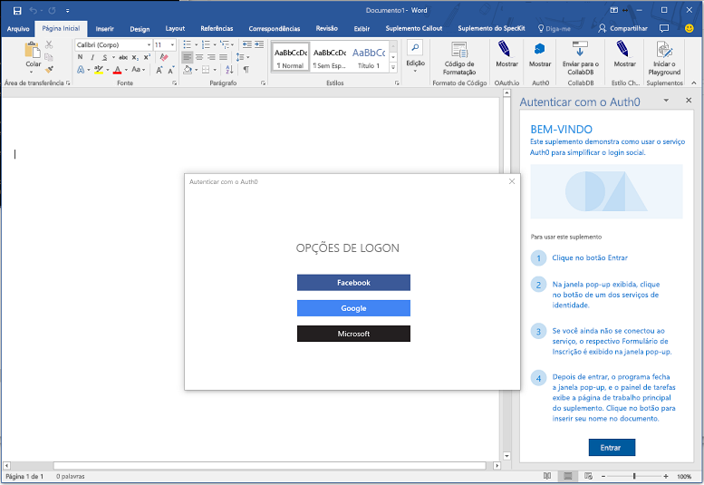
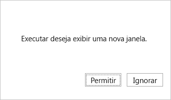
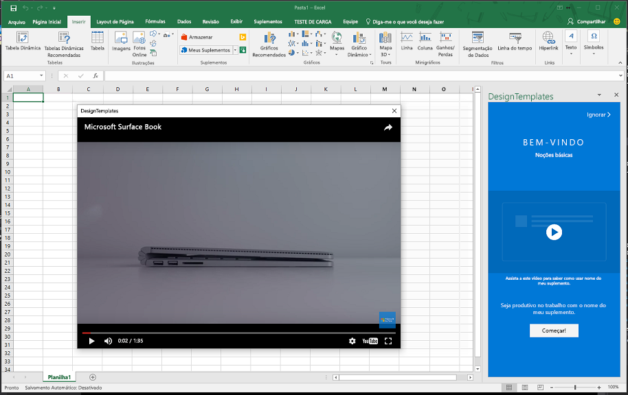

# <a name="use-the-dialog-api-in-your-office-add-ins"></a><span data-ttu-id="0b18e-102">Use a API de Caixa de Diálogo em seus Suplementos do Office</span><span class="sxs-lookup"><span data-stu-id="0b18e-102">Use the Dialog API in your Office Add-ins</span></span>

<span data-ttu-id="0b18e-p101">Você pode usar a [API de Caixa de diálogo](/javascript/api/office/office.ui) para abrir caixas de diálogo no seu Suplemento do Office. Este artigo fornece orientações para usar a API de Caixa de diálogo em seu Suplemento do Office.</span><span class="sxs-lookup"><span data-stu-id="0b18e-p101">You can use the [Dialog API](/javascript/api/office/office.ui) to open dialog boxes in your Office Add-in. This article provides guidance for using the Dialog API in your Office Add-in.</span></span>

> [!NOTE]
> <span data-ttu-id="0b18e-p102">Para informações sobre os programas para os quais a API de Caixa de Diálogo tem suporte no momento, confira [Conjuntos de requisitos da API de Caixa de Diálogo](/office/dev/add-ins/reference/requirement-sets/dialog-api-requirement-sets). Atualmente, a API de Caixa de Diálogo tem suporte para Word, Excel, PowerPoint e Outlook.</span><span class="sxs-lookup"><span data-stu-id="0b18e-p102">For information about where the Dialog API is currently supported, see [Dialog API requirement sets](/office/dev/add-ins/reference/requirement-sets/dialog-api-requirement-sets). The Dialog API is currently supported for Word, Excel, PowerPoint, and Outlook.</span></span>

> <span data-ttu-id="0b18e-107">Um cenário primário para as APIs de Caixa de Diálogo é habilitar a autenticação com um recurso como o Google ou o Facebook.</span><span class="sxs-lookup"><span data-stu-id="0b18e-107">A primary scenario for the Dialog APIs is to enable authentication with a resource such as Google or Facebook.</span></span>

<span data-ttu-id="0b18e-108">Considere abrir uma caixa de diálogo em um painel de tarefas, suplemento de conteúdo ou [comando de suplemento](../design/add-in-commands.md) para fazer o seguinte:</span><span class="sxs-lookup"><span data-stu-id="0b18e-108">Consider opening a dialog box from a task pane or content add-in or [add-in command](../design/add-in-commands.md) to do the following:</span></span>

- <span data-ttu-id="0b18e-109">Exibir páginas de entrada que não podem ser abertas diretamente em um painel de tarefas.</span><span class="sxs-lookup"><span data-stu-id="0b18e-109">Display sign in pages that cannot be opened directly in a task pane.</span></span>
- <span data-ttu-id="0b18e-110">Fornecer mais espaço na tela, ou até uma tela inteira, para algumas tarefas no seu suplemento.</span><span class="sxs-lookup"><span data-stu-id="0b18e-110">Provide more screen space, or even a full screen, for some tasks in your add-in.</span></span>
- <span data-ttu-id="0b18e-111">Hospedar um vídeo que seria muito pequeno se fosse confinado em um painel de tarefas.</span><span class="sxs-lookup"><span data-stu-id="0b18e-111">Host a video that would be too small if confined to a task pane.</span></span>

> [!NOTE]
> <span data-ttu-id="0b18e-p103">Como a sobreposição de elementos de IU não são recomendáveis, evite abrir uma caixa de diálogo em um painel de tarefas a menos que seu cenário o obrigue a fazer isso. Ao considerar como usar a área de superfície de um painel de tarefas, observe que painéis de tarefas podem ter guias. Por exemplo, confira o exemplo [Suplemento do Excel JavaScriptSalesTracker](https://github.com/OfficeDev/Excel-Add-in-JavaScript-SalesTracker).</span><span class="sxs-lookup"><span data-stu-id="0b18e-p103">Because overlapping UI elements are discouraged, avoid opening a dialog from a task pane unless your scenario requires it. When you consider how to use the surface area of a task pane, note that task panes can be tabbed. For an example, see the [Excel Add-in JavaScript SalesTracker](https://github.com/OfficeDev/Excel-Add-in-JavaScript-SalesTracker) sample.</span></span>

<span data-ttu-id="0b18e-115">A imagem abaixo mostra um exemplo de uma caixa de diálogo.</span><span class="sxs-lookup"><span data-stu-id="0b18e-115">The following image shows an example of a dialog box.</span></span>



<span data-ttu-id="0b18e-p104">A caixa de diálogo sempre abre no centro da tela. O usuário pode movê-la e redimensioná-la. A janela é *não modal*: o usuário pode continuar a interagir com o documento no aplicativo do Office do host e com a página host no painel de tarefas, caso houver uma.</span><span class="sxs-lookup"><span data-stu-id="0b18e-p104">Note that the dialog box always opens in the center of the screen. The user can move and resize it. The window is *nonmodal*--a user can continue to interact with both the document in the host Office application and with the host page in the task pane, if there is one.</span></span>

## <a name="dialog-api-scenarios"></a><span data-ttu-id="0b18e-120">Cenários da API de Caixa de Diálogo</span><span class="sxs-lookup"><span data-stu-id="0b18e-120">Dialog API scenarios</span></span>

<span data-ttu-id="0b18e-121">As APIs JavaScript para Office têm suporte para os seguintes cenários com um objeto [Dialog](/javascript/api/office/office.dialog) e duas funções no [namespace Office.context.ui](/javascript/api/office/office.ui).</span><span class="sxs-lookup"><span data-stu-id="0b18e-121">The Office JavaScript APIs support the following scenarios with a [Dialog](/javascript/api/office/office.dialog) object and two functions in the [Office.context.ui namespace](/javascript/api/office/office.ui).</span></span>

### <a name="open-a-dialog-box"></a><span data-ttu-id="0b18e-122">Abra uma caixa de diálogo</span><span class="sxs-lookup"><span data-stu-id="0b18e-122">Open a dialog box</span></span>

<span data-ttu-id="0b18e-p105">Para abrir uma caixa de diálogo, seu código no painel de tarefas chama o método [displayDialogAsync](/javascript/api/office/office.ui) e transmite a ele a URL do recurso que você deseja abrir. Isso geralmente é uma página, mas pode ser um método controlador em um aplicativo MVC, uma rota, um método de serviço Web ou qualquer outro recurso. Neste artigo, 'página' ou 'site' refere-se ao recurso na caixa de diálogo. Apresentamos um exemplo de código simples a seguir.</span><span class="sxs-lookup"><span data-stu-id="0b18e-p105">To open a dialog box, your code in the task pane calls the [displayDialogAsync](/javascript/api/office/office.ui) method and passes to it the URL of the resource that you want to open. This is usually a page, but it can be a controller method in an MVC application, a route, a web service method, or any other resource. In this article, 'page' or 'website' refers to the resource in the dialog. The following code is a simple example:</span></span>

```js
Office.context.ui.displayDialogAsync('https://myAddinDomain/myDialog.html');
```

> [!NOTE]
> - <span data-ttu-id="0b18e-p106">A URL usa o protocolo HTTP**S**. Isso é obrigatório para todas as páginas carregadas em uma caixa diálogo, não apenas para a primeira página carregada.</span><span class="sxs-lookup"><span data-stu-id="0b18e-p106">The URL uses the HTTP**S** protocol. This is mandatory for all pages loaded in a dialog box, not just the first page loaded.</span></span>
> - <span data-ttu-id="0b18e-129">O domínio do recurso de caixa de diálogo é o mesmo que o domínio da página de host, que pode ser a página em um painel de tarefas ou o [arquivo de função](/office/dev/add-ins/reference/manifest/functionfile) de um comando de suplemento.</span><span class="sxs-lookup"><span data-stu-id="0b18e-129">The dialog resource's domain is the same as the domain of the host page, which can be the page in a task pane or the [function file](/office/dev/add-ins/reference/manifest/functionfile) of an add-in command.</span></span> <span data-ttu-id="0b18e-130">Isso é necessário: a página, o método do controlador ou outro recurso que é passado para o método `displayDialogAsync` deve estar no mesmo domínio que a página de host.</span><span class="sxs-lookup"><span data-stu-id="0b18e-130">This is required: the page, controller method, or other resource that is passed to the `displayDialogAsync` method must be in the same domain as the host page.</span></span>

> [!IMPORTANT]
> <span data-ttu-id="0b18e-131">A página de host e os recursos de caixa de diálogo devem ter o mesmo domínio completo.</span><span class="sxs-lookup"><span data-stu-id="0b18e-131">The host page and the resources of the dialog must have the same full domain.</span></span> <span data-ttu-id="0b18e-132">Se você tentar passar `displayDialogAsync` para um subdomínio do domínio do suplemento, ele não funcionará.</span><span class="sxs-lookup"><span data-stu-id="0b18e-132">If you attempt to pass `displayDialogAsync` a subdomain of the add-in's domain, it will not work.</span></span> <span data-ttu-id="0b18e-133">O domínio completo, incluindo qualquer subdomínio, deve corresponder.</span><span class="sxs-lookup"><span data-stu-id="0b18e-133">The full domain, including any subdomain, must match.</span></span>

<span data-ttu-id="0b18e-p109">Após o carregamento da primeira página (ou de outro recurso), um usuário pode ir para qualquer site (ou outro recurso) que usa HTTPS. Também é possível criar a primeira página para redirecionar imediatamente para outro site.</span><span class="sxs-lookup"><span data-stu-id="0b18e-p109">After the first page (or other resource) is loaded, a user can go to any website (or other resource) that uses HTTPS. You can also design the first page to immediately redirect to another site.</span></span>

<span data-ttu-id="0b18e-136">Por padrão, a caixa de diálogo ocupará 80% da altura e da largura na tela do dispositivo, mas você pode definir porcentagens diferentes. Basta transmitir um objeto de configuração para o método, como mostra o exemplo a seguir.</span><span class="sxs-lookup"><span data-stu-id="0b18e-136">By default, the dialog box will occupy 80% of the height and width of the device screen, but you can set different percentages by passing a configuration object to the method, as shown in the following example:</span></span>

```js
Office.context.ui.displayDialogAsync('https://myDomain/myDialog.html', {height: 30, width: 20});
```

<span data-ttu-id="0b18e-137">Para ver um suplemento de exemplo que faz isso, confira [Exemplo de API de Caixa de diálogo do Suplemento do Office](https://github.com/OfficeDev/Office-Add-in-Dialog-API-Simple-Example).</span><span class="sxs-lookup"><span data-stu-id="0b18e-137">For a sample add-in that does this, see [Office Add-in Dialog API Example](https://github.com/OfficeDev/Office-Add-in-Dialog-API-Simple-Example).</span></span>

<span data-ttu-id="0b18e-p110">Defina os dois valores como 100% para ter uma verdadeira experiência de tela inteira. O máximo real é 99,5%, e a janela ainda poderá ser movida e redimensionada.</span><span class="sxs-lookup"><span data-stu-id="0b18e-p110">Set both values to 100% to get what is effectively a full screen experience. (The effective maximum is 99.5%, and the window is still moveable and resizable.)</span></span>

> [!NOTE]
> <span data-ttu-id="0b18e-p111">Apenas uma caixa de diálogo pode ser aberta em uma janela do host. Tentar abrir outra caixa de diálogo gera um erro. Portanto, por exemplo, se um usuário abrir uma caixa de diálogo no painel de tarefas, ele não poderá abrir uma segunda caixa de diálogo em uma página diferente no painel de tarefas. No entanto, quando uma caixa de diálogo é aberta em um [comando de suplemento](../design/add-in-commands.md), o comando abre um arquivo HTML novo (mas não visto) sempre que ele é selecionado. Isso cria uma nova janela do host (não vista) para que cada janela possa iniciar sua própria caixa de diálogo. Para obter mais informações, confira [Erros de displayDialogAsync](#errors-from-displaydialogasync).</span><span class="sxs-lookup"><span data-stu-id="0b18e-p111">You can open only one dialog box from a host window. An attempt to open another dialog box generates an error. For example, if a user opens a dialog box from a task pane, she cannot open a second dialog box, from a different page in the task pane. However, when a dialog box is opened from an [add-in command](../design/add-in-commands.md), the command opens a new (but unseen) HTML file each time it is selected. This creates a new (unseen) host window, so each such window can launch its own dialog box. For more information, see [Errors from displayDialogAsync](#errors-from-displaydialogasync).</span></span>

### <a name="take-advantage-of-a-performance-option-in-office-on-the-web"></a><span data-ttu-id="0b18e-146">Aproveite uma opção de desempenho no Office na Web</span><span class="sxs-lookup"><span data-stu-id="0b18e-146">Take advantage of a performance option in Office Online</span></span>

<span data-ttu-id="0b18e-p112">A propriedade `displayInIframe` é uma propriedade adicional no objeto de configuração que você pode passar para `displayDialogAsync`. Quando essa propriedade for definida como `true` e o suplemento estiver em execução em um documento aberto no Office na Web, a caixa de diálogo será aberta como um iframe flutuante, em vez de uma janela independente, o que faz com que ela seja aberta mais rapidamente. Apresentamos um exemplo a seguir:</span><span class="sxs-lookup"><span data-stu-id="0b18e-p112">The `displayInIframe` property is an additional property in the configuration object that you can pass to `displayDialogAsync`. When this property is set to `true`, and the add-in is running in a document opened in Office Online, the dialog box will open as a floating iframe rather than an independent window, which makes it open faster. The following is an example:</span></span>

```js
Office.context.ui.displayDialogAsync('https://myDomain/myDialog.html', {height: 30, width: 20, displayInIframe: true});
```

<span data-ttu-id="0b18e-p113">O valor padrão é `false`, que é o mesmo que omitir a propriedade inteiramente. Se o suplemento não estiver sendo executado no Office na Web, `displayInIframe` será ignorado.</span><span class="sxs-lookup"><span data-stu-id="0b18e-p113">The default value is `false`, which is the same as omitting the property entirely. If the add-in is not running in Office Online, the `displayInIframe` is ignored.</span></span>

> [!NOTE]
> <span data-ttu-id="0b18e-p114">Você **não** deverá usar `displayInIframe: true` se a caixa de diálogo redirecionar a qualquer ponto para uma página que não possa ser aberta em um iframe. Por exemplo, as páginas de entrada de muitos serviços Web populares, como Google e Conta da Microsoft, não podem ser abertas em um iframe.</span><span class="sxs-lookup"><span data-stu-id="0b18e-p114">You should **not** use `displayInIframe: true` if the dialog will at any point redirect to a page that cannot be opened in an iframe. For example, the sign in pages of many popular web services, such as Google and Microsoft Account, cannot be opened in an iframe.</span></span>

### <a name="handling-pop-up-blockers-with-office-on-the-web"></a><span data-ttu-id="0b18e-154">Tratamento de bloqueadores de pop-up com o Office na Web</span><span class="sxs-lookup"><span data-stu-id="0b18e-154">Handling pop-up blockers with Office on the web</span></span>

<span data-ttu-id="0b18e-155">Tentar exibir uma caixa de diálogo enquanto usa o Office na Web pode fazer com que bloqueadores de pop-up do navegador bloqueiem a caixa de diálogo.</span><span class="sxs-lookup"><span data-stu-id="0b18e-155">Attempting to display a dialog while using Office Online may cause the browser's pop-up blocker to block the dialog.</span></span> <span data-ttu-id="0b18e-156">O bloqueador de pop-up do navegador pode ser evitado se o usuário de seu suplemento concordar primeiro com um aviso do suplemento.</span><span class="sxs-lookup"><span data-stu-id="0b18e-156">The browser's pop-up blocker can be circumvented if the user of your add-in first agrees to a prompt from the add-in.</span></span> <span data-ttu-id="0b18e-157">`displayDialogAsync`'s [DialogOptions](/javascript/api/office/office.dialogoptions) tem a `promptBeforeOpen` propriedade para acionar esse tipo de pop-up.</span><span class="sxs-lookup"><span data-stu-id="0b18e-157">`displayDialogAsync`'s [DialogOptions](/javascript/api/office/office.dialogoptions) has the `promptBeforeOpen` property to trigger such a pop-up.</span></span> <span data-ttu-id="0b18e-158">`promptBeforeOpen` é um valor booliano que fornece o comportamento a seguir:</span><span class="sxs-lookup"><span data-stu-id="0b18e-158">`promptBeforeOpen` is a boolean value which provides the following behavior:</span></span>

 - <span data-ttu-id="0b18e-159">`true` - A estrutura exibe um pop-up para acionar o painel de navegação e evitar bloqueadores de pop-up do navegador.</span><span class="sxs-lookup"><span data-stu-id="0b18e-159">`true` - The framework displays a pop-up to trigger the navigation and avoid the browser's pop-up blocker.</span></span> 
 - <span data-ttu-id="0b18e-160">`false` - A caixa de diálogo não será exibida e o desenvolvedor deverá lidar com pop-ups (fornecendo um artefato da interface de usuário para acionar a navegação).</span><span class="sxs-lookup"><span data-stu-id="0b18e-160">`false` - The dialog will not be shown and the developer must handle pop-ups (by providing a user interface artifact to trigger the navigation).</span></span> 
 
<span data-ttu-id="0b18e-161">O pop-up parece semelhante ao da captura de tela a seguir:</span><span class="sxs-lookup"><span data-stu-id="0b18e-161">The pop-up looks similiar to that in the following screenshot:</span></span>


 
### <a name="send-information-from-the-dialog-box-to-the-host-page"></a><span data-ttu-id="0b18e-163">Envie informações da caixa de diálogo para a página host</span><span class="sxs-lookup"><span data-stu-id="0b18e-163">Send information from the dialog box to the host page</span></span>

<span data-ttu-id="0b18e-164">A caixa de diálogo não pode se comunicar com a página host no painel de tarefas, a menos que:</span><span class="sxs-lookup"><span data-stu-id="0b18e-164">The dialog box cannot communicate with the host page in the task pane unless:</span></span>

- <span data-ttu-id="0b18e-165">A página atual na caixa de diálogo esteja no mesmo domínio da página host.</span><span class="sxs-lookup"><span data-stu-id="0b18e-165">The current page in the dialog box is in the same domain as the host page.</span></span>
- <span data-ttu-id="0b18e-p116">A biblioteca JavaScript do Office seja carregada na página. Como qualquer página que usa a biblioteca JavaScript do Office, o script da página deve atribuir um método à propriedade `Office.initialize`, embora ele possa ser um método vazio. Para mais detalhes, confira [Iniciar o suplemento](understanding-the-javascript-api-for-office.md#initializing-your-add-in).</span><span class="sxs-lookup"><span data-stu-id="0b18e-p116">The Office JavaScript library is loaded in the page. (Like any page that uses the Office JavaScript library, script for the page must assign a method to the `Office.initialize` property, although it can be an empty method. For details, see [Initializing your add-in](understanding-the-javascript-api-for-office.md#initializing-your-add-in).)</span></span>

<span data-ttu-id="0b18e-p117">O código na página de diálogo use a função `messageParent` para enviar uma mensagem de cadeia de caracteres ou um valor booliano para a página host. A cadeia de caracteres pode ser uma palavra, uma frase, um blob XML, um JSON em formato de cadeia de caracteres ou qualquer outra coisa que possa ser serializada em uma cadeia de caracteres. Apresentamos um exemplo a seguir:</span><span class="sxs-lookup"><span data-stu-id="0b18e-p117">Code in the dialog page uses the `messageParent` function to send either a Boolean value or a string message to the host page. The string can be a word, sentence, XML blob, stringified JSON, or anything else that can be serialized to a string. The following is an example:</span></span>

```js
if (loginSuccess) {
    Office.context.ui.messageParent(true);
}
```

> [!NOTE]
> - <span data-ttu-id="0b18e-p118">A função `messageParent` é uma das *únicas* duas APIs do Office que pode ser chamada na caixa de diálogo. A outra é `Office.context.requirements.isSetSupported`. Para saber mais, confira [Especificar hosts do Office e requisitos da API](specify-office-hosts-and-api-requirements.md).</span><span class="sxs-lookup"><span data-stu-id="0b18e-p118">The `messageParent` function is one of *only* two Office APIs that can be called in the dialog box. The other is `Office.context.requirements.isSetSupported`. For information about it, see [Specify Office hosts and API requirements](specify-office-hosts-and-api-requirements.md).</span></span>
> - <span data-ttu-id="0b18e-175">A função `messageParent` só pode ser chamada em uma página com o mesmo domínio (incluindo o protocolo e a porta) da página host.</span><span class="sxs-lookup"><span data-stu-id="0b18e-175">The `messageParent` function can only be called on a page with the same domain (including protocol and port) as the host page.</span></span>

<span data-ttu-id="0b18e-176">No próximo exemplo, `googleProfile` é uma versão em formato de cadeia de caracteres do perfil do Google do usuário.</span><span class="sxs-lookup"><span data-stu-id="0b18e-176">In the next example, `googleProfile` is a stringified version of the user's Google profile.</span></span>

```js
if (loginSuccess) {
    Office.context.ui.messageParent(googleProfile);
}
```

<span data-ttu-id="0b18e-p119">A página host deve ser configurada para receber a mensagem. Você pode fazer isso adicionando um parâmetro de retorno de chamada à chamada original de `displayDialogAsync`. O retorno de chamada atribui um manipulador ao evento `DialogMessageReceived`. Apresentamos um exemplo a seguir:</span><span class="sxs-lookup"><span data-stu-id="0b18e-p119">The host page must be configured to receive the message. You do this by adding a callback parameter to the original call of `displayDialogAsync`. The callback assigns a handler to the `DialogMessageReceived` event. The following is an example:</span></span>

```js
var dialog;
Office.context.ui.displayDialogAsync('https://myDomain/myDialog.html', {height: 30, width: 20},
    function (asyncResult) {
        dialog = asyncResult.value;
        dialog.addEventHandler(Office.EventType.DialogMessageReceived, processMessage);
    }
);
```

> [!NOTE]
> - <span data-ttu-id="0b18e-p120">O Office transmite um objeto [AsyncResult](/javascript/api/office/office.asyncresult) para o retorno de chamada. Ele representa o resultado de tentativas de abrir a caixa de diálogo, mas não representa o resultado de eventos na caixa diálogo. Para obter mais informações sobre essa distinção, confira a seção [Manipular erros e eventos](#handle-errors-and-events).</span><span class="sxs-lookup"><span data-stu-id="0b18e-p120">Office passes an [AsyncResult](/javascript/api/office/office.asyncresult) object to the callback. It represents the result of the attempt to open the dialog box. It does not represent the outcome of any events in the dialog box. For more on this distinction, see the section [Handle errors and events](#handle-errors-and-events).</span></span>
> - <span data-ttu-id="0b18e-185">A propriedade `value` do `asyncResult` é definida como um objeto [Dialog](/javascript/api/office/office.dialog) que existe na página host, não no contexto da execução da caixa de diálogo.</span><span class="sxs-lookup"><span data-stu-id="0b18e-185">The `value` property of the `asyncResult` is set to a [Dialog](/javascript/api/office/office.dialog) object, which exists in the host page, not in the dialog box's execution context.</span></span>
> - <span data-ttu-id="0b18e-p121">O `processMessage` é a função que manipula o evento. Você pode dar a ele o nome que desejar.</span><span class="sxs-lookup"><span data-stu-id="0b18e-p121">The `processMessage` is the function that handles the event. You can give it any name you want.</span></span>
> - <span data-ttu-id="0b18e-188">A variável `dialog` é declarada em um escopo mais amplo do que o retorno de chamada porque ela também é referenciada em `processMessage`.</span><span class="sxs-lookup"><span data-stu-id="0b18e-188">The `dialog` variable is declared at a wider scope than the callback because it is also referenced in `processMessage`.</span></span>

<span data-ttu-id="0b18e-189">Veja a seguir um exemplo simples de um manipulador para o evento `DialogMessageReceived`:</span><span class="sxs-lookup"><span data-stu-id="0b18e-189">The following is a simple example of a handler for the `DialogMessageReceived` event:</span></span>

```js
function processMessage(arg) {
    var messageFromDialog = JSON.parse(arg.message);
    showUserName(messageFromDialog.name);
}
```

> [!NOTE]
> - <span data-ttu-id="0b18e-p122">O Office transmite o objeto `arg` para o manipulador. Sua propriedade `message` é o booliano ou a cadeia de caracteres enviada pela chamada de `messageParent` na caixa de diálogo. Neste exemplo, ela é uma representação em formato de cadeia de caracteres de um perfil de usuário de um serviço como a Conta da Microsoft ou o Google, portanto está desserializada como um objeto com `JSON.parse` novamente.</span><span class="sxs-lookup"><span data-stu-id="0b18e-p122">Office passes the `arg` object to the handler. Its `message` property is the Boolean or string sent by the call of `messageParent` in the dialog. In this example, it is a stringified representation of a user's profile from a service such as Microsoft Account or Google, so it is deserialized back to an object with `JSON.parse`.</span></span>
> - <span data-ttu-id="0b18e-p123">A implementação de `showUserName` não é mostrada. Ela pode exibir uma mensagem de boas-vindas personalizada no painel de tarefas.</span><span class="sxs-lookup"><span data-stu-id="0b18e-p123">The `showUserName` implementation is not shown. It might display a personalized welcome message on the task pane.</span></span>

<span data-ttu-id="0b18e-195">Quando a interação do usuário com a caixa de diálogo for concluída, seu manipulador de mensagem fechará a caixa de diálogo, conforme mostrado neste exemplo.</span><span class="sxs-lookup"><span data-stu-id="0b18e-195">When the user interaction with the dialog box is completed, your message handler should close the dialog box, as shown in this example.</span></span>

```js
function processMessage(arg) {
    dialog.close();
    // message processing code goes here;
}
```

> [!NOTE]
> - <span data-ttu-id="0b18e-196">O objeto `dialog` deve ser o mesmo que é retornado pela chamada de `displayDialogAsync`.</span><span class="sxs-lookup"><span data-stu-id="0b18e-196">The `dialog` object must be the same one that is returned by the call of `displayDialogAsync`.</span></span>
> - <span data-ttu-id="0b18e-197">A chamada de `dialog.close` informa ao Office para fechar a caixa de diálogo imediatamente.</span><span class="sxs-lookup"><span data-stu-id="0b18e-197">The call of `dialog.close` tells Office to immediately close the dialog box.</span></span>

<span data-ttu-id="0b18e-198">Para ver um suplemento de exemplo que usa essas técnicas, confira [Exemplo de API de Caixa de diálogo do Suplemento do Office](https://github.com/OfficeDev/Office-Add-in-Dialog-API-Simple-Example).</span><span class="sxs-lookup"><span data-stu-id="0b18e-198">For a sample add-in that uses these techniques, see [Office Add-in Dialog API Example](https://github.com/OfficeDev/Office-Add-in-Dialog-API-Simple-Example).</span></span>

<span data-ttu-id="0b18e-p124">Se o suplemento precisa abrir uma página diferente do painel de tarefas depois de receber a mensagem, é possível usar o método `window.location.replace` (ou `window.location.href`) como a última linha do manipulador. Apresentamos um exemplo a seguir:</span><span class="sxs-lookup"><span data-stu-id="0b18e-p124">If the add-in needs to open a different page of the task pane after receiving the message, you can use the `window.location.replace` method (or `window.location.href`) as the last line of the handler. The following is an example:</span></span>

```js
function processMessage(arg) {
    // message processing code goes here;
    window.location.replace("/newPage.html");
    // Alternatively ...
    // window.location.href = "/newPage.html";
}
```

<span data-ttu-id="0b18e-201">Para ver um exemplo de um suplemento que faz isso, consulte [Inserir gráficos do Excel usando o Microsoft Graph em um Suplemento do PowerPoint](https://github.com/OfficeDev/PowerPoint-Add-in-Microsoft-Graph-ASPNET-InsertChart).</span><span class="sxs-lookup"><span data-stu-id="0b18e-201">For an example of an add-in that does this, see the [Insert Excel charts using Microsoft Graph in a PowerPoint add-in](https://github.com/OfficeDev/PowerPoint-Add-in-Microsoft-Graph-ASPNET-InsertChart) sample.</span></span>

#### <a name="conditional-messaging"></a><span data-ttu-id="0b18e-202">Mensagens condicionais</span><span class="sxs-lookup"><span data-stu-id="0b18e-202">Conditional messaging</span></span>

<span data-ttu-id="0b18e-p125">Como você pode enviar várias chamadas `messageParent` a partir da caixa de diálogo, mas tem apenas um manipulador na página host do evento `DialogMessageReceived`, o manipulador tem que usar a lógica condicional para distinguir mensagens diferentes. Por exemplo, se a caixa de diálogo solicitar que o usuário entre em um provedor de identidade como a Conta da Microsoft ou o Google, ele enviará o perfil do usuário como uma mensagem. Se a autenticação falhar, a caixa de diálogo enviará informações de erro à página host, como no exemplo a seguir:</span><span class="sxs-lookup"><span data-stu-id="0b18e-p125">Because you can send multiple `messageParent` calls from the dialog box, but you have only one handler in the host page for the `DialogMessageReceived` event, the handler must use conditional logic to distinguish different messages. For example, if the dialog box prompts a user to sign in to an identity provider such as Microsoft Account or Google, it sends the user's profile as a message. If authentication fails, the dialog box sends error information to the host page, as in the following example:</span></span>

```js
if (loginSuccess) {
    var userProfile = getProfile();
    var messageObject = {messageType: "signinSuccess", profile: userProfile};
    var jsonMessage = JSON.stringify(messageObject);
    Office.context.ui.messageParent(jsonMessage);
} else {
    var errorDetails = getError();
    var messageObject = {messageType: "signinFailure", error: errorDetails};
    var jsonMessage = JSON.stringify(messageObject);
    Office.context.ui.messageParent(jsonMessage);
}
```

> [!NOTE]
> - <span data-ttu-id="0b18e-206">A variável `loginSuccess` poderia ser inicializada por meio da leitura da resposta HTTP no provedor de identidade.</span><span class="sxs-lookup"><span data-stu-id="0b18e-206">The `loginSuccess` variable would be initialized by reading the HTTP response from the identity provider.</span></span>
> - <span data-ttu-id="0b18e-p126">A implementação das funções `getProfile` e `getError` não é exibida. Cada uma delas obtém dados de um parâmetro de consulta ou do corpo da resposta HTTP.</span><span class="sxs-lookup"><span data-stu-id="0b18e-p126">The the implementation of the `getProfile` and `getError` functions are not not shown. They each get data from a query parameter or from the body of the HTTP response.</span></span>
> - <span data-ttu-id="0b18e-p127">São enviados objetos anônimos de diferentes tipos se a entrada for bem-sucedida ou não. Ambos têm uma propriedade `messageType`, mas um tem uma propriedade `profile` e o outro tem uma propriedade `error`.</span><span class="sxs-lookup"><span data-stu-id="0b18e-p127">Anonymous objects of different types are sent depending on whether the sign in was successful. Both have a `messageType` property, but one has a `profile` property and the other has an `error` property.</span></span>

<span data-ttu-id="0b18e-p128">O código do manipulador na página host usa o valor da propriedade `messageType` para ramificar como no exemplo a seguir. A função `showUserName` é a mesma do exemplo anterior e a função `showNotification` exibe o erro na interface do usuário da página host.</span><span class="sxs-lookup"><span data-stu-id="0b18e-p128">The handler code in the host page uses the value of the `messageType` property to branch as shown in the following example. Note that the `showUserName` function is the same as in the previous example and `showNotification` function displays the error in the host page's UI.</span></span>

```js
function processMessage(arg) {
    var messageFromDialog = JSON.parse(arg.message);
    if (messageFromDialog.messageType === "signinSuccess") {
        dialog.close();
        showUserName(messageFromDialog.profile.name);
        window.location.replace("/newPage.html");
    } else {
        dialog.close();
        showNotification("Unable to authenticate user: " + messageFromDialog.error);
    }
}
```

> [!NOTE]
> <span data-ttu-id="0b18e-213">A `showNotification` implementação não é exibida no código de exemplo fornecido neste artigo.</span><span class="sxs-lookup"><span data-stu-id="0b18e-213">The `showNotification` implementation is not shown in the sample code provided by this article.</span></span> <span data-ttu-id="0b18e-214">Um exemplo de como você pode implementar essa função dentro do suplemento, confira [Exemplo do suplemento do Office exemplo do diálogo API](https://github.com/OfficeDev/Office-Add-in-Dialog-API-Simple-Example).</span><span class="sxs-lookup"><span data-stu-id="0b18e-214">For an example of how you might implement this function within your add-in, see [Office Add-in Dialog API Example](https://github.com/OfficeDev/Office-Add-in-Dialog-API-Simple-Example).</span></span>

### <a name="closing-the-dialog-box"></a><span data-ttu-id="0b18e-215">Feche a caixa de diálogo</span><span class="sxs-lookup"><span data-stu-id="0b18e-215">Closing the dialog box</span></span>

<span data-ttu-id="0b18e-p130">Você pode implementar um botão na caixa de diálogo para fechá-la. Para fazer isso, o manipulador de eventos de clique do botão deve usar `messageParent` para informar a página host em que o botão foi clicado. Apresentamos um exemplo a seguir:</span><span class="sxs-lookup"><span data-stu-id="0b18e-p130">You can implement a button in the dialog box that will close it. To do this, the click event handler for the button should use `messageParent` to tell the host page that the button has been clicked. The following is an example:</span></span>

```js
function closeButtonClick() {
    var messageObject = {messageType: "dialogClosed"};
    var jsonMessage = JSON.stringify(messageObject);
    Office.context.ui.messageParent(jsonMessage);
}
```

<span data-ttu-id="0b18e-p131">O manipulador de página host de `DialogMessageReceived` poderia chamar `dialog.close`, como neste exemplo. (Veja exemplos anteriores que mostram como o objeto dialog é inicializado.)</span><span class="sxs-lookup"><span data-stu-id="0b18e-p131">The host page handler for `DialogMessageReceived` would call `dialog.close`, as in this example. (See previous examples that show how the dialog object is initialized.)</span></span>


```js
function processMessage(arg) {
    var messageFromDialog = JSON.parse(arg.message);
    if (messageFromDialog.messageType === "dialogClosed") {
       dialog.close();
    }
}
```

<span data-ttu-id="0b18e-p132">Mesmo quando você não tem sua própria interface de usuário de diálogo de fechar, um usuário final pode fechar a caixa de diálogo escolhendo a opção **X** no canto superior direito. Essa ação aciona o evento `DialogEventReceived`. Se seu painel do host precisar saber quando isso acontece, ele deverá declarar um manipulador para esse evento. Confira a seção [Erros e eventos na janela de diálogo](#errors-and-events-in-the-dialog-window) para ver os detalhes.</span><span class="sxs-lookup"><span data-stu-id="0b18e-p132">Even when you don't have your own close dialog UI, an end user can close the dialog box by choosing the **X** in the upper-right corner. This action triggers the `DialogEventReceived` event. If your host pane needs to know when this happens, it should declare a handler for this event. See the section [Errors and events in the dialog window](#errors-and-events-in-the-dialog-window) for details.</span></span>

## <a name="handle-errors-and-events"></a><span data-ttu-id="0b18e-225">Manipular erros e eventos</span><span class="sxs-lookup"><span data-stu-id="0b18e-225">Handle errors and events</span></span>

<span data-ttu-id="0b18e-226">Seu código deve manipular duas categorias de eventos:</span><span class="sxs-lookup"><span data-stu-id="0b18e-226">Your code should handle two categories of events:</span></span>

- <span data-ttu-id="0b18e-227">Erros retornados pela chamada de `displayDialogAsync` porque não foi possível criar a caixa de diálogo.</span><span class="sxs-lookup"><span data-stu-id="0b18e-227">Errors returned by the call of `displayDialogAsync` because the dialog box cannot be created.</span></span>
- <span data-ttu-id="0b18e-228">Erros e outros eventos na janela de diálogo.</span><span class="sxs-lookup"><span data-stu-id="0b18e-228">Errors, and other events, in the dialog window.</span></span>

### <a name="errors-from-displaydialogasync"></a><span data-ttu-id="0b18e-229">Erros de displayDialogAsync</span><span class="sxs-lookup"><span data-stu-id="0b18e-229">Errors from displayDialogAsync</span></span>

<span data-ttu-id="0b18e-230">Além dos erros gerais de sistema e de plataforma, três erros são específicos para chamar `displayDialogAsync`.</span><span class="sxs-lookup"><span data-stu-id="0b18e-230">In addition to general platform and system errors, three errors are specific to calling `displayDialogAsync`.</span></span>

|<span data-ttu-id="0b18e-231">Número do código</span><span class="sxs-lookup"><span data-stu-id="0b18e-231">Code number</span></span>|<span data-ttu-id="0b18e-232">Significado</span><span class="sxs-lookup"><span data-stu-id="0b18e-232">Meaning</span></span>|
|:-----|:-----|
|<span data-ttu-id="0b18e-233">12004</span><span class="sxs-lookup"><span data-stu-id="0b18e-233">12004</span></span>|<span data-ttu-id="0b18e-p133">O domínio que a URL transmitiu para `displayDialogAsync` não é confiável. O domínio deve ser o mesmo domínio que o da página de host (incluindo o protocolo e o número de porta).</span><span class="sxs-lookup"><span data-stu-id="0b18e-p133">The domain of the URL passed to `displayDialogAsync` is not trusted. The domain must be the same domain as the host page (including protocol and port number).</span></span>|
|<span data-ttu-id="0b18e-236">12005</span><span class="sxs-lookup"><span data-stu-id="0b18e-236">12005</span></span>|<span data-ttu-id="0b18e-p134">A URL passada para `displayDialogAsync` usa o protocolo HTTP. HTTPS é necessário. (Em algumas versões do Office, a mensagem de erro retornada com 12005 é a mesma retornada para 12004.)</span><span class="sxs-lookup"><span data-stu-id="0b18e-p134">The URL passed to `displayDialogAsync` uses the HTTP protocol. HTTPS is required. (In some versions of Office, the error message returned with 12005 is the same one returned for 12004.)</span></span>|
|<span data-ttu-id="0b18e-240"><span id="12007">12007</span></span><span class="sxs-lookup"><span data-stu-id="0b18e-240"><span id="12007">12007</span></span></span>|<span data-ttu-id="0b18e-p135">Uma caixa de diálogo já está aberta na janela do host. Uma janela do host, como um painel de tarefas, só pode ter uma caixa de diálogo aberta por vez.</span><span class="sxs-lookup"><span data-stu-id="0b18e-p135">A dialog box is already opened from this host window. A host window, such as a task pane, can only have one dialog box open at a time.</span></span>|
|<span data-ttu-id="0b18e-243">12009</span><span class="sxs-lookup"><span data-stu-id="0b18e-243">12009</span></span>|<span data-ttu-id="0b18e-244">O usuário opta por ignorar a caixa de diálogo.</span><span class="sxs-lookup"><span data-stu-id="0b18e-244">The user chose to ignore the dialog box.</span></span> <span data-ttu-id="0b18e-245">Este erro pode ocorrer em versões online do Office, em que os usuários podem optar por não permitir que um suplemento apresente uma caixa de diálogo.</span><span class="sxs-lookup"><span data-stu-id="0b18e-245">This error can occur in online versions of Office, where users may choose not to allow an add-in to present a dialog.</span></span>|

<span data-ttu-id="0b18e-246">Quando `displayDialogAsync` é chamado, ele sempre transmite um objeto [AsyncResult](/javascript/api/office/office.asyncresult) para sua função de retorno de chamada.</span><span class="sxs-lookup"><span data-stu-id="0b18e-246">When `displayDialogAsync` is called, it always passes an [AsyncResult](/javascript/api/office/office.asyncresult) object to its callback function.</span></span> <span data-ttu-id="0b18e-247">Se a chamada for bem-sucedida, ou seja, a janela de diálogo for aberta, a propriedade `value` do objeto `AsyncResult` será um objeto [Dialog](/javascript/api/office/office.dialog).</span><span class="sxs-lookup"><span data-stu-id="0b18e-247">When the call is successful - that is, the dialog window is opened - the `value` property of the `AsyncResult` object is a [Dialog](/javascript/api/office/office.dialog) object.</span></span> <span data-ttu-id="0b18e-248">Um exemplo disso encontra-se na seção [Enviar informações da caixa de diálogo para a página de host](#send-information-from-the-dialog-box-to-the-host-page).</span><span class="sxs-lookup"><span data-stu-id="0b18e-248">An example of this is in the section [Send information from the dialog box to the host page](#send-information-from-the-dialog-box-to-the-host-page).</span></span> <span data-ttu-id="0b18e-249">Quando a chamada para `displayDialogAsync` falha, a janela não é criada, a propriedade `status` do objeto `AsyncResult` é definida como `Office.AsyncResultStatus.Failed` e a propriedade `error` do objeto é preenchida.</span><span class="sxs-lookup"><span data-stu-id="0b18e-249">When the call to `displayDialogAsync` fails, the window is not created, the `status` property of the `AsyncResult` object is set to `Office.AsyncResultStatus.Failed`, and the `error` property of the object is populated.</span></span> <span data-ttu-id="0b18e-250">Você deve ter sempre um retorno de chamada que testa o `status` e responde quando é um erro.</span><span class="sxs-lookup"><span data-stu-id="0b18e-250">You should always have a callback that tests the `status` and responds when it's an error.</span></span> <span data-ttu-id="0b18e-251">Para um exemplo que simplesmente relata a mensagem de erro independentemente do número do código, veja o código a seguir:</span><span class="sxs-lookup"><span data-stu-id="0b18e-251">For an example that simply reports the error message regardless of its code number, see the following code:</span></span>

```js
var dialog;
Office.context.ui.displayDialogAsync('https://myDomain/myDialog.html',
function (asyncResult) {
    if (asyncResult.status === Office.AsyncResultStatus.Failed) {
        showNotification(asyncResult.error.code = ": " + asyncResult.error.message);
    } else {
        dialog = asyncResult.value;
        dialog.addEventHandler(Office.EventType.DialogMessageReceived, processMessage);
    }
});
```

### <a name="errors-and-events-in-the-dialog-window"></a><span data-ttu-id="0b18e-252">Erros e eventos na janela de diálogo</span><span class="sxs-lookup"><span data-stu-id="0b18e-252">Errors and events in the dialog window</span></span>

<span data-ttu-id="0b18e-253">Três erros e eventos, conhecidos por seus números de códigos, na caixa de diálogo acionarão um evento `DialogEventReceived` na página host.</span><span class="sxs-lookup"><span data-stu-id="0b18e-253">Three errors and events, known by their code numbers, in the dialog box will trigger a `DialogEventReceived` event in the host page.</span></span>

|<span data-ttu-id="0b18e-254">Número do código</span><span class="sxs-lookup"><span data-stu-id="0b18e-254">Code number</span></span>|<span data-ttu-id="0b18e-255">Significado</span><span class="sxs-lookup"><span data-stu-id="0b18e-255">Meaning</span></span>|
|:-----|:-----|
|<span data-ttu-id="0b18e-256">12002</span><span class="sxs-lookup"><span data-stu-id="0b18e-256">12002</span></span>|<span data-ttu-id="0b18e-257">Uma destas opções:</span><span class="sxs-lookup"><span data-stu-id="0b18e-257">One of the following:</span></span><br> <span data-ttu-id="0b18e-258">- Não existe uma página na URL transmitida para `displayDialogAsync`.</span><span class="sxs-lookup"><span data-stu-id="0b18e-258">- No page exists at the URL that was passed to `displayDialogAsync`.</span></span><br> <span data-ttu-id="0b18e-259">- A página transmitida para `displayDialogAsync` foi carregada, mas a caixa de diálogo foi direcionada para uma página que ela não consegue localizar nem carregar ou foi direcionada para uma URL com sintaxe inválida.</span><span class="sxs-lookup"><span data-stu-id="0b18e-259">- The page that was passed to `displayDialogAsync` loaded, but the dialog box was directed to a page that it cannot find or load, or it has been directed to a URL with invalid syntax.</span></span>|
|<span data-ttu-id="0b18e-260">12003</span><span class="sxs-lookup"><span data-stu-id="0b18e-260">12003</span></span>|<span data-ttu-id="0b18e-p138">A caixa de diálogo foi direcionada para uma URL com o protocolo HTTP. HTTPS é necessário.</span><span class="sxs-lookup"><span data-stu-id="0b18e-p138">The dialog box was directed to a URL with the HTTP protocol. HTTPS is required.</span></span>|
|<span data-ttu-id="0b18e-263">12006</span><span class="sxs-lookup"><span data-stu-id="0b18e-263">12006</span></span>|<span data-ttu-id="0b18e-264">A caixa de diálogo foi fechada, geralmente pelo usuário ter escolhido o botão **X**.</span><span class="sxs-lookup"><span data-stu-id="0b18e-264">The dialog box was closed, usually because the user chooses the **X** button.</span></span>|

<span data-ttu-id="0b18e-p139">Seu código pode atribuir um manipulador para o evento `DialogEventReceived` na chamada para `displayDialogAsync`. Apresentamos um exemplo simples a seguir:</span><span class="sxs-lookup"><span data-stu-id="0b18e-p139">Your code can assign a handler for the `DialogEventReceived` event in the call to `displayDialogAsync`. The following is a simple example:</span></span>

```js
var dialog;
Office.context.ui.displayDialogAsync('https://myDomain/myDialog.html',
    function (result) {
        dialog = result.value;
        dialog.addEventHandler(Office.EventType.DialogEventReceived, processDialogEvent);
    }
);
```

<span data-ttu-id="0b18e-267">Para obter um exemplo de um manipulador para o evento `DialogEventReceived` que cria mensagens de erro personalizadas para cada código de erro, veja o exemplo a seguir:</span><span class="sxs-lookup"><span data-stu-id="0b18e-267">For an example of a handler for the `DialogEventReceived` event that creates custom error messages for each error code, see the following example:</span></span>

```js
function processDialogEvent(arg) {
    switch (arg.error) {
        case 12002:
            showNotification("The dialog box has been directed to a page that it cannot find or load, or the URL syntax is invalid.");
            break;
        case 12003:
            showNotification("The dialog box has been directed to a URL with the HTTP protocol. HTTPS is required.");            break;
        case 12006:
            showNotification("Dialog closed.");
            break;
        default:
            showNotification("Unknown error in dialog box.");
            break;
    }
}
```

<span data-ttu-id="0b18e-268">Para ver um suplemento de exemplo que manipula erros dessa forma, confira [Exemplo de API de Caixa de diálogo do Suplemento do Office](https://github.com/OfficeDev/Office-Add-in-Dialog-API-Simple-Example).</span><span class="sxs-lookup"><span data-stu-id="0b18e-268">For a sample add-in that handles errors in this way, see [Office Add-in Dialog API Example](https://github.com/OfficeDev/Office-Add-in-Dialog-API-Simple-Example).</span></span>


## <a name="pass-information-to-the-dialog-box"></a><span data-ttu-id="0b18e-269">Transmitir informações para a caixa diálogo</span><span class="sxs-lookup"><span data-stu-id="0b18e-269">Pass information to the dialog box</span></span>

<span data-ttu-id="0b18e-p140">Às vezes, a página host precisa transmitir informações para a caixa de diálogo. Você pode fazer isso de duas maneiras principais:</span><span class="sxs-lookup"><span data-stu-id="0b18e-p140">Sometimes the host page needs to pass information to the dialog box. You can do this in two primary ways:</span></span>

- <span data-ttu-id="0b18e-272">Adicionar parâmetros de consulta à URL que é transmitida para `displayDialogAsync`.</span><span class="sxs-lookup"><span data-stu-id="0b18e-272">Add query parameters to the URL that is passed to `displayDialogAsync`.</span></span>
- <span data-ttu-id="0b18e-p141">Armazenar as informações em outro local que seja acessível para a janela do host e para a caixa de diálogo. As duas janelas não compartilham um armazenamento de sessão comum, mas *se elas tiverem o mesmo domínio* (incluindo o número da porta, se houver algum), compartilharão um [local de armazenamento](https://www.w3schools.com/html/html5_webstorage.asp) comum.</span><span class="sxs-lookup"><span data-stu-id="0b18e-p141">Store the information somewhere that is accessible to both the host window and dialog box. The two windows do not share a common session storage, but *if they have the same domain* (including port number, if any),  they share a common [local storage](https://www.w3schools.com/html/html5_webstorage.asp).</span></span>

### <a name="use-local-storage"></a><span data-ttu-id="0b18e-275">Usar o armazenamento local</span><span class="sxs-lookup"><span data-stu-id="0b18e-275">Use local storage</span></span>

<span data-ttu-id="0b18e-276">Para usar o armazenamento local, seu código chama o método `setItem` do objeto `window.localStorage` na página host antes da chamada `displayDialogAsync`, como no exemplo a seguir:</span><span class="sxs-lookup"><span data-stu-id="0b18e-276">To use local storage, your code calls the `setItem` method of the `window.localStorage` object in the host page before the `displayDialogAsync` call, as in the following example:</span></span>

```js
localStorage.setItem("clientID", "15963ac5-314f-4d9b-b5a1-ccb2f1aea248");
```

<span data-ttu-id="0b18e-277">O código na janela de diálogo lê o item quando necessário, como no exemplo a seguir:</span><span class="sxs-lookup"><span data-stu-id="0b18e-277">Code in the dialog window reads the item when it's needed, as in the following example:</span></span>

```js
var clientID = localStorage.getItem("clientID");
// You can also use property syntax:
// var clientID = localStorage.clientID;
```

### <a name="use-query-parameters"></a><span data-ttu-id="0b18e-278">Usar parâmetros de consulta</span><span class="sxs-lookup"><span data-stu-id="0b18e-278">Use query parameters</span></span>

<span data-ttu-id="0b18e-279">O exemplo a seguir mostra como transmitir dados com um parâmetro de consulta:</span><span class="sxs-lookup"><span data-stu-id="0b18e-279">The following example shows how to pass data with a query parameter:</span></span>

```js
Office.context.ui.displayDialogAsync('https://myAddinDomain/myDialog.html?clientID=15963ac5-314f-4d9b-b5a1-ccb2f1aea248');
```

<span data-ttu-id="0b18e-280">Para ver um exemplo que usa essa técnica, consulte [Inserir gráficos do Excel usando o Microsoft Graph em um Suplemento do PowerPoint](https://github.com/OfficeDev/PowerPoint-Add-in-Microsoft-Graph-ASPNET-InsertChart).</span><span class="sxs-lookup"><span data-stu-id="0b18e-280">For a sample that uses this technique, see [Insert Excel charts using Microsoft Graph in a PowerPoint add-in](https://github.com/OfficeDev/PowerPoint-Add-in-Microsoft-Graph-ASPNET-InsertChart).</span></span>

<span data-ttu-id="0b18e-281">O código na janela de diálogo pode analisar a URL e ler o valor do parâmetro.</span><span class="sxs-lookup"><span data-stu-id="0b18e-281">Code in your dialog window can parse the URL and read the parameter value.</span></span>

> [!NOTE]
> <span data-ttu-id="0b18e-p142">O Office adiciona automaticamente um parâmetro de consulta chamado `_host_info` à URL que é transmitida para `displayDialogAsync`. Ele é anexado após os parâmetros de consulta personalizados, se houver algum. Ele não é anexado às URLs subsequentes para as quais a caixa de diálogo navega. No futuro, a Microsoft poderá alterar o conteúdo desse valor ou removê-lo completamente para que seu código não consiga lê-lo. O mesmo valor é adicionado ao armazenamento de sessão da caixa de diálogo. Novamente, *seu código não deve ler nem gravar esse valor*.</span><span class="sxs-lookup"><span data-stu-id="0b18e-p142">Office automatically adds a query parameter called `_host_info` to the URL that is passed to `displayDialogAsync`. (It is appended after your custom query parameters, if any. It is not appended to any subsequent URLs that the dialog box navigates to.) Microsoft may change the content of this value, or remove it entirely, in the future, so your code should not read it. The same value is added to the dialog box's session storage. Again, *your code should neither read nor write to this value*.</span></span>

## <a name="use-the-dialog-apis-to-show-a-video"></a><span data-ttu-id="0b18e-287">Use APIs de Caixa de Diálogo para exibir um vídeo</span><span class="sxs-lookup"><span data-stu-id="0b18e-287">Use the Dialog APIs to show a video</span></span>

<span data-ttu-id="0b18e-288">Para mostrar um vídeo em uma caixa de diálogo:</span><span class="sxs-lookup"><span data-stu-id="0b18e-288">To show a video in a dialog box:</span></span>

1.  <span data-ttu-id="0b18e-p143">Crie uma página cujo único conteúdo seja um iframe. O atributo `src` dos pontos do iframe para um vídeo online. O protocolo da URL do vídeo deve ser HTTP**S**. Neste artigo, chamaremos esta página de "video.dialogbox.html". Veja a seguir um exemplo da marcação:</span><span class="sxs-lookup"><span data-stu-id="0b18e-p143">Create a page whose only content is an iframe. The `src` attribute of the iframe points to an online video. The protocol of the video's URL must be HTTP**S**. In this article we'll call this page "video.dialogbox.html". The following is an example of the markup:</span></span>

    ```HTML
    <iframe class="ms-firstrun-video__player"  width="640" height="360"
        src="https://www.youtube.com/embed/XVfOe5mFbAE?rel=0&autoplay=1"
        frameborder="0" allowfullscreen>
    </iframe>
    ```

2.  <span data-ttu-id="0b18e-294">A página video.dialogbox.html deve estar no mesmo domínio que a página de host.</span><span class="sxs-lookup"><span data-stu-id="0b18e-294">The video.dialogbox.html page must be in the same domain as the host page.</span></span>
3.  <span data-ttu-id="0b18e-295">Use uma chamada de `displayDialogAsync` na página host para abrir video.dialogbox.html.</span><span class="sxs-lookup"><span data-stu-id="0b18e-295">Use a call of `displayDialogAsync` in the host page to open video.dialogbox.html.</span></span>
4.  <span data-ttu-id="0b18e-p144">Se o suplemento precisar saber quando o usuário fecha a caixa de diálogo, registre um manipulador para o evento `DialogEventReceived` e manipule o evento 12006. Para mais detalhes, confira a seção [Erros e eventos na janela de diálogo](#errors-and-events-in-the-dialog-window).</span><span class="sxs-lookup"><span data-stu-id="0b18e-p144">If your add-in needs to know when the user closes the dialog box, register a handler for the `DialogEventReceived` event and handle the 12006 event. For details, see the section [Errors and events in the dialog window](#errors-and-events-in-the-dialog-window).</span></span>

<span data-ttu-id="0b18e-298">Para ver um exemplo que mostre um vídeo na caixa de diálogo, confira a [padrão de design de roteiro de vídeo](/office/dev/add-ins/design/first-run-experience-patterns#video-placemat).</span><span class="sxs-lookup"><span data-stu-id="0b18e-298">For a sample that shows a video in a dialog box, see the [video placemat design pattern](/office/dev/add-ins/design/first-run-experience-patterns#video-placemat).</span></span>



## <a name="use-the-dialog-apis-in-an-authentication-flow"></a><span data-ttu-id="0b18e-300">Use as APIs de Caixa de Diálogo em um fluxo de autenticação</span><span class="sxs-lookup"><span data-stu-id="0b18e-300">Use the Dialog APIs in an authentication flow</span></span>

<span data-ttu-id="0b18e-301">O principal cenário das APIs de Caixa de diálogo é habilitar a autenticação com um provedor de identidade ou recurso que não permite que a página de entrada abra em um Iframe, como uma Conta da Microsoft, o Office 365, o Google e o Facebook.</span><span class="sxs-lookup"><span data-stu-id="0b18e-301">A primary scenario for the Dialog APIs is to enable authentication with a resource or identity provider that does not allow its sign-in page to open in an Iframe, such as Microsoft Account, Office 365, Google, and Facebook.</span></span>

> [!NOTE]
> <span data-ttu-id="0b18e-p145">Ao usar as APIs de Diálogo para esse cenário, *não* use a opção `displayInIframe: true` na chamada para `displayDialogAsync`. Confira [Aproveite uma opção de desempenho no Office na Web](#take-advantage-of-a-performance-option-in-office-on-the-web) para obter detalhes sobre essa opção anteriormente neste artigo.</span><span class="sxs-lookup"><span data-stu-id="0b18e-p145">When you are using the Dialog APIs for this scenario, do *not* use the `displayInIframe: true` option in the call to `displayDialogAsync`. See [Take advantage of a performance option in Office Online](#take-advantage-of-a-performance-option-in-office-on-the-web) previously in this article for details about this option.</span></span>

<span data-ttu-id="0b18e-304">O que vem a seguir é um fluxo de autenticação simples e típico:</span><span class="sxs-lookup"><span data-stu-id="0b18e-304">The following is a simple and typical authentication flow:</span></span>

1. <span data-ttu-id="0b18e-p146">A primeira página que é aberta na caixa de diálogo é uma página local (ou outro recurso) que está hospedada no domínio do suplemento; ou seja, o domínio da janela do host. Essa página pode ter uma única interface de usuário que informa "Aguarde. Estamos redirecionando você para a página onde poderá entrar no *NOME-DO-PROVEDOR*." O código nessa página constrói a URL da página de entrada do provedor de identidade usando as informações que são transmitidas para a caixa de diálogo, conforme descrito em [Transmitir informações para a caixa de diálogo](#pass-information-to-the-dialog-box).</span><span class="sxs-lookup"><span data-stu-id="0b18e-p146">The first page that opens in the dialog box is a local page (or other resource) that is hosted in the add-in's domain; that is, the host window's domain. This page can have a simple UI that says "Please wait, we are redirecting you to the page where you can sign in to *NAME-OF-PROVIDER*." Code in this page constructs the URL of the identity provider's sign-in page by using information that is passed to the dialog box as described in [Pass information to the dialog box](#pass-information-to-the-dialog-box).</span></span>
2. <span data-ttu-id="0b18e-p147">A janela de diálogo redireciona então para a página de entrada. A URL inclui um parâmetro de consulta que informa o provedor de identidade para redirecionar a janela de diálogo depois que o usuário entrar em uma página específica. Neste artigo, chamaremos essa página de "redirectPage.html". (*Essa página deve estar no mesmo domínio que a janela do host*, já que a única maneira de a janela de diálogo transmitir os resultados da tentativa de entrada é usar uma chamada de `messageParent`, que só pode ser chamada em uma página com o mesmo domínio da janela do host.)</span><span class="sxs-lookup"><span data-stu-id="0b18e-p147">The dialog window then redirects to the sign-in page. The URL includes a query parameter that tells the identity provider to redirect the dialog window, after the user signs in, to a specific page. In this article, we'll call this page "redirectPage.html". (*This must be a page in the same domain as the host window*, because the only way for the dialog window to pass the results of the sign-in attempt is with a call of `messageParent`, which can only be called on a page with the same domain as the host window.)</span></span>
2. <span data-ttu-id="0b18e-p148">O serviço do provedor de identidade processa a solicitação GET recebida na janela de diálogo. Se o usuário já estiver conectado, ele imediatamente redirecionará a janela para redirectPage.html e incluirá os dados do usuário como um parâmetro de consulta. Se o usuário ainda não tiver entrado, a página de entrada do provedor aparecerá na janela para que o usuário possa entrar. Para a maioria dos provedores, se o usuário não consegue entrar com êxito, o provedor mostra uma página de erro na janela de diálogo e não redireciona para redirectPage.html. O usuário precisa fechar a janela selecionando o **X** no canto. Se o usuário entrar com êxito, a janela de diálogo será redirecionada para redirectPage.html e os dados do usuário serão incluídos como um parâmetro de consulta.</span><span class="sxs-lookup"><span data-stu-id="0b18e-p148">The identity provider's service processes the incoming GET request from the dialog window. If the user is already logged on, it immediately redirects the window to redirectPage.html and includes user data as a query parameter. If the user is not already signed in, the provider's sign-in page appears in the window, and the user signs in. For most providers, if the user cannot sign in successfully, the provider shows an error page in the dialog window and does not redirect to redirectPage.html. The user must close the window by selecting the **X** in the corner. If the user successfully signs in, the dialog window is redirected to redirectPage.html and user data is included as a query parameter.</span></span>
3. <span data-ttu-id="0b18e-318">Quando a página redirectPage.html é aberta, ela chama `messageParent` para relatar o êxito ou falha na página host e opcionalmente também informar dados do usuário ou dados de erro.</span><span class="sxs-lookup"><span data-stu-id="0b18e-318">When the redirectPage.html page opens, it calls `messageParent` to report the success or failure to the host page and optionally also report user data or error data.</span></span>
4. <span data-ttu-id="0b18e-319">O evento `DialogMessageReceived` é acionado na página host e seu manipulador fecha a janela de diálogo e, opcionalmente, faz outro processamento da mensagem.</span><span class="sxs-lookup"><span data-stu-id="0b18e-319">The `DialogMessageReceived` event fires in the host page and its handler closes the dialog window and optionally does other processing of the message.</span></span>

<span data-ttu-id="0b18e-320">Para exemplo de suplemento que usa esse padrão, confira:</span><span class="sxs-lookup"><span data-stu-id="0b18e-320">For a sample add-in that uses this pattern, see:</span></span>

- <span data-ttu-id="0b18e-321">[Inserir gráficos do Excel usando o Microsoft Graph em um suplemento do PowerPoint](https://github.com/OfficeDev/PowerPoint-Add-in-Microsoft-Graph-ASPNET-InsertChart): o recurso que abre inicialmente na janela de diálogo é um método do controlador que não tem seu próprio modo de exibição.</span><span class="sxs-lookup"><span data-stu-id="0b18e-321">[Insert Excel charts using Microsoft Graph in a PowerPoint add-in](https://github.com/OfficeDev/PowerPoint-Add-in-Microsoft-Graph-ASPNET-InsertChart): The resource that is initially opened in the dialog window is a controller method that has no view of its own.</span></span> <span data-ttu-id="0b18e-322">Ele redireciona para a página de entrada do Office 365.</span><span class="sxs-lookup"><span data-stu-id="0b18e-322">It redirects to the Office 365 sign in page.</span></span>

#### <a name="support-multiple-identity-providers"></a><span data-ttu-id="0b18e-323">Prestar suporte a vários provedores de identidade</span><span class="sxs-lookup"><span data-stu-id="0b18e-323">Support multiple identity providers</span></span>

<span data-ttu-id="0b18e-p150">Se seu suplemento oferece ao usuário uma variedade de opções de provedores, como a Conta da Microsoft, o Google ou o Facebook, você precisa de uma primeira página local (confira a seção anterior) que forneça uma interface de usuário para a escolha de um provedor. A escolha do provedor acionará a construção da URL de entrada e seu redirecionamento.</span><span class="sxs-lookup"><span data-stu-id="0b18e-p150">If your add-in gives the user a choice of providers, such as Microsoft Account, Google, or Facebook, you need a local first page (see preceding section) that provides a UI for the user to select a provider. Selection triggers the construction of the sign-in URL and redirection to it.</span></span>

#### <a name="authorization-of-the-add-in-to-an-external-resource"></a><span data-ttu-id="0b18e-326">Autorização do suplemento para um recurso externo</span><span class="sxs-lookup"><span data-stu-id="0b18e-326">Authorization of the add-in to an external resource</span></span>

<span data-ttu-id="0b18e-p151">Na Web moderna, os aplicativos Web são entidades de segurança, como os usuários, e o aplicativo tem sua própria identidade e permissões para recursos online, como o Office 365, Google Plus, Facebook ou LinkedIn. O aplicativo é registrado no provedor de recursos antes da implantação. O registro inclui:</span><span class="sxs-lookup"><span data-stu-id="0b18e-p151">In the modern web, web applications are security principals just as users are, and the application has its own identity and permissions to an online resource such as Office 365, Google Plus, Facebook, or LinkedIn. The application is registered with the resource provider before it is deployed. The registration includes:</span></span>

- <span data-ttu-id="0b18e-330">Uma lista das permissões que o aplicativo precisa para usar recursos de um usuário.</span><span class="sxs-lookup"><span data-stu-id="0b18e-330">A list of the permissions that the application needs to a user's resources.</span></span>
- <span data-ttu-id="0b18e-331">Uma URL para a qual o serviço do recurso deve retornar um token de acesso quando o aplicativo acessa o serviço.</span><span class="sxs-lookup"><span data-stu-id="0b18e-331">A URL to which the resource service should return an access token when the application accesses the service.</span></span>  

<span data-ttu-id="0b18e-p152">Quando um usuário invoca uma função no aplicativo que acessa os dados do usuário no serviço do recurso, ele é solicitado a entrar no serviço e a conceder ao aplicativo as permissões necessárias para os recursos do usuário. Em seguida, o serviço redireciona a janela de entrada para a URL previamente registrada e transmite o token de acesso. O aplicativo usa o token de acesso para acessar os recursos do usuário.</span><span class="sxs-lookup"><span data-stu-id="0b18e-p152">When a user invokes a function in the application that accesses the user's data in the resource service, they are prompted to sign in to the service and then prompted to grant the application the permissions it needs to the user's resources. The service then redirects the sign-in window to the previously registered URL and passes the access token. The application uses the access token to access the user's resources.</span></span>

<span data-ttu-id="0b18e-p153">Você pode usar as APIs de Caixa de Diálogo para gerenciar esse processo usando um fluxo semelhante àquele descrito para os usuários entrarem. As únicas diferenças são:</span><span class="sxs-lookup"><span data-stu-id="0b18e-p153">You can use the Dialog APIs to manage this process by using a flow that is similar to the one described for users to sign in. The only differences are:</span></span>

- <span data-ttu-id="0b18e-337">Se o usuário ainda não tiver concedido ao aplicativo as permissões necessárias, ele será solicitada a fazê-lo na caixa de diálogo após entrar.</span><span class="sxs-lookup"><span data-stu-id="0b18e-337">If the user hasn't previously granted the application the permissions it needs, she is prompted to do so in the dialog box after signing in.</span></span>
- <span data-ttu-id="0b18e-p154">A janela de diálogo envia o token de acesso à janela do host usando `messageParent` para enviar o token de acesso em formato de cadeia de caracteres ou armazenando o token de acesso em um local onde a janela do host poderá recuperá-lo. O token tem um limite de tempo, mas enquanto durar, a janela do host poder usá-lo para acessar recursos do usuário de forma direta, sem outras solicitações.</span><span class="sxs-lookup"><span data-stu-id="0b18e-p154">The dialog window sends the access token to the host window either by using `messageParent` to send the stringified access token or by storing the access token where the host window can retrieve it. The token has a time limit, but while it lasts, the host window can use it to directly access the user's resources without any further prompting.</span></span>

<span data-ttu-id="0b18e-340">Os exemplos a seguir usam as APIs de caixa de diálogo para essa finalidade:</span><span class="sxs-lookup"><span data-stu-id="0b18e-340">The following sample uses the Dialog APIs for this purpose:</span></span>
- <span data-ttu-id="0b18e-341">[Inserir gráficos do Excel usando o Microsoft Graph em um Suplemento do PowerPoint](https://github.com/OfficeDev/PowerPoint-Add-in-Microsoft-Graph-ASPNET-InsertChart): armazena o token de acesso em um banco de dados.</span><span class="sxs-lookup"><span data-stu-id="0b18e-341">[Insert Excel charts using Microsoft Graph in a PowerPoint add-in](https://github.com/OfficeDev/PowerPoint-Add-in-Microsoft-Graph-ASPNET-InsertChart) - Stores the access token in a database.</span></span>

<span data-ttu-id="0b18e-342">Para mais informações sobre a autenticação e autorização em suplementos, consulte:</span><span class="sxs-lookup"><span data-stu-id="0b18e-342">For more information about authentication and authorization in add-ins, see:</span></span>
- [<span data-ttu-id="0b18e-343">Autorizar serviços externos no seu Suplemento do Office</span><span class="sxs-lookup"><span data-stu-id="0b18e-343">Authorize external services in your Office Add-in</span></span>](auth-external-add-ins.md)
- [<span data-ttu-id="0b18e-344">Biblioteca de Auxiliares da API JavaScript para Office</span><span class="sxs-lookup"><span data-stu-id="0b18e-344">Office JavaScript API Helpers library</span></span>](https://github.com/OfficeDev/office-js-helpers)


## <a name="use-the-office-dialog-api-with-single-page-applications-and-client-side-routing"></a><span data-ttu-id="0b18e-345">Usar a API de Caixa de diálogo para Office com aplicativos de página única e roteamento do lado do cliente</span><span class="sxs-lookup"><span data-stu-id="0b18e-345">Use the Office Dialog API with single-page applications and client-side routing</span></span>

<span data-ttu-id="0b18e-346">Se seu suplemento usa o roteamento do lado do cliente, como os aplicativos de página única geralmente fazem, você tem a opção de transmitir a URL de um roteamento para o método [displayDialogAsync](/javascript/api/office/office.ui), em vez da URL de uma página HTML completa e separada.</span><span class="sxs-lookup"><span data-stu-id="0b18e-346">If your add-in uses client-side routing, as single-page applications typically do, you have the option to pass the URL of a route to the [displayDialogAsync](/javascript/api/office/office.ui) method, instead of the URL of a complete and separate HTML page.</span></span>

> [!IMPORTANT]
><span data-ttu-id="0b18e-p155">A caixa de diálogo está em uma nova janela com seu próprio contexto de execução. Se você transmitir uma rota, sua página de base e todos os códigos de inicialização e bootstrapping serão executados novamente nesse novo contexto e todas as variáveis serão definidas com seus valores iniciais na caixa de diálogo. Portanto, essa técnica inicia uma segunda instância do aplicativo na janela de diálogo. O código que altera as variáveis na janela de diálogo não altera a versão do painel tarefas das mesmas variáveis. De forma semelhante, a janela de diálogo tem seu próprio armazenamento de sessão que não pode ser acessado a partir do código no painel de tarefas.</span><span class="sxs-lookup"><span data-stu-id="0b18e-p155">The dialog box is in a new window with its own execution context. If you pass a route, your base page and all its initialization and bootstrapping code run again in this new context, and any variables are set to their initial values in the dialog window. So this technique launches a second instance of your application in the dialog window. Code that changes variables in the dialog window does not change the task pane version of the same variables. Similarly, the dialog window has its own session storage, which is not accessible from code in the task pane.</span></span>
