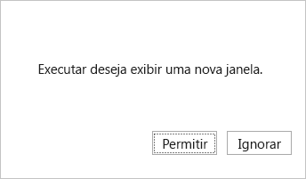

# <a name="best-practices-and-rules-for-the-office-dialog-api"></a>Práticas recomendadas e regras para a API da caixa de diálogo do Office

Este artigo fornece regras, gotchas e práticas recomendadas para a API de diálogo Office, incluindo práticas recomendadas para projetar a interface do usuário de uma caixa de diálogo e usar a API com em um aplicativo de página única (SPA)

> [!NOTE]
> Este artigo pressupõe que você está familiarizado com as noções básicas de uso da API de diálogo Office conforme descrito em Usar Office API de diálogo Office em seus [Office Add-ins](dialog-api-in-office-add-ins.md).
> 
> Consulte também [Tratamento de erros e eventos com a caixa Office caixa de diálogo](dialog-handle-errors-events.md).

## <a name="rules-and-gotchas"></a>Regras e dicas

- A caixa de diálogo só pode navegar até URLs HTTPS, não HTTP.
- A URL passada para o [método displayDialogAsync](/javascript/api/office/office.ui) deve estar exatamente no mesmo domínio que o próprio complemento. Não pode ser um subdomínio. Mas a página passada para ela pode redirecionar para uma página em outro domínio.
- Uma janela host, que pode ser um painel de tarefas ou o arquivo de função sem [](../reference/manifest/functionfile.md) interface do usuário de um comando de complemento, pode ter apenas uma caixa de diálogo aberta por vez.
- Somente duas Office APIs podem ser chamadas na caixa de diálogo:
  - A [função messageParent](/javascript/api/office/office.ui#office-office-ui-messageparent-member(1)) .
  - `Office.context.requirements.isSetSupported`(Para obter mais informações, consulte [Specify Office applications and API requirements](specify-office-hosts-and-api-requirements.md).)
- A [função messageParent](/javascript/api/office/office.ui#office-office-ui-messageparent-member(1)) geralmente deve ser chamada de uma página no mesmo domínio que o próprio complemento, mas isso não é obrigatório. Para obter mais informações, [mensagens entre domínios para o runtime do host](dialog-api-in-office-add-ins.md#cross-domain-messaging-to-the-host-runtime).

## <a name="best-practices"></a>Práticas recomendadas

### <a name="avoid-overusing-dialog-boxes"></a>Evitar o excesso de caixas de diálogo

Como a sobreposição de elementos de IU não são recomendáveis, evite abrir uma caixa de diálogo em um painel de tarefas a menos que seu cenário o obrigue a fazer isso. Ao considerar como usar a área de superfície de um painel de tarefas, observe que painéis de tarefas podem ter guias. Para ver um exemplo de um painel de tarefas com guias, consulte o [exemplo Excel JavaScript SalesTracker](https://github.com/OfficeDev/Excel-Add-in-JavaScript-SalesTracker) de complemento.

### <a name="design-a-dialog-box-ui"></a>Criar uma interface do usuário da caixa de diálogo

Para saber mais sobre as práticas recomendadas no design da caixa de diálogo, consulte Caixas de diálogo [em Office Add-ins](../design/dialog-boxes.md).

### <a name="handle-pop-up-blockers-with-office-on-the-web"></a>Manipular bloqueadores pop-up com Office na Web

Tentar exibir uma caixa de diálogo enquanto Office na Web pode fazer com que o bloqueador pop-up do navegador bloqueie a caixa de diálogo. Se isso acontecer, Office na Web abrirá um prompt semelhante ao seguinte.



Se o usuário escolher **Permitir, a** caixa Office caixa de diálogo será aberta. Se o usuário escolher **Ignorar**, o prompt será fechado e Office caixa de diálogo não será aberta. Em vez disso `displayDialogAsync` , o método retorna o erro 12009. Seu código deve capturar esse erro e fornecer uma experiência alternativa que não exija uma caixa de diálogo ou exibir uma mensagem para o usuário avisando que o complemento exige que eles permitam a caixa de diálogo. (Para obter mais sobre 12009, consulte [Errors from displayDialogAsync](dialog-handle-errors-events.md#errors-from-displaydialogasync).)

Se, por qualquer motivo, você quiser desativar esse recurso, seu código deverá desativar. Ela faz essa solicitação com o [objeto DialogOptions](/javascript/api/office/office.dialogoptions) que é passado para o `displayDialogAsync` método. Especificamente, o objeto deve incluir `promptBeforeOpen: false`. Quando essa opção for definida como false, Office na Web solicitará que o usuário permita que o add-in abra uma caixa de diálogo e a caixa de diálogo Office não será aberta.

### <a name="do-not-use-the-_host_info-value"></a>Não use o valor \_hostinfo\_

Office adiciona automaticamente um parâmetro de consulta chamado `_host_info` à URL que é passada para `displayDialogAsync`. Ele é anexado após os parâmetros de consulta personalizados, se algum. Ele não é anexado a urLs subsequentes às que a caixa de diálogo navega. A Microsoft pode alterar o conteúdo desse valor ou removê-lo completamente, portanto, seu código não deve lê-lo. O mesmo valor é adicionado ao armazenamento de sessão da caixa de diálogo (ou seja, a [propriedade Window.sessionStorage](https://developer.mozilla.org/docs/Web/API/Window/sessionStorage) ). Novamente, *seu código não deve ler nem gravar nesse valor*.

### <a name="open-another-dialog-immediately-after-closing-one"></a>Abra outra caixa de diálogo imediatamente após o fechamento de um

Você não pode ter mais de uma caixa de diálogo aberta de uma determinada página host, portanto, seu código deve chamar [Dialog.close](/javascript/api/office/office.dialog#office-office-dialog-close-member(1)) `displayDialogAsync` em uma caixa de diálogo aberta antes de chamar para abrir outra caixa de diálogo. O `close` método é assíncrono. Por esse motivo, se `displayDialogAsync` você chamar imediatamente após uma chamada de , a `close`primeira caixa de diálogo pode não ter sido completamente fechada quando Office tentar abrir a segunda. Se isso acontecer, Office retornará um erro [12007](dialog-handle-errors-events.md#12007): "A operação falhou porque esse complemento já tem uma caixa de diálogo ativa".

O `close` método não aceita um parâmetro de retorno de chamada e não retorna um objeto Promise `await` , portanto, ele não pode ser aguardado com a palavra-chave ou com um `then` método. Por esse motivo, sugerimos a seguinte técnica quando você precisa abrir uma nova caixa de diálogo imediatamente após o fechamento de uma caixa de diálogo: encapsular o código para abrir a nova caixa de diálogo em um método e projetar o método para chamar a si mesmo de forma recursiva `displayDialogAsync` se a chamada de retornar `12007`. Apresentamos um exemplo a seguir.

```javascript
function openFirstDialog() {
  Office.context.ui.displayDialogAsync("https://MyDomain/firstDialog.html", { width: 50, height: 50},
     (result) => {
      if(result.status === Office.AsyncResultStatus.Succeeded) {
        const dialog = result.value;
        dialog.close();
        openSecondDialog();
      }
      else {
         // Handle errors
      }
    }
  );
}
 
function openSecondDialog() {
  Office.context.ui.displayDialogAsync("https://MyDomain/secondDialog.html", { width: 50, height: 50},
    (result) => {
      if(result.status === Office.AsyncResultStatus.Failed) {
        if (result.error.code === 12007) {
          openSecondDialog(); // Recursive call
        }
        else {
         // Handle other errors
        }
      }
    }
  );
}
```

Como alternativa, você pode forçar o código a pausar antes que ele tente abrir a segunda caixa de diálogo usando o [método setTimeout](https://www.w3schools.com/jsref/met_win_settimeout.asp) . Apresentamos um exemplo a seguir.

```javascript
function openFirstDialog() {
  Office.context.ui.displayDialogAsync("https://MyDomain/firstDialog.html", { width: 50, height: 50},
     (result) => {
      if(result.status === Office.AsyncResultStatus.Succeeded) {
        const dialog = result.value;
        dialog.close();
        setTimeout(() => { 
          Office.context.ui.displayDialogAsync("https://MyDomain/secondDialog.html", { width: 50, height: 50},
             (result) => { /* callback body */ }
          );
        }, 1000);
      }
      else {
         // Handle errors
      }
    }
  );
}
```

### <a name="best-practices-for-using-the-office-dialog-api-in-an-spa"></a>Práticas recomendadas para usar a OFFICE de diálogo em um SPA

Se o seu add-in usa o roteamento do lado do cliente, como os aplicativos de página única (SPAs) normalmente fazem, você tem a opção de passar a URL de uma rota para o método [displayDialogAsync](/javascript/api/office/office.ui) em vez da URL de uma página HTML separada. *Recomendamos não fazer isso pelos motivos abaixo.*

> [!NOTE]
> Este artigo não é relevante para o *roteamento do* lado do servidor, como em um aplicativo Web baseado em Express.

#### <a name="problems-with-spas-and-the-office-dialog-api"></a>Problemas com SPAs e a API de Office de diálogo

A Office caixa de diálogo está em uma nova janela com sua própria instância do mecanismo JavaScript e, portanto, seu próprio contexto de execução completo. Se você passar uma rota, sua página base e todo o código de inicialização e inicialização serão executados novamente nesse novo contexto, e todas as variáveis serão definidas como seus valores iniciais na caixa de diálogo. Portanto, essa técnica baixa e inicia uma segunda instância do seu aplicativo na janela da caixa, o que parte do objetivo de um SPA. Além disso, o código que altera variáveis na janela da caixa de diálogo não altera a versão do painel de tarefas das mesmas variáveis. Da mesma forma, a janela da caixa de diálogo tem seu próprio armazenamento de sessão (a [propriedade Window.sessionStorage](https://developer.mozilla.org/docs/Web/API/Window/sessionStorage) ), que não é acessível a partir do código no painel de tarefas. A caixa de diálogo e a página de host na qual `displayDialogAsync` foi chamada se parecem com dois clientes diferentes para seu servidor. (Para um lembrete do que é uma página de host, consulte [Abrir uma caixa de diálogo de uma página host](dialog-api-in-office-add-ins.md#open-a-dialog-box-from-a-host-page).)

Portanto, se você passou `displayDialogAsync` uma rota para o método, não teria realmente um SPA; você teria duas *instâncias do mesmo SPA*. Além disso, grande parte do código na instância do painel de tarefas nunca seria usada nessa instância e grande parte do código na instância da caixa de diálogo nunca seria usada nessa instância. Seria como ter dois SPAs no mesmo grupo.

#### <a name="microsoft-recommendations"></a>Recomendações da Microsoft

Em vez de passar uma rota do lado do cliente para o `displayDialogAsync` método, recomendamos que você faça um dos seguintes:

* Se o código que você deseja executar na caixa de diálogo for suficientemente complexo, crie duas SPAs diferentes explicitamente; ou seja, ter dois SPAs em pastas diferentes do mesmo domínio. Um SPA é executado na caixa de diálogo e o outro na página host da caixa de diálogo onde `displayDialogAsync` foi chamado. 
* Na maioria dos cenários, apenas a lógica simples é necessária na caixa de diálogo. Nesses casos, seu projeto será bastante simplificado hospedando uma única página HTML, com JavaScript incorporado ou referenciado, no domínio de seu SPA. Passe a URL da página para o método`displayDialogAsync`. Embora isso signifique que você está desviando da ideia literal de um aplicativo de página única; você realmente não tem uma única instância de um SPA quando você está usando a API de Office de diálogo.
