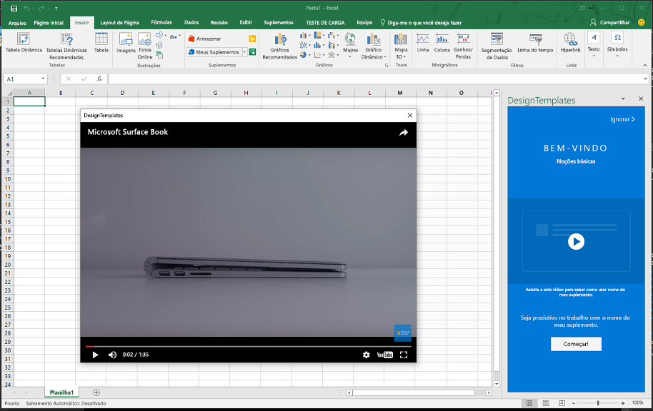

# <a name="use-the-office-dialog-box-to-show-a-video"></a>Usar a caixa de diálogo do Office para mostrar um vídeo

Este artigo explica como reproduzir um vídeo em uma caixa de diálogo do suplemento do Office.

> [!NOTE]
> Este artigo presume que você esteja familiarizado com as noções básicas de usar a caixa de diálogo do Office, conforme descrito em [usar a API de diálogo do Office em seus suplementos do Office](dialog-api-in-office-add-ins.md).

Para reproduzir um vídeo em uma caixa de diálogo com a API de diálogo do Office, siga estas etapas:

1. Criar uma página contendo um iframe e nenhum outro conteúdo. A página deve estar no mesmo domínio que a página host. Para obter um lembrete sobre o que é uma página de host, consulte [abrir uma caixa de diálogo em uma página de host](dialog-api-in-office-add-ins.md#open-a-dialog-box-from-a-host-page). No `src` atributo do iframe, aponte para a URL de um vídeo online. O protocolo da URL do vídeo deve ser HTTPS. Neste artigo, chamaremos esta página "Video. DialogBox. html". Veja a seguir um exemplo da marcação:

    ```HTML
    <iframe class="ms-firstrun-video__player"  width="640" height="360"
        src="https://www.youtube.com/embed/XVfOe5mFbAE?rel=0&autoplay=1"
        frameborder="0" allowfullscreen>
    </iframe>
    ```

2. Use uma chamada de `displayDialogAsync` na página host para abrir video.dialogbox.html.
3. Se o suplemento precisar saber quando o usuário fecha a caixa de diálogo, registre um manipulador para o evento `DialogEventReceived` e manipule o evento 12006. Para obter detalhes, consulte [erros e eventos na caixa de diálogo do Office](dialog-handle-errors-events.md).

Para ver um exemplo de reprodução de vídeo em uma caixa de diálogo, confira o [padrão de design do roteiro de vídeo](../design/first-run-experience-patterns.md#video-placemat).


