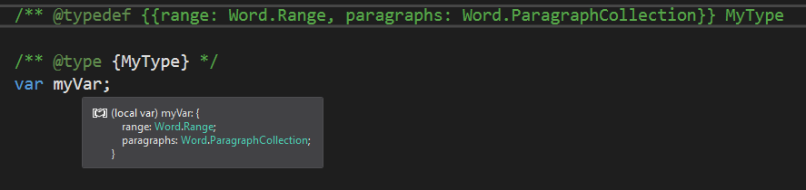

# <a name="get-javascript-intellisense-in-visual-studio-2017"></a><span data-ttu-id="7c4fd-102">Obtenha o JavaScript IntelliSense no Visual Studio 2017</span><span class="sxs-lookup"><span data-stu-id="7c4fd-102">Get JavaScript IntelliSense in Visual Studio 2017</span></span>

<span data-ttu-id="7c4fd-p101">Quando você usa o Visual Studio 2017 para desenvolver suplementos do Office, pode usar o JSDoc para habilitar o IntelliSense para as variáveis, os objetos, os parâmetros e os valores de retorno de JavaScript. Este artigo fornece uma visão geral do JSDoc e como usá-lo para criar IntellSense no Visual Studio. Confira mais detalhes em [JavaScript IntelliSense](/visualstudio/ide/javascript-intellisense) e [Suporte ao JSDoc no JavaScript](https://github.com/Microsoft/TypeScript/wiki/JsDoc-support-in-JavaScript).</span><span class="sxs-lookup"><span data-stu-id="7c4fd-p101">When you use Visual Studio 2017 to develop Office Add-ins, you can use JSDoc to enable IntelliSense for your JavaScript variables, objects, parameters, and return values. This article provides an overview of JSDoc and how you can use it to create IntellSense in Visual Studio. For more details, see [JavaScript IntelliSense](/visualstudio/ide/javascript-intellisense) and [JSDoc support in JavaScript](https://github.com/Microsoft/TypeScript/wiki/JsDoc-support-in-JavaScript).</span></span> 

## <a name="officejs-type-definitions"></a><span data-ttu-id="7c4fd-106">Definições de tipo do Office.js</span><span class="sxs-lookup"><span data-stu-id="7c4fd-106">Office.js type definitions</span></span>

<span data-ttu-id="7c4fd-p102">Você precisa fornecer as definições dos tipos no Office.js para o Visual Studio. Para fazer isso, é possível:</span><span class="sxs-lookup"><span data-stu-id="7c4fd-p102">You need to provide the definitions of the types in Office.js to Visual Studio. To do this, you can:</span></span>

- <span data-ttu-id="7c4fd-p103">Ter uma cópia local dos arquivos Office.js em uma pasta em sua solução denominada `\Office\1\`. Os modelos de projeto de Suplemento do Office no Visual Studio adicionam essa cópia local quando você cria o projeto de um suplemento.</span><span class="sxs-lookup"><span data-stu-id="7c4fd-p103">Have a local copy of the Office.js files in a folder in your solution named `\Office\1\`. The Office Add-in project templates in Visual Studio add this local copy when you create an add-in project.</span></span> 
- <span data-ttu-id="7c4fd-p104">Use a versão online do Office.js adicionando um arquivo tsconfig.json à raiz do projeto de aplicativo da Web na solução do suplemento. O arquivo deve incluir o seguinte conteúdo:</span><span class="sxs-lookup"><span data-stu-id="7c4fd-p104">Use an online version of Office.js by adding a tsconfig.json file to the root of the web application project in the add-in solution. The file should include the following content.</span></span>

    ```json
        {
            "compilerOptions": {
                "allowJs": true,            // These settings apply to JavaScript files also.
                "noEmit":  true             // Do not compile the JS (or TS) files in this project.
            },
            "exclude": [
                "node_modules",             // Don't include any JavaScript found under "node_modules".
                "Scripts/Office/1"          // Suppress loading all the JavaScript files from the Office NuGet package.
            ],
            "typeAcquisition": {
                "enable": true,             // Enable automatic fetching of type definitions for detected JavaScript libraries.
                "include": [ "office-js" ]  // Ensure that the "Office-js" type definition is fetched.
            }
        }
    ```

## <a name="jsdoc-syntax"></a><span data-ttu-id="7c4fd-113">Sintaxe JSDoc</span><span class="sxs-lookup"><span data-stu-id="7c4fd-113">JSDoc syntax</span></span>

<span data-ttu-id="7c4fd-p105">A técnica básica é incluir antes da variável (ou do parâmetro e assim por diante) um comentário que identifica seu tipo de dados. Isso permite que o IntelliSense no Visual Studio infira seus membros. Eis alguns exemplos:</span><span class="sxs-lookup"><span data-stu-id="7c4fd-p105">The basic technique is to precede the variable (or parameter, and so on) with a comment that identifies its data type. This allows IntelliSense in Visual Studio to infer its members. The following are examples.</span></span>

### <a name="variable"></a><span data-ttu-id="7c4fd-117">Variável</span><span class="sxs-lookup"><span data-stu-id="7c4fd-117">Variable</span></span>

```js
/** @type {Excel.Range} */
var subsetRange;
```


### <a name="parameter"></a><span data-ttu-id="7c4fd-119">Parâmetro</span><span class="sxs-lookup"><span data-stu-id="7c4fd-119">Parameter</span></span>

```js
/** @param {Word.ParagraphCollection} paragraphs */
function myFunc(paragraphs){

}
```


### <a name="return-value"></a><span data-ttu-id="7c4fd-121">Valor de retorno</span><span class="sxs-lookup"><span data-stu-id="7c4fd-121">Return value</span></span>

```js
/** @returns {Word.Range} */
function myFunc() {

}
```


### <a name="complex-types"></a><span data-ttu-id="7c4fd-123">Tipos complexos</span><span class="sxs-lookup"><span data-stu-id="7c4fd-123">Complex types</span></span>

```js
/** @typedef {{range: Word.Range, paragraphs: Word.ParagraphCollection}} MyType

/** @returns {MyType} */
function myFunc() {

}
```


## <a name="see-also"></a><span data-ttu-id="7c4fd-125">Confira também</span><span class="sxs-lookup"><span data-stu-id="7c4fd-125">See also</span></span>

- [<span data-ttu-id="7c4fd-126">Criar e depurar suplementos no Visual Studio</span><span class="sxs-lookup"><span data-stu-id="7c4fd-126">Create and debug add-ins in Visual Studio</span></span>](create-and-debug-office-add-ins-in-visual-studio.md)
